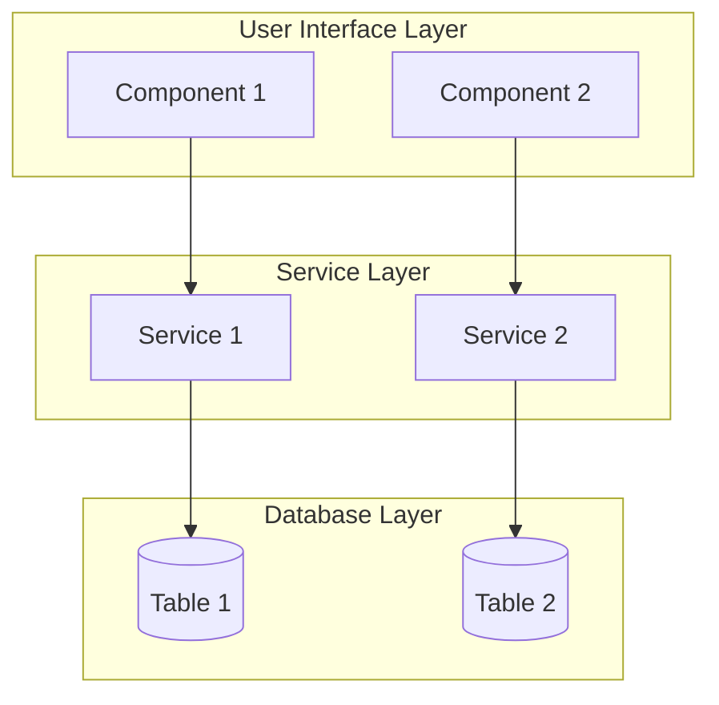
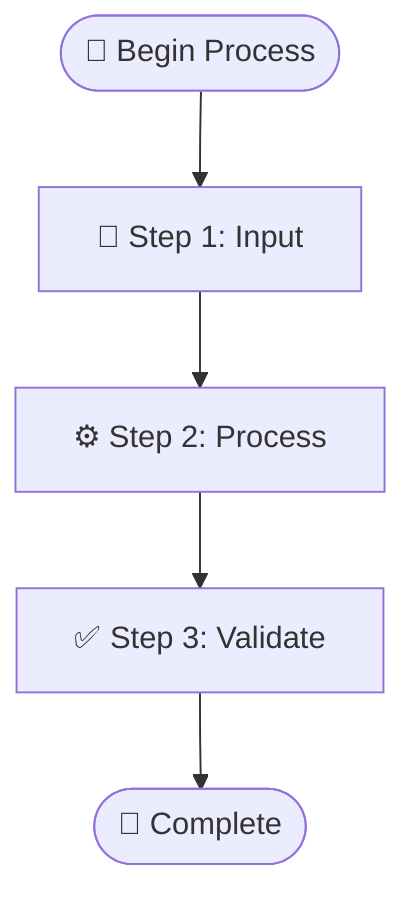
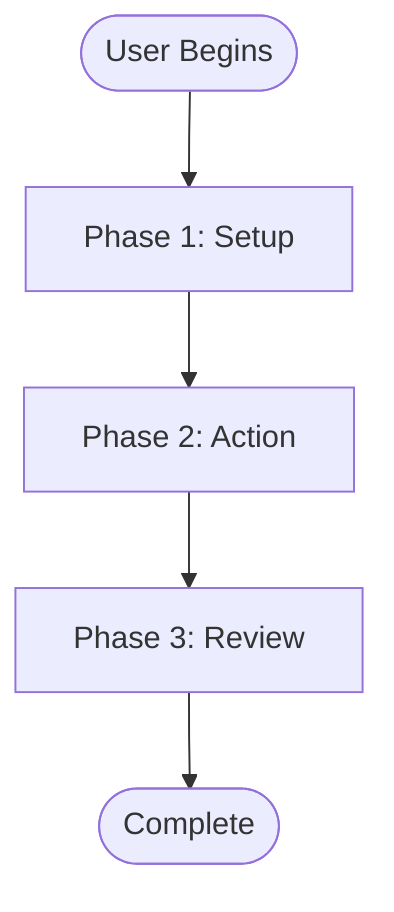

# 0000 Mermaid Diagram Creation Procedure

## Overview

This procedure establishes comprehensive guidelines for creating reliable, professional Mermaid diagrams in the Construct AI documentation system. It addresses common parsing errors, provides systematic approaches for diagram development and validation, and includes advanced patterns for complex system documentation.

**🔗 Cross-References to Related Procedures:**

**Documentation & Workflow Procedures:**
- → `0000_WORKFLOW_DOCUMENTATION_PROCEDURE.md` → Comprehensive framework for documenting workflows with diagrams
- → `0000_PROCEDURES_GUIDE.md` → Navigation guide for all procedures and documentation standards
- → `01900_system-integration-diagram.md` → **SAMPLE**: Advanced system integration diagram with multi-layer architecture

**System Maintenance & Troubleshooting:**
- → `0000_SYSTEM_TROUBLESHOOTING_PROCEDURE_TEMPLATE.md` → Framework for troubleshooting diagram rendering issues
- → `0000_DEBUGGING_GUIDE.md` → Advanced debugging techniques for diagram syntax and platform compatibility
- → `docs/0000_MASTER_DATABASE_SCHEMA.md` → Database schema reference for data flow diagrams

## Scope

This procedure applies to:
- All Mermaid diagram creation for technical documentation
- Data flow diagrams, architecture diagrams, and process flows
- Integration with GitHub, VS Code, and other Mermaid-compatible platforms

## Requirements

### Prerequisites
- Access to Mermaid-compatible renderer (GitHub, VS Code with extension, Mermaid Live)
- Basic understanding of Mermaid syntax
- Target documentation platform identified

### Tools & Resources
- [Mermaid Live Editor](https://mermaid.live) - Primary testing environment
- VS Code with Mermaid extension - Development environment
- GitHub - Production rendering environment

## Implementation

### Phase 1: Planning & Design

#### Step 1.1: Define Diagram Requirements
- **Objective**: Clearly articulate diagram purpose and audience
- **Content**: Identify key components, relationships, and data flows
- **Complexity**: Assess diagram size and nesting requirements
- **Platform**: Confirm target rendering environment compatibility

#### Step 1.2: Choose Diagram Type
- **Flowchart**: For process flows and decision trees
- **Graph**: For component relationships and data flows
- **Sequence**: For temporal interactions and API calls
- **State**: For state machines and status transitions

### Phase 2: Syntax Development

#### Step 2.1: Basic Structure Creation
```bash
# Start with simple structure
graph TD
    A[Start] --> B[Process]
    B --> C[End]
```

#### Step 2.2: Node Label Guidelines
**MANDATORY**: Follow these rules to prevent parsing errors

✅ **ALLOWED**:
- Alphanumeric characters: `A-Z a-z 0-9`
- Spaces and underscores: ` ` `_`
- Basic punctuation: `. , - : ;`

❌ **PROHIBITED**:
- Curly braces: `{ }`
- Square brackets: `[ ]`
- Parentheses: `( )`
- Angle brackets: `< >`
- HTML tags: `<br/> <strong>`

#### Step 2.3: Safe Node Labeling Strategy

**Complex Objects**:
```mermaid
❌ PROBLEMATIC:
API_RESPONSE[Returns {success: true, data: []}]

✅ SOLUTION:
API_SUCCESS[Success Response]
API_DATA[Data Array]
API_SUCCESS --> API_DATA
```

**Function Names**:
```mermaid
❌ PROBLEMATIC:
HOOK[useProcurementOrders()]

✅ SOLUTION:
HOOK[useProcurementOrders]
HOOK_STATE[State: loading]
HOOK --> HOOK_STATE
```

**Multi-line Content**:
```mermaid
❌ PROBLEMATIC:
NODE[Line 1<br/>Line 2]

✅ SOLUTION:
NODE[Line 1 - Line 2]
```

### Phase 3: Syntax Validation

#### Step 3.1: Multi-Renderer Testing
**REQUIRED**: Test in all target environments

1. **Mermaid Live Editor** - Primary validation
2. **VS Code Extension** - Development environment
3. **GitHub** - Production environment
4. **Documentation Platform** - Final deployment target

#### Step 3.2: Progressive Error Resolution

**Error Identification**:
```
Parse error on line X: ...text -----------------------^ Expecting 'TOKEN'...
```

**Resolution Steps**:
1. Identify problematic character/line
2. Replace with plain text equivalent
3. Split complex nodes if necessary
4. Re-test in all environments

#### Step 3.3: Common Error Patterns

| Error Pattern | Cause | Solution |
|--------------|--------|----------|
| `Expecting 'SQE'` | Square brackets `[]` in labels | Replace with descriptive text |
| `Expecting 'PS'` | Parentheses `()` in labels | Remove or replace |
| `Expecting 'DIAMOND_START'` | Angle brackets `<>` in labels | Use plain text separators |
| **Text missing from PNG exports** | `<foreignObject>` elements removed during SVG cleaning | Preserve `foreignObject` elements in export function |
| `...generateFromTemplate()` | Parentheses interpreted as node shape syntax | Escape with HTML entities: `generateFromTemplate#40;#41;` |
| `...DGS --> PTAPI %% comment` | Inline `%%` comments after connections | Move comments to separate lines before connections |
| `...Title (Required) • Descrip -----------------------^ Expecting 'PS'` | Bullet points `•` interpreted as special characters | Replace with dashes `-` or plain text |

#### Step 3.4: Recently Encountered Parse Errors

**Error 1: Parentheses in Function Names (Line 77)**
```
Parse error on line 77: ...generateFromTemplate()
CLIENT COMPLI -----------------------^ Expecting 'SQE', 'DOUBLECIRCLEEND', 'PE', '-)', 'STADIUMEND', 'SUBROUTINEEND', 'PIPE', 'CYLINDEREND', 'DIAMOND_STOP', 'TAGEND', 'TRAPEND', 'INVTRAPEND', 'UNICODE_TEXT', 'TEXT', 'TAGSTART', got 'PS'
```

**Solution**: Escape parentheses using HTML entities
```mermaid
❌ PROBLEMATIC:
DG[DocumentGenerator Service<br/>generateFromTemplate()<br/>CLIENT COMPLIANT OUTPUT]

✅ FIXED:
DG[DocumentGenerator Service<br/>generateFromTemplate#40;#41;<br/>CLIENT COMPLIANT OUTPUT]
```

**Error 2: Inline Comments After Connections (Line 107)**
```
Parse error on line 107: ... DGS --> PTAPI %% DocumentGenerator ----------------------^ Expecting 'SEMI', 'NEWLINE', 'EOF', 'AMP', 'START_LINK', 'LINK', 'LINK_ID', got 'NODE_STRING'
```

**Solution**: Move comments to separate lines
```mermaid
❌ PROBLEMATIC:
DGS --> PTAPI  %% DocumentGenerator uses procurement templates
POT --> POTAPI  %% Previous Order Templates API

✅ FIXED:
%% DocumentGenerator uses procurement templates
DGS --> PTAPI
%% Previous Order Templates API
POT --> POTAPI
```
+++++++ REPLACE</parameter>
<task_progress>- [x] Read current procedure document
- [x] Add section on common Mermaid parse errors
- [x] Document the specific errors encountered and their fixes
- [ ] Update version history and save document</parameter>

### Phase 4: Optimization & Documentation

#### Step 4.1: Diagram Simplification
- Break overly complex nodes into multiple connected nodes
- Use subgraphs for logical grouping
- Maintain readability over complexity

#### Step 4.2: Styling & Consistency
```mermaid
classDef apiClass fill:#e1f5fe,stroke:#01579b
classDef componentClass fill:#fff3e0,stroke:#e65100
classDef dataClass fill:#e8f5e8,stroke:#2e7d32

class API_NODE apiClass
class COMPONENT_NODE componentClass
class DATA_NODE dataClass
```

#### Step 4.3: Documentation Integration
- Include diagram source in markdown files
- Add explanatory text above/below diagram
- Reference diagram in related procedures

#### Step 4.4: Advanced Diagram Patterns

**Multi-Diagram Documents**:
Following the pattern from `01900_system-integration-diagram.md`, create comprehensive documentation with multiple diagram types:

```markdown
# System Integration Diagram - [System Name]

[Primary architecture diagram using graph TB]

## [Section Header]

[Detailed flowchart or sequence diagram]

## Implementation Details

- [Technical specifications]
- [Workflow sequences]
- [User input requirements]
```

**Layered Architecture Diagrams**:


**Workflow Sequences with Emojis**:


**User Journey Flowcharts**:


#### Step 4.5: Performance Optimization

**Caching & Optimization**:
```mermaid
subgraph "Performance Layer"
    CACHE1[⚡ Template Cache]
    CACHE2[⚡ Compliance Cache]
end

SERVICE --> CACHE1
SERVICE --> CACHE2
```

**Parallel Processing**:
```mermaid
AGENT1 -->|⚡ parallel| AGENT2
AGENT2 -->|⚡ parallel| AGENT3
```

#### Step 4.6: Advanced Styling & Theming

**Multi-Class Styling System**:
```mermaid
classDef ui fill:#e1f5fe,stroke:#01579b,stroke-width:2px
classDef component fill:#f3e5f5,stroke:#4a148c,stroke-width:2px
classDef service fill:#e8f5e8,stroke:#1b5e20,stroke-width:2px
classDef agent fill:#fff3e0,stroke:#e65100,stroke-width:2px
classDef db fill:#fce4ec,stroke:#880e4f,stroke-width:2px
classDef api fill:#f9fbe7,stroke:#827717,stroke-width:2px

class UI_NODE ui
class COMP_NODE component
class SVC_NODE service
class AGENT_NODE agent
class DB_NODE db
class API_NODE api
```

**HITL (Human-in-the-Loop) Styling**:
```mermaid
classDef hitl fill:#bbdefb,stroke:#1565c0,stroke-width:3px
class HUMAN_REVIEW hitl
```

#### Step 4.7: Documentation Integration Best Practices

**Comprehensive Diagram Documentation**:
Following `01900_system-integration-diagram.md` and `01901_create_procurement_order_workflow.md`, structure complex diagrams with:

1. **Header Section**: Clear title and overview
2. **🚨 Copyable Labels Section**: Dedicated section with copyable node labels (see Step 4.8 below)
3. **Primary Diagram**: Main architecture/system view
4. **Detailed Sections**: Break down complex areas with additional diagrams
5. **Implementation Details**: Technical specifications and workflows
6. **User Input Requirements**: Complete user journey documentation
7. **Summaries**: Critical path analysis and key takeaways

**Cross-Reference Integration**:
- Link related procedures and implementation docs
- Reference specific code files and components
- Include URLs for navigation paths
- Cross-link between workflow and implementation docs

#### Step 4.8: Copyable Labels Best Practices (NEW)

**Dedicated Copyable Labels Section**:
Following the pattern established in `01901_create_procurement_order_workflow.md`, include a prominent copyable labels section:

```markdown
## 🚨 **COPYABLE NODE LABELS - QUICK REFERENCE GUIDE**

> **⚠️ IMPORTANT: ONLY copy labels from the YELLOW code blocks below**
> **🚫 DO NOT copy from the narrative text below - only from these code blocks!**

### **Phase 1: Basic Info** - Copyable Node Labels
```yaml
📝 Basic Details
Order Type Selection
Primary Discipline
```
```

**Key Features of Copyable Labels Section**:
- **🚨 Alert Header**: Use warning emoji and bold text to grab attention
- **⚠️ Clear Instructions**: Explicitly state what to copy and what NOT to copy
- **📋 Code Blocks**: Use ```yaml or ``` syntax highlighting for easy copying
- **🎯 Direct Copy**: Labels ready for immediate use in Mermaid diagrams
- **🚫 Prohibition Notice**: Clear warnings against copying from narrative text

**Word Wrapping for Multi-Line Labels**:
```mermaid
✅ RECOMMENDED: Use \n for line breaks in copyable labels
P4_ROUTING[Sequential\nParallel\nHybrid]

❌ AVOID: HTML tags that cause parsing errors
P4_ROUTING[Sequential<br/>Parallel<br/>Hybrid]
```

**Positioning Guidelines**:
- Place immediately after the document title and before the diagram
- Use separator lines (---) for visual distinction
- Make it the first content users see after the title

#### Step 4.9: Collaboration & Version Control

**Team Collaboration Guidelines**:
- Use Git branches for diagram development
- Include diagram changes in pull request reviews
- Document diagram updates in commit messages
- Maintain diagram version history

**Review Process**:
- Technical review by subject matter experts
- Visual review by UX/design team members
- Testing across all target platforms
- Accessibility review for complex diagrams

**Version Control Best Practices**:
```markdown
## Version History

| Version | Date | Changes |
|---------|------|---------|
| 1.0.0 | 2025-12-03 | Initial diagram creation |
| 1.1.0 | 2025-12-04 | Added HITL workflow and styling |
| 1.2.0 | 2025-12-05 | Enhanced user input requirements section |
```

#### Step 4.9: Accessibility & Inclusive Design

**Accessibility Guidelines**:
- Use high contrast colors (minimum 4.5:1 ratio)
- Include alt text descriptions in markdown
- Ensure sufficient color differentiation
- Test with color blindness simulators
- Provide text alternatives for visual information

**Inclusive Design Patterns**:
```mermaid
classDef accessible fill:#ffffff,stroke:#000000,stroke-width:2px,color:#000000
classDef highContrast fill:#000000,stroke:#ffffff,stroke-width:3px,color:#ffffff

class ACCESSIBLE_NODE accessible
class HIGH_CONTRAST_NODE highContrast
```

**Screen Reader Support**:
- Add descriptive text above/below diagrams
- Use meaningful node labels (not just abbreviations)
- Include summary paragraphs for complex diagrams
- Reference diagram in surrounding text content

## Validation Checklist

### Pre-Deployment Validation
- [ ] **Syntax Validation**: Validates in Mermaid Live Editor without errors
- [ ] **Cross-Platform Rendering**: Renders correctly in VS Code extension, GitHub, and target platforms
- [ ] **Node Label Safety**: No prohibited special characters in node labels
- [ ] **Styling Consistency**: Class definitions applied correctly and consistently
- [ ] **Diagram Purpose**: Serves documented objective and audience requirements
- [ ] **Complexity Management**: Large diagrams broken into logical subgraphs if needed
- [ ] **Performance**: Renders within 2 seconds in target environments
- [ ] **Accessibility**: High contrast ratios, meaningful labels, alt text provided

### Advanced Pre-Deployment Checks
- [ ] **Multi-Diagram Integration**: If part of larger document, integrates well with other diagrams
- [ ] **Workflow Sequences**: User journeys and process flows are logical and complete
- [ ] **Layer Architecture**: Component relationships accurately represented
- [ ] **HITL Integration**: Human-in-the-loop processes clearly marked and styled
- [ ] **Caching & Performance**: Optimization layers properly represented
- [ ] **Cross-References**: Links to related procedures and code files are accurate

### Post-Deployment Validation
- [ ] Verify rendering in production environment
- [ ] Check mobile responsiveness and touch targets if applicable
- [ ] Validate accessibility with screen readers and keyboard navigation
- [ ] Test print compatibility and PDF export quality
- [ ] Confirm diagram loads in offline documentation viewers
- [ ] Verify links and cross-references remain functional

## Troubleshooting

### Common Issues & Solutions

#### Issue: Diagram renders in Mermaid Live but fails in GitHub
**Cause**: Platform-specific syntax differences
**Solution**: Simplify syntax, remove platform-specific features

#### Issue: Special characters cause parsing errors
**Cause**: Mermaid parser strictness varies by version/platform
**Solution**: Use the "Safe Node Labeling Strategy" above

#### Issue: Complex diagrams become unreadable
**Cause**: Too much information in single diagram
**Solution**: Break into multiple diagrams or use subgraphs

#### Issue: Styling not applied consistently
**Cause**: CSS class definitions not compatible across platforms
**Solution**: Use basic styling or platform-specific versions

### Emergency Procedures

#### When Diagram Won't Render Anywhere
1. **Strip to basics**: Create minimal working diagram
2. **Add complexity gradually**: Test after each addition
3. **Use Mermaid Live**: Debug in isolated environment
4. **Consult documentation**: Reference Mermaid official docs

#### When Platform-Specific Issues Occur
1. **Identify platform**: Determine exact rendering environment
2. **Check version**: Verify Mermaid version compatibility
3. **Simplify syntax**: Remove advanced features
4. **Use alternatives**: Consider different diagram types

## Quality Assurance

### Code Review Requirements
- [ ] Syntax validation completed
- [ ] Multi-platform testing performed
- [ ] Documentation purpose served
- [ ] Accessibility considerations addressed

### Performance Standards
- [ ] Diagram renders within 2 seconds
- [ ] No JavaScript errors in console
- [ ] Compatible with target screen sizes
- [ ] Print-friendly if required

## Related Documentation

### Core References
- [1500_MERMAID_MASTER_GUIDE.md](../mermaid/1500_MERMAID_MASTER_GUIDE.md) - Complete Mermaid system documentation
- [Mermaid Official Documentation](https://mermaid.js.org/) - Core syntax reference

### Supporting Procedures
- [0000_WORKFLOW_DOCUMENTATION_PROCEDURE.md](0000_WORKFLOW_DOCUMENTATION_PROCEDURE.md) - Documentation workflow
- [0000_PROCEDURES_GUIDE.md](0000_PROCEDURES_GUIDE.md) - Procedure organization

## Version History

| Version | Date | Changes |
|---------|------|---------|
| 1.0.0 | 2025-12-03 | Initial procedure creation with syntax validation guidelines |
| 1.0.1 | 2025-12-03 | Added troubleshooting section and validation checklists |
| 1.0.2 | 2025-12-03 | **FIXED: Text missing from PNG exports** - Added foreignObject preservation guidance |
| 2.0.0 | 2026-01-06 | **ENHANCED: Advanced diagram patterns & best practices** - Added sample reference, multi-diagram docs, layered architecture, workflow sequences, performance optimization, advanced styling, documentation integration, collaboration guidelines, accessibility features, and comprehensive validation checklists |
| 2.0.1 | 2026-01-06 | **ADDED: Recently encountered parse errors** - Documented parentheses in function names and inline comments after connections with specific examples and solutions |
| 2.0.2 | 2026-07-01 | **ADDED: Bullet point parsing error** - Added bullet point (`•`) character as common error pattern causing `Expecting 'PS'` errors, with solution to replace with dashes (`-`) |
| 2.1.0 | 2026-07-01 | **MAJOR ENHANCEMENT: Copyable Labels Best Practices** - Added comprehensive section on dedicated copyable labels sections in documentation, with positioning guidelines, word wrapping techniques, and examples from `01901_create_procurement_order_workflow.md`. Updated documentation integration best practices to include copyable labels as standard pattern. |
+++++++ REPLACE</parameter>
<task_progress>- [x] Read current procedure document
- [x] Add section on common Mermaid parse errors
- [x] Document the specific errors encountered and their fixes
- [x] Update version history and save document</parameter>

---

**This procedure ensures reliable Mermaid diagram creation across all platforms and prevents common parsing errors through systematic validation and safe syntax practices.**
