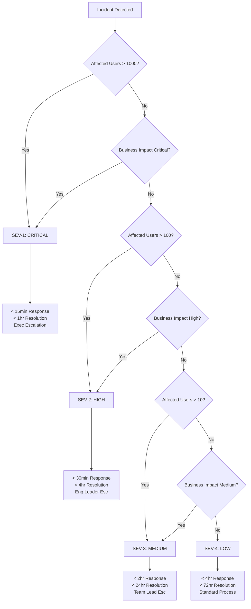
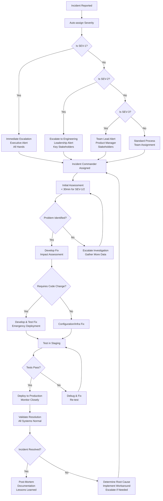
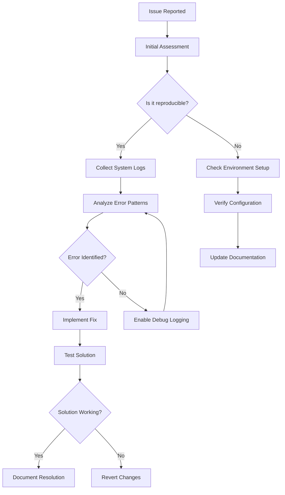
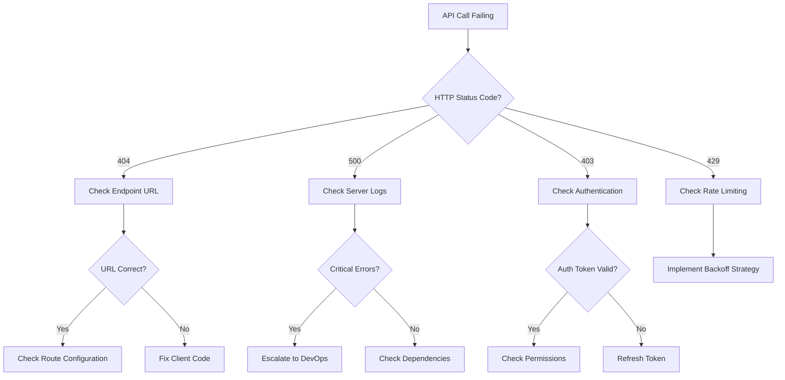
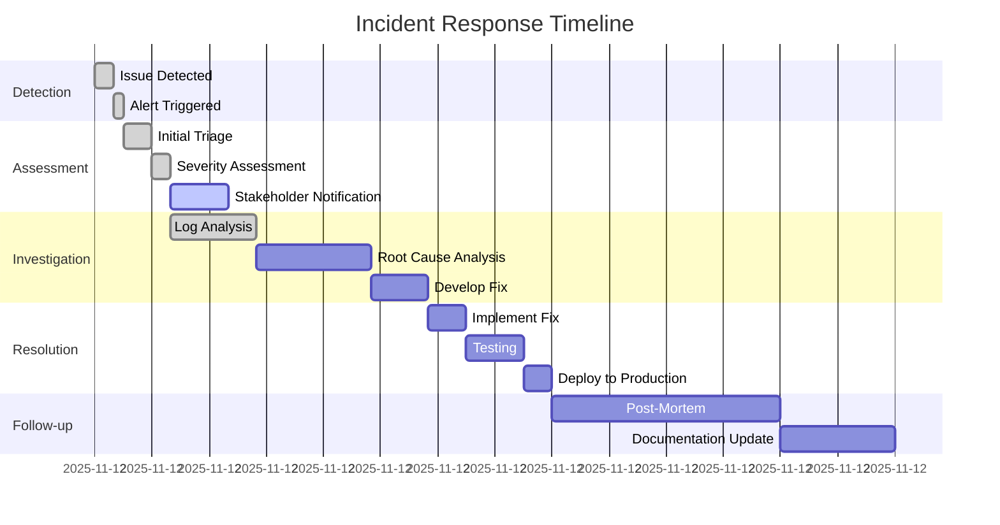

e# 1300_01300 System Troubleshooting Procedure Template

## Document Usage Guide

**📋 This Document's Role**: Systematic investigation methodology and enterprise logging standards. **Use this for complex investigations** requiring structured problem-solving and crisis management protocols.

**📚 Related Documents in Debugging Ecosystem:**
- **`PROCEDURES_GUIDE.md`** → Start here to identify which procedure fits your issue category
- **`DEBUGGING_GUIDE.md`** → Go here for hands-on technical debugging steps and immediate solutions
- **`ERROR_TRACKING_ALL.md`** → Reference for historical error patterns and proven solutions

## Overview

This document provides a comprehensive troubleshooting procedure template with **advanced logging methodologies** for diagnosing and resolving complex system issues. This template incorporates industry-standard logging practices, log analysis techniques, and systematic debugging procedures.

**🔗 Cross-References to Related Procedures:**

**Core Navigation & Reference:**
- → `0000_PROCEDURES_GUIDE.md` → Complete index of all troubleshooting and operational procedures for systematic issue identification
- → `0000_DEBUGGING_GUIDE.md` → Hands-on technical debugging steps and immediate solutions for common issues

**System Maintenance & Database:**
- → `0000_SQL_EXECUTION_PROCEDURE.md` → Database operations, schema changes, and SQL troubleshooting procedures
- → `docs/0000_MASTER_DATABASE_SCHEMA.md` → Complete database schema reference for understanding table structures
- → `0500_VECTOR_DATA_ISOLATION_PROCEDURE.md` → Vector data management and isolation troubleshooting

**Workflow & AI Procedures:**
- → `0000_WORKFLOW_DOCUMENTATION_PROCEDURE.md` → Comprehensive framework for documenting complex workflows
- → `0000_WORKFLOW_OPTIMIZATION_GUIDE.md` → Performance optimization and system monitoring procedures
- → `0000_WORKFLOW_AI_FIELD_ATTRIBUTE_IMPLEMENTATION_PROCEDURE.md` → AI field configuration and validation issues

**UI/UX & Integration:**
- → `0000_ELEMENT_STYLING_REFERENCE_PROCEDURE.md` → UI component styling and consistency issues
- → `0000_DROPDOWN_IMPLEMENTATION_PROCEDURE.md` → Dropdown component debugging and implementation
- → `0000_CHATBOT_COMPREHENSIVE_PROCEDURE.md` → Chatbot integration and response debugging

## Requirements

### Prerequisites
- Access to comprehensive system logs and monitoring tools
- Understanding of structured logging formats and log levels
- Knowledge of log aggregation systems (ELK stack, Splunk, etc.)
- Access to development, staging, and production environments
- Familiarity with distributed tracing and correlation IDs

### System Components Involved
- **[COMPONENT_1]**: [Brief description of primary component]
- **[COMPONENT_2]**: [Brief description of secondary component]
- **[COMPONENT_3]**: [Brief description of related component]
- **[COMPONENT_N]**: [Brief description of additional components]

## Implementation

### Problem Identification

#### Symptom Analysis
**User Experience:**
- [Describe the user-facing symptoms and impact]

**Technical Root Cause:**
- [Identify the underlying technical cause]
- [List contributing factors]
- [Explain why the issue occurs]

#### Advanced Diagnostic Steps

1. **Comprehensive Log Analysis**
   ```bash
   # Multi-level log analysis with correlation
   export CORRELATION_ID="[correlation-id]"
   export TIME_WINDOW="10 minutes ago"

   # Search for correlation ID across all services
   grep -r "$CORRELATION_ID" /var/log/application/ | head -50

   # Time-based error analysis
   journalctl --since "$TIME_WINDOW" -u application.service | grep -E "(ERROR|FATAL)"

   # Structured log parsing with jq
   cat application.log | jq 'select(.level == "error" and .timestamp > "'$(date -d '10 minutes ago' +%s)'")'
   ```

2. **Distributed Tracing Investigation**
   ```javascript
   // Trace request flow across services
   const traceId = "trace-12345";
   const spanId = "span-67890";

   // Query tracing system for complete request flow
   const trace = await tracingService.getTrace(traceId);
   console.log('Trace duration:', trace.duration);
   console.log('Error spans:', trace.spans.filter(s => s.error));

   // Check service mesh logs
   kubectl logs -l app=service-name --since=10m | grep "$traceId"
   ```

3. **Performance Log Analysis**
   ```bash
   # Performance bottleneck identification
   grep "duration_ms" application.log | \
   awk '{ sum += $NF; count++ } END { print "Average:", sum/count, "ms" }'

   # Memory leak detection
   grep "heap_used" application.log | tail -100 | \
   awk '{ print $2, $NF }' | sort -k2 -n | tail -10

   # Database query performance
   grep "SELECT.*duration" database.log | \
   sort -k NF -n | tail -20
   ```

4. **Security Event Correlation**
   ```bash
   # Security incident investigation
   export INCIDENT_TIME="2025-11-12 09:00:00"

   # Correlate authentication failures with suspicious activity
   grep -A5 -B5 "$INCIDENT_TIME" auth.log security.log | \
   grep -E "(FAILED|BLOCKED|SUSPICIOUS)"

   # Check for brute force patterns
   grep "authentication.*failed" auth.log | \
   awk '{ print $1, $2 }' | sort | uniq -c | sort -nr | head -10
   ```

5. **Workflow Code Quality Evaluation**
   ```bash
   # Evaluate the workflow/code to ensure standards compliance and identify length issues

   # Check code length and complexity against AGENTS.md standards
   echo "=== CODE QUALITY ASSESSMENT ==="
   echo "Checking workflow length and standards compliance..."
   echo "Refer to AGENTS.md for coding standards and parameters to be checked:"
   echo "- ES6+ syntax requirements"
   echo "- camelCase for variables, PascalCase for components"
   echo "- File structure organization"
   echo "- Error handling patterns"
   echo "- Database query parameterization"
   echo "- Security best practices"

   # Automated code analysis (if linting tools available)
   if command -v eslint &> /dev/null; then
       echo "Running ESLint analysis..."
       eslint client/src/ --format=compact | head -20
   fi

   # Check for long files that may indicate unstructured code
   echo "Largest JavaScript files (potential length issues):"
   find client/src/ -name "*.js" -o -name "*.jsx" | xargs wc -l | sort -nr | head -10

   # Evaluate complexity metrics
   echo "Functions over 50 lines (potential refactoring needed):"
   grep -r "function.*{" client/src/ | head -10
   ```

### Advanced Logging Standards

#### Structured Logging Implementation

**Frontend Logging Standards:**
```javascript
// Comprehensive client-side logging
const logger = {
  info: (message, context = {}) => {
    console.log(JSON.stringify({
      timestamp: new Date().toISOString(),
      level: 'info',
      component: 'frontend',
      userId: getCurrentUserId(),
      sessionId: getSessionId(),
      correlationId: getCorrelationId(),
      userAgent: navigator.userAgent,
      url: window.location.href,
      message,
      ...context
    }));
  },

  error: (error, context = {}) => {
    console.error(JSON.stringify({
      timestamp: new Date().toISOString(),
      level: 'error',
      component: 'frontend',
      userId: getCurrentUserId(),
      sessionId: getSessionId(),
      correlationId: getCorrelationId(),
      error: {
        name: error.name,
        message: error.message,
        stack: error.stack,
        cause: error.cause
      },
      browser: {
        userAgent: navigator.userAgent,
        language: navigator.language,
        platform: navigator.platform,
        cookieEnabled: navigator.cookieEnabled
      },
      url: window.location.href,
      message: error.message,
      ...context
    }));
  },

  performance: (metric, value, context = {}) => {
    console.log(JSON.stringify({
      timestamp: new Date().toISOString(),
      level: 'info',
      component: 'frontend',
      type: 'performance',
      metric,
      value,
      userId: getCurrentUserId(),
      sessionId: getSessionId(),
      correlationId: getCorrelationId(),
      ...context
    }));
  }
};

// Usage examples
logger.info('User initiated template generation', {
  templateType: 'safety-policy',
  userAction: 'button_click'
});

logger.error(new Error('Template generation failed'), {
  templateType: 'safety-policy',
  step: 'api_call',
  duration: 45000
});

logger.performance('api_response_time', 1250, {
  endpoint: '/api/templates/generate',
  method: 'POST'
});
```

**Backend Logging Standards:**
```javascript
// Enterprise-grade backend logging
import winston from 'winston';
import { v4 as uuidv4 } from 'uuid';

const logger = winston.createLogger({
  level: process.env.LOG_LEVEL || 'info',
  format: winston.format.combine(
    winston.format.timestamp(),
    winston.format.errors({ stack: true }),
    winston.format.json()
  ),
  defaultMeta: {
    service: 'construct-ai',
    version: process.env.npm_package_version,
    environment: process.env.NODE_ENV
  },
  transports: [
    new winston.transports.Console({
      format: winston.format.combine(
        winston.format.colorize(),
        winston.format.simple()
      )
    }),
    new winston.transports.File({
      filename: 'logs/error.log',
      level: 'error'
    }),
    new winston.transports.File({
      filename: 'logs/combined.log'
    })
  ]
});

// Request correlation middleware
const correlationMiddleware = (req, res, next) => {
  req.correlationId = req.headers['x-correlation-id'] ||
                     req.headers['x-request-id'] ||
                     uuidv4();

  req.logger = logger.child({
    correlationId: req.correlationId,
    userId: req.user?.id,
    sessionId: req.session?.id,
    method: req.method,
    url: req.originalUrl,
    userAgent: req.get('User-Agent'),
    ip: req.ip
  });

  res.set('x-correlation-id', req.correlationId);
  next();
};

// Usage examples
app.use(correlationMiddleware);

// In route handlers
router.post('/api/templates/generate', async (req, res) => {
  req.logger.info('Template generation started', {
    templateType: req.body.templateType,
    customPromptLength: req.body.customPrompt?.length,
    userId: req.user?.id
  });

  try {
    const result = await templateService.generateTemplate(req.body);
    req.logger.info('Template generation completed', {
      templateId: result.metadata.id,
      duration: result.metadata.generationTime,
      tokensUsed: result.metadata.tokensUsed
    });
    res.json(result);
  } catch (error) {
    req.logger.error('Template generation failed', {
      error: error.message,
      stack: error.stack,
      templateType: req.body.templateType,
      duration: Date.now() - req.startTime
    });
    res.status(500).json({ error: error.message });
  }
});
```

#### Log Level Standards

| Level | Usage | Examples |
|-------|-------|----------|
| `FATAL` | System unusable, immediate attention required | Database connection lost, critical service down |
| `ERROR` | Operation failed, user impact | API call failed, data corruption, authentication errors |
| `WARN` | Potential issues, degraded performance | High latency, deprecated API usage, resource warnings |
| `INFO` | Normal operations, significant events | User actions, API calls, state changes |
| `DEBUG` | Detailed debugging information | Variable values, execution flow, performance metrics |
| `TRACE` | Very detailed execution tracing | Method entry/exit, loop iterations, network packets |

#### Log Context Enrichment

**Required Context Fields:**
```javascript
const baseContext = {
  timestamp: new Date().toISOString(),
  correlationId: generateCorrelationId(),
  sessionId: getSessionId(),
  userId: getUserId(),
  component: 'component-name',
  version: '1.0.0',
  environment: process.env.NODE_ENV,
  hostname: os.hostname(),
  pid: process.pid
};
```

**Business Context Fields:**
```javascript
const businessContext = {
  organizationId: getOrganizationId(),
  projectId: getProjectId(),
  discipline: getCurrentDiscipline(),
  templateType: getTemplateType(),
  userRole: getUserRole(),
  permissions: getUserPermissions()
};
```

**Technical Context Fields:**
```javascript
const technicalContext = {
  requestId: getRequestId(),
  traceId: getTraceId(),
  spanId: getSpanId(),
  parentSpanId: getParentSpanId(),
  duration: getDuration(),
  memoryUsage: process.memoryUsage(),
  cpuUsage: process.cpuUsage(),
  threadId: getThreadId()
};
```

### Log Analysis Methodologies

#### Real-Time Log Monitoring

**Live Log Tailing:**
```bash
# Monitor all services with correlation
tail -f /var/log/application/*.log | grep "$CORRELATION_ID"

# Error rate monitoring
tail -f application.log | grep -E "(ERROR|FATAL)" | \
while read line; do
  echo "$(date): $line"
  # Send alert if error rate exceeds threshold
done

# Performance anomaly detection
tail -f application.log | grep "duration_ms" | \
awk '{
  if ($NF > 5000) {
    print "SLOW REQUEST: " $0
    system("curl -X POST -H \"Content-Type: application/json\" -d \"{\\\"alert\\\":\\\"slow_request\\\",\\\"duration\\\":" $NF "}\" http://alerts.example.com/webhook")
  }
}'
```

#### Log Aggregation and Search

**ELK Stack Queries:**
```javascript
// Elasticsearch queries for troubleshooting
const errorQuery = {
  "query": {
    "bool": {
      "must": [
        { "term": { "level": "error" } },
        { "range": { "@timestamp": { "gte": "now-1h" } } }
      ],
      "should": [
        { "term": { "component": "template-generation" } },
        { "term": { "correlationId": "trace-12345" } }
      ]
    }
  },
  "aggs": {
    "errors_by_component": {
      "terms": { "field": "component" }
    },
    "errors_over_time": {
      "date_histogram": {
        "field": "@timestamp",
        "interval": "5m"
      }
    }
  }
};

// Kibana visualization queries
const performanceQuery = {
  "query": {
    "bool": {
      "must": [
        { "term": { "type": "performance" } },
        { "range": { "@timestamp": { "gte": "now-24h" } } }
      ]
    }
  },
  "aggs": {
    "avg_response_time": {
      "avg": { "field": "duration_ms" }
    },
    "percentiles": {
      "percentiles": {
        "field": "duration_ms",
        "percents": [50, 95, 99]
      }
    }
  }
};
```

#### Automated Log Analysis

**Pattern Recognition:**
```python
import re
from collections import defaultdict

def analyze_error_patterns(log_file):
    patterns = defaultdict(int)
    error_contexts = []

    with open(log_file, 'r') as f:
        for line in f:
            # Detect common error patterns
            if 'timeout' in line.lower():
                patterns['timeout_errors'] += 1
            elif 'connection refused' in line.lower():
                patterns['connection_errors'] += 1
            elif 'out of memory' in line.lower():
                patterns['memory_errors'] += 1

            # Extract error context
            match = re.search(r'correlationId["\s:]+([^"\s,]+)', line)
            if match:
                error_contexts.append({
                    'correlation_id': match.group(1),
                    'timestamp': extract_timestamp(line),
                    'error_type': classify_error(line)
                })

    return {
        'patterns': dict(patterns),
        'error_contexts': error_contexts,
        'recommendations': generate_recommendations(patterns)
    }

def generate_recommendations(patterns):
    recommendations = []
    if patterns.get('timeout_errors', 0) > 10:
        recommendations.append("Increase timeout thresholds for long-running operations")
    if patterns.get('connection_errors', 0) > 5:
        recommendations.append("Check network connectivity and service health")
    if patterns.get('memory_errors', 0) > 3:
        recommendations.append("Monitor memory usage and consider increasing limits")
    return recommendations
```

### Historical Troubleshooting Examples

This section provides real-world examples from previous system issues, showing common troubleshooting patterns and successful resolution approaches with emphasis on logging best practices.

### Historical Troubleshooting Examples

This section provides real-world examples from previous system issues, showing common troubleshooting patterns and successful resolution approaches. Use these as reference for similar problems.

#### Example 1: API Route Mounting Issues (FIX 25, 26)
**Problem**: Client receiving 404 errors when calling API endpoints
**Symptoms**: `Cannot POST /api/process` or `Cannot POST /api/analyze`
**Root Cause**: Router mounting configuration mismatch between client expectations and server setup
**Diagnostic Steps**:
```bash
# Check server app.js for router mounting
grep -n "app.use.*processRouter" server/app.js
# Expected: app.use("/api/process", processRouter)

# Check client calls
grep -n "/api/process" client/src/**/*.js
# Verify client calls match server mounting
```
**Resolution Pattern**:
1. Identify router mounting path in `server/app.js`
2. Update client API calls to match server configuration
3. Test endpoint accessibility
4. Update documentation with correct endpoints

#### Example 2: Third-Party Library Integration Issues (FIX 24)
**Problem**: `TypeError: Cannot read properties of undefined (reading 'Symbol($$DEPENDENCIES)')`
**Symptoms**: Component fails to initialize, empty containers, dependency injection errors
**Root Cause**: Incorrect plugin registration order in third-party libraries
**Diagnostic Steps**:
```javascript
// Check plugin registration order
console.log('Plugin registration sequence:');
univer.registerPlugin(UniverRenderEnginePlugin); // Core first
univer.registerPlugin(UniverFormulaEnginePlugin); // Core second
// UI plugins must come after core plugins
```
**Resolution Pattern**:
1. Review library documentation for correct initialization order
2. Implement proper dependency injection sequence
3. Add Facade API integration for easier manipulation
4. Include comprehensive error handling and cleanup

#### Example 3: Database Schema Mismatches (FIX 19)
**Problem**: `"Could not find the 'configurations' column of 'governance_document_templates'"`
**Symptoms**: Database operations fail with schema validation errors
**Root Cause**: Client sending fields that don't exist in database schema
**Diagnostic Steps**:
```sql
-- Check actual table schema
\d governance_document_templates

-- Compare with client data structure
-- Look for field name mismatches or extra fields
```
**Resolution Pattern**:
1. Compare client data structure with database schema
2. Remove non-existent fields from client requests
3. Update table name references if incorrect
4. Implement proper data transformation layers

#### Example 4: Variable Scoping Bugs (FIX 22)
**Problem**: `ReferenceError: formDataToSave is not defined`
**Symptoms**: Runtime errors when accessing undefined variables
**Root Cause**: Method parameters vs local variable confusion
**Diagnostic Steps**:
```javascript
// Check variable declarations and usage
function processData(formData) {  // Parameter: formData
  console.log(formData.field);    // ✅ Correct usage
  console.log(formDataToSave.field); // ❌ Wrong variable
}
```
**Resolution Pattern**:
1. Audit variable declarations and usage
2. Ensure parameter names match throughout method
3. Use consistent naming conventions
4. Add proper error handling for undefined variables

#### Example 5: Missing Dependencies (FIX 23)
**Problem**: `Module not found: @univerjs/sheets-formula/lib/index.css`
**Symptoms**: Build failures, webpack compilation errors
**Root Cause**: Importing non-existent files from third-party packages
**Diagnostic Steps**:
```bash
# Check package contents
ls node_modules/@univerjs/sheets-formula/lib/
# Verify which files actually exist

# Check import statements
grep -n "@univerjs/sheets-formula" client/src/**/*.js
```
**Resolution Pattern**:
1. Verify package contents match documentation
2. Remove imports for non-existent files
3. Update build configurations if needed
4. Test compilation after each change

#### Example 6: Database Query Missing Columns (FIX 32)
**Problem**: Discipline field not displaying in forms table
**Symptoms**: Empty discipline column, discipline-related functionality not working
**Root Cause**: Database query not selecting `discipline_name` column from `governance_document_templates` table
**Diagnostic Steps**:
```javascript
// Check database schema
console.log('Table columns:', await client.from('governance_document_templates').select('*').limit(1));

// Check client query
console.log('Query fields:', Object.keys(await fetchForms())[0]);

// Verify transformation logic
console.log('Client transformation:', forms.map(f => f.discipline_name));
```
**Browser Console Evidence**:
```javascript
// DisciplineDropdown received empty disciplines array
[DISCIPLINE_DEBUG] DisciplineDropdown for form 3017cae1-100b-4a06-8e0c-c9fbb214c56f:
{formDisciplineId: '851078f8-d902-4819-9d80-e3eeac21e5ed',
formDisciplineName: undefined,
selectedDiscipline: '851078f8-d902-4819-9d80-e3eeac21e5ed',
disciplinesCount: 0,
disciplinesSample: Array(0), …}
```
**Resolution Pattern**:
1. Add missing `discipline_name` field to database select query in `fetchForms`
2. Verify table schema includes the column (was already present)
3. Test data transformation handles the new field correctly
4. Confirm discipline field displays in forms table

#### Example 7: Modal Import and Integration Issues (PROCEDURE)
**Problem**: Modal components not rendering correctly, TypeError on modal usage
**Symptoms**: Modal not showing, console errors about missing imports, undefined components
**Root Cause**: Incorrect modal import paths or missing modal component implementations
**Diagnostic Steps**:
```javascript
// Check import statement syntax
console.log('Modal imports check:');
console.log('Import statement:', import JobDescriptionModal from "./modals/01500-JobDescriptionModal.js");

// Verify file exists
console.log('File exists check:', existsSync('./modals/01500-JobDescriptionModal.js'));

// Check modal component export
console.log('Component export check:', typeof JobDescriptionModal);

// Verify modal props structure
console.log('Modal usage pattern:', {
  isOpen: typeof props.isOpen,
  onClose: typeof props.onClose,
  onSave: typeof props.onSave,
  expectedProps: ['isOpen', 'onClose', 'onSave', 'editJobDescription']
});
```
**Common Error Patterns:**

**Error Pattern 1: Incorrect Import Path**
```javascript
// ❌ Wrong: Missing relative path
import JobDescriptionModal from "modals/01500-JobDescriptionModal.js";

// ❌ Wrong: Incorrect file extension
import JobDescriptionModal from "./modals/01500-JobDescriptionModal";

// ❌ Wrong: Case sensitivity mismatch
import jobdescriptionmodal from "./modals/01500-JobDescriptionModal.js";

// ✅ Correct: Proper relative path and extension
import JobDescriptionModal from "./modals/01500-JobDescriptionModal.js";
```

**Error Pattern 2: Missing Modal Component**
```javascript
// ❌ Symptom: Component renders as undefined
console.error("JobDescriptionModal is not defined");

// ✅ Resolution: Create modal component file with proper export
// File: ./modals/01500-JobDescriptionModal.js
import React, { useState, useEffect } from 'react';

const JobDescriptionModal = ({
  isOpen,
  onClose,
  onSave,
  editJobDescription
}) => {
  // Modal implementation here
  return isOpen ? <div>Modal Content</div> : null;
};

export default JobDescriptionModal;
```

**Error Pattern 3: Incorrect Modal Props**
```javascript
// ❌ Wrong: Missing required props
<JobDescriptionModal
  isOpen={showModal}
  onSave={handleSave}  // Missing onClose
/>

// ❌ Wrong: Incorrect prop types
<JobDescriptionModal
  isOpen="true"        // Should be boolean
  onClose={handleModalClose}
  onSave="handleSave"  // Should be function
/>

// ✅ Correct: Proper props structure
<JobDescriptionModal
  isOpen={showCreateModal}
  onClose={() => setShowCreateModal(false)}
  onSave={handleModalSave}
  editJobDescription={selectedJob ? transformJobForModal(selectedJob) : null}
/>
```

**Resolution Pattern for Modal Integration:**
1. **Verify File Structure**
   ```bash
   # Check modal directory exists
   ls -la client/src/pages/01500-human-resources/components/modals/

   # Verify modal file exists with correct naming
   ls client/src/pages/01500-human-resources/components/modals/01500-JobDescriptionModal.js
   ```

2. **Implement Modal Component**
   ```javascript
   // Create modal with proper React patterns
   // Ensure modal follows existing UI patterns (pure CSS, no Bootstrap)
   // Include proper prop validation and default values
   // Implement data transformation for job description formats
   ```

3. **Update Parent Component**
   ```javascript
   // Import modal at top of file
   import JobDescriptionModal from "./modals/01500-JobDescriptionModal.js";

   // Add modal state management
   const [showCreateModal, setShowCreateModal] = useState(false);

   // Add data transformation functions
   const transformJobForModal = (job) => { /* transform logic */ };
   const transformModalDataToDB = (modalData) => { /* transform logic */ };

   // Add modal save handler
   const handleModalSave = async (modalData) => { /* save logic */ };

   // Render modal component
   <JobDescriptionModal
     isOpen={showCreateModal}
     onClose={() => setShowCreateModal(false)}
     onSave={handleModalSave}
     editJobDescription={selectedJob ? transformJobForModal(selectedJob) : null}
   />
   ```

4. **Test Modal Integration**
   ```javascript
   // Test modal button click
   console.log('Modal button clicked, state:', showCreateModal);

   // Test modal props passing
   console.log('Modal props:', { isOpen, onClose, onSave });

   // Test data transformation
   console.log('Transformed data:', transformModalDataToDB(modalData));
   ```

5. **Common Pitfalls to Avoid**
   - **Import Path Issues**: Always use relative paths (`./`) for local components
   - **Component Naming**: Match file name with component name (PascalCase)
   - **Prop Types**: Ensure boolean props are boolean, function props are functions
   - **State Management**: Modal state should be managed in parent component
   - **Data Flow**: Use transformation functions to handle different data formats
   - **Styling**: Follow existing CSS patterns (avoid Bootstrap classes)
   - **File Structure**: Modals should be in dedicated `modals/` subdirectory

**Modal Implementation Checklist:**
- [ ] Create modal component file in correct directory
- [ ] Implement proper React component structure
- [ ] Add required prop types and default values
- [ ] Include data transformation logic for job description formats
- [ ] Update parent component imports
- [ ] Add modal state management
- [ ] Implement modal save handler with database integration
- [ ] Test modal opening/closing functionality
- [ ] Test data save functionality
- [ ] Verify modal styling matches application theme
- [ ] Test modal with different data states (create vs edit)

### Logging Best Practices Implementation

#### Log Retention and Rotation

**Log Rotation Strategy:**
```bash
# Logrotate configuration for application logs
cat > /etc/logrotate.d/application << EOF
/var/log/application/*.log {
    daily
    rotate 30
    compress
    delaycompress
    missingok
    notifempty
    create 644 www-data www-data
    postrotate
        systemctl reload application.service
    endscript
}
EOF

# Archive old logs to S3
aws s3 sync /var/log/application/archive/ s3://logs-archive/application/ \
    --delete \
    --storage-class STANDARD_IA
```

**Retention Policies:**
```javascript
const retentionPolicies = {
  debug: {
    retention: '7 days',
    storage: 'local',
    compression: 'gzip'
  },
  info: {
    retention: '30 days',
    storage: 'local',
    compression: 'gzip'
  },
  warn: {
    retention: '90 days',
    storage: 'S3_STANDARD_IA',
    compression: 'gzip'
  },
  error: {
    retention: '1 year',
    storage: 'S3_GLACIER',
    compression: 'gzip',
    encryption: 'AES256'
  },
  fatal: {
    retention: '7 years',
    storage: 'S3_DEEP_ARCHIVE',
    compression: 'gzip',
    encryption: 'AES256',
    immutable: true
  }
};
```

#### Log Security and Compliance

**Security Logging Standards:**
```javascript
// Security event logging
const securityLogger = {
  authentication: (event, context) => {
    logger.security('Authentication event', {
      event,
      userId: context.userId,
      ip: context.ip,
      userAgent: context.userAgent,
      success: context.success,
      failureReason: context.failureReason,
      mfaUsed: context.mfaUsed,
      ...context
    });
  },

  authorization: (event, context) => {
    logger.security('Authorization event', {
      event,
      userId: context.userId,
      resource: context.resource,
      action: context.action,
      decision: context.decision,
      policies: context.policies,
      ...context
    });
  },

  dataAccess: (event, context) => {
    logger.security('Data access event', {
      event,
      userId: context.userId,
      table: context.table,
      operation: context.operation,
      recordId: context.recordId,
      fields: context.fields,
      ip: context.ip,
      ...context
    });
  },

  suspiciousActivity: (event, context) => {
    logger.security('Suspicious activity detected', {
      event,
      severity: 'HIGH',
      userId: context.userId,
      ip: context.ip,
      activity: context.activity,
      indicators: context.indicators,
      ...context
    });
  }
};

// Usage examples
securityLogger.authentication('LOGIN_SUCCESS', {
  userId: 'user123',
  ip: '192.168.1.100',
  mfaUsed: true
});

securityLogger.dataAccess('RECORD_VIEWED', {
  userId: 'user123',
  table: 'sensitive_documents',
  recordId: 'doc456',
  fields: ['title', 'content']
});
```

**Compliance Logging (GDPR, SOX, etc.):**
```javascript
const complianceLogger = {
  dataProcessing: (operation, context) => {
    logger.compliance('Data processing activity', {
      operation,
      dataSubjectId: context.dataSubjectId,
      dataCategories: context.dataCategories,
      processingPurpose: context.processingPurpose,
      legalBasis: context.legalBasis,
      retentionPeriod: context.retentionPeriod,
      consentGiven: context.consentGiven,
      consentTimestamp: context.consentTimestamp,
      ...context
    });
  },

  dataBreach: (incident, context) => {
    logger.compliance('Data breach incident', {
      incident,
      severity: 'CRITICAL',
      affectedRecords: context.affectedRecords,
      dataCategories: context.dataCategories,
      breachType: context.breachType,
      detectionTime: context.detectionTime,
      notificationRequired: context.notificationRequired,
      ...context
    });
  },

  auditTrail: (action, context) => {
    logger.compliance('Audit trail entry', {
      action,
      userId: context.userId,
      timestamp: new Date().toISOString(),
      resource: context.resource,
      changes: context.changes,
      reason: context.reason,
      ...context
    });
  }
};
```

#### Log Monitoring and Alerting

**Real-Time Log Monitoring Setup:**
```bash
# Install and configure monitoring stack
sudo apt update
sudo apt install -y elasticsearch kibana logstash filebeat

# Configure Filebeat for log shipping
cat > /etc/filebeat/filebeat.yml << EOF
filebeat.inputs:
- type: log
  enabled: true
  paths:
    - /var/log/application/*.log
  fields:
    service: construct-ai
    environment: production

output.elasticsearch:
  hosts: ["localhost:9200"]
  index: "construct-ai-%{+yyyy.MM.dd}"

setup.kibana:
  host: "localhost:5601"
EOF

# Start services
sudo systemctl enable elasticsearch kibana filebeat
sudo systemctl start elasticsearch kibana filebeat
```

**Alert Configuration:**
```javascript
const alertingRules = {
  errorRate: {
    condition: 'rate(errors[5m]) > 10',
    severity: 'WARNING',
    message: 'Error rate exceeded threshold: {{value}} errors per minute',
    channels: ['slack', 'email'],
    escalation: {
      '15m': 'CRITICAL',
      '30m': 'PAGE_ONCALL'
    }
  },

  responseTime: {
    condition: 'avg(response_time) > 5000',
    severity: 'WARNING',
    message: 'Average response time too high: {{value}}ms',
    channels: ['slack'],
    runbook: 'https://wiki.company.com/slow-responses'
  },

  memoryUsage: {
    condition: 'avg(memory_usage_percent) > 85',
    severity: 'CRITICAL',
    message: 'High memory usage: {{value}}%',
    channels: ['slack', 'pagerduty'],
    autoRemediation: 'scale_up_instances'
  },

  securityAlert: {
    condition: 'count(security_events[1m]) > 0',
    severity: 'CRITICAL',
    message: 'Security event detected: {{count}} events',
    channels: ['slack', 'pagerduty', 'security-team'],
    immediate: true
  }
};
```

#### Log Correlation and Tracing

**Distributed Tracing Implementation:**
```javascript
// OpenTelemetry tracing setup
import { NodeTracerProvider } from '@opentelemetry/sdk-trace-node';
import { SimpleSpanProcessor } from '@opentelemetry/sdk-trace-base';
import { JaegerExporter } from '@opentelemetry/exporter-jaeger';
import { registerInstrumentations } from '@opentelemetry/instrumentation';
import { HttpInstrumentation } from '@opentelemetry/instrumentation-http';
import { ExpressInstrumentation } from '@opentelemetry/instrumentation-express';

const provider = new NodeTracerProvider();
const exporter = new JaegerExporter({
  endpoint: 'http://jaeger-collector:14268/api/traces'
});

provider.addSpanProcessor(new SimpleSpanProcessor(exporter));
provider.register();

// Instrument HTTP and Express
registerInstrumentations({
  instrumentations: [
    new HttpInstrumentation(),
    new ExpressInstrumentation()
  ]
});

// Usage in application code
const tracer = opentelemetry.trace.getTracer('construct-ai');

app.use('/api/templates/generate', async (req, res) => {
  const span = tracer.startSpan('template_generation', {
    attributes: {
      'service.name': 'construct-ai',
      'operation': 'generate_template',
      'user.id': req.user?.id,
      'template.type': req.body.templateType
    }
  });

  try {
    const result = await templateService.generateTemplate(req.body);
    span.setAttribute('template.id', result.metadata.id);
    span.setAttribute('generation.time', result.metadata.generationTime);
    span.setStatus({ code: opentelemetry.SpanStatusCode.OK });
    res.json(result);
  } catch (error) {
    span.setStatus({
      code: opentelemetry.SpanStatusCode.ERROR,
      message: error.message
    });
    span.recordException(error);
    throw error;
  } finally {
    span.end();
  }
});
```

#### Automated Log Analysis and Insights

**Log Pattern Recognition:**
```python
import re
import json
from datetime import datetime, timedelta
from collections import defaultdict, Counter
import pandas as pd
from sklearn.cluster import DBSCAN
import numpy as np

class LogAnalyzer:
    def __init__(self):
        self.patterns = {
            'timeout': re.compile(r'timeout|timed out', re.IGNORECASE),
            'database_error': re.compile(r'psql|postgres|database.*error', re.IGNORECASE),
            'memory_error': re.compile(r'out of memory|heap space|gc overhead', re.IGNORECASE),
            'network_error': re.compile(r'connection refused|network.*error|dns', re.IGNORECASE),
            'auth_error': re.compile(r'unauthorized|forbidden|authentication.*failed', re.IGNORECASE)
        }

    def analyze_logs(self, log_file, time_window_hours=24):
        """Analyze logs for patterns and anomalies"""
        logs = []
        cutoff_time = datetime.now() - timedelta(hours=time_window_hours)

        with open(log_file, 'r') as f:
            for line in f:
                try:
                    log_entry = json.loads(line.strip())
                    log_time = datetime.fromisoformat(log_entry['timestamp'].replace('Z', '+00:00'))

                    if log_time > cutoff_time:
                        logs.append(log_entry)
                except (json.JSONDecodeError, KeyError):
                    continue

        df = pd.DataFrame(logs)

        # Pattern analysis
        pattern_counts = defaultdict(int)
        for _, row in df.iterrows():
            message = str(row.get('message', '')) + str(row.get('error', {}).get('message', ''))
            for pattern_name, pattern in self.patterns.items():
                if pattern.search(message):
                    pattern_counts[pattern_name] += 1

        # Error clustering
        error_logs = df[df['level'] == 'error']
        if len(error_logs) > 0:
            # Simple clustering based on error messages
            error_messages = error_logs['message'].fillna('')
            clusters = self.cluster_errors(error_messages)

        # Performance analysis
        if 'duration' in df.columns:
            perf_stats = {
                'avg_duration': df['duration'].mean(),
                '95th_percentile': df['duration'].quantile(0.95),
                '99th_percentile': df['duration'].quantile(0.99),
                'max_duration': df['duration'].max()
            }
        else:
            perf_stats = {}

        return {
            'total_logs': len(logs),
            'error_count': len(error_logs),
            'pattern_analysis': dict(pattern_counts),
            'performance_stats': perf_stats,
            'time_range': {
                'start': df['timestamp'].min() if len(df) > 0 else None,
                'end': df['timestamp'].max() if len(df) > 0 else None
            },
            'recommendations': self.generate_recommendations(pattern_counts, perf_stats)
        }

    def cluster_errors(self, error_messages):
        """Cluster similar error messages"""
        # Simple clustering based on string similarity
        clusters = defaultdict(list)
        for msg in error_messages:
            # Create a simple hash of the error message
            msg_hash = hash(msg[:100])  # First 100 chars
            clusters[msg_hash].append(msg)

        return {k: list(set(v)) for k, v in clusters.items()}

    def generate_recommendations(self, patterns, perf_stats):
        """Generate actionable recommendations"""
        recommendations = []

        if patterns.get('timeout', 0) > 10:
            recommendations.append({
                'priority': 'HIGH',
                'category': 'TIMEOUT',
                'message': 'High timeout rate detected. Consider increasing timeout thresholds or optimizing slow operations.',
                'action_items': [
                    'Review timeout configurations',
                    'Optimize database queries',
                    'Consider implementing async processing for long-running tasks'
                ]
            })

        if patterns.get('database_error', 0) > 5:
            recommendations.append({
                'priority': 'HIGH',
                'category': 'DATABASE',
                'message': 'Database errors detected. Check connection pool and query performance.',
                'action_items': [
                    'Monitor database connection pool',
                    'Review slow queries',
                    'Check database server resources'
                ]
            })

        if perf_stats.get('95th_percentile', 0) > 5000:
            recommendations.append({
                'priority': 'MEDIUM',
                'category': 'PERFORMANCE',
                'message': 'High response times detected. Performance optimization needed.',
                'action_items': [
                    'Implement caching where appropriate',
                    'Optimize database queries',
                    'Consider horizontal scaling'
                ]
            })

        return recommendations

# Usage
analyzer = LogAnalyzer()
results = analyzer.analyze_logs('/var/log/application/combined.log')
print(json.dumps(results, indent=2))
```

### Advanced Troubleshooting Methodologies

#### Systematic Debugging Framework

**Phase 1: Problem Definition & Context Gathering**
```bash
# 1. Establish baseline system state
timestamp=$(date +%s)
hostname=$(hostname)
uptime=$(uptime)
load_average=$(uptime | awk -F'load average:' '{ print $2 }')

echo "=== SYSTEM STATE BASELINE ===" >> debug_session_$timestamp.log
echo "Timestamp: $(date)" >> debug_session_$timestamp.log
echo "Hostname: $hostname" >> debug_session_$timestamp.log
echo "Uptime: $uptime" >> debug_session_$timestamp.log
echo "Load Average: $load_average" >> debug_session_$timestamp.log

# 2. Capture current process state
ps aux | head -20 >> debug_session_$timestamp.log
netstat -tlnp | grep LISTEN >> debug_session_$timestamp.log
df -h >> debug_session_$timestamp.log

# 3. Log current user context
whoami >> debug_session_$timestamp.log
id >> debug_session_$timestamp.log
env | grep -E "(NODE_ENV|PORT|DATABASE_URL)" >> debug_session_$timestamp.log
```

**Phase 2: Log Correlation & Timeline Analysis**
```bash
# Create correlation timeline
export INCIDENT_TIME="2025-11-12 09:00:00"
export TIME_WINDOW="30 minutes"

# Extract all logs within time window
find /var/log -name "*.log" -exec grep -l "$INCIDENT_TIME" {} \; | while read logfile; do
    echo "=== $logfile ===" >> timeline_$timestamp.log
    grep -B2 -A2 "$INCIDENT_TIME" "$logfile" >> timeline_$timestamp.log
done

# Correlate by correlation ID if available
if [ ! -z "$CORRELATION_ID" ]; then
    echo "=== CORRELATION ID: $CORRELATION_ID ===" >> correlation_$timestamp.log
    grep -r "$CORRELATION_ID" /var/log/ >> correlation_$timestamp.log
fi

# Performance metrics timeline
echo "=== PERFORMANCE TIMELINE ===" >> perf_timeline_$timestamp.log
grep "duration_ms\|response_time\|memory_usage" /var/log/application/*.log | \
awk '{ print $1, $2, $0 }' | sort -k1,2 >> perf_timeline_$timestamp.log
```

**Phase 3: Component Isolation Testing**
```bash
# Test individual system components
echo "=== COMPONENT ISOLATION TESTS ===" >> isolation_$timestamp.log

# Database connectivity
echo "Testing database connection..." >> isolation_$timestamp.log
timeout 10s nc -z $DB_HOST $DB_PORT && echo "✓ Database reachable" >> isolation_$timestamp.log || echo "✗ Database unreachable" >> isolation_$timestamp.log

# External API dependencies
echo "Testing external APIs..." >> isolation_$timestamp.log
curl -s --max-time 10 $EXTERNAL_API_URL > /dev/null && echo "✓ External API reachable" >> isolation_$timestamp.log || echo "✗ External API unreachable" >> isolation_$timestamp.log

# Cache systems
echo "Testing cache systems..." >> isolation_$timestamp.log
redis-cli ping 2>/dev/null && echo "✓ Redis reachable" >> isolation_$timestamp.log || echo "✗ Redis unreachable" >> isolation_$timestamp.log

# File system permissions
echo "Testing file system..." >> isolation_$timestamp.log
touch /tmp/test_write && rm /tmp/test_write && echo "✓ File system writable" >> isolation_$timestamp.log || echo "✗ File system read-only" >> isolation_$timestamp.log
```

#### Advanced Performance Profiling

**Real-Time Performance Monitoring:**
```bash
# Continuous performance monitoring script
#!/bin/bash
MONITOR_INTERVAL=5  # seconds
LOG_FILE="/var/log/performance_monitor_$(date +%Y%m%d_%H%M%S).log"

echo "=== PERFORMANCE MONITOR STARTED $(date) ===" > "$LOG_FILE"
echo "Monitoring interval: ${MONITOR_INTERVAL}s" >> "$LOG_FILE"
echo "Timestamp,CPU%,Memory%,Disk_IO,Network_RX,Network_TX,Load_1m,Load_5m,Load_15m" >> "$LOG_FILE"

while true; do
    timestamp=$(date +%s)
    cpu=$(top -bn1 | grep "Cpu(s)" | sed "s/.*, *\([0-9.]*\)%* id.*/\1/" | awk '{print 100 - $1}')
    memory=$(free | grep Mem | awk '{printf "%.1f", $3/$2 * 100.0}')
    disk_io=$(iostat -d 1 1 | tail -1 | awk '{print $2}')  # %util
    network_rx=$(cat /proc/net/dev | grep eth0 | awk '{print $2}')  # bytes
    network_tx=$(cat /proc/net/dev | grep eth0 | awk '{print $10}') # bytes
    load_avg=$(uptime | awk -F'load average:' '{ print $2 }' | sed 's/,//g')

    echo "${timestamp},${cpu},${memory},${disk_io},${network_rx},${network_tx},${load_avg}" >> "$LOG_FILE"

    # Alert on critical thresholds
    if (( $(echo "$cpu > 90" | bc -l) )) || (( $(echo "$memory > 90" | bc -l) )); then
        echo "CRITICAL: High resource usage detected - CPU: ${cpu}%, Memory: ${memory}%" | tee -a "$LOG_FILE"
        # Send alert here
    fi

    sleep $MONITOR_INTERVAL
done
```

**Memory Leak Detection:**
```bash
# Advanced memory analysis
echo "=== ADVANCED MEMORY ANALYSIS ===" >> memory_deep_analysis_$timestamp.log

# Process memory mapping
echo "Process memory maps:" >> memory_deep_analysis_$timestamp.log
pmap -x $(pgrep -f "node.*application") >> memory_deep_analysis_$timestamp.log

# Heap analysis (if using Node.js)
echo "V8 Heap statistics:" >> memory_deep_analysis_$timestamp.log
node -e "
const v8 = require('v8');
const heapStats = v8.getHeapStatistics();
console.log('Total heap size:', heapStats.total_heap_size);
console.log('Used heap size:', heapStats.used_heap_size);
console.log('Heap size limit:', heapStats.heap_size_limit);
console.log('Number of native contexts:', heapStats.number_of_native_contexts);
console.log('Number of detached contexts:', heapStats.number_of_detached_contexts);
" >> memory_deep_analysis_$timestamp.log

# Memory fragmentation analysis
echo "Memory fragmentation:" >> memory_deep_analysis_$timestamp.log
grep "heap_used\|external_memory" /var/log/application/*.log | tail -20 >> memory_deep_analysis_$timestamp.log
```

**Database Performance Analysis:**
```sql
-- Advanced database performance queries
-- Query execution time analysis
SELECT
    query,
    calls,
    total_time,
    mean_time,
    max_time,
    stddev_time
FROM pg_stat_statements
ORDER BY total_time DESC
LIMIT 20;

-- Table bloat analysis
SELECT
    schemaname,
    tablename,
    n_dead_tup,
    n_live_tup,
    ROUND(n_dead_tup::numeric / (n_live_tup + n_dead_tup) * 100, 2) as dead_pct
FROM pg_stat_user_tables
WHERE n_dead_tup > 0
ORDER BY dead_pct DESC;

-- Index usage analysis
SELECT
    schemaname,
    tablename,
    indexname,
    idx_scan,
    idx_tup_read,
    idx_tup_fetch
FROM pg_stat_user_indexes
ORDER BY idx_scan DESC;

-- Connection analysis
SELECT
    state,
    count(*) as connections
FROM pg_stat_activity
GROUP BY state
ORDER BY count(*) DESC;
```

#### Network Diagnostics & Analysis

**Advanced Network Troubleshooting:**
```bash
# Comprehensive network diagnostics
echo "=== ADVANCED NETWORK DIAGNOSTICS ===" >> network_analysis_$timestamp.log

# TCP connection analysis
echo "TCP connection states:" >> network_analysis_$timestamp.log
netstat -ant | awk '{print $6}' | sort | uniq -c | sort -nr >> network_analysis_$timestamp.log

# Packet loss and latency analysis
echo "Network latency and packet loss:" >> network_analysis_$timestamp.log
for host in 8.8.8.8 1.1.1.1 $DB_HOST; do
    echo "Testing connectivity to $host:" >> network_analysis_$timestamp.log
    ping -c 10 -i 0.2 $host | tail -3 >> network_analysis_$timestamp.log
    echo "---" >> network_analysis_$timestamp.log
done

# DNS resolution analysis
echo "DNS resolution times:" >> network_analysis_$timestamp.log
time nslookup google.com >> network_analysis_$timestamp.log 2>&1
time nslookup $DB_HOST >> network_analysis_$timestamp.log 2>&1

# SSL/TLS certificate validation
echo "SSL certificate validation:" >> network_analysis_$timestamp.log
echo | openssl s_client -connect $API_HOST:443 -servername $API_HOST 2>/dev/null | openssl x509 -noout -dates >> network_analysis_$timestamp.log
```

**API Endpoint Monitoring:**
```bash
# API health check script
#!/bin/bash
API_ENDPOINTS=("https://api.example.com/health" "https://api.example.com/status" "https://db.example.com/health")
TIMEOUT=10
LOG_FILE="/var/log/api_monitor_$(date +%Y%m%d_%H%M%S).log"

echo "=== API MONITORING STARTED $(date) ===" > "$LOG_FILE"

for endpoint in "${API_ENDPOINTS[@]}"; do
    echo "Testing $endpoint..." >> "$LOG_FILE"

    start_time=$(date +%s%N)
    response=$(curl -s -w "HTTPSTATUS:%{http_code};TIME:%{time_total}" \
                   --max-time $TIMEOUT \
                   -H "Authorization: Bearer $API_TOKEN" \
                   "$endpoint" 2>> "$LOG_FILE")
    end_time=$(date +%s%N)

    http_code=$(echo "$response" | tr -d '\n' | sed -e 's/.*HTTPSTATUS://' | sed -e 's/;TIME.*//')
    response_time=$(echo "$response" | tr -d '\n' | sed -e 's/.*TIME://')

    echo "Endpoint: $endpoint" >> "$LOG_FILE"
    echo "HTTP Status: $http_code" >> "$LOG_FILE"
    echo "Response Time: ${response_time}s" >> "$LOG_FILE"

    # Alert on failures
    if [ "$http_code" != "200" ] && [ "$http_code" != "201" ]; then
        echo "ALERT: $endpoint returned $http_code" | tee -a "$LOG_FILE"
    fi

    if (( $(echo "$response_time > 5.0" | bc -l) )); then
        echo "WARNING: $endpoint slow response (${response_time}s)" >> "$LOG_FILE"
    fi

    echo "---" >> "$LOG_FILE"
done

echo "=== API MONITORING COMPLETED $(date) ===" >> "$LOG_FILE"
```

#### Container Orchestration Troubleshooting

**Kubernetes Pod Analysis:**
```bash
# Comprehensive pod troubleshooting
POD_NAME="application-pod"
NAMESPACE="production"

echo "=== KUBERNETES POD ANALYSIS ===" >> k8s_analysis_$timestamp.log

# Pod status and events
kubectl get pod $POD_NAME -n $NAMESPACE -o wide >> k8s_analysis_$timestamp.log
kubectl describe pod $POD_NAME -n $NAMESPACE >> k8s_analysis_$timestamp.log
kubectl get events -n $NAMESPACE --sort-by='.lastTimestamp' | tail -20 >> k8s_analysis_$timestamp.log

# Resource usage
kubectl top pods -n $NAMESPACE >> k8s_analysis_$timestamp.log
kubectl top nodes >> k8s_analysis_$timestamp.log

# Logs with different verbosity levels
kubectl logs $POD_NAME -n $NAMESPACE --previous >> k8s_analysis_$timestamp.log
kubectl logs $POD_NAME -n $NAMESPACE -c application --tail=100 >> k8s_analysis_$timestamp.log

# Network policies and services
kubectl get networkpolicies -n $NAMESPACE >> k8s_analysis_$timestamp.log
kubectl get services -n $NAMESPACE >> k8s_analysis_$timestamp.log
kubectl get endpoints -n $NAMESPACE >> k8s_analysis_$timestamp.log
```

**Docker Container Analysis:**
```bash
# Docker container deep dive
CONTAINER_ID=$(docker ps | grep application | awk '{print $1}')

echo "=== DOCKER CONTAINER ANALYSIS ===" >> docker_analysis_$timestamp.log

# Container stats
docker stats --no-stream $CONTAINER_ID >> docker_analysis_$timestamp.log

# Container logs with different filters
docker logs --tail 100 $CONTAINER_ID 2>&1 | head -50 >> docker_analysis_$timestamp.log
docker logs --since "1 hour ago" $CONTAINER_ID 2>&1 | tail -50 >> docker_analysis_$timestamp.log

# Container inspection
docker inspect $CONTAINER_ID | jq '.[] | {Id, State, Config, NetworkSettings}' >> docker_analysis_$timestamp.log

# Volume mounts and permissions
docker exec $CONTAINER_ID ls -la /app >> docker_analysis_$timestamp.log
docker exec $CONTAINER_ID df -h >> docker_analysis_$timestamp.log

# Process analysis inside container
docker exec $CONTAINER_ID ps aux >> docker_analysis_$timestamp.log
docker exec $CONTAINER_ID top -b -n1 | head -20 >> docker_analysis_$timestamp.log
```

#### Cloud Infrastructure Diagnostics

**AWS/EC2 Analysis:**
```bash
# CloudWatch metrics collection
INSTANCE_ID=$(curl -s http://169.254.169.254/latest/meta-data/instance-id)
REGION=$(curl -s http://169.254.169.254/latest/meta-data/placement/region)

echo "=== AWS INFRASTRUCTURE ANALYSIS ===" >> aws_analysis_$timestamp.log

# Instance metadata
curl -s http://169.254.169.254/latest/meta-data/ >> aws_analysis_$timestamp.log
curl -s http://169.254.169.254/latest/dynamic/instance-identity/document >> aws_analysis_$timestamp.log

# CloudWatch metrics
aws cloudwatch get-metric-statistics \
    --namespace AWS/EC2 \
    --metric-name CPUUtilization \
    --dimensions Name=InstanceId,Value=$INSTANCE_ID \
    --start-time $(date -u -d '1 hour ago' +%Y-%m-%dT%H:%M:%S) \
    --end-time $(date -u +%Y-%m-%dT%H:%M:%S) \
    --period 300 \
    --statistics Average \
    --region $REGION >> aws_analysis_$timestamp.log

# ELB health checks
aws elb describe-instance-health \
    --load-balancer-name $ELB_NAME \
    --instances $INSTANCE_ID \
    --region $REGION >> aws_analysis_$timestamp.log

# RDS performance insights
aws rds describe-db-instances \
    --db-instance-identifier $DB_INSTANCE \
    --region $REGION >> aws_analysis_$timestamp.log
```

**Load Balancer Analysis:**
```bash
# Load balancer troubleshooting
echo "=== LOAD BALANCER ANALYSIS ===" >> lb_analysis_$timestamp.log

# Backend server health
curl -s http://localhost:8080/health >> lb_analysis_$timestamp.log

# Load balancer configuration
if command -v nginx &> /dev/null; then
    nginx -T 2>/dev/null | grep -A10 -B10 "upstream\|server" >> lb_analysis_$timestamp.log
fi

# HAProxy stats (if applicable)
if command -v socat &> /dev/null; then
    echo "show stat" | socat stdio /var/run/haproxy.sock >> lb_analysis_$timestamp.log
fi

# Connection distribution analysis
netstat -ant | grep :80 | awk '{print $5}' | cut -d: -f1 | sort | uniq -c | sort -nr | head -10 >> lb_analysis_$timestamp.log
```

#### Security Incident Response

**Security Event Analysis:**
```bash
# Security incident investigation
INCIDENT_TIME="2025-11-12 09:00:00"
INVESTIGATION_WINDOW="2 hours"

echo "=== SECURITY INCIDENT ANALYSIS ===" >> security_analysis_$timestamp.log

# Failed authentication attempts
grep "authentication.*failed\|login.*failed" /var/log/auth.log | \
grep -B1 -A1 "$INCIDENT_TIME" >> security_analysis_$timestamp.log

# Suspicious network connections
netstat -antp | grep -E "(ESTABLISHED|SYN_SENT)" | \
awk '{print $5}' | cut -d: -f1 | sort | uniq -c | sort -nr | head -20 >> security_analysis_$timestamp.log

# File system changes
find /var/www -name "*.php" -newermt "$INCIDENT_TIME" >> security_analysis_$timestamp.log
find /etc -name "*.conf" -newermt "$INCIDENT_TIME" >> security_analysis_$timestamp.log

# Process anomaly detection
ps aux --sort=-%cpu | head -10 >> security_analysis_$timestamp.log
ps aux --sort=-%mem | head -10 >> security_analysis_$timestamp.log

# Log tampering detection
for logfile in /var/log/*.log; do
    if [ -f "$logfile" ]; then
        modified_time=$(stat -c %Y "$logfile")
        incident_timestamp=$(date -d "$INCIDENT_TIME" +%s)
        if [ $modified_time -gt $incident_timestamp ]; then
            echo "Log file modified after incident: $logfile" >> security_analysis_$timestamp.log
        fi
    fi
done
```

**Intrusion Detection:**
```bash
# IDS/IPS analysis
echo "=== INTRUSION DETECTION ANALYSIS ===" >> ids_analysis_$timestamp.log

# Snort/Suricata alerts (if applicable)
if [ -f /var/log/snort/alert ]; then
    tail -50 /var/log/snort/alert >> ids_analysis_$timestamp.log
fi

# Fail2Ban status
if command -v fail2ban-client &> /dev/null; then
    fail2ban-client status >> ids_analysis_$timestamp.log
    fail2ban-client status sshd >> ids_analysis_$timestamp.log
fi

# SSH brute force detection
grep "Failed password\|Invalid user" /var/log/auth.log | \
awk '{print $1,$2,$3, $(NF-3), $(NF-1)}' | sort | uniq -c | sort -nr | head -10 >> ids_analysis_$timestamp.log

# Web application firewall logs
if [ -f /var/log/modsec_audit.log ]; then
    grep "$(date -d "$INCIDENT_TIME" +%Y%m%d)" /var/log/modsec_audit.log | tail -20 >> ids_analysis_$timestamp.log
fi
```

#### Automated Alerting & Monitoring

**Intelligent Alerting System:**
```python
#!/usr/bin/env python3
# intelligent_alerting.py

import json
import smtplib
import requests
from datetime import datetime, timedelta
from email.mime.text import MIMEText
from email.mime.multipart import MIMEMultipart
import logging
import time
from collections import defaultdict

class IntelligentAlertingSystem:
    def __init__(self, config_file='/etc/alerting_config.json'):
        with open(config_file, 'r') as f:
            self.config = json.load(f)

        self.alert_history = defaultdict(list)
        self.suppression_window = timedelta(minutes=30)  # Don't spam alerts

        logging.basicConfig(
            filename='/var/log/alerting_system.log',
            level=logging.INFO,
            format='%(asctime)s - %(levelname)s - %(message)s'
        )

    def should_suppress_alert(self, alert_type, severity):
        """Suppress duplicate alerts within time window"""
        now = datetime.now()
        recent_alerts = [
            ts for ts in self.alert_history[alert_type]
            if now - ts < self.suppression_window
        ]

        if len(recent_alerts) >= self.config.get('max_alerts_per_window', 3):
            logging.info(f"Suppressing duplicate alert: {alert_type}")
            return True

        self.alert_history[alert_type].append(now)
        return False

    def analyze_metric_trend(self, metric_name, current_value, history):
        """Analyze metric trends to prevent false positives"""
        if len(history) < 5:
            return True  # Not enough data

        avg = sum(history) / len(history)
        std_dev = (sum((x - avg) ** 2 for x in history) / len(history)) ** 0.5

        # Alert only if significantly deviated from normal
        threshold = avg + (std_dev * 2)
        return current_value > threshold

    def send_alert(self, alert_data):
        """Send alert through configured channels"""
        alert_type = alert_data['type']
        severity = alert_data['severity']

        if self.should_suppress_alert(alert_type, severity):
            return

        # Email alert
        if 'email' in self.config['channels']:
            self.send_email_alert(alert_data)

        # Slack alert
        if 'slack' in self.config['channels']:
            self.send_slack_alert(alert_data)

        # PagerDuty alert
        if 'pagerduty' in self.config['channels'] and severity == 'CRITICAL':
            self.send_pagerduty_alert(alert_data)

        # Log alert
        logging.warning(f"Alert sent: {alert_type} - {alert_data['message']}")

    def send_email_alert(self, alert_data):
        """Send email alert"""
        msg = MIMEMultipart()
        msg['From'] = self.config['email']['from']
        msg['To'] = ', '.join(self.config['email']['to'])
        msg['Subject'] = f"[{alert_data['severity']}] {alert_data['type']} Alert"

        body = f"""
Alert Details:
- Type: {alert_data['type']}
- Severity: {alert_data['severity']}
- Message: {alert_data['message']}
- Timestamp: {datetime.now().isoformat()}
- Host: {alert_data.get('host', 'Unknown')}

{alert_data.get('details', '')}

This is an automated alert from the monitoring system.
        """

        msg.attach(MIMEText(body, 'plain'))

        try:
            server = smtplib.SMTP(self.config['email']['smtp_server'])
            server.starttls()
            server.login(self.config['email']['username'], self.config['email']['password'])
            server.sendmail(msg['From'], self.config['email']['to'], msg.as_string())
            server.quit()
        except Exception as e:
            logging.error(f"Failed to send email alert: {e}")

    def send_slack_alert(self, alert_data):
        """Send Slack alert"""
        payload = {
            "channel": self.config['slack']['channel'],
            "username": "Alert Bot",
            "icon_emoji": ":warning:",
            "attachments": [{
                "color": "danger" if alert_data['severity'] == 'CRITICAL' else "warning",
                "title": f"{alert_data['severity']}: {alert_data['type']}",
                "text": alert_data['message'],
                "fields": [
                    {"title": "Host", "value": alert_data.get('host', 'Unknown'), "short": True},
                    {"title": "Time", "value": datetime.now().isoformat(), "short": True}
                ]
            }]
        }

        try:
            requests.post(self.config['slack']['webhook_url'], json=payload)
        except Exception as e:
            logging.error(f"Failed to send Slack alert: {e}")

    def send_pagerduty_alert(self, alert_data):
        """Send PagerDuty alert"""
        payload = {
            "routing_key": self.config['pagerduty']['routing_key'],
            "event_action": "trigger",
            "payload": {
                "summary": alert_data['message'],
                "severity": alert_data['severity'].lower(),
                "source": alert_data.get('host', 'monitoring-system'),
                "component": alert_data['type'],
                "group": "infrastructure",
                "class": "alert"
            }
        }

        try:
            requests.post('https://events.pagerduty.com/v2/enqueue', json=payload)
        except Exception as e:
            logging.error(f"Failed to send PagerDuty alert: {e}")

# Usage example
if __name__ == "__main__":
    alerting = IntelligentAlertingSystem()

    # Example alert
    alert = {
        'type': 'HIGH_CPU_USAGE',
        'severity': 'WARNING',
        'message': 'CPU usage exceeded 85% for 5 minutes',
        'host': 'web-server-01',
        'details': 'Current CPU: 87.3%\nAverage: 45.2%\nThreshold: 80%'
    }

    alerting.send_alert(alert)
```

**Predictive Alerting:**
```python
# predictive_alerting.py
import pandas as pd
import numpy as np
from sklearn.ensemble import IsolationForest
from sklearn.preprocessing import StandardScaler
import time
import logging

class PredictiveAlerting:
    def __init__(self, metrics_window=100):
        self.metrics_window = metrics_window
        self.metrics_history = defaultdict(list)
        self.models = {}
        self.scalers = {}

        logging.basicConfig(filename='/var/log/predictive_alerting.log', level=logging.INFO)

    def collect_metric(self, metric_name, value, timestamp=None):
        """Collect metric data for analysis"""
        if timestamp is None:
            timestamp = time.time()

        self.metrics_history[metric_name].append({
            'timestamp': timestamp,
            'value': value
        })

        # Keep only recent data
        if len(self.metrics_history[metric_name]) > self.metrics_window:
            self.metrics_history[metric_name] = self.metrics_history[metric_name][-self.metrics_window:]

    def train_anomaly_model(self, metric_name):
        """Train anomaly detection model for metric"""
        if len(self.metrics_history[metric_name]) < 50:
            return False  # Not enough data

        data = pd.DataFrame(self.metrics_history[metric_name])

        # Prepare features
        data['hour'] = pd.to_datetime(data['timestamp'], unit='s').dt.hour
        data['day_of_week'] = pd.to_datetime(data['timestamp'], unit='s').dt.dayofweek

        features = data[['value', 'hour', 'day_of_week']].values

        # Scale features
        self.scalers[metric_name] = StandardScaler()
        scaled_features = self.scalers[metric_name].fit_transform(features)

        # Train isolation forest
        self.models[metric_name] = IsolationForest(contamination=0.1, random_state=42)
        self.models[metric_name].fit(scaled_features)

        logging.info(f"Trained anomaly model for {metric_name}")
        return True

    def detect_anomaly(self, metric_name, value, timestamp=None):
        """Detect if current metric value is anomalous"""
        if metric_name not in self.models:
            if not self.train_anomaly_model(metric_name):
                return False, 0  # Not enough data

        if timestamp is None:
            timestamp = time.time()

        # Prepare current data point
        dt = pd.to_datetime(timestamp, unit='s')
        features = np.array([[value, dt.hour, dt.dayofweek]])

        # Scale features
        scaled_features = self.scalers[metric_name].transform(features)

        # Predict anomaly
        prediction = self.models[metric_name].predict(scaled_features)
        anomaly_score = self.models[metric_name].decision_function(scaled_features)

        is_anomaly = prediction[0] == -1  # -1 indicates anomaly

        if is_anomaly:
            logging.warning(f"Anomaly detected for {metric_name}: value={value}, score={anomaly_score[0]}")

        return is_anomaly, anomaly_score[0]

    def predict_failure(self, metric_name, prediction_window=3600):
        """Predict potential failure based on metric trends"""
        if len(self.metrics_history[metric_name]) < 20:
            return False, {}

        data = pd.DataFrame(self.metrics_history[metric_name])

        # Calculate trend
        recent_data = data.tail(10)
        trend = np.polyfit(range(len(recent_data)), recent_data['value'], 1)[0]

        # Calculate volatility
        volatility = recent_data['value'].std()

        # Predict next value
        predicted_value = recent_data['value'].iloc[-1] + (trend * 10)

        # Determine if prediction indicates potential failure
        thresholds = {
            'cpu_usage': 90,
            'memory_usage': 85,
            'disk_usage': 95,
            'response_time': 5000
        }

        threshold = thresholds.get(metric_name, 80)
        will_fail = predicted_value > threshold

        if will_fail:
            logging.warning(f"Failure prediction for {metric_name}: predicted_value={predicted_value}, threshold={threshold}")

        return will_fail, {
            'predicted_value': predicted_value,
            'current_trend': trend,
            'volatility': volatility,
            'confidence': min(1.0, len(data) / 100)  # Confidence based on data size
        }

# Usage example
if __name__ == "__main__":
    predictor = PredictiveAlerting()

    # Simulate metric collection
    import random
    for i in range(200):
        cpu_usage = 50 + random.gauss(0, 10)  # Normal distribution around 50%
        predictor.collect_metric('cpu_usage', cpu_usage)

        # Introduce anomaly
        if i == 150:
            predictor.collect_metric('cpu_usage', 95)  # Anomalous high value

    # Check for anomalies
    is_anomaly, score = predictor.detect_anomaly('cpu_usage', 95)
    print(f"Anomaly detected: {is_anomaly}, Score: {score}")

    # Check failure prediction
    will_fail, prediction = predictor.predict_failure('cpu_usage')
    print(f"Failure predicted: {will_fail}, Details: {prediction}")
```

#### Advanced Performance Profiling

**Real-Time Performance Monitoring:**
```bash
# Continuous performance monitoring script
#!/bin/bash
MONITOR_INTERVAL=5  # seconds
LOG_FILE="/var/log/performance_monitor_$(date +%Y%m%d_%H%M%S).log"

echo "=== PERFORMANCE MONITOR STARTED $(date) ===" > "$LOG_FILE"
echo "Monitoring interval: ${MONITOR_INTERVAL}s" >> "$LOG_FILE"
echo "Timestamp,CPU%,Memory%,Disk_IO,Network_RX,Network_TX,Load_1m,Load_5m,Load_15m" >> "$LOG_FILE"

while true; do
    timestamp=$(date +%s)
    cpu=$(top -bn1 | grep "Cpu(s)" | sed "s/.*, *\([0-9.]*\)%* id.*/\1/" | awk '{print 100 - $1}')
    memory=$(free | grep Mem | awk '{printf "%.1f", $3/$2 * 100.0}')
    disk_io=$(iostat -d 1 1 | tail -1 | awk '{print $2}')  # %util
    network_rx=$(cat /proc/net/dev | grep eth0 | awk '{print $2}')  # bytes
    network_tx=$(cat /proc/net/dev | grep eth0 | awk '{print $10}') # bytes
    load_avg=$(uptime | awk -F'load average:' '{ print $2 }' | sed 's/,//g')

    echo "${timestamp},${cpu},${memory},${disk_io},${network_rx},${network_tx},${load_avg}" >> "$LOG_FILE"

    # Alert on critical thresholds
    if (( $(echo "$cpu > 90" | bc -l) )) || (( $(echo "$memory > 90" | bc -l) )); then
        echo "CRITICAL: High resource usage detected - CPU: ${cpu}%, Memory: ${memory}%" | tee -a "$LOG_FILE"
        # Send alert here
    fi

    sleep $MONITOR_INTERVAL
done
```

**Memory Leak Detection:**
```bash
# Advanced memory analysis
echo "=== ADVANCED MEMORY ANALYSIS ===" >> memory_deep_analysis_$timestamp.log

# Process memory mapping
echo "Process memory maps:" >> memory_deep_analysis_$timestamp.log
pmap -x $(pgrep -f "node.*application") >> memory_deep_analysis_$timestamp.log

# Heap analysis (if using Node.js)
echo "V8 Heap statistics:" >> memory_deep_analysis_$timestamp.log
node -e "
const v8 = require('v8');
const heapStats = v8.getHeapStatistics();
console.log('Total heap size:', heapStats.total_heap_size);
console.log('Used heap size:', heapStats.used_heap_size);
console.log('Heap size limit:', heapStats.heap_size_limit);
console.log('Number of native contexts:', heapStats.number_of_native_contexts);
console.log('Number of detached contexts:', heapStats.number_of_detached_contexts);
" >> memory_deep_analysis_$timestamp.log

# Memory fragmentation analysis
echo "Memory fragmentation:" >> memory_deep_analysis_$timestamp.log
grep "heap_used\|external_memory" /var/log/application/*.log | tail -20 >> memory_deep_analysis_$timestamp.log
```

**Database Performance Analysis:**
```sql
-- Advanced database performance queries
-- Query execution time analysis
SELECT
    query,
    calls,
    total_time,
    mean_time,
    max_time,
    stddev_time
FROM pg_stat_statements
ORDER BY total_time DESC
LIMIT 20;

-- Table bloat analysis
SELECT
    schemaname,
    tablename,
    n_dead_tup,
    n_live_tup,
    ROUND(n_dead_tup::numeric / (n_live_tup + n_dead_tup) * 100, 2) as dead_pct
FROM pg_stat_user_tables
WHERE n_dead_tup > 0
ORDER BY dead_pct DESC;

-- Index usage analysis
SELECT
    schemaname,
    tablename,
    indexname,
    idx_scan,
    idx_tup_read,
    idx_tup_fetch
FROM pg_stat_user_indexes
ORDER BY idx_scan DESC;

-- Connection analysis
SELECT
    state,
    count(*) as connections
FROM pg_stat_activity
GROUP BY state
ORDER BY count(*) DESC;
```

#### Network Diagnostics & Analysis

**Advanced Network Troubleshooting:**
```bash
# Comprehensive network diagnostics
echo "=== ADVANCED NETWORK DIAGNOSTICS ===" >> network_analysis_$timestamp.log

# TCP connection analysis
echo "TCP connection states:" >> network_analysis_$timestamp.log
netstat -ant | awk '{print $6}' | sort | uniq -c | sort -nr >> network_analysis_$timestamp.log

# Packet loss and latency analysis
echo "Network latency and packet loss:" >> network_analysis_$timestamp.log
for host in 8.8.8.8 1.1.1.1 $DB_HOST; do
    echo "Testing connectivity to $host:" >> network_analysis_$timestamp.log
    ping -c 10 -i 0.2 $host | tail -3 >> network_analysis_$timestamp.log
    echo "---" >> network_analysis_$timestamp.log
done

# DNS resolution analysis
echo "DNS resolution times:" >> network_analysis_$timestamp.log
time nslookup google.com >> network_analysis_$timestamp.log 2>&1
time nslookup $DB_HOST >> network_analysis_$timestamp.log 2>&1

# SSL/TLS certificate validation
echo "SSL certificate validation:" >> network_analysis_$timestamp.log
echo | openssl s_client -connect $API_HOST:443 -servername $API_HOST 2>/dev/null | openssl x509 -noout -dates >> network_analysis_$timestamp.log
```

**API Endpoint Monitoring:**
```bash
# API health check script
#!/bin/bash
API_ENDPOINTS=("https://api.example.com/health" "https://api.example.com/status" "https://db.example.com/health")
TIMEOUT=10
LOG_FILE="/var/log/api_monitor_$(date +%Y%m%d_%H%M%S).log"

echo "=== API MONITORING STARTED $(date) ===" > "$LOG_FILE"

for endpoint in "${API_ENDPOINTS[@]}"; do
    echo "Testing $endpoint..." >> "$LOG_FILE"

    start_time=$(date +%s%N)
    response=$(curl -s -w "HTTPSTATUS:%{http_code};TIME:%{time_total}" \
                   --max-time $TIMEOUT \
                   -H "Authorization: Bearer $API_TOKEN" \
                   "$endpoint" 2>> "$LOG_FILE")
    end_time=$(date +%s%N)

    http_code=$(echo "$response" | tr -d '\n' | sed -e 's/.*HTTPSTATUS://' | sed -e 's/;TIME.*//')
    response_time=$(echo "$response" | tr -d '\n' | sed -e 's/.*TIME://')

    echo "Endpoint: $endpoint" >> "$LOG_FILE"
    echo "HTTP Status: $http_code" >> "$LOG_FILE"
    echo "Response Time: ${response_time}s" >> "$LOG_FILE"

    # Alert on failures
    if [ "$http_code" != "200" ] && [ "$http_code" != "201" ]; then
        echo "ALERT: $endpoint returned $http_code" | tee -a "$LOG_FILE"
    fi

    if (( $(echo "$response_time > 5.0" | bc -l) )); then
        echo "WARNING: $endpoint slow response (${response_time}s)" >> "$LOG_FILE"
    fi

    echo "---" >> "$LOG_FILE"
done

echo "=== API MONITORING COMPLETED $(date) ===" >> "$LOG_FILE"
```

#### Container Orchestration Troubleshooting

**Kubernetes Pod Analysis:**
```bash
# Comprehensive pod troubleshooting
POD_NAME="application-pod"
NAMESPACE="production"

echo "=== KUBERNETES POD ANALYSIS ===" >> k8s_analysis_$timestamp.log

# Pod status and events
kubectl get pod $POD_NAME -n $NAMESPACE -o wide >> k8s_analysis_$timestamp.log
kubectl describe pod $POD_NAME -n $NAMESPACE >> k8s_analysis_$timestamp.log
kubectl get events -n $NAMESPACE --sort-by='.lastTimestamp' | tail -20 >> k8s_analysis_$timestamp.log

# Resource usage
kubectl top pods -n $NAMESPACE >> k8s_analysis_$timestamp.log
kubectl top nodes >> k8s_analysis_$timestamp.log

# Logs with different verbosity levels
kubectl logs $POD_NAME -n $NAMESPACE --previous >> k8s_analysis_$timestamp.log
kubectl logs $POD_NAME -n $NAMESPACE -c application --tail=100 >> k8s_analysis_$timestamp.log

# Network policies and services
kubectl get networkpolicies -n $NAMESPACE >> k8s_analysis_$timestamp.log
kubectl get services -n $NAMESPACE >> k8s_analysis_$timestamp.log
kubectl get endpoints -n $NAMESPACE >> k8s_analysis_$timestamp.log
```

**Docker Container Analysis:**
```bash
# Docker container deep dive
CONTAINER_ID=$(docker ps | grep application | awk '{print $1}')

echo "=== DOCKER CONTAINER ANALYSIS ===" >> docker_analysis_$timestamp.log

# Container stats
docker stats --no-stream $CONTAINER_ID >> docker_analysis_$timestamp.log

# Container logs with different filters
docker logs --tail 100 $CONTAINER_ID 2>&1 | head -50 >> docker_analysis_$timestamp.log
docker logs --since "1 hour ago" $CONTAINER_ID 2>&1 | tail -50 >> docker_analysis_$timestamp.log

# Container inspection
docker inspect $CONTAINER_ID | jq '.[] | {Id, State, Config, NetworkSettings}' >> docker_analysis_$timestamp.log

# Volume mounts and permissions
docker exec $CONTAINER_ID ls -la /app >> docker_analysis_$timestamp.log
docker exec $CONTAINER_ID df -h >> docker_analysis_$timestamp.log

# Process analysis inside container
docker exec $CONTAINER_ID ps aux >> docker_analysis_$timestamp.log
docker exec $CONTAINER_ID top -b -n1 | head -20 >> docker_analysis_$timestamp.log
```

#### Cloud Infrastructure Diagnostics

**AWS/EC2 Analysis:**
```bash
# CloudWatch metrics collection
INSTANCE_ID=$(curl -s http://169.254.169.254/latest/meta-data/instance-id)
REGION=$(curl -s http://169.254.169.254/latest/meta-data/placement/region)

echo "=== AWS INFRASTRUCTURE ANALYSIS ===" >> aws_analysis_$timestamp.log

# Instance metadata
curl -s http://169.254.169.254/latest/meta-data/ >> aws_analysis_$timestamp.log
curl -s http://169.254.169.254/latest/dynamic/instance-identity/document >> aws_analysis_$timestamp.log

# CloudWatch metrics
aws cloudwatch get-metric-statistics \
    --namespace AWS/EC2 \
    --metric-name CPUUtilization \
    --dimensions Name=InstanceId,Value=$INSTANCE_ID \
    --start-time $(date -u -d '1 hour ago' +%Y-%m-%dT%H:%M:%S) \
    --end-time $(date -u +%Y-%m-%dT%H:%M:%S) \
    --period 300 \
    --statistics Average \
    --region $REGION >> aws_analysis_$timestamp.log

# ELB health checks
aws elb describe-instance-health \
    --load-balancer-name $ELB_NAME \
    --instances $INSTANCE_ID \
    --region $REGION >> aws_analysis_$timestamp.log

# RDS performance insights
aws rds describe-db-instances \
    --db-instance-identifier $DB_INSTANCE \
    --region $REGION >> aws_analysis_$timestamp.log
```

**Load Balancer Analysis:**
```bash
# Load balancer troubleshooting
echo "=== LOAD BALANCER ANALYSIS ===" >> lb_analysis_$timestamp.log

# Backend server health
curl -s http://localhost:8080/health >> lb_analysis_$timestamp.log

# Load balancer configuration
if command -v nginx &> /dev/null; then
    nginx -T 2>/dev/null | grep -A10 -B10 "upstream\|server" >> lb_analysis_$timestamp.log
fi

# HAProxy stats (if applicable)
if command -v socat &> /dev/null; then
    echo "show stat" | socat stdio /var/run/haproxy.sock >> lb_analysis_$timestamp.log
fi

# Connection distribution analysis
netstat -ant | grep :80 | awk '{print $5}' | cut -d: -f1 | sort | uniq -c | sort -nr | head -10 >> lb_analysis_$timestamp.log
```

#### Security Incident Response

**Security Event Analysis:**
```bash
# Security incident investigation
INCIDENT_TIME="2025-11-12 09:00:00"
INVESTIGATION_WINDOW="2 hours"

echo "=== SECURITY INCIDENT ANALYSIS ===" >> security_analysis_$timestamp.log

# Failed authentication attempts
grep "authentication.*failed\|login.*failed" /var/log/auth.log | \
grep -B1 -A1 "$INCIDENT_TIME" >> security_analysis_$timestamp.log

# Suspicious network connections
netstat -antp | grep -E "(ESTABLISHED|SYN_SENT)" | \
awk '{print $5}' | cut -d: -f1 | sort | uniq -c | sort -nr | head -20 >> security_analysis_$timestamp.log

# File system changes
find /var/www -name "*.php" -newermt "$INCIDENT_TIME" >> security_analysis_$timestamp.log
find /etc -name "*.conf" -newermt "$INCIDENT_TIME" >> security_analysis_$timestamp.log

# Process anomaly detection
ps aux --sort=-%cpu | head -10 >> security_analysis_$timestamp.log
ps aux --sort=-%mem | head -10 >> security_analysis_$timestamp.log

# Log tampering detection
for logfile in /var/log/*.log; do
    if [ -f "$logfile" ]; then
        modified_time=$(stat -c %Y "$logfile")
        incident_timestamp=$(date -d "$INCIDENT_TIME" +%s)
        if [ $modified_time -gt $incident_timestamp ]; then
            echo "Log file modified after incident: $logfile" >> security_analysis_$timestamp.log
        fi
    fi
done
```

**Intrusion Detection:**
```bash
# IDS/IPS analysis
echo "=== INTRUSION DETECTION ANALYSIS ===" >> ids_analysis_$timestamp.log

# Snort/Suricata alerts (if applicable)
if [ -f /var/log/snort/alert ]; then
    tail -50 /var/log/snort/alert >> ids_analysis_$timestamp.log
fi

# Fail2Ban status
if command -v fail2ban-client &> /dev/null; then
    fail2ban-client status >> ids_analysis_$timestamp.log
    fail2ban-client status sshd >> ids_analysis_$timestamp.log
fi

# SSH brute force detection
grep "Failed password\|Invalid user" /var/log/auth.log | \
awk '{print $1,$2,$3, $(NF-3), $(NF-1)}' | sort | uniq -c | sort -nr | head -10 >> ids_analysis_$timestamp.log

# Web application firewall logs
if [ -f /var/log/modsec_audit.log ]; then
    grep "$(date -d "$INCIDENT_TIME" +%Y%m%d)" /var/log/modsec_audit.log | tail -20 >> ids_analysis_$timestamp.log
fi
```

#### Automated Alerting & Monitoring

**Intelligent Alerting System:**
```python
#!/usr/bin/env python3
# intelligent_alerting.py

import json
import smtplib
import requests
from datetime import datetime, timedelta
from email.mime.text import MIMEText
from email.mime.multipart import MIMEMultipart
import logging
import time
from collections import defaultdict

class IntelligentAlertingSystem:
    def __init__(self, config_file='/etc/alerting_config.json'):
        with open(config_file, 'r') as f:
            self.config = json.load(f)

        self.alert_history = defaultdict(list)
        self.suppression_window = timedelta(minutes=30)  # Don't spam alerts

        logging.basicConfig(
            filename='/var/log/alerting_system.log',
            level=logging.INFO,
            format='%(asctime)s - %(levelname)s - %(message)s'
        )

    def should_suppress_alert(self, alert_type, severity):
        """Suppress duplicate alerts within time window"""
        now = datetime.now()
        recent_alerts = [
            ts for ts in self.alert_history[alert_type]
            if now - ts < self.suppression_window
        ]

        if len(recent_alerts) >= self.config.get('max_alerts_per_window', 3):
            logging.info(f"Suppressing duplicate alert: {alert_type}")
            return True

        self.alert_history[alert_type].append(now)
        return False

    def analyze_metric_trend(self, metric_name, current_value, history):
        """Analyze metric trends to prevent false positives"""
        if len(history) < 5:
            return True  # Not enough data

        avg = sum(history) / len(history)
        std_dev = (sum((x - avg) ** 2 for x in history) / len(history)) ** 0.5

        # Alert only if significantly deviated from normal
        threshold = avg + (std_dev * 2)
        return current_value > threshold

    def send_alert(self, alert_data):
        """Send alert through configured channels"""
        alert_type = alert_data['type']
        severity = alert_data['severity']

        if self.should_suppress_alert(alert_type, severity):
            return

        # Email alert
        if 'email' in self.config['channels']:
            self.send_email_alert(alert_data)

        # Slack alert
        if 'slack' in self.config['channels']:
            self.send_slack_alert(alert_data)

        # PagerDuty alert
        if 'pagerduty' in self.config['channels'] and severity == 'CRITICAL':
            self.send_pagerduty_alert(alert_data)

        # Log alert
        logging.warning(f"Alert sent: {alert_type} - {alert_data['message']}")

    def send_email_alert(self, alert_data):
        """Send email alert"""
        msg = MIMEMultipart()
        msg['From'] = self.config['email']['from']
        msg['To'] = ', '.join(self.config['email']['to'])
        msg['Subject'] = f"[{alert_data['severity']}] {alert_data['type']} Alert"

        body = f"""
Alert Details:
- Type: {alert_data['type']}
- Severity: {alert_data['severity']}
- Message: {alert_data['message']}
- Timestamp: {datetime.now().isoformat()}
- Host: {alert_data.get('host', 'Unknown')}

{alert_data.get('details', '')}

This is an automated alert from the monitoring system.
        """

        msg.attach(MIMEText(body, 'plain'))

        try:
            server = smtplib.SMTP(self.config['email']['smtp_server'])
            server.starttls()
            server.login(self.config['email']['username'], self.config['email']['password'])
            server.sendmail(msg['From'], self.config['email']['to'], msg.as_string())
            server.quit()
        except Exception as e:
            logging.error(f"Failed to send email alert: {e}")

    def send_slack_alert(self, alert_data):
        """Send Slack alert"""
        payload = {
            "channel": self.config['slack']['channel'],
            "username": "Alert Bot",
            "icon_emoji": ":warning:",
            "attachments": [{
                "color": "danger" if alert_data['severity'] == 'CRITICAL' else "warning",
                "title": f"{alert_data['severity']}: {alert_data['type']}",
                "text": alert_data['message'],
                "fields": [
                    {"title": "Host", "value": alert_data.get('host', 'Unknown'), "short": True},
                    {"title": "Time", "value": datetime.now().isoformat(), "short": True}
                ]
            }]
        }

        try:
            requests.post(self.config['slack']['webhook_url'], json=payload)
        except Exception as e:
            logging.error(f"Failed to send Slack alert: {e}")

    def send_pagerduty_alert(self, alert_data):
        """Send PagerDuty alert"""
        payload = {
            "routing_key": self.config['pagerduty']['routing_key'],
            "event_action": "trigger",
            "payload": {
                "summary": alert_data['message'],
                "severity": alert_data['severity'].lower(),
                "source": alert_data.get('host', 'monitoring-system'),
                "component": alert_data['type'],
                "group": "infrastructure",
                "class": "alert"
            }
        }

        try:
            requests.post('https://events.pagerduty.com/v2/enqueue', json=payload)
        except Exception as e:
            logging.error(f"Failed to send PagerDuty alert: {e}")

# Usage example
if __name__ == "__main__":
    alerting = IntelligentAlertingSystem()

    # Example alert
    alert = {
        'type': 'HIGH_CPU_USAGE',
        'severity': 'WARNING',
        'message': 'CPU usage exceeded 85% for 5 minutes',
        'host': 'web-server-01',
        'details': 'Current CPU: 87.3%\nAverage: 45.2%\nThreshold: 80%'
    }

    alerting.send_alert(alert)
```

**Predictive Alerting:**
```python
# predictive_alerting.py
import pandas as pd
import numpy as np
from sklearn.ensemble import IsolationForest
from sklearn.preprocessing import StandardScaler
import time
import logging

class PredictiveAlerting:
    def __init__(self, metrics_window=100):
        self.metrics_window = metrics_window
        self.metrics_history = defaultdict(list)
        self.models = {}
        self.scalers = {}

        logging.basicConfig(filename='/var/log/predictive_alerting.log', level=logging.INFO)

    def collect_metric(self, metric_name, value, timestamp=None):
        """Collect metric data for analysis"""
        if timestamp is None:
            timestamp = time.time()

        self.metrics_history[metric_name].append({
            'timestamp': timestamp,
            'value': value
        })

        # Keep only recent data
        if len(self.metrics_history[metric_name]) > self.metrics_window:
            self.metrics_history[metric_name] = self.metrics_history[metric_name][-self.metrics_window:]

    def train_anomaly_model(self, metric_name):
        """Train anomaly detection model for metric"""
        if len(self.metrics_history[metric_name]) < 50:
            return False  # Not enough data

        data = pd.DataFrame(self.metrics_history[metric_name])

        # Prepare features
        data['hour'] = pd.to_datetime(data['timestamp'], unit='s').dt.hour
        data['day_of_week'] = pd.to_datetime(data['timestamp'], unit='s').dt.dayofweek

        features = data[['value', 'hour', 'day_of_week']].values

        # Scale features
        self.scalers[metric_name] = StandardScaler()
        scaled_features = self.scalers[metric_name].fit_transform(features)

        # Train isolation forest
        self.models[metric_name] = IsolationForest(contamination=0.1, random_state=42)
        self.models[metric_name].fit(scaled_features)

        logging.info(f"Trained anomaly model for {metric_name}")
        return True

    def detect_anomaly(self, metric_name, value, timestamp=None):
        """Detect if current metric value is anomalous"""
        if metric_name not in self.models:
            if not self.train_anomaly_model(metric_name):
                return False, 0  # Not enough data

        if timestamp is None:
            timestamp = time.time()

        # Prepare current data point
        dt = pd.to_datetime(timestamp, unit='s')
        features = np.array([[value, dt.hour, dt.dayofweek]])

        # Scale features
        scaled_features = self.scalers[metric_name].transform(features)

        # Predict anomaly
        prediction = self.models[metric_name].predict(scaled_features)
        anomaly_score = self.models[metric_name].decision_function(scaled_features)

        is_anomaly = prediction[0] == -1  # -1 indicates anomaly

        if is_anomaly:
            logging.warning(f"Anomaly detected for {metric_name}: value={value}, score={anomaly_score[0]}")

        return is_anomaly, anomaly_score[0]

    def predict_failure(self, metric_name, prediction_window=3600):
        """Predict potential failure based on metric trends"""
        if len(self.metrics_history[metric_name]) < 20:
            return False, {}

        data = pd.DataFrame(self.metrics_history[metric_name])

        # Calculate trend
        recent_data = data.tail(10)
        trend = np.polyfit(range(len(recent_data)), recent_data['value'], 1)[0]

        # Calculate volatility
        volatility = recent_data['value'].std()

        # Predict next value
        predicted_value = recent_data['value'].iloc[-1] + (trend * 10)

        # Determine if prediction indicates potential failure
        thresholds = {
            'cpu_usage': 90,
            'memory_usage': 85,
            'disk_usage': 95,
            'response_time': 5000
        }

        threshold = thresholds.get(metric_name, 80)
        will_fail = predicted_value > threshold

        if will_fail:
            logging.warning(f"Failure prediction for {metric_name}: predicted_value={predicted_value}, threshold={threshold}")

        return will_fail, {
            'predicted_value': predicted_value,
            'current_trend': trend,
            'volatility': volatility,
            'confidence': min(1.0, len(data) / 100)  # Confidence based on data size
        }

# Usage example
if __name__ == "__main__":
    predictor = PredictiveAlerting()

    # Simulate metric collection
    import random
    for i in range(200):
        cpu_usage = 50 + random.gauss(0, 10)  # Normal distribution around 50%
        predictor.collect_metric('cpu_usage', cpu_usage)

        # Introduce anomaly
        if i == 150:
            predictor.collect_metric('cpu_usage', 95)  # Anomalous high value

    # Check for anomalies
    is_anomaly, score = predictor.detect_anomaly('cpu_usage', 95)
    print(f"Anomaly detected: {is_anomaly}, Score: {score}")

    # Check failure prediction
    will_fail, prediction = predictor.predict_failure('cpu_usage')
    print(f"Failure predicted: {will_fail}, Details: {prediction}")
```

#### Memory & Performance Analysis

**Memory Leak Detection:**
```bash
# Monitor memory usage over time
echo "=== MEMORY ANALYSIS ===" >> memory_analysis_$timestamp.log

# Current memory state
free -h >> memory_analysis_$timestamp.log
ps aux --sort=-%mem | head -10 >> memory_analysis_$timestamp.log

# Historical memory patterns
echo "Memory usage last 24 hours:" >> memory_analysis_$timestamp.log
grep "heap_used\|rss\|memory_usage" /var/log/application/*.log | \
tail -100 | awk '{ sum += $NF; count++ } END { print "Average memory:", sum/count, "KB" }' >> memory_analysis_$timestamp.log

# Process memory growth
echo "Process memory growth:" >> memory_analysis_$timestamp.log
ps -o pid,ppid,cmd,%mem,%cpu --sort=-%mem | head -5 >> memory_analysis_$timestamp.log
```

**Performance Bottleneck Identification:**
```bash
# Identify slow operations
echo "=== PERFORMANCE BOTTLENECKS ===" >> perf_bottlenecks_$timestamp.log

# Slow database queries
grep "SELECT\|INSERT\|UPDATE\|DELETE" /var/log/database/*.log | \
awk '{ if ($NF > 1000) print $0 }' | sort -k NF -nr | head -10 >> perf_bottlenecks_$timestamp.log

# Slow API responses
grep "response_time\|duration" /var/log/application/*.log | \
awk '{ if ($NF > 5000) print $0 }' | sort -k NF -nr | head -10 >> perf_bottlenecks_$timestamp.log

# High CPU processes
ps aux --sort=-%cpu | head -5 >> perf_bottlenecks_$timestamp.log

# Network latency
ping -c 5 8.8.8.8 | tail -1 >> perf_bottlenecks_$timestamp.log
```

#### Automated Diagnostic Scripts

**System Health Check Script:**
```bash
#!/bin/bash
# comprehensive-system-health-check.sh

LOG_FILE="/var/log/system_health_$(date +%Y%m%d_%H%M%S).log"
THRESHOLDS_FILE="/etc/system_health_thresholds.conf"

echo "=== SYSTEM HEALTH CHECK $(date) ===" > "$LOG_FILE"

# Load thresholds
source "$THRESHOLDS_FILE" 2>/dev/null || {
    echo "Warning: Thresholds file not found, using defaults" >> "$LOG_FILE"
    CPU_THRESHOLD=80
    MEM_THRESHOLD=85
    DISK_THRESHOLD=90
    LOAD_THRESHOLD=5
}

# CPU Check
CPU_USAGE=$(top -bn1 | grep "Cpu(s)" | sed "s/.*, *\([0-9.]*\)%* id.*/\1/" | awk '{print 100 - $1}')
echo "CPU Usage: ${CPU_USAGE}%" >> "$LOG_FILE"
if (( $(echo "$CPU_USAGE > $CPU_THRESHOLD" | bc -l) )); then
    echo "⚠️  WARNING: High CPU usage detected" >> "$LOG_FILE"
fi

# Memory Check
MEM_USAGE=$(free | grep Mem | awk '{printf "%.0f", $3/$2 * 100.0}')
echo "Memory Usage: ${MEM_USAGE}%" >> "$LOG_FILE"
if (( MEM_USAGE > MEM_THRESHOLD )); then
    echo "⚠️  WARNING: High memory usage detected" >> "$LOG_FILE"
fi

# Disk Check
DISK_USAGE=$(df / | tail -1 | awk '{print $5}' | sed 's/%//')
echo "Disk Usage: ${DISK_USAGE}%" >> "$LOG_FILE"
if (( DISK_USAGE > DISK_THRESHOLD )); then
    echo "⚠️  WARNING: High disk usage detected" >> "$LOG_FILE"
fi

# Load Average Check
LOAD_AVG=$(uptime | awk -F'load average:' '{ print $2 }' | cut -d, -f1)
echo "Load Average: $LOAD_AVG" >> "$LOG_FILE"
if (( $(echo "$LOAD_AVG > $LOAD_THRESHOLD" | bc -l) )); then
    echo "⚠️  WARNING: High load average detected" >> "$LOG_FILE"
fi

# Service Status Check
echo "=== SERVICE STATUS ===" >> "$LOG_FILE"
services=("nginx" "postgresql" "redis" "application")
for service in "${services[@]}"; do
    if systemctl is-active --quiet "$service"; then
        echo "✅ $service: RUNNING" >> "$LOG_FILE"
    else
        echo "❌ $service: NOT RUNNING" >> "$LOG_FILE"
    fi
done

# Network Connectivity
echo "=== NETWORK CONNECTIVITY ===" >> "$LOG_FILE"
if ping -c 1 -W 2 8.8.8.8 > /dev/null 2>&1; then
    echo "✅ Internet connectivity: OK" >> "$LOG_FILE"
else
    echo "❌ Internet connectivity: FAILED" >> "$LOG_FILE"
fi

# Recent Errors
echo "=== RECENT ERRORS ===" >> "$LOG_FILE"
ERROR_COUNT=$(journalctl --since "1 hour ago" --priority err | wc -l)
echo "Errors in last hour: $ERROR_COUNT" >> "$LOG_FILE"

if (( ERROR_COUNT > 10 )); then
    echo "⚠️  WARNING: High error rate detected" >> "$LOG_FILE"
    journalctl --since "1 hour ago" --priority err | tail -10 >> "$LOG_FILE"
fi

echo "=== HEALTH CHECK COMPLETE ===" >> "$LOG_FILE"
echo "Log saved to: $LOG_FILE"
```

**Log Analysis Automation:**
```python
#!/usr/bin/env python3
# automated-log-analyzer.py

import re
import json
import sys
from datetime import datetime, timedelta
from collections import defaultdict, Counter
import pandas as pd
from pathlib import Path

class AutomatedLogAnalyzer:
    def __init__(self, log_directory="/var/log/application"):
        self.log_directory = Path(log_directory)
        self.patterns = {
            'errors': re.compile(r'\b(ERROR|FATAL|CRITICAL)\b', re.IGNORECASE),
            'warnings': re.compile(r'\b(WARN|WARNING)\b', re.IGNORECASE),
            'timeouts': re.compile(r'\b(timeout|timed out)\b', re.IGNORECASE),
            'database_errors': re.compile(r'\b(psql|postgres|database.*error)\b', re.IGNORECASE),
            'memory_errors': re.compile(r'\b(out of memory|heap space|gc overhead)\b', re.IGNORECASE),
            'network_errors': re.compile(r'\b(connection refused|network.*error|dns)\b', re.IGNORECASE)
        }

    def analyze_recent_logs(self, hours=24):
        """Analyze logs from the last N hours"""
        cutoff_time = datetime.now() - timedelta(hours=hours)
        analysis_results = {
            'time_range': {
                'start': cutoff_time.isoformat(),
                'end': datetime.now().isoformat()
            },
            'patterns': defaultdict(int),
            'errors_by_hour': defaultdict(int),
            'top_error_messages': Counter(),
            'performance_metrics': {
                'avg_response_time': 0,
                'error_rate': 0,
                'throughput': 0
            }
        }

        log_files = list(self.log_directory.glob("*.log"))
        total_lines = 0
        error_lines = 0

        for log_file in log_files:
            try:
                with open(log_file, 'r', encoding='utf-8', errors='ignore') as f:
                    for line in f:
                        total_lines += 1

                        # Extract timestamp (assuming ISO format)
                        timestamp_match = re.search(r'\d{4}-\d{2}-\d{2}T\d{2}:\d{2}:\d{2}', line)
                        if timestamp_match:
                            try:
                                line_time = datetime.fromisoformat(timestamp_match.group().replace('Z', '+00:00'))
                                if line_time < cutoff_time:
                                    continue
                            except:
                                pass

                        # Pattern matching
                        for pattern_name, pattern in self.patterns.items():
                            if pattern.search(line):
                                analysis_results['patterns'][pattern_name] += 1

                                if pattern_name == 'errors':
                                    error_lines += 1
                                    # Extract hour for error distribution
                                    if timestamp_match:
                                        hour = timestamp_match.group()[:13]  # YYYY-MM-DDTHH
                                        analysis_results['errors_by_hour'][hour] += 1

                                    # Extract error message
                                    error_msg = line.strip()[:200]  # First 200 chars
                                    analysis_results['top_error_messages'][error_msg] += 1

            except Exception as e:
                print(f"Error reading {log_file}: {e}", file=sys.stderr)

        # Calculate metrics
        if total_lines > 0:
            analysis_results['performance_metrics']['error_rate'] = (error_lines / total_lines) * 100

        # Generate recommendations
        analysis_results['recommendations'] = self.generate_recommendations(analysis_results)

        return analysis_results

    def generate_recommendations(self, results):
        """Generate actionable recommendations based on analysis"""
        recommendations = []

        patterns = results['patterns']

        if patterns.get('timeouts', 0) > 10:
            recommendations.append({
                'priority': 'HIGH',
                'category': 'TIMEOUT',
                'message': f'High timeout rate detected ({patterns["timeouts"]} occurrences)',
                'actions': [
                    'Review timeout configurations',
                    'Optimize slow operations',
                    'Consider implementing async processing'
                ]
            })

        if patterns.get('database_errors', 0) > 5:
            recommendations.append({
                'priority': 'HIGH',
                'category': 'DATABASE',
                'message': f'Database errors detected ({patterns["database_errors"]} occurrences)',
                'actions': [
                    'Check database connection pool',
                    'Review slow queries',
                    'Monitor database server resources'
                ]
            })

        if patterns.get('memory_errors', 0) > 3:
            recommendations.append({
                'priority': 'MEDIUM',
                'category': 'MEMORY',
                'message': f'Memory issues detected ({patterns["memory_errors"]} occurrences)',
                'actions': [
                    'Monitor memory usage patterns',
                    'Check for memory leaks',
                    'Consider increasing memory limits'
                ]
            })

        error_rate = results['performance_metrics']['error_rate']
        if error_rate > 5:
            recommendations.append({
                'priority': 'HIGH',
                'category': 'ERROR_RATE',
                'message': f'High error rate: {error_rate:.2f}%',
                'actions': [
                    'Review recent error patterns',
                    'Check system resource utilization',
                    'Implement additional error handling'
                ]
            })

        return recommendations

    def generate_report(self, results, output_file=None):
        """Generate a comprehensive analysis report"""
        if not output_file:
            timestamp = datetime.now().strftime("%Y%m%d_%H%M%S")
            output_file = f"log_analysis_report_{timestamp}.json"

        with open(output_file, 'w') as f:
            json.dump(results, f, indent=2, default=str)

        print(f"Analysis report saved to: {output_file}")
        return output_file

if __name__ == "__main__":
    analyzer = AutomatedLogAnalyzer()

    # Analyze last 24 hours
    results = analyzer.analyze_recent_logs(hours=24)

    # Print summary
    print("=== LOG ANALYSIS SUMMARY ===")
    print(f"Time Range: {results['time_range']['start']} to {results['time_range']['end']}")
    print(f"Patterns Found: {dict(results['patterns'])}")
    print(f"Error Rate: {results['performance_metrics']['error_rate']:.2f}%")

    print("\n=== RECOMMENDATIONS ===")
    for rec in results['recommendations']:
        print(f"[{rec['priority']}] {rec['category']}: {rec['message']}")
        for action in rec['actions']:
            print(f"  • {action}")

    # Generate detailed report
    analyzer.generate_report(results)
```

### Common Troubleshooting Patterns

Based on historical issues, here are recurring patterns and their solutions with enhanced logging focus:

#### Pattern 1: Client-Server API Mismatches
**Frequency**: High (FIX 25, 26, 17)
**Symptoms**: 404 errors, endpoint not found
**Quick Check**: Compare client API calls with server route definitions
**Solution**: Align client expectations with server implementation
**Logging Enhancement**:
```javascript
// Add detailed API logging
const apiLogger = logger.child({ component: 'api-client' });

apiLogger.info('API Request', {
  method: request.method,
  url: request.url,
  headers: sanitizeHeaders(request.headers),
  body: sanitizeBody(request.body),
  correlationId: getCorrelationId()
});

apiLogger.error('API Response Error', {
  status: response.status,
  statusText: response.statusText,
  url: request.url,
  responseBody: response.body,
  duration: Date.now() - request.startTime
});
```

#### Pattern 2: Third-Party Library Issues
**Frequency**: Medium (FIX 24, 23)
**Symptoms**: Initialization failures, missing dependencies
**Quick Check**: Review library documentation and examples
**Solution**: Follow official integration guides precisely
**Logging Enhancement**:
```javascript
// Library initialization logging
const libLogger = logger.child({ component: 'third-party-libs' });

try {
  libLogger.info('Library initialization started', {
    library: 'univer-js',
    version: getLibraryVersion(),
    plugins: pluginList
  });

  // Initialization code here

  libLogger.info('Library initialization completed', {
    duration: Date.now() - startTime,
    pluginsLoaded: loadedPlugins.length
  });
} catch (error) {
  libLogger.error('Library initialization failed', {
    library: 'univer-js',
    error: error.message,
    stack: error.stack,
    pluginsAttempted: pluginList
  });
}
```

#### Pattern 3: Database Schema Issues
**Frequency**: Medium (FIX 19, 16, 7)
**Symptoms**: Validation errors, constraint violations
**Quick Check**: Compare client data with database schema
**Solution**: Implement proper data transformation and validation
**Logging Enhancement**:
```javascript
// Database operation logging
const dbLogger = logger.child({ component: 'database' });

dbLogger.info('Database query executed', {
  operation: 'SELECT',
  table: 'governance_document_templates',
  conditions: query.conditions,
  duration: Date.now() - queryStart,
  rowCount: result.length
});

dbLogger.error('Database schema mismatch', {
  table: 'governance_document_templates',
  requestedFields: Object.keys(data),
  availableFields: schema.fields,
  missingFields: findMissingFields(data, schema)
});
```

#### Pattern 4: Variable/Logic Errors
**Frequency**: Medium (FIX 22, 13, 15)
**Symptoms**: ReferenceError, TypeError, unexpected behavior
**Quick Check**: Code review for variable scoping and logic flow
**Solution**: Systematic code auditing and testing
**Logging Enhancement**:
```javascript
// Variable state logging
const debugLogger = logger.child({ component: 'debug' });

function processData(formData) {
  debugLogger.debug('Function entry', {
    function: 'processData',
    parameters: {
      formDataKeys: Object.keys(formData || {}),
      formDataType: typeof formData
    },
    callStack: new Error().stack.split('\n').slice(0, 5)
  });

  try {
    // Processing logic here
    debugLogger.debug('Processing step completed', {
      step: 'validation',
      result: 'success'
    });

    return result;
  } catch (error) {
    debugLogger.error('Processing failed', {
      function: 'processData',
      error: error.message,
      localVariables: {
        formData: typeof formData,
        result: typeof result
      },
      stack: error.stack
    });
    throw error;
  }
}
```

#### Pattern 5: Configuration Issues
**Frequency**: Low to Medium (FIX 14, various)
**Symptoms**: Missing props, incorrect configurations
**Quick Check**: Verify component prop passing and configuration objects
**Solution**: Add prop validation and default values
**Logging Enhancement**:
```javascript
// Configuration validation logging
const configLogger = logger.child({ component: 'configuration' });

function validateConfiguration(config) {
  const requiredFields = ['apiUrl', 'databaseUrl', 'logLevel'];
  const missingFields = requiredFields.filter(field => !config[field]);

  if (missingFields.length > 0) {
    configLogger.error('Configuration validation failed', {
      missingFields,
      providedConfig: Object.keys(config),
      environment: process.env.NODE_ENV
    });
    throw new Error(`Missing required configuration: ${missingFields.join(', ')}`);
  }

  configLogger.info('Configuration validated successfully', {
    configKeys: Object.keys(config),
    environment: process.env.NODE_ENV
  });
}
```

#### Pattern 6: Memory & Performance Issues
**Frequency**: Medium (Various performance incidents)
**Symptoms**: Slow responses, high memory usage, system hangs
**Quick Check**: Monitor system resources and performance metrics
**Solution**: Optimize resource usage and implement performance monitoring
**Logging Enhancement**:
```javascript
// Performance monitoring logging
const perfLogger = logger.child({ component: 'performance' });

function monitorPerformance(operation, startTime) {
  const duration = Date.now() - startTime;
  const memoryUsage = process.memoryUsage();

  perfLogger.info('Operation completed', {
    operation,
    duration,
    memoryUsage: {
      rss: memoryUsage.rss,
      heapUsed: memoryUsage.heapUsed,
      heapTotal: memoryUsage.heapTotal,
      external: memoryUsage.external
    },
    performance: duration > 5000 ? 'SLOW' : 'NORMAL'
  });

  // Alert on slow operations
  if (duration > 10000) {
    perfLogger.warn('Slow operation detected', {
      operation,
      duration,
      threshold: 10000,
      impact: 'HIGH'
    });
  }
}
```

#### Pattern 7: Network & Connectivity Issues
**Frequency**: Medium (API failures, external service issues)
**Symptoms**: Connection timeouts, DNS failures, SSL errors
**Quick Check**: Test network connectivity and external dependencies
**Solution**: Implement retry logic and circuit breakers
**Logging Enhancement**:
```javascript
// Network monitoring logging
const networkLogger = logger.child({ component: 'network' });

async function makeNetworkRequest(url, options = {}) {
  const startTime = Date.now();
  const requestId = generateRequestId();

  networkLogger.info('Network request initiated', {
    requestId,
    url,
    method: options.method || 'GET',
    timeout: options.timeout || 30000
  });

  try {
    const response = await fetch(url, {
      ...options,
      signal: AbortSignal.timeout(options.timeout || 30000)
    });

    networkLogger.info('Network request completed', {
      requestId,
      url,
      status: response.status,
      statusText: response.statusText,
      duration: Date.now() - startTime,
      contentLength: response.headers.get('content-length')
    });

    return response;
  } catch (error) {
    networkLogger.error('Network request failed', {
      requestId,
      url,
      error: error.message,
      errorType: error.name,
      duration: Date.now() - startTime,
      isTimeout: error.name === 'TimeoutError',
      isNetworkError: error.name === 'TypeError'
    });
    throw error;
  }
}
```

#### Pattern 8: Authentication & Authorization Failures
**Frequency**: Medium (Security incidents, access issues)
**Symptoms**: 401/403 errors, session timeouts, permission issues
**Quick Check**: Verify authentication tokens and user permissions
**Solution**: Implement proper session management and access controls
**Logging Enhancement**:
```javascript
// Security event logging
const securityLogger = logger.child({ component: 'security' });

function logAuthenticationEvent(event, context) {
  securityLogger.info('Authentication event', {
    event, // 'LOGIN_SUCCESS', 'LOGIN_FAILED', 'LOGOUT', etc.
    userId: context.userId,
    ipAddress: context.ipAddress,
    userAgent: context.userAgent,
    timestamp: new Date().toISOString(),
    success: context.success,
    failureReason: context.failureReason,
    sessionId: context.sessionId
  });
}

function logAuthorizationEvent(event, context) {
  securityLogger.info('Authorization event', {
    event, // 'ACCESS_GRANTED', 'ACCESS_DENIED', 'PERMISSION_CHECK'
    userId: context.userId,
    resource: context.resource,
    action: context.action,
    decision: context.decision,
    policies: context.policies,
    timestamp: new Date().toISOString()
  });
}
```

### Root Cause Analysis Framework

#### 5-Why Analysis Method
```bash
# Systematic root cause analysis
echo "=== 5-WHY ROOT CAUSE ANALYSIS ===" > rca_$timestamp.log
echo "Incident: $INCIDENT_DESCRIPTION" >> rca_$timestamp.log
echo "Date: $(date)" >> rca_$timestamp.log
echo "" >> rca_$timestamp.log

# Level 1: What happened?
echo "1. WHAT: $WHAT_HAPPENED" >> rca_$timestamp.log

# Level 2: Why did it happen?
echo "2. WHY: $FIRST_WHY" >> rca_$timestamp.log

# Level 3: Why did that happen?
echo "3. WHY: $SECOND_WHY" >> rca_$timestamp.log

# Level 4: Why did that happen?
echo "4. WHY: $THIRD_WHY" >> rca_$timestamp.log

# Level 5: Why did that happen? (Root cause)
echo "5. WHY (ROOT CAUSE): $ROOT_CAUSE" >> rca_$timestamp.log

# Contributing factors
echo "" >> rca_$timestamp.log
echo "CONTRIBUTING FACTORS:" >> rca_$timestamp.log
echo "- $FACTOR_1" >> rca_$timestamp.log
echo "- $FACTOR_2" >> rca_$timestamp.log

# Corrective actions
echo "" >> rca_$timestamp.log
echo "CORRECTIVE ACTIONS:" >> rca_$timestamp.log
echo "1. $ACTION_1" >> rca_$timestamp.log
echo "2. $ACTION_2" >> rca_$timestamp.log
echo "3. $ACTION_3" >> rca_$timestamp.log

# Preventive measures
echo "" >> rca_$timestamp.log
echo "PREVENTIVE MEASURES:" >> rca_$timestamp.log
echo "1. $PREVENTION_1" >> rca_$timestamp.log
echo "2. $PREVENTION_2" >> rca_$timestamp.log
```

#### Fishbone Diagram Analysis
```bash
# Fishbone diagram for systematic cause categorization
echo "=== FISHBONE DIAGRAM ANALYSIS ===" > fishbone_$timestamp.log
echo "Problem: $PROBLEM_STATEMENT" >> fishbone_$timestamp.log
echo "" >> fishbone_$timestamp.log

echo "PEOPLE:" >> fishbone_$timestamp.log
echo "- Training issues" >> fishbone_$timestamp.log
echo "- Communication gaps" >> fishbone_$timestamp.log
echo "- Human error" >> fishbone_$timestamp.log
echo "" >> fishbone_$timestamp.log

echo "PROCESS:" >> fishbone_$timestamp.log
echo "- Procedure not followed" >> fishbone_$timestamp.log
echo "- Inadequate controls" >> fishbone_$timestamp.log
echo "- Process bottlenecks" >> fishbone_$timestamp.log
echo "" >> fishbone_$timestamp.log

echo "EQUIPMENT:" >> fishbone_$timestamp.log
echo "- Hardware failure" >> fishbone_$timestamp.log
echo "- Software bugs" >> fishbone_$timestamp.log
echo "- Configuration issues" >> fishbone_$timestamp.log
echo "" >> fishbone_$timestamp.log

echo "MATERIALS:" >> fishbone_$timestamp.log
echo "- Data corruption" >> fishbone_$timestamp.log
echo "- Resource constraints" >> fishbone_$timestamp.log
echo "- Supply chain issues" >> fishbone_$timestamp.log
echo "" >> fishbone_$timestamp.log

echo "ENVIRONMENT:" >> fishbone_$timestamp.log
echo "- Network issues" >> fishbone_$timestamp.log
echo "- Power failures" >> fishbone_$timestamp.log
echo "- External dependencies" >> fishbone_$timestamp.log
echo "" >> fishbone_$timestamp.log

echo "ROOT CAUSE IDENTIFIED: $ROOT_CAUSE" >> fishbone_$timestamp.log
```

### Crisis Management & Escalation

#### Incident Severity Classification

**Incident Severity Decision Tree:**


**Incident Response Workflow:**


```bash
# Incident severity assessment
assess_incident_severity() {
    local affected_users=$1
    local business_impact=$2
    local technical_scope=$3

    echo "=== INCIDENT SEVERITY ASSESSMENT ==="

    # Severity criteria
    if [ "$business_impact" = "critical" ] || [ $affected_users -gt 1000 ]; then
        echo "SEVERITY: CRITICAL (SEV-1)"
        echo "Response Time: Immediate (< 15 minutes)"
        echo "Resolution Time: < 1 hour"
        echo "Escalation: Executive leadership, all hands on deck"
    elif [ "$business_impact" = "high" ] || [ $affected_users -gt 100 ]; then
        echo "SEVERITY: HIGH (SEV-2)"
        echo "Response Time: < 30 minutes"
        echo "Resolution Time: < 4 hours"
        echo "Escalation: Engineering leadership, key stakeholders"
    elif [ "$business_impact" = "medium" ] || [ $affected_users -gt 10 ]; then
        echo "SEVERITY: MEDIUM (SEV-3)"
        echo "Response Time: < 2 hours"
        echo "Resolution Time: < 24 hours"
        echo "Escalation: Team lead, product manager"
    else
        echo "SEVERITY: LOW (SEV-4)"
        echo "Response Time: < 4 hours"
        echo "Resolution Time: < 72 hours"
        echo "Escalation: Standard process"
    fi
}
```

#### Communication Templates

**Stakeholder Notification:**
```bash
# Automated stakeholder communication
send_stakeholder_notification() {
    local incident_id=$1
    local severity=$2
    local status=$3
    local eta=$4

    cat << EOF | mail -s "INCIDENT $incident_id - $severity - $status" stakeholders@company.com
Subject: Incident $incident_id Update - $severity

Incident Details:
- ID: $incident_id
- Severity: $severity
- Status: $status
- ETA: $eta

Impact Assessment:
- Affected Systems: [List affected systems]
- User Impact: [Describe user impact]
- Business Impact: [Describe business impact]

Current Actions:
- [List current mitigation steps]
- [List investigation progress]

Next Update: $(date -d '+30 minutes')

For real-time updates, visit: https://status.company.com/incidents/$incident_id
EOF
}
```

**Post-Mortem Template:**
```bash
# Post-mortem documentation template
generate_post_mortem() {
    local incident_id=$1
    local start_time=$2
    local end_time=$3

    cat << EOF > post_mortem_$incident_id.md
# Incident Post-Mortem: $incident_id

## Incident Summary
- **Date**: $(date)
- **Duration**: $(( ( $(date -d "$end_time" +%s) - $(date -d "$start_time" +%s) ) / 60 )) minutes
- **Severity**: [SEV-1/SEV-2/SEV-3/SEV-4]
- **Affected Systems**: [List systems]
- **Impact**: [Describe impact]

## Timeline
- **Detection**: $start_time
- **Response**: [Time to initial response]
- **Resolution**: $end_time
- **Key Events**:
  - [Time]: [Event description]
  - [Time]: [Event description]

## Root Cause
[Detailed root cause analysis]

## Contributing Factors
- [Factor 1]
- [Factor 2]
- [Factor 3]

## Resolution
[How the incident was resolved]

## Corrective Actions
### Immediate (Completed)
- [ ] [Action 1]
- [ ] [Action 2]

### Short-term (< 1 week)
- [ ] [Action 3]
- [ ] [Action 4]

### Long-term (< 1 month)
- [ ] [Action 5]
- [ ] [Action 6]

## Prevention Measures
- [ ] [Prevention 1]
- [ ] [Prevention 2]
- [ ] [Prevention 3]

## Lessons Learned
- [Lesson 1]
- [Lesson 2]
- [Lesson 3]

## Metrics to Monitor
- [Metric 1]: [Current value] → [Target value]
- [Metric 2]: [Current value] → [Target value]

---
*Generated automatically on $(date)*
EOF
}
```

### Solution Implementation

#### Step 1: [Component/Module Name] Modifications

**File:** `[path/to/affected/file]`

**Changes Required:**
```javascript
// [Describe the code changes needed]
// [Include specific implementation details]
// [Show before/after code examples if applicable]
```

#### Step 2: [Related Component/Module Name] Updates

**File:** `[path/to/related/file]`

**Changes Required:**
```javascript
// [Describe integration or related changes]
// [Include callback implementations, API updates, etc.]
```

#### Step 3: Testing Implementation

**Create Test Script:** `test-[issue-name].js`
```javascript
// [Include comprehensive test cases]
// [Mock external dependencies]
// [Verify expected behavior]
// [Include edge case testing]
```

#### Step 4: Verification Steps

**Run Tests:**
```bash
# [Include specific test commands]
# [Describe expected test output]
# [Include validation criteria]
```

**Integration Testing:**
```bash
# [Include end-to-end test procedures]
# [Describe system-level validation]
```

### Process Flow Diagrams

#### Creating Mermaid Diagrams for Troubleshooting

**🎯 Cross-Reference**: For comprehensive mermaid diagram creation guidance and templates, refer to our [Mermaid System Master Guide](../../mermaid/1500_MERMAID_MASTER_GUIDE.md) in the `/docs/mermaid/` directory. This includes 5 specialized template designers specifically built for system troubleshooting and workflow documentation.

**Recommended Templates for Troubleshooting** (available via Information Technology → Developer settings → Mermaid Templates):
- **Workflow Designer** (`workflow-design.html`) - For troubleshooting procedures and decision trees
- **API Flow Designer** (`api-flow.html`) - For API request/response flow analysis
- **Architecture Designer** (`architecture.html`) - For system component relationship mapping

Use Mermaid syntax to create visual flowcharts, decision trees, and process diagrams where they enhance understanding of complex troubleshooting procedures.

**🎨 Best Practices**: Follow the [Coding Workflow Integration Guide](../../mermaid/1500_CODING_WORKFLOW_INTEGRATION.md) for optimal diagram creation and integration.

**Basic Flowchart Example:**


**Decision Tree Example:**


**Incident Response Timeline:**


#### Current State (Problem)
```
[Describe current problematic flow]
[Include step-by-step breakdown]
[Highlight where the issue occurs]
```

**Mermaid Diagram for Current State:**
```mermaid
flowchart LR
    [Describe the problematic process steps using Mermaid syntax]
```

#### Target State (Solution)
```
[Describe desired flow after fix]
[Include step-by-step breakdown]
[Show how the issue is resolved]
```

**Mermaid Diagram for Target State:**
```mermaid
flowchart LR
    [Describe the corrected process steps using Mermaid syntax]
```

### Error Handling & Edge Cases

#### Common Issues and Solutions

**[ISSUE_CATEGORY_1]**
```
Symptom: [Describe the symptom]
Root Cause: [Explain the technical cause]
Solution: [Provide step-by-step resolution]
Prevention: [Include preventive measures]
```

**[ISSUE_CATEGORY_2]**
```
Symptom: [Describe the symptom]
Root Cause: [Explain the technical cause]
Solution: [Provide step-by-step resolution]
Prevention: [Include preventive measures]
```

### Performance & Scalability Considerations

#### Performance Metrics
- **[METRIC_1]**: [Description and acceptable ranges]
- **[METRIC_2]**: [Description and acceptable ranges]
- **[METRIC_N]**: [Description and acceptable ranges]

#### Scalability Guidelines
- [Include scaling recommendations]
- [Describe resource requirements]
- [Include monitoring thresholds]

### Monitoring & Alerting

#### Key Metrics to Monitor
```javascript
// [Include relevant monitoring code examples]
// [Show how to calculate key performance indicators]
// [Include alerting thresholds]
```

#### Alert Conditions
- **[ALERT_1]**: [Trigger condition and response procedure]
- **[ALERT_2]**: [Trigger condition and response procedure]
- **[ALERT_N]**: [Trigger condition and response procedure]

### Documentation & Maintenance

#### Update Required Documentation
- [List documentation that needs updating]
- [Include cross-references to related docs]
- [Specify maintenance procedures]

#### Version History
- **[VERSION]** ([DATE]): [Description of changes]
  - [Detailed change log]
  - [Impact assessment]
  - [Testing completed]

## Status Tracking

### Implementation Status
- [ ] Problem identified and analyzed
- [ ] Root cause determined
- [ ] Solution designed
- [ ] Code changes implemented
- [ ] Unit tests created and passing
- [ ] Integration tests completed
- [ ] Documentation updated
- [ ] Production deployment verified
- [ ] User acceptance testing completed

### Testing Status
- [ ] Unit tests for core functionality
- [ ] Integration tests for end-to-end flow
- [ ] Performance testing under load
- [ ] Error handling verification
- [ ] Edge case testing
- [ ] User acceptance testing

### Rollback Plan
**If issues occur after deployment:**
1. [Step-by-step rollback procedure]
2. [Data recovery procedures if needed]
3. [Communication plan for stakeholders]
4. [Post-mortem analysis requirements]

---

## Template Usage Instructions

This template should be copied and customized for each new troubleshooting procedure:

1. **Replace placeholders** in `[BRACKETS]` with specific details
2. **Fill in sections** with issue-specific information
3. **Customize code examples** for the specific problem domain
4. **Update file paths** to match the actual affected components
5. **Adjust checklists** based on the complexity of the issue

**Template Version:** v1.0 (2025-11-12)
**Last Updated:** 2025-11-12
