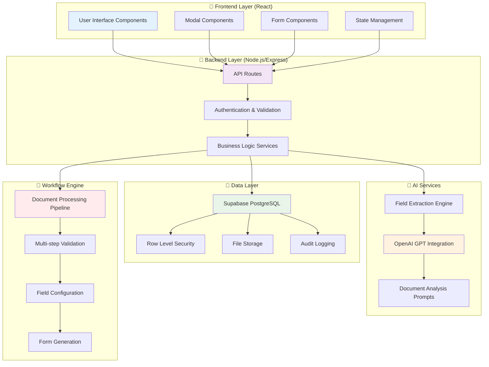
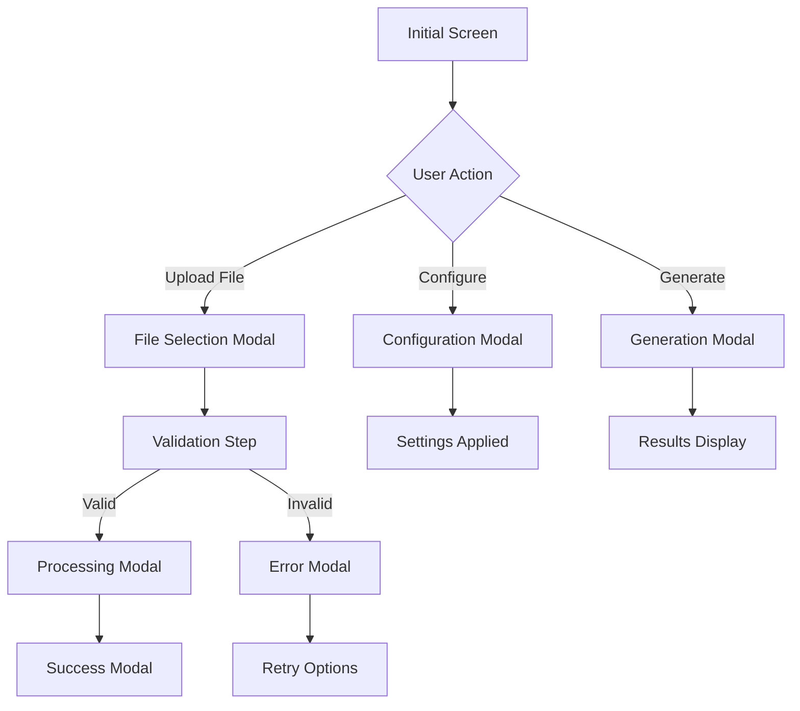
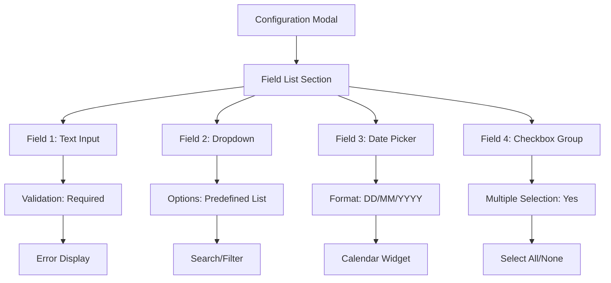
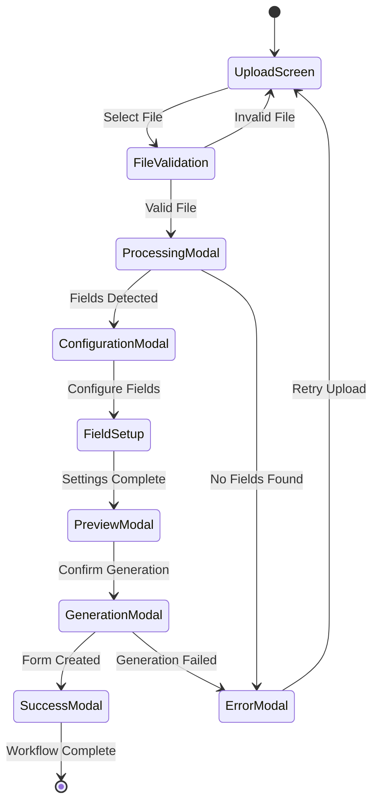
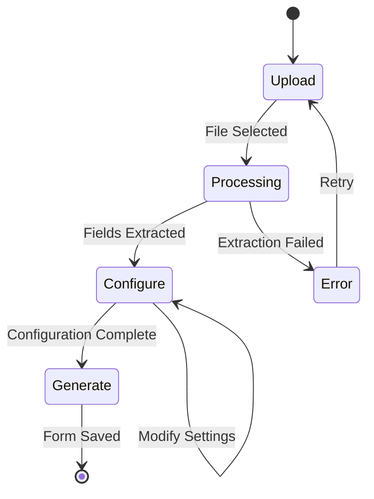
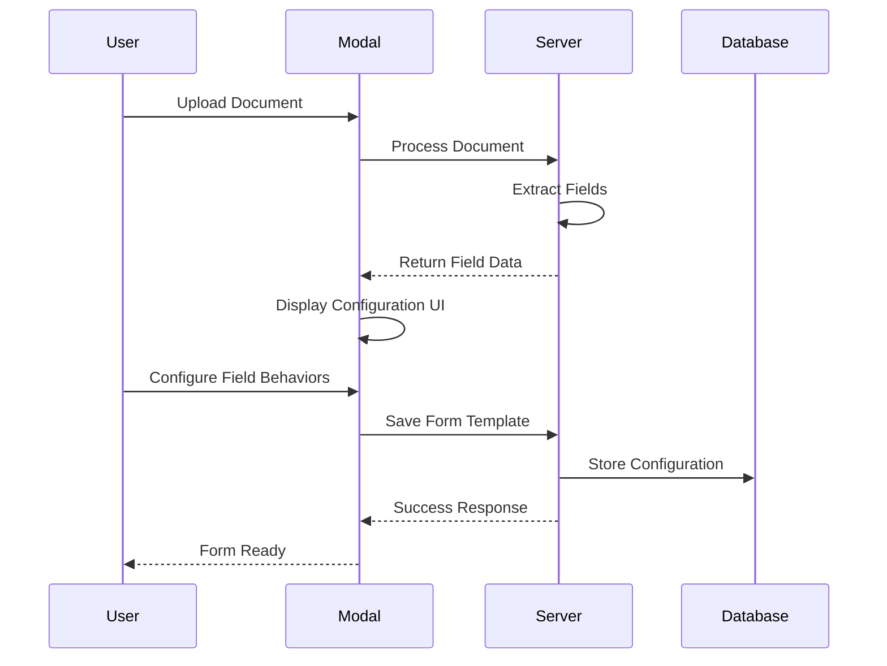
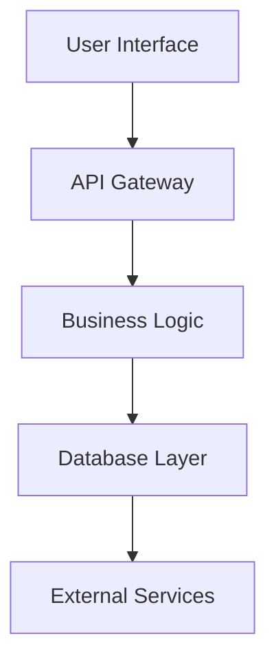
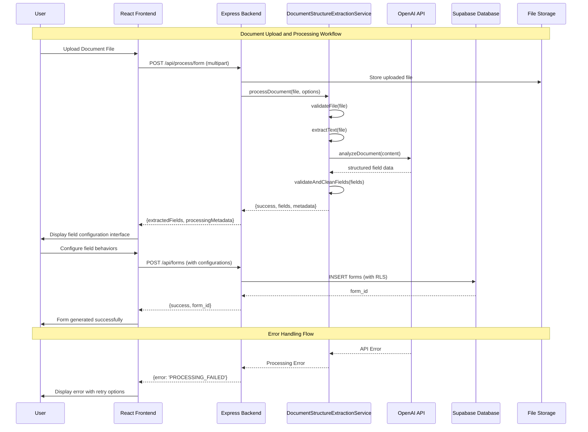

# 0000_WORKFLOW_DOCUMENTATION_PROCEDURE.md - Workflow Documentation Procedure - Construct AI System Documentation

## Document Usage Guide

**🎯 This Document's Role**: Comprehensive procedure for documenting complex workflows in the Construct AI system. **Use this procedure** when implementing new workflows or documenting existing ones to ensure complete, maintainable documentation.

**📚 Related Documents in Documentation Ecosystem:**

- **`0000_PROCEDURES_GUIDE.md`** → Go here for navigation index and procedure selection
- **`0000_SYSTEM_TROUBLESHOOTING_PROCEDURE_TEMPLATE.md`** → **REQUIRED REFERENCE** for comprehensive logging standards, error handling patterns, and troubleshooting methodologies (see "Advanced Documentation Elements" section below)
- **`docs/pages-disciplines/`** → Location for workflow-specific documentation files

**🔗 Cross-References to Related Procedures:**

**Workflow Implementation Procedures:**
- → `0000_WORKFLOW_TEMPLATE_FIELD_ATTRIBUTE_IMPLEMENTATION_PROCEDURE.md` → AI field attribute compliance and validation standards
- → `0000_WORKFLOW_HITL_PROCEDURE.md` → Human-in-the-loop workflow patterns and documentation
- → `0000_WORKFLOW_TASK_PROCEDURE.md` → Task execution workflow documentation standards
- → `0000_WORKFLOW_OPTIMIZATION_GUIDE.md` → Performance optimization and monitoring for workflows

**Visual Documentation Tools:**
- → `0000_MERMAID_DIAGRAM_CREATION_PROCEDURE.md` → Creating visual diagrams for workflow documentation
- → `docs/pages-disciplines/1300_02050_MERMAID_TEMPLATES_PAGE.md` → Mermaid templates for workflow visualization

**System Maintenance Procedures:**
- → `0000_DEBUGGING_GUIDE.md` → Advanced debugging techniques for workflow troubleshooting
- → `docs/0000_MASTER_DATABASE_SCHEMA.md` → Database schema reference for workflow data models

## Overview

This procedure provides a comprehensive framework for documenting complex workflows in the Construct AI system. It ensures that all workflow documentation follows consistent standards, covers all necessary technical and operational details, and serves as both reference material and maintenance guide.

## Purpose

The primary goals of workflow documentation are:

1. **Knowledge Transfer**: Enable developers to understand and maintain complex workflows
2. **Quality Assurance**: Provide testing teams with complete workflow specifications
3. **Operational Support**: Give system administrators clear understanding of workflow components
4. **Future Development**: Serve as foundation for enhancements and modifications
5. **Troubleshooting**: Provide detailed technical information for issue resolution

## When to Create Workflow Documentation

### **Mandatory Documentation Triggers**

#### **New Workflow Implementation**

- Any new multi-step workflow with user interaction
- Complex business logic spanning multiple components
- Workflows involving external API integrations
- Processes with state management across components

#### **Existing Workflow Enhancement**

- Significant architectural changes to existing workflows
- Addition of new features that alter workflow behavior
- Performance optimizations affecting workflow flow
- Security enhancements modifying access patterns

#### **Critical System Workflows**

- Core business functionality (template generation, form processing)
- User authentication and authorization flows
- Data processing pipelines with multiple stages
- Integration workflows between major system components

### **Recommended Documentation Triggers**

#### **Complex User Interactions**

- Multi-step modal workflows with state persistence
- Form submission processes with validation chains
- File upload and processing workflows
- Real-time collaborative workflows

#### **Technical Complexity Indicators**

- Workflows spanning 3+ system components
- State management across multiple React components
- Complex error handling and recovery logic
- Performance-critical processing pipelines

## Workflow Documentation Structure

### **Workflow Component Architecture**

#### **Core Component Categories**

Before documenting specific workflows, understand the standard Construct AI component architecture:

##### **Frontend Components (React)**

- **Page Components**: Main route handlers (`01300-governance`, `01900-procurement`)
- **Modal Components**: User interaction dialogs (`01300-document-upload-modal.js`, `TemplateUseModal`)
- **Form Components**: Data collection interfaces with validation
- **Display Components**: Data visualization and status indicators
- **Service Components**: Business logic abstraction layers
- **State Management**: React hooks with persistent state across modal workflows

```javascript
// Standard React State Management for Workflows
const [workflowState, setWorkflowState] = useState({
  currentStep: "upload", // upload | validate | configure | generate | complete
  formData: {},
  configurations: {},
  progress: { current: 0, total: 100 },
  errors: [],
  loading: false,
  // Construct AI specific state
  documentType: null,
  extractedFields: [],
  fieldBehaviors: {},
  previewMode: false,
});
```

##### **Backend Components (Node.js/Express)**

- **Route Handlers**: API endpoint definitions (`/api/accordion-sections`, `/api/forms`)
- **Service Layers**: Business logic implementation (`document-processing-service.js`)
- **Database Models**: Data access patterns with RLS policies
- **Middleware**: Authentication, validation, and error handling

##### **Integration Components**

- **External APIs**: OpenAI, Supabase, third-party services
- **Database Layer**: PostgreSQL with Row Level Security
- **File Processing**: Document upload, AI analysis, format conversion

#### **Construct AI Specific Architecture Patterns**

##### **Database Schema Integration**

```sql
-- Construct AI Forms Table Structure
CREATE TABLE forms (
  id UUID PRIMARY KEY DEFAULT gen_random_uuid(),
  organization_id UUID REFERENCES organizations(id),
  name TEXT NOT NULL,
  description TEXT,
  template_data JSONB NOT NULL,
  field_configurations JSONB DEFAULT '{}',
  created_by UUID REFERENCES users(id),
  created_at TIMESTAMP WITH TIME ZONE DEFAULT NOW(),
  updated_at TIMESTAMP WITH TIME ZONE DEFAULT NOW(),
  status TEXT DEFAULT 'active' CHECK (status IN ('active', 'draft', 'archived'))
);

-- Row Level Security Policy
CREATE POLICY "Users can only access their organization's forms" ON forms
  FOR ALL TO authenticated
  USING (organization_id = current_setting('app.current_organization_id')::UUID);
```

##### **Service Layer Pattern**

```javascript
// DocumentStructureExtractionService.js Pattern
class DocumentStructureExtractionService {
  constructor() {
    this.openaiClient = new OpenAI({
      apiKey: process.env.OPENAI_API_KEY,
    });
    this.supportedFormats = ["pdf", "docx", "xlsx", "txt"];
  }

  async processDocument(file, options = {}) {
    try {
      // 1. Validate file format and size
      await this.validateFile(file);

      // 2. Extract text content based on file type
      const content = await this.extractText(file);

      // 3. AI-powered field detection
      const extractedFields = await this.analyzeWithAI(content, options);

      // 4. Post-process and validate results
      const processedFields = this.validateAndCleanFields(extractedFields);

      return {
        success: true,
        fields: processedFields,
        metadata: {
          fileName: file.originalname,
          fileSize: file.size,
          processingTime: Date.now() - startTime,
          confidence: this.calculateAverageConfidence(processedFields),
        },
      };
    } catch (error) {
      throw new FormProcessingError(
        `Document processing failed: ${error.message}`
      );
    }
  }
}
```

#### **Workflow State Management Patterns**

```javascript
// Standard React State Management for Construct AI Workflows
const [workflowState, setWorkflowState] = useState({
  currentStep: 'upload', // upload | validate | configure | generate | complete
  formData: {},
  configurations: {},
  progress: { current: 0, total: 100 },
  errors: [],
  loading: false,
  // Construct AI specific state
  documentType: null,
  extractedFields: [],
  fieldBehaviors: {},
  previewMode: false,
  organizationId: null,
  userId: null
});

// Multi-Step Workflow Controller
const workflowController = {
  validateStep: (step, data) => boolean,
  processStep: async (step, data) => result,
  handleError: (error, step) => recovery,
  updateProgress: (step, progress) => void,
  // Construct AI specific methods
  saveToDatabase: async (formData) => supabase.from('forms').insert(formData),
  applyRLSFilters: (query) => query.eq('organization_id', currentOrganizationId)
};
```

#### **Component Communication Patterns**

```javascript
// Parent-Child Communication (Props)
<WorkflowModal
  currentStep={currentStep}
  onStepChange={handleStepChange}
  formData={formData}
  onDataUpdate={updateFormData}
/>;

// Service Layer Communication
const workflowService = {
  async initializeWorkflow(config) {
    return await api.post("/workflows", config);
  },
  async processStep(workflowId, stepData) {
    return await api.put(`/workflows/${workflowId}/step`, stepData);
  },
};
```

#### **Construct AI System Architecture Overview**



### **Required Sections**

#### **1. Overview Section**

```markdown
## Overview

The Field Attributes Configuration Workflow is a critical component of Construct AI's document processing system that allows users to configure how individual form fields behave after document analysis and form generation. This feature provides granular control over field behaviors, enabling users to customize form templates based on their specific business requirements.
```

**Required Elements:**

- Clear problem statement and solution overview
- Business value and user benefits
- High-level architecture description
- Integration points with other systems

#### **2. Purpose Section**

```markdown
## Purpose

The primary goals of this workflow are:

1. **Field Behavior Customization**: Allow users to define how each extracted field should behave in the final form
2. **Enhanced Form Control**: Provide options for read-only, editable, and AI-assisted field behaviors
3. **User Experience Optimization**: Enable form creators to tailor forms to their target users' needs
4. **Data Integrity**: Support scenarios where certain fields should be protected or automatically populated
```

**Required Elements:**

- Specific objectives and success criteria
- User personas and use cases
- Business requirements addressed
- Technical requirements and constraints

#### **3. Workflow Architecture Section**

```markdown
## Workflow Architecture

### Multi-Step Process Flow

The field attributes configuration follows a three-step workflow:

#### Step 1: Document Upload & Analysis

- User uploads a document (PDF, Excel, or text file)
- System performs AI-powered document analysis
- Fields are automatically extracted and categorized
- User can optionally modify document classification settings

#### Step 2: Field Configuration (⚙️ Configure Field Behaviors)

- System displays all extracted fields in an interactive interface
- Each field shows its type, current behavior, and configuration options
- Users can configure field behaviors using radio button controls
- Real-time form preview shows how configurations affect the final form
- Configuration summary provides progress tracking and field statistics

#### Step 3: Form Generation & Saving

- User reviews final configuration
- System generates the form template with applied field behaviors
- Template is saved to the database with all configuration metadata
- Form becomes available for use in the governance system
```

**Required Elements:**

- Step-by-step process flow with clear transitions
- Decision points and conditional logic
- Error states and recovery paths
- User interaction points and feedback mechanisms

#### **4. Component Details Section**

```markdown
## Field Behavior Types

### 🔒 Read-Only Fields

- **Description**: Users can view the field value but cannot modify it
- **Use Cases**:
  - Standard project information (Project Name, Project Number)
  - Auto-populated system fields
  - Reference data that should not be changed
- **UI Indication**: Red border, disabled input styling
- **Validation**: Server-side enforcement prevents modifications

### ✏️ Editable Fields

- **Description**: Users can freely modify field values
- **Use Cases**:
  - Data entry fields requiring user input
  - Dynamic information that changes per form instance
  - Custom fields without restrictions
- **UI Indication**: Green border, standard input styling
- **Validation**: Standard form validation rules apply
```

**Required Elements:**

- Detailed component specifications
- Configuration options and parameters
- Visual design specifications
- Behavioral characteristics and constraints

#### **5. Technical Implementation Section**

````markdown
## Technical Implementation

### Component Structure

#### DocumentUploadModal Component

The main workflow is implemented in `01300-document-upload-modal.js` with the following key sections:

```javascript
// State management for field configurations
const [fieldConfigurations, setFieldConfigurations] = useState({});

// Field configuration functions
const updateFieldConfiguration = (formId, fieldId, behavior) => { ... };
const getFieldConfiguration = (formId, fieldId) => { ... };
const getFieldConfigurationSummary = (formObj) => { ... };
```
````

#### Step Rendering Logic

```javascript
{currentConfigurationStep === "configure" && currentFormForConfigurationState && (
  // Field configuration interface
)}
```

### Data Flow

1. **Document Processing**: Server extracts fields and returns structured data
2. **State Initialization**: `currentFormForConfigurationState` stores processed form data
3. **Field Injection**: `injectHeaderFields()` adds standard project fields
4. **Configuration Storage**: `fieldConfigurations` state tracks user selections
5. **Form Generation**: Configurations merged with form template before saving

````

**Required Elements:**
- Code structure and organization
- State management patterns
- Data flow diagrams and sequences
- API integration points and contracts
- Database schema and relationships

#### **6. Integration Points Section**
```markdown
## Integration Points

### Database Integration
- Field configurations stored as JSON metadata with form templates
- Configurations persist across form instances
- Integration with governance system's form rendering engine

### AI Analysis Integration
- Pre-population of field behaviors based on AI confidence scores
- Document type detection influences default field behaviors
- AI suggestions for field classification and behavior

### Form Rendering Integration
- Configurations applied during form instantiation
- Field-level permissions enforced at runtime
- Dynamic form behavior based on user roles and field configurations
````

**Required Elements:**

- External system dependencies
- API contracts and interfaces
- Data synchronization requirements
- Cross-component communication patterns

#### **7. Validation & Error Handling Section**

```markdown
## Validation & Error Handling

### Client-Side Validation

- Ensures all fields have valid behavior configurations
- Prevents progression without complete field setup
- Real-time feedback on configuration status

### Server-Side Validation

- Validates field configurations during form saving
- Ensures data integrity and security constraints
- Prevents invalid behavior combinations

### Error Recovery

- Graceful handling of processing failures
- Ability to restart configuration process
- Preservation of partial configurations during errors
```

**Required Elements:**

- Input validation rules and constraints
- Error classification and handling strategies
- Recovery procedures and fallback mechanisms
- User feedback and error messaging

#### **8. Performance Considerations Section**

```markdown
## Performance Considerations

### Lazy Loading

- Field configuration interface loads only when needed
- Preview rendering optimized for large field sets
- Efficient state management prevents unnecessary re-renders

### Memory Management

- Large document processing handled in chunks
- State cleanup on component unmount
- Optimized field configuration storage
```

**Required Elements:**

- Performance optimization strategies
- Resource usage patterns and limits
- Caching and optimization techniques
- Scalability considerations

#### **9. Security Considerations Section**

```markdown
## Security Considerations

### Field-Level Permissions

- Read-only fields prevent unauthorized modifications
- Server-side validation of field access permissions
- Audit trails for field configuration changes

### Data Sanitization

- Input validation for all field configurations
- Prevention of malicious configuration injection
- Safe handling of dynamic field properties
```

**Required Elements:**

- Access control and authorization
- Data validation and sanitization
- Audit logging and monitoring
- Security threat mitigation

#### **10. Testing & Quality Assurance Section**

```markdown
## Testing & Quality Assurance

### Unit Tests

- Field configuration logic validation
- State management testing
- Component rendering verification

### Integration Tests

- End-to-end workflow testing
- Database persistence validation
- Form rendering with configurations

### User Acceptance Testing

- Workflow usability validation
- Configuration interface feedback
- Real-world usage scenario testing
```

**Required Elements:**

- Test coverage requirements
- Testing methodologies and frameworks
- Quality metrics and acceptance criteria
- Automated testing integration

#### **11. Future Enhancements Section**

```markdown
## Future Enhancements

### Advanced Field Types

- Support for complex field types (file uploads, signatures)
- Conditional field visibility based on other field values
- Dynamic field validation rules

### Bulk Configuration

- Apply behaviors to multiple fields simultaneously
- Template-based configuration presets
- Import/export of field configuration profiles
```

**Required Elements:**

- Planned feature roadmap
- Technical debt and refactoring opportunities
- Scalability and performance improvements
- User experience enhancements

#### **12. Configuration Examples Section**

```markdown
## Configuration Examples

### Construction Procurement Form
```

Project Name: Read-Only (auto-populated)
Project Number: Read-Only (auto-populated)
Vendor Name: Editable
Contract Value: AI-Editable (AI suggests based on project size)
Delivery Date: Editable
Approval Status: Read-Only (system managed)

```

### Safety Inspection Form
```

Inspection Date: AI-Editable (AI suggests current date)
Inspector Name: Editable
Location: Editable
Risk Level: AI-Editable (AI analyzes description)
Corrective Actions: Editable
Follow-up Date: AI-Editable (AI calculates based on risk level)

```

```

**Required Elements:**

- Real-world usage scenarios
- Configuration patterns and templates
- Best practices and recommendations
- Common configuration mistakes to avoid

#### **13. Conclusion Section**

```markdown
## Conclusion

The Field Attributes Configuration Workflow represents a sophisticated approach to form customization that balances user control with system intelligence. By providing granular field behavior configuration options, the system enables organizations to create forms that match their specific operational requirements while maintaining data integrity and user experience standards.

The implementation demonstrates effective integration of AI capabilities with user-driven configuration, creating a hybrid approach that leverages machine intelligence while preserving human oversight and customization needs.
```

**Required Elements:**

- Summary of key benefits and achievements
- Architectural decisions and trade-offs
- Lessons learned and best practices
- Future outlook and evolution path

## Sub-Workflow Documentation Guidelines

### **When to Create Sub-Workflow Documentation**

Sub-workflows should be documented when:

- **Complex Multi-Step Processes**: Workflows with 3+ distinct user interaction points
- **Modal-Based Interfaces**: Processes involving multiple modal dialogs
- **Branching Logic**: Workflows with conditional paths or decision points
- **Cross-System Integration**: Workflows spanning multiple components or services
- **User Configuration Requirements**: Processes requiring user setup or preferences

### **Sub-Workflow Visual Documentation**

For workflows involving user interfaces, include high-level Mermaid diagrams showing:

#### **Modal Flow Diagrams**



#### **Field Configuration Diagrams**



#### **Process Step Diagrams**



### **Modal Interface Descriptions**

#### **File Upload Modal**

```
┌─────────────────────────────────────┐
│          📁 File Upload             │
├─────────────────────────────────────┤
│ 📎 Drag & drop files here           │
│      or click to browse             │
│                                     │
│ 📄 Supported formats:               │
│    • PDF documents                  │
│    • Word documents (.docx)         │
│    • Excel spreadsheets (.xlsx)     │
│    • Text files (.txt)              │
│                                     │
│ 🔒 Maximum file size: 10MB          │
├─────────────────────────────────────┤
│            [Upload] [Cancel]        │
└─────────────────────────────────────┘
```

#### **Field Configuration Modal**

```
┌─────────────────────────────────────┐
│     ⚙️ Configure Field Behaviors    │
├─────────────────────────────────────┤
│ Field: Project Name                 │
│ Type: Text Input                    │
│                                     │
│ Behavior:                           │
│ ○ 🔒 Read-Only (auto-populated)     │
│ ● ✏️ Editable (user input)          │
│ ○ 🤖 AI-Editable (AI suggests)      │
│                                     │
│ Validation: Required field          │
├─────────────────────────────────────┤
│            [Apply] [Next] [Cancel]  │
└─────────────────────────────────────┘
```

#### **Progress Modal**

```
┌─────────────────────────────────────┐
│        🔄 Processing Document       │
├─────────────────────────────────────┤
│ ┌─────────────────────────────────┐ │
│ │██████████████░░░░░░░░░░░░░ 60% │ │
│ └─────────────────────────────────┘ │
│                                     │
│ 📊 Current Step:                    │
│ Analyzing document structure...     │
│                                     │
│ ⏱️ Estimated time remaining: 30s    │
├─────────────────────────────────────┤
│          [Cancel Process]           │
└─────────────────────────────────────┘
```

### **User Interface Element Guidelines**

#### **Form Fields to Document**

- **Text Inputs**: Single-line text entry with validation rules
- **Text Areas**: Multi-line text for longer content
- **Dropdowns**: Predefined option selection with search/filter
- **Date Pickers**: Calendar-based date selection with format specification
- **Checkboxes**: Binary choices or multiple selection options
- **Radio Buttons**: Single choice from mutually exclusive options
- **File Uploads**: Drag-and-drop or browse file selection
- **Sliders/Selectors**: Range or quantity selection

#### **Modal Navigation Patterns**

- **Sequential Flow**: Previous/Next buttons for step-by-step processes
- **Tab-Based**: Different sections within the same modal
- **Wizard Style**: Progress indicators with numbered steps
- **Accordion**: Expandable sections for complex configurations
- **Sidebar**: Additional options or settings panel

#### **Status Indicators**

- **Loading States**: Spinners, progress bars, estimated completion times
- **Success States**: Checkmarks, confirmation messages, next action buttons
- **Error States**: Warning icons, error descriptions, retry options
- **Validation States**: Real-time feedback, field highlighting, help text

### **Sub-Workflow Integration Documentation**

#### **Data Flow Between Modals**

```
Modal A (Upload) → Modal B (Configuration) → Modal C (Generation)
    ↓                    ↓                        ↓
Field Data ──────────── Field Data ──────────── Form Data
Validation ──────────── Configuration ───────── Validation
Errors ──────────────── Settings ────────────── Results
```

#### **State Management Across Modals**

- **Persistent Data**: Information carried between modal steps
- **Temporary State**: Modal-specific settings that don't persist
- **Global Context**: User preferences and system settings
- **Validation State**: Real-time validation feedback across steps

### **Common Sub-Workflow Patterns**

#### **Document Processing Pattern**

1. **Upload Modal**: File selection and initial validation
2. **Analysis Modal**: AI processing with progress indication
3. **Configuration Modal**: Field setup and behavior selection
4. **Preview Modal**: Form preview and final adjustments
5. **Generation Modal**: Final processing and completion

#### **Configuration Setup Pattern**

1. **Selection Modal**: Choose items to configure
2. **Bulk Settings Modal**: Apply common settings to multiple items
3. **Individual Configuration Modal**: Detailed setup for specific items
4. **Validation Modal**: Review and confirm all settings
5. **Save Modal**: Final confirmation and persistence

#### **Approval Workflow Pattern**

1. **Review Modal**: Display items requiring approval
2. **Decision Modal**: Approve/reject with comments
3. **Escalation Modal**: Forward to other reviewers if needed
4. **Completion Modal**: Final status and notification options

## Advanced Documentation Elements

### **For Complex Workflows**

#### **🔗 Cross-Reference: System Troubleshooting Standards**

**IMPORTANT**: For comprehensive logging standards, enterprise error handling patterns, troubleshooting methodologies, and code quality evaluation procedures, **refer to `0000_SYSTEM_TROUBLESHOOTING_PROCEDURE_TEMPLATE.md`**. This template provides:

- **Advanced Logging Standards**: Structured logging, correlation IDs, log levels, and retention policies
- **Error Classification**: Client/server error categorization with user-friendly messaging
- **Performance Profiling**: Real-time monitoring, memory leak detection, and bottleneck identification
- **Security Event Logging**: Authentication, authorization, and data access audit trails
- **Automated Diagnostics**: Log analysis patterns, anomaly detection, and predictive alerting
- **Code Quality Assessment**: Standards compliance checking and length evaluation procedures

**Do not duplicate these detailed procedures** in workflow documentation. Instead, reference the troubleshooting template for comprehensive technical standards.

### **🔗 Accordion Navigation Integration & User Experience**

**CRITICAL WORKFLOW INTEGRATION**: When documenting complex workflows that involve user navigation between multiple system areas, **mandatory integration with the Accordion Navigation System** is required. Follow the standards outlined in `docs/user-interface/0975_ACCORDION_MASTER_GUIDE.md` for proper navigation implementation.

#### **Navigation Standards for Workflow Documentation**

**MANDATORY: All workflow documentation must include accordion navigation integration when:**

- **Multi-Discipline Workflows**: Workflows spanning multiple accordion sections (e.g., Procurement → Engineering → Safety)
- **Appendix Interfaces**: Workflows involving dedicated appendix interfaces (A-F)
- **User Experience Flows**: Any workflow requiring user navigation between different system areas

##### **Accordion Navigation Integration Requirements**

```markdown
## User Experience & Navigation Integration

### Accordion Navigation Updates (Following `docs/user-interface/0975_ACCORDION_MASTER_GUIDE.md`)

#### Procurement Section Integration
```javascript
// server/src/routes/accordion-sections-routes.js - Procurement Section Update
{
  id: 'accordion-button-01900',
  title: 'Procurement',
  display_order: 1900,
  sector: 'global',
  links: [
    // ✅ MANDATORY: Section title first (per 0975_ACCORDION_MASTER_GUIDE.md)
    { title: 'Procurement', url: '/procurement' },

    // ✅ ALPHABETICAL ORDERING: Appendix interfaces in correct positions
    { title: 'Appendix A: Product Specifications', url: '/product-specifications' },
    { title: 'Appendix C: Delivery Schedules', url: '/procurement/gantt-chart' },

    // Continue alphabetical ordering (C before D, E, M, P, S, T)
    { title: 'Contractor Vetting', url: '/contractor-vetting' },
    { title: 'Document Ordering Management', url: '/document-ordering-management?discipline=01900' },
    { title: 'Documents', url: '/all-documents' },
    { title: 'Email Management', url: '/email-management' },
    { title: 'My Tasks Dashboard', url: '/my-tasks' },
    { title: 'Purchase/Service/Work Orders', url: '/purchase-orders', icon: 'briefcase' },
    { title: 'Scope of Work Generation', url: '/scope-of-work' },
    { title: 'Supplier Directory', url: '/supplier-directory' },
    { title: 'Template & Form Management', url: '/templates-forms-management?discipline=01900' }
  ],
  subsections: {}
}
```

#### Safety Section Integration
```javascript
{
  id: 'accordion-button-02400',
  title: 'Safety',
  display_order: 2400,
  sector: 'global',
  links: [
    { title: 'Safety', url: '/safety' },
    { title: 'Contractor Vetting', url: '/contractor-vetting' },
    { title: 'Appendix B: Safety Data Sheets', url: '/appendix-b-sds-review' }, // ✅ Consistent naming
    { title: 'Documents', url: '/all-documents' },
    { title: 'Email Management', url: '/email-management' },
    { title: 'Inspections', url: '/inspections' },
    { title: 'My Tasks Dashboard', url: '/my-tasks' },
    { title: 'Template & Form Management', url: '/templates-forms-management?discipline=02400' }
  ],
  subsections: {}
}
```

**Source Documentation References**:
- **Navigation Standards**: `docs/user-interface/0975_ACCORDION_MASTER_GUIDE.md` (Section 3.2: Link Ordering Standards)
- **Naming Conventions**: `docs/0000_DOCUMENTATION_MASTER_GUIDE.md` (Section: Documentation Organization Structure)
- **Alphabetical Ordering**: `docs/user-interface/0975_ACCORDION_MASTER_GUIDE.md` (MANDATORY Link Ordering Standards)

##### **Success Criteria for Navigation Integration**
- [ ] Workflow documentation includes accordion navigation integration section
- [ ] Appendix interfaces properly positioned in alphabetical order
- [ ] Consistent "Appendix X: Description" naming across all sections
- [ ] Navigation updates documented with source references
- [ ] User experience flows validated against accordion standards

##### **Workflow Navigation Documentation Template**

```markdown
### User Experience & Navigation Flow

#### Primary User Journey
1. **Entry Point**: User accesses workflow from [Accordion Section] → [Specific Link]
2. **Navigation Flow**: [Section A] → [Section B] → [Section C] (alphabetical order maintained)
3. **Appendix Access**: Dedicated appendix interfaces accessible via [Section Links]
4. **Task Integration**: MyTasks dashboard integration for workflow tracking
5. **Completion Flow**: Return navigation to originating section

#### Accordion Integration Requirements
- **Link Ordering**: All workflow-related links in strict alphabetical order
- **Consistent Naming**: Appendix interfaces use "Appendix X: Description" format
- **Source Compliance**: Implementation follows 0975_ACCORDION_MASTER_GUIDE.md standards
- **User Experience**: Seamless navigation between workflow components
- **Cross-Section Flow**: Clear documentation of multi-section workflow navigation

#### Navigation Validation Checklist
- [ ] Entry points clearly documented with accordion section references
- [ ] Exit points provide clear return navigation paths
- [ ] Appendix interfaces properly integrated into relevant sections
- [ ] Alphabetical ordering verified across all workflow links
- [ ] User experience flows tested for intuitive navigation
- [ ] Cross-section workflows documented with section transitions
```

**IMPLEMENTATION REQUIREMENT**: All workflow documentation must include this accordion navigation integration section when workflows involve user navigation between multiple system areas or appendix interfaces. This ensures consistent user experience and proper integration with the enterprise navigation system.

### **For Complex Workflows (Continued)**

#### **State Machine Diagrams**



#### **Sequence Diagrams**



#### **API Contract Specifications**

```typescript
interface FieldConfiguration {
  fieldId: string;
  behavior: "readonly" | "editable" | "ai_generated";
  validation?: ValidationRule[];
  permissions?: Permission[];
}

interface WorkflowState {
  currentStep: "upload" | "configure" | "generate";
  formData: FormData;
  configurations: Record<string, FieldConfiguration>;
  progress: ProgressMetrics;
}
```

### **Performance Metrics Integration**

```javascript
const workflowMetrics = {
  stepCompletionTime: {
    upload: "< 5s",
    configure: "< 30s",
    generate: "< 10s",
  },
  errorRates: {
    clientErrors: "< 2%",
    serverErrors: "< 1%",
    timeoutErrors: "< 0.5%",
  },
  userSatisfaction: {
    easeOfUse: "> 4.5/5",
    featureCompleteness: "> 95%",
    errorRecovery: "> 90%",
  },
};
```

### **🔗 Mermaid Templates Integration for Visual Documentation**

**CRITICAL REFERENCE**: For creating visual workflow diagrams, system architecture diagrams, and interactive technical documentation, **use the Mermaid Templates Page** at `http://localhost:3060/#/coding-templates`.

#### **When to Use Mermaid Templates in Workflow Documentation**

##### **Architecture Documentation Phase**

- **System Architecture Diagrams**: Use "🏗️ Architecture" template for component relationships and data flow
- **Microservices Design**: Document service interactions and API dependencies
- **Database Schema Visualization**: Create ER diagrams for data relationships

##### **Workflow Process Mapping**

- **Business Process Flows**: Use flowchart templates for step-by-step workflow visualization
- **Decision Trees**: Map conditional logic and branching workflows
- **State Transitions**: Document workflow state changes and lifecycle

##### **API and Integration Documentation**

- **Sequence Diagrams**: Use "🔄 API Flow" template for API call sequences
- **Integration Patterns**: Document external service interactions
- **Authentication Flows**: Map security and access control processes

##### **Technical Design Documentation**

- **Algorithm Visualization**: Use "🧠 Algorithm Design" for complex logic flows
- **Class Hierarchies**: Create "📊 Class Diagram" for object-oriented designs
- **Project Timelines**: Use "⚙️ Workflow Designer" for Gantt chart planning

#### **Mermaid Template Usage Workflow**

```javascript
// Standard workflow for diagram creation
const diagramWorkflow = {
  planning: {
    identifyPurpose: "Define diagram objective",
    selectTemplate: "Choose appropriate Mermaid template",
    gatherRequirements: "Collect all necessary data points",
  },
  creation: {
    customizeTemplate: "Modify template with specific details",
    validateSyntax: "Ensure Mermaid syntax is correct",
    previewDiagram: "Review real-time rendering",
  },
  integration: {
    exportDiagram: "Generate PNG/SVG for documentation",
    saveSourceCode: "Store Mermaid code in version control",
    embedInWorkflow: "Include diagram in workflow documentation",
  },
};
```

#### **Best Practices for Workflow Diagrams**

- **Consistent Naming**: Use `[WorkflowName]_[DiagramType]_[Version]` format
- **Version Control**: Store Mermaid source code alongside documentation
- **Accessibility**: Ensure diagrams are readable and include alt-text where applicable
- **Cross-Platform**: Test diagram rendering across different browsers and devices

#### **Integration with Workflow Documentation Structure**

````markdown
## Workflow Architecture

### Visual Process Flow


_Generated using Mermaid Templates - Source: workflow-architecture-v1.0.mmd_

### Component Interaction Diagram


````

### Sequence Diagram

_See detailed API sequence diagram in Mermaid Templates_

````

**File Reference**: [1300_02050_MERMAID_TEMPLATES_PAGE.md](../pages-disciplines/1300_02050_MERMAID_TEMPLATES_PAGE.md) - Complete Mermaid Templates documentation

#### **Complete Workflow Data Flow**



## Documentation Maintenance Procedures

### **Version Control Strategy**
```markdown
## Document Information

- **Document ID**: `1300_01300_WORKFLOW_FIELD_ATTRIBUTES_CONFIGURATION`
- **Version**: 1.0
- **Created**: 2025-11-30
- **Last Updated**: 2025-11-30
- **Author**: AI Assistant (Construct AI)
- **Review Cycle**: Quarterly
- **Related Documents**:
  - `client/src/pages/01300-governance/components/01300-document-upload-modal.js`
  - `server/src/routes/form-processing.js`
  - `docs/procedures/0000_WORKFLOW_DOCUMENTATION_PROCEDURE.md`
````

### **Update Triggers**

- **Code Changes**: Any modification to workflow logic requires documentation update
- **New Features**: Addition of workflow capabilities needs documentation expansion
- **Bug Fixes**: Critical fixes affecting workflow behavior require documentation updates
- **Performance Changes**: Optimization affecting user experience requires documentation
- **Security Updates**: Changes to access control or validation require documentation updates

### **Review Process**

1. **Peer Review**: Technical accuracy by development team member
2. **QA Review**: Testability and completeness by QA team member
3. **Product Review**: User experience alignment by product team member
4. **Security Review**: Security implications by security team member
5. **Documentation Review**: Standards compliance by technical writer

## Quality Assurance Checklist

### **Content Completeness**

- [ ] Overview clearly explains the workflow purpose and scope
- [ ] All workflow steps are documented with decision points
- [ ] Technical implementation details are complete and accurate
- [ ] Integration points with other systems are identified
- [ ] Error handling and recovery procedures are documented
- [ ] Performance considerations and limitations are specified
- [ ] Security considerations and access controls are defined
- [ ] Testing procedures and quality metrics are established

### **Technical Accuracy**

- [ ] Code examples are syntactically correct and functional
- [ ] API contracts match actual implementation
- [ ] Database schemas reflect current structure
- [ ] State management patterns are correctly described
- [ ] Performance metrics are based on real measurements
- [ ] Security controls match implemented policies

### **Maintainability**

- [ ] Document structure follows standard template
- [ ] Cross-references are accurate and up-to-date
- [ ] Version control information is current
- [ ] Related documents are properly linked
- [ ] Future enhancement roadmap is realistic and prioritized

### **User Experience**

- [ ] Configuration examples are practical and realistic
- [ ] Error messages and user feedback are documented
- [ ] Performance expectations are clearly stated
- [ ] Troubleshooting guides are included for common issues
- [ ] Best practices and recommendations are provided

## Common Documentation Pitfalls

### **Technical Documentation Issues**

- **Outdated Code Examples**: Always verify code snippets against current implementation
- **Missing Error States**: Document all possible error conditions and recovery paths
- **Incomplete API Contracts**: Include request/response formats, status codes, and error responses
- **Assumed Knowledge**: Don't assume readers know internal system details

### **Process Documentation Issues**

- **Missing Decision Points**: Document all conditional logic and user choice points
- **Incomplete State Management**: Show how data flows between workflow steps
- **Performance Blind Spots**: Include performance characteristics and limitations
- **Security Gaps**: Document all access controls and permission checks

### **Maintenance Issues**

- **No Update Triggers**: Define when documentation must be updated
- **Missing Version Control**: Include version history and change tracking
- **Broken Cross-References**: Regularly verify all document links and references
- **Stale Examples**: Update configuration examples as system evolves

## Tooling and Automation

### **Documentation Generation**

```bash
# Generate workflow documentation from code analysis
node scripts/generate-workflow-docs.js --workflow field-attributes --output docs/pages-disciplines/

# Validate documentation completeness
node scripts/validate-workflow-docs.js --file 1300_01300_WORKFLOW_FIELD_ATTRIBUTES_CONFIGURATION.md
```

### **Cross-Reference Validation**

```javascript
// Automated cross-reference checking
const crossReferenceValidator = {
  validateLinks: (document) => {
    // Check all internal links are valid
    // Verify external references exist
    // Ensure API endpoints are current
  },
  updateReferences: (document) => {
    // Auto-update version numbers
    // Refresh code example line numbers
    // Update performance metrics
  },
};
```

## Success Metrics

### **Documentation Quality Metrics**

- **Completeness Score**: Percentage of required sections present (target: 100%)
- **Accuracy Score**: Percentage of technical details verified against code (target: 95%)
- **Update Frequency**: Documentation updated within 30 days of code changes (target: 90%)
- **User Satisfaction**: Developer feedback on documentation usefulness (target: >4/5)

### **Workflow Health Metrics**

- **Documentation Coverage**: Percentage of workflows with current documentation (target: 95%)
- **Review Compliance**: Documentation reviews completed on schedule (target: 100%)
- **Bug Prevention**: Issues caught during documentation review (target: >20% of potential issues)
- **Onboarding Time**: Time for new developers to understand workflows (target: <4 hours)

## Emergency Documentation Procedures

### **Critical Workflow Failures**

1. **Immediate Response**: Check documentation for known failure modes
2. **Temporary Workarounds**: Use documented recovery procedures
3. **Communication**: Notify team using documented escalation paths
4. **Documentation Update**: Update documentation with new failure mode

### **Security Incidents**

1. **Containment**: Follow documented security response procedures
2. **Investigation**: Use documented debugging procedures
3. **Recovery**: Implement documented recovery workflows
4. **Documentation**: Update security documentation with lessons learned

## Conclusion

Comprehensive workflow documentation is essential for maintaining complex systems like Construct AI. This procedure ensures that all workflow documentation follows consistent standards, covers all necessary technical and operational details, and serves as both reference material and maintenance guide for current and future development teams.

By following this procedure, teams can create documentation that not only explains how workflows work but also provides the context and technical details needed for effective maintenance, troubleshooting, and future enhancements.

---

## Future Enhancement Roadmap

This section outlines emerging technologies and specialized enterprise concerns that should be integrated into future versions of this workflow documentation procedure as the Construct AI system evolves.

### **AI/ML Workflow Documentation Standards**

#### **AI Integration Patterns**
```markdown
## AI-Powered Workflow Documentation

### AI Integration Patterns
- **Prompt Engineering**: Documenting AI prompts and their evolution
- **Model Selection**: Criteria for choosing AI models for workflow tasks
- **Fallback Mechanisms**: Non-AI alternatives when AI services fail
- **Cost Optimization**: API usage monitoring and budget controls
- **Ethical AI**: Bias detection, transparency, and accountability measures

### AI Workflow Metrics
- **Accuracy Rates**: AI-generated content quality measurements
- **Response Times**: AI processing performance benchmarks
- **Cost per Transaction**: AI API usage cost tracking
- **Human Override Frequency**: Rate of AI suggestions requiring human correction
- **Model Performance**: Accuracy, latency, and reliability metrics over time
```

#### **Machine Learning Operations (MLOps)**
- **Model Versioning**: Tracking AI model versions and their impact on workflows
- **A/B Testing**: Documentation of AI model performance comparisons
- **Drift Detection**: Monitoring for AI model performance degradation
- **Explainability**: Documenting AI decision-making processes for auditability

### **Real-time Collaboration Workflows**

#### **Collaborative Workflow Patterns**
```markdown
## Real-time Collaboration Workflows

### Synchronization Patterns
- **Operational Transformation**: Conflict resolution for concurrent edits
- **Presence Indicators**: User activity and cursor position sharing
- **Change Notifications**: Real-time updates for workflow participants
- **Offline Support**: Synchronization strategies for intermittent connectivity
- **Conflict Resolution**: Automated and manual merge conflict handling

### Collaboration Metrics
- **Concurrent Users**: Maximum simultaneous participants supported
- **Conflict Resolution Rate**: Percentage of edits requiring manual resolution
- **Session Duration**: Average collaborative session length
- **Participant Satisfaction**: User feedback on collaboration experience
- **Productivity Impact**: Time savings from collaborative features
```

#### **Distributed Team Support**
- **Global Time Zone Handling**: Scheduling and notification strategies
- **Language Barriers**: Translation and localization support
- **Cultural Adaptation**: Region-specific workflow customizations
- **Connectivity Resilience**: Offline-first design patterns

### **Regulatory Compliance Integration**

#### **Compliance Workflow Documentation**
```markdown
## Regulatory Compliance Integration

### Compliance Workflow Patterns
- **Audit Trails**: Complete transaction logging for regulatory requirements
- **Data Retention**: Compliance-driven data lifecycle management
- **Access Controls**: Role-based permissions for sensitive workflows
- **Change Management**: Documented approval processes for workflow modifications
- **Data Sovereignty**: Geographic data residency requirements

### Compliance Metrics
- **Audit Success Rate**: Percentage of successful regulatory audits
- **Data Breach Prevention**: Security incident rates and response times
- **Compliance Violation Rate**: Frequency of regulatory infractions
- **Remediation Time**: Average time to resolve compliance issues
- **Evidence Collection**: Time to gather audit evidence
```

#### **Industry-Specific Compliance**
- **GDPR/SOC2**: Privacy and security compliance workflows
- **SOX/PCI DSS**: Financial and payment compliance requirements
- **HIPAA/HITECH**: Healthcare data protection workflows
- **Industry 4.0 Standards**: Manufacturing and industrial compliance

### **Cost Optimization Strategies**

#### **Financial Workflow Documentation**
```markdown
## Cost Optimization Strategies

### Resource Usage Monitoring
- **API Cost Tracking**: Cloud service usage and cost allocation
- **Storage Optimization**: Data lifecycle and archival strategies
- **Compute Efficiency**: Serverless function optimization and caching
- **Network Optimization**: CDN usage and data transfer minimization
- **Third-party Service Costs**: Vendor API and service usage tracking

### Cost Metrics
- **Cost per Workflow**: Average expense per completed workflow
- **Resource Utilization**: Percentage of allocated resources actually used
- **Cost Variance**: Budget vs. actual expenditure tracking
- **ROI Measurement**: Business value delivered per dollar spent
- **Cost Efficiency Trends**: Cost reduction over time
```

#### **Economic Sustainability**
- **Carbon Footprint Tracking**: Environmental impact measurement
- **Energy-Efficient Design**: Low-power workflow patterns
- **Resource Pooling**: Shared infrastructure optimization
- **Usage-Based Pricing**: Cost allocation based on actual consumption

### **Microservices Workflow Architecture**

#### **Distributed System Patterns**
```markdown
## Microservices Workflow Architecture

### Service Mesh Integration
- **Service Discovery**: Dynamic service location and health monitoring
- **Circuit Breakers**: Fault tolerance and graceful degradation
- **Distributed Tracing**: End-to-end request tracking across services
- **Event-Driven Communication**: Asynchronous workflow coordination
- **Saga Orchestration**: Complex transaction management across services

### Microservices Metrics
- **Service Availability**: Uptime percentage for critical workflow services
- **Inter-Service Latency**: Response times between microservices
- **Error Propagation Rate**: Frequency of cascading failures
- **Scalability Events**: Automatic scaling trigger frequency and success rate
- **Service Dependencies**: Mapping of service interdependencies
```

#### **Event-Driven Architecture**
- **Event Storming**: Collaborative event modeling for workflows
- **Event Sourcing**: Complete audit trails through event logs
- **CQRS Patterns**: Command Query Responsibility Segregation implementation
- **Domain-Driven Design**: Business domain modeling in distributed systems

### **DevOps Integration Enhancement**

#### **CI/CD Pipeline Integration**
```markdown
## DevOps Workflow Integration

### Deployment Automation
- **Automated Testing**: Workflow testing in deployment pipelines
- **Blue-Green Deployments**: Zero-downtime workflow updates
- **Feature Flags**: Gradual rollout of workflow changes
- **Canary Releases**: Phased deployment with rollback capabilities
- **Infrastructure as Code**: Workflow infrastructure automation

### Deployment Metrics
- **Deployment Frequency**: How often workflows are updated
- **Lead Time**: Time from code commit to production deployment
- **Change Failure Rate**: Percentage of deployments requiring rollback
- **Recovery Time**: Time to restore service after incidents
- **Deployment Success Rate**: Percentage of successful automated deployments
```

#### **Observability and Monitoring**
- **Distributed Tracing**: End-to-end workflow performance monitoring
- **Log Aggregation**: Centralized logging across microservices
- **Metrics Collection**: Performance and business metrics gathering
- **Alert Management**: Automated incident detection and response

### **Advanced User Experience Patterns**

#### **Mobile-First and Responsive Design**
```markdown
## Advanced User Experience Patterns

### Mobile Workflow Optimization
- **Touch-First Design**: Interface optimization for touch interactions
- **Progressive Web Apps**: Offline-capable workflow applications
- **Gesture Recognition**: Advanced interaction patterns for mobile devices
- **Context-Aware UI**: Adaptive interfaces based on device capabilities

### Accessibility Standards
- **WCAG Compliance**: Web Content Accessibility Guidelines implementation
- **Screen Reader Support**: Voice navigation and audio feedback
- **Keyboard Navigation**: Full keyboard accessibility for workflows
- **Color Contrast**: Visual accessibility standards compliance
```

#### **Internationalization and Localization**
- **Multi-Language Support**: Workflow interfaces in multiple languages
- **Cultural Adaptation**: Region-specific date, number, and format handling
- **RTL Language Support**: Right-to-left language interface adaptation
- **Timezone Handling**: Global time zone management in workflows

### **Emerging Technology Integration**

#### **Edge Computing and IoT**
```markdown
## Emerging Technology Integration

### Edge Computing Workflows
- **Local Processing**: Data processing at the network edge
- **Offline Synchronization**: Data sync patterns for disconnected devices
- **IoT Device Integration**: Sensor and device data workflows
- **Low-Latency Processing**: Real-time decision-making at the edge

### Blockchain and Web3
- **Smart Contracts**: Automated workflow execution through blockchain
- **Decentralized Identity**: Self-sovereign identity in workflow systems
- **Tokenized Incentives**: Cryptocurrency-based workflow rewards
- **Immutable Audit Trails**: Blockchain-based transaction logging
```

#### **Quantum Computing Readiness**
- **Quantum-Safe Cryptography**: Post-quantum encryption standards
- **Quantum Algorithm Integration**: Optimization problems for quantum computing
- **Hybrid Computing**: Classical-quantum workflow orchestration
- **Future-Proof Architecture**: Quantum-ready workflow design patterns

### **Implementation Timeline**

#### **Phase 1: Near-Term Enhancements (6-12 months)**
- AI/ML workflow documentation patterns
- Real-time collaboration frameworks
- Enhanced DevOps integration

#### **Phase 2: Mid-Term Evolution (12-24 months)**
- Regulatory compliance integration
- Cost optimization strategies
- Advanced microservices patterns

#### **Phase 3: Long-Term Innovation (24+ months)**
- Emerging technologies (IoT, blockchain, quantum)
- Advanced UX patterns
- Global scalability enhancements

---

## Document Information

- **Document ID**: `0000_WORKFLOW_DOCUMENTATION_PROCEDURE`
- **Version**: 2.0
- **Created**: 2025-11-30
- **Last Updated**: 2025-11-30
- **Author**: AI Assistant (Construct AI)
- **Review Cycle**: Quarterly
- **Related Documents**:
  - `docs/pages-disciplines/1300_01300_WORKFLOW_GENERATE_FORMS_FROM_UPLOADS.md` (Enhanced Implementation Example)
  - `docs/pages-disciplines/1300_01300_WORKFLOW_FIELD_ATTRIBUTES_CONFIGURATION.md` (Example Implementation)
  - `docs/pages-disciplines/1300_02050_MERMAID_TEMPLATES_PAGE.md` (Visual Documentation Tool)
  - `docs/procedures/0000_PROCEDURES_GUIDE.md` (Procedure Navigation)
  - `docs/0000_DOCUMENTATION_GUIDE.md` (General Documentation Standards)
  - `docs/procedures/0000_SYSTEM_TROUBLESHOOTING_PROCEDURE_TEMPLATE.md` (Technical Standards Reference)

---

**Navigation**: This procedure should be used whenever documenting new workflows or updating existing workflow documentation to ensure comprehensive coverage and maintainability.
