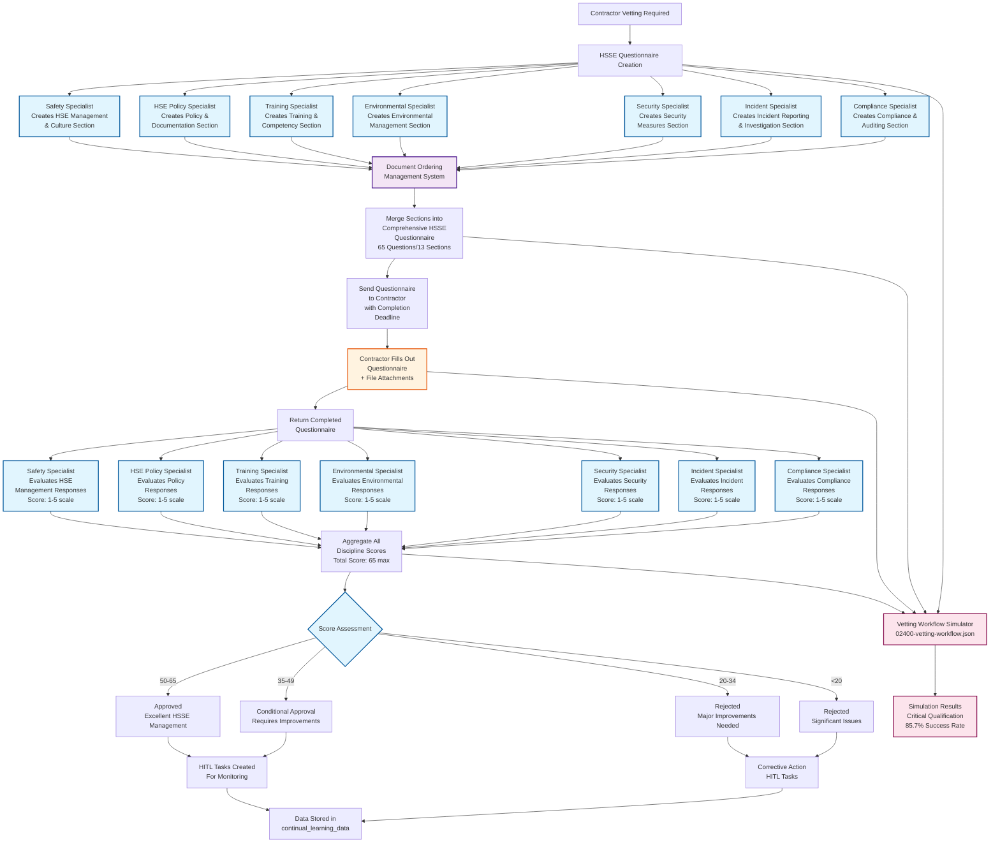

# HSSE Questionnaire Workflow Diagram

## Overview
This Mermaid diagram illustrates the contractor vetting workflow using the HSSE Management and Culture Questionnaire, showing how specialists create questionnaire sections, merge them into a comprehensive document, send to contractors for completion, and segregate responses back to discipline specialists for evaluation.

## Process Description

### 1. Questionnaire Creation Phase
- **Parallel Specialist Input**: 7 HSSE discipline specialists each create their domain-specific sections
- **Document Assembly**: Sections merged into comprehensive 65-question questionnaire via Document Ordering Management System

### 2. Contractor Engagement Phase
- **Questionnaire Delivery**: Complete questionnaire sent to contractor with completion deadline
- **Response Collection**: Contractor provides detailed responses and supporting documentation

### 3. Discipline Evaluation Phase
- **Response Segregation**: Completed questionnaire responses automatically routed to relevant discipline specialists
- **Specialist Assessment**: Each specialist scores their section (1-5 scale) with qualitative evaluation and recommendations

### 4. Qualification Decision Phase
- **Score Aggregation**: Individual discipline scores totaled (65 points maximum)
- **Qualification Logic**:
  - 50-65: Approved (Excellent HSSE Management)
  - 35-49: Conditional Approval (Requires Improvements)
  - 20-34: Rejected (Major Improvements Needed)
  - <20: Rejected (Significant Compliance Issues)

### 5. Learning & Improvement Phase
- **HITL Tasks**: Automated task creation for monitoring, corrective actions, or improvement plans
- **Data Storage**: Assessment data stored in `continual_learning_data` table for model training

### 6. Simulation Integration
- **Parallel Execution**: 02400 Contractor Vetting Workflow Simulator runs parallel assessment
- **Verification**: Simulation validates qualification logic and agent performance (achieved 85.7% success rate in testing)

## Key Features

- **Specialized Domain Expertise**: Each discipline maintains independent evaluation authority
- **Parallel Processing**: Specialists work simultaneously for efficiency
- **Structured Scoring**: Standardized 1-5 scoring with qualitative feedback
- **HITL Integration**: Human oversight for complex evaluations and improvements
- **Learning Loop**: Continuous improvement through data collection and model training
- **Simulation Validation**: 02400 workflow simulator ensures process reliability

## Integration Points

- **Database Tables**: `contractor_vetting`, `contractor_evaluations`, `tasks`, `continual_learning_data`
- **UI Access**: Contractor Vetting button → Safety page → Inspections section
- **Document Management**: Integrated file upload and version control
- **Task Management**: Automated stakeholder notifications and HITL assignments