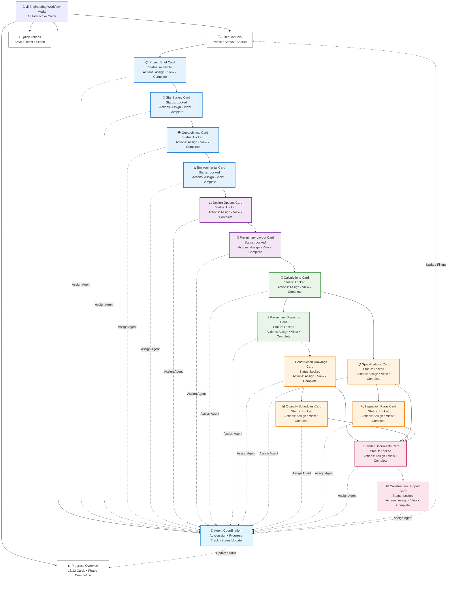

# Civil Engineering Modal Workflow System - Complete Diagram

```mermaid
flowchart TD
    %% Modal Entry Point
    MODAL_ENTRY([🎯 Civil Engineering<br/>Workflow Modal<br/>13 Interactive Cards])

    %% Modal System Architecture
    subgraph "🎨 Modal System Architecture"
        MODAL_CONTROLLER[🎯 Modal Controller<br/>State Management & Persistence]
        WORKFLOW_ENGINE[⚙️ Workflow Engine<br/>Card Dependencies & Logic]
        AGENT_COORDINATOR[🤖 Agent Coordinator<br/>Multi-Agent Integration]
        APPROVAL_SYSTEM[✅ Approval Workflow<br/>Sign-off & Governance]
    end

    %% Phase 1: Site Assessment Cards - DETAILED
    subgraph "📋 Phase 1: Site Assessment (4 Cards)"
        P1_BRIEF[📋 Project Brief Card<br/>📥 INPUT DOCS:<br/>• Client Requirements<br/>• Scope Documents<br/>• OR Retrieve from 00900 Doc Control<br/>⚙️ AGENT: Content Analysis Agent<br/>📤 OUTPUT: Approved Brief<br/>✅ APPROVAL: PM Sign-off → 00900]
        P1_SURVEY[📍 Site Survey Card<br/>📥 INPUT DOCS:<br/>• Topographic Data<br/>• Utility Maps<br/>• OR Retrieve from Survey DB<br/>⚙️ AGENT: GIS Processing Agent<br/>📤 OUTPUT: Survey Report<br/>✅ APPROVAL: Technical Lead → 00900]
        P1_GEOTECH[🌍 Geotechnical Card<br/>📥 INPUT DOCS:<br/>• Soil Reports<br/>• Borehole Data<br/>• OR Retrieve from Geo DB<br/>⚙️ AGENT: Analysis Agent<br/>📤 OUTPUT: Foundation Recs<br/>✅ APPROVAL: Geotech Engineer → 00900]
        P1_ENV[⚖️ Environmental Card<br/>📥 INPUT DOCS:<br/>• EIA Reports<br/>• Permits<br/>• OR Retrieve from Env DB<br/>⚙️ AGENT: Compliance Agent<br/>📤 OUTPUT: Env Constraints<br/>✅ APPROVAL: Env Specialist → 00900]
    end

    %% Phase 2: Conceptual Design Cards - DETAILED
    subgraph "💡 Phase 2: Conceptual Design (2 Cards)"
        P2_OPTIONS[⚖️ Design Options Card<br/>📥 INPUT DOCS:<br/>• Site Constraints<br/>• Client Preferences<br/>• Budget Parameters<br/>⚙️ AGENT: Options Analysis Agent<br/>📤 OUTPUT: Options Matrix<br/>✅ APPROVAL: Design Team → PM]
        P2_LAYOUT[📐 Preliminary Layout Card<br/>📥 INPUT DOCS:<br/>• Selected Option<br/>• Alignment Data<br/>• Mass Balance Req<br/>⚙️ AGENTS:<br/>• CAD Agent (2D/3D Models)<br/>• GIS Agent (Alignments)<br/>• Analysis Agent (Calculations)<br/>📤 OUTPUT: Layout Drawings<br/>✅ APPROVAL: Senior Engineer → 00900]
    end

    %% Phase 3: Preliminary Design Cards - DETAILED
    subgraph "📐 Phase 3: Preliminary Design (2 Cards)"
        P3_CALC[🧮 Engineering Calculations<br/>📥 INPUT DOCS:<br/>• Layout Drawings<br/>• Load Requirements<br/>• Material Properties<br/>⚙️ AGENTS:<br/>• Structural Analysis Agent<br/>• Hydraulic Analysis Agent<br/>• Geotech Analysis Agent<br/>📤 OUTPUT: Calculation Package<br/>✅ APPROVAL: Technical Lead → 00900]
        P3_DRAWINGS[📏 Preliminary Drawings<br/>📥 INPUT DOCS:<br/>• Calculation Results<br/>• Standards & Codes<br/>• Coordination Req<br/>⚙️ AGENTS:<br/>• CAD Agent (Drawings)<br/>• BIM Agent (Coordination)<br/>• Clash Detection Agent<br/>📤 OUTPUT: Drawing Set<br/>✅ APPROVAL: Drawing Office → 00900]
    end

    %% Phase 4: Detailed Design Cards - DETAILED
    subgraph "🔧 Phase 4: Detailed Design (4 Cards)"
        P4_CONSTRUCTION[📐 Construction Drawings<br/>📥 INPUT DOCS:<br/>• Preliminary Drawings<br/>• Construction Details<br/>• Revision Control<br/>⚙️ AGENTS:<br/>• CAD Agent (Production)<br/>• Standards Agent (Compliance)<br/>• Quality Agent (Review)<br/>📤 OUTPUT: Full Drawing Set<br/>✅ APPROVAL: Chief Engineer → 00900]
        P4_SPECS[📋 Technical Specifications<br/>📥 INPUT DOCS:<br/>• Material Standards<br/>• Quality Requirements<br/>• Regulatory Specs<br/>⚙️ AGENTS:<br/>• Content Agent (Writing)<br/>• Compliance Agent (Checking)<br/>• Standards Agent (Validation)<br/>📤 OUTPUT: Spec Document<br/>✅ APPROVAL: Technical Lead → 00900]
        P4_QUANTITIES[📊 Quantity Schedules<br/>📥 INPUT DOCS:<br/>• Construction Drawings<br/>• Material Take-offs<br/>• Unit Rates<br/>⚙️ AGENTS:<br/>• Quantity Agent (Take-off)<br/>• Cost Agent (Pricing)<br/>• Validation Agent (Checking)<br/>📤 OUTPUT: BOQ Excel<br/>✅ APPROVAL: Quantity Surveyor → 00900]
        P4_INSPECTION[🔍 Inspection & Test Plans<br/>📥 INPUT DOCS:<br/>• Specifications<br/>• Quality Standards<br/>• Regulatory Requirements<br/>⚙️ AGENTS:<br/>• Quality Agent (Planning)<br/>• Compliance Agent (Standards)<br/>• Documentation Agent (Writing)<br/>📤 OUTPUT: ITP Document<br/>✅ APPROVAL: QA Manager → 00900]
    end

    %% Phase 5: Procurement & Construction Cards - DETAILED
    subgraph "📋 Phase 5: Procurement & Construction (2 Cards)"
        P5_TENDER[📄 Tender Documents<br/>📥 INPUT DOCS:<br/>• All Phase 4 Outputs<br/>• Procurement Requirements<br/>• Compliance Matrices<br/>⚙️ AGENTS:<br/>• Documentation Agent (Assembly)<br/>• Compliance Agent (Checking)<br/>• Quality Agent (Review)<br/>📤 OUTPUT: Tender Package<br/>✅ APPROVAL: Procurement Lead → 00900]
        P5_CONSTRUCTION[🏗️ Construction Support<br/>📥 INPUT DOCS:<br/>• Tender Package<br/>• Construction Queries<br/>• Variation Requests<br/>⚙️ AGENTS:<br/>• Support Agent (RFI Responses)<br/>• Variation Agent (Assessment)<br/>• Documentation Agent (Records)<br/>📤 OUTPUT: Construction Docs<br/>✅ APPROVAL: Project Director → 00900]
    end

    %% Document Control Integration
    subgraph "📚 Document Control System (00900)"
        DOC_CONTROL[(🔐 00900 Document Control<br/>Central Repository)]
        APPROVAL_WORKFLOW[✅ Approval Workflow<br/>Multi-level Sign-off]
        VERSION_CONTROL[📝 Version Control<br/>Revision Tracking]
        AUDIT_TRAIL[📊 Audit Trail<br/>Complete History]
    end

    %% Agent Coordination System
    subgraph "🤖 Multi-Agent Coordination"
        AGENT_ROUTER[🎯 Agent Router<br/>Task Distribution]
        CAD_AGENTS[🏗️ CAD Agents<br/>AutoCAD • MicroStation]
        ANALYSIS_AGENTS[🧮 Analysis Agents<br/>Structural • Hydraulic]
        GIS_AGENTS[🗺️ GIS Agents<br/>ArcGIS • QGIS]
        CONTENT_AGENTS[📝 Content Agents<br/>Writing • Review]
        COMPLIANCE_AGENTS[⚖️ Compliance Agents<br/>Regulatory • Standards]
    end

    %% Modal User Interface Controls
    subgraph "🎮 Modal UI Controls"
        CARD_FILTERS[🔍 Filter Controls<br/>Phase • Status • Search]
        PROGRESS_TRACKER[📊 Progress Dashboard<br/>13/13 Cards • Phase Completion]
        QUICK_ACTIONS[⚡ Quick Actions<br/>Save • Reset • Export • Help]
        STATUS_INDICATORS[📈 Status Indicators<br/>Real-time Updates]
    end

    %% User Interaction Flow
    MODAL_ENTRY --> CARD_FILTERS
    CARD_FILTERS --> PROGRESS_TRACKER
    PROGRESS_TRACKER --> QUICK_ACTIONS

    %% Phase 1 Flow with Dependencies
    CARD_FILTERS --> P1_BRIEF
    P1_BRIEF -->|Complete + Approve| P1_SURVEY
    P1_SURVEY -->|Complete + Approve| P1_GEOTECH
    P1_GEOTECH -->|Complete + Approve| P1_ENV
    P1_ENV -->|Next Phase| P2_OPTIONS

    %% Phase 2 Flow
    P2_OPTIONS -->|Complete + Approve| P2_LAYOUT
    P2_LAYOUT -->|Next Phase| P3_CALC

    %% Phase 3 Flow
    P3_CALC -->|Complete + Approve| P3_DRAWINGS
    P3_DRAWINGS -->|Next Phase| P4_CONSTRUCTION

    %% Phase 4 Flow (Parallel Processing)
    P4_CONSTRUCTION -->|Complete + Approve| P5_TENDER
    P3_CALC --> P4_SPECS
    P4_SPECS -->|Complete + Approve| P5_TENDER
    P4_CONSTRUCTION --> P4_QUANTITIES
    P4_QUANTITIES -->|Complete + Approve| P5_TENDER
    P4_SPECS --> P4_INSPECTION
    P4_INSPECTION -->|Complete + Approve| P5_TENDER

    %% Phase 5 Flow
    P5_TENDER -->|Complete + Approve| P5_CONSTRUCTION
    P5_CONSTRUCTION -->|Complete + Approve| PROJECT_COMPLETE([✅ Project Complete<br/>Handover Documentation])

    %% Document Control Integration
    P1_BRIEF -.->|Store & Retrieve| DOC_CONTROL
    P1_SURVEY -.->|Store & Retrieve| DOC_CONTROL
    P1_GEOTECH -.->|Store & Retrieve| DOC_CONTROL
    P1_ENV -.->|Store & Retrieve| DOC_CONTROL
    P2_OPTIONS -.->|Store & Retrieve| DOC_CONTROL
    P2_LAYOUT -.->|Store & Retrieve| DOC_CONTROL
    P3_CALC -.->|Store & Retrieve| DOC_CONTROL
    P3_DRAWINGS -.->|Store & Retrieve| DOC_CONTROL
    P4_CONSTRUCTION -.->|Store & Retrieve| DOC_CONTROL
    P4_SPECS -.->|Store & Retrieve| DOC_CONTROL
    P4_QUANTITIES -.->|Store & Retrieve| DOC_CONTROL
    P4_INSPECTION -.->|Store & Retrieve| DOC_CONTROL
    P5_TENDER -.->|Store & Retrieve| DOC_CONTROL
    P5_CONSTRUCTION -.->|Store & Retrieve| DOC_CONTROL

    %% Approval Workflow Integration
    P1_BRIEF -.->|Approval Required| APPROVAL_WORKFLOW
    P1_SURVEY -.->|Approval Required| APPROVAL_WORKFLOW
    P1_GEOTECH -.->|Approval Required| APPROVAL_WORKFLOW
    P1_ENV -.->|Approval Required| APPROVAL_WORKFLOW
    P2_OPTIONS -.->|Approval Required| APPROVAL_WORKFLOW
    P2_LAYOUT -.->|Approval Required| APPROVAL_WORKFLOW
    P3_CALC -.->|Approval Required| APPROVAL_WORKFLOW
    P3_DRAWINGS -.->|Approval Required| APPROVAL_WORKFLOW
    P4_CONSTRUCTION -.->|Approval Required| APPROVAL_WORKFLOW
    P4_SPECS -.->|Approval Required| APPROVAL_WORKFLOW
    P4_QUANTITIES -.->|Approval Required| APPROVAL_WORKFLOW
    P4_INSPECTION -.->|Approval Required| APPROVAL_WORKFLOW
    P5_TENDER -.->|Approval Required| APPROVAL_WORKFLOW
    P5_CONSTRUCTION -.->|Approval Required| APPROVAL_WORKFLOW

    %% Agent Coordination
    P2_LAYOUT -.->|CAD/GIS/Analysis| AGENT_ROUTER
    AGENT_ROUTER -.-> CAD_AGENTS
    AGENT_ROUTER -.-> GIS_AGENTS
    AGENT_ROUTER -.-> ANALYSIS_AGENTS

    P3_CALC -.->|Analysis| AGENT_ROUTER
    AGENT_ROUTER -.-> ANALYSIS_AGENTS

    P4_SPECS -.->|Content/Compliance| AGENT_ROUTER
    AGENT_ROUTER -.-> CONTENT_AGENTS
    AGENT_ROUTER -.-> COMPLIANCE_AGENTS

    %% Status Updates
    AGENT_ROUTER -.->|Progress Updates| STATUS_INDICATORS
    APPROVAL_WORKFLOW -.->|Approval Status| STATUS_INDICATORS
    DOC_CONTROL -.->|Document Status| STATUS_INDICATORS

    %% Navigation Controls
    P1_BRIEF -.->|Cancel/Previous| QUICK_ACTIONS
    P2_OPTIONS -.->|Previous| P1_ENV
    P3_CALC -.->|Previous| P2_LAYOUT
    P4_CONSTRUCTION -.->|Previous| P3_DRAWINGS
    P5_TENDER -.->|Previous| P4_QUANTITIES

    %% Styling
    classDef modal_entry fill:#e1f5fe,stroke:#0277bd,stroke-width:3px
    classDef modal_system fill:#fff3e0,stroke:#f57c00,stroke-width:2px
    classDef phase1 fill:#e3f2fd,stroke:#1976d2,stroke-width:2px
    classDef phase2 fill:#f3e5f5,stroke:#7b1fa2,stroke-width:2px
    classDef phase3 fill:#e8f5e8,stroke:#388e3c,stroke-width:2px
    classDef phase4 fill:#fff3e0,stroke:#f57c00,stroke-width:2px
    classDef phase5 fill:#fce4ec,stroke:#c2185b,stroke-width:2px
    classDef doc_control fill:#e8f5e8,stroke:#2e7d32,stroke-width:2px
    classDef agents fill:#f3e5f5,stroke:#7b1fa2,stroke-width:2px
    classDef ui_controls fill:#ffffff,stroke:#6c757d,stroke-width:1px
    classDef complete fill:#d4edda,stroke:#155724,stroke-width:3px

    class MODAL_ENTRY modal_entry
    class MODAL_CONTROLLER,WORKFLOW_ENGINE,AGENT_COORDINATOR,APPROVAL_SYSTEM modal_system
    class P1_BRIEF,P1_SURVEY,P1_GEOTECH,P1_ENV phase1
    class P2_OPTIONS,P2_LAYOUT phase2
    class P3_CALC,P3_DRAWINGS phase3
    class P4_CONSTRUCTION,P4_SPECS,P4_QUANTITIES,P4_INSPECTION phase4
    class P5_TENDER,P5_CONSTRUCTION phase5
    class DOC_CONTROL,APPROVAL_WORKFLOW,VERSION_CONTROL,AUDIT_TRAIL doc_control
    class AGENT_ROUTER,CAD_AGENTS,ANALYSIS_AGENTS,GIS_AGENTS,CONTENT_AGENTS,COMPLIANCE_AGENTS agents
    class CARD_FILTERS,PROGRESS_TRACKER,QUICK_ACTIONS,STATUS_INDICATORS ui_controls
    class PROJECT_COMPLETE complete
```

## Modal Button Functionality Map



---

## Key Features of the New Modal Workflow System

### **Modal Button Actions (Every Card)**
- **👁️ View Button**: Opens detailed card interface with full agent collaboration
- **👤 Assign Button**: Assigns appropriate AI agents to handle the work
- **✅ Complete Button**: Marks card as completed and triggers approval workflow
- **📥 Download Button**: Downloads templates and current outputs
- **📤 Submit Button**: Submits work for formal approval

### **Agent Assignments by Card**
- **Project Brief**: Content Analysis Agent
- **Site Survey**: GIS Processing Agent
- **Geotechnical**: Analysis Agent
- **Environmental**: Compliance Agent
- **Design Options**: Options Analysis Agent
- **Preliminary Layout**: CAD + GIS + Analysis Agents
- **Calculations**: Structural + Hydraulic + Geotech Agents
- **Preliminary Drawings**: CAD + BIM + Clash Detection Agents
- **Construction Drawings**: CAD + Standards + Quality Agents
- **Specifications**: Content + Compliance + Standards Agents
- **Quantity Schedules**: Quantity + Cost + Validation Agents
- **Inspection Plans**: Quality + Compliance + Documentation Agents
- **Tender Documents**: Documentation + Compliance + Quality Agents
- **Construction Support**: Support + Variation + Documentation Agents

### **Document Control Integration (00900)**
- **Input Documents**: Automatic retrieval from 00900 Doc Control
- **Output Documents**: Auto-saving to 00900 with version control
- **Approval Routing**: Documents routed through approval workflows
- **Audit Trail**: Complete history of all document interactions

### **Approval Workflows**
- **Project Manager**: Project briefs and conceptual designs
- **Technical Lead**: Engineering calculations and specifications
- **Chief Engineer**: Construction drawings and final designs
- **QA Manager**: Quality plans and inspection documents
- **Procurement Lead**: Tender documentation
- **Project Director**: Construction support and handover

### **Modal System Features**
- **13 Interactive Cards**: Full workflow navigation and dependencies
- **Real-time Agent Status**: Live progress tracking and coordination
- **Professional UI**: Civil Engineering theme with accessibility
- **State Persistence**: VFS integration for cross-session continuity
- **Multi-level Filtering**: Phase, status, and search capabilities

---

**Version**: 2.0 - Complete Modal Workflow Integration
**Last Updated**: 2026-03-28
**Related Documents**:
- [00850_0_CIVIL_ENGINEERING_DESIGN_WORKFLOW.MD](00850_0_CIVIL_ENGINEERING_DESIGN_WORKFLOW.MD)
- [00850_0_UI_CARDS_IMPLEMENTATION_SUMMARY.md](00850_0_UI_CARDS_IMPLEMENTATION_SUMMARY.md)
- [00850_MODAL_IMPLEMENTATION_GUIDE.md](00850_MODAL_IMPLEMENTATION_GUIDE.md)