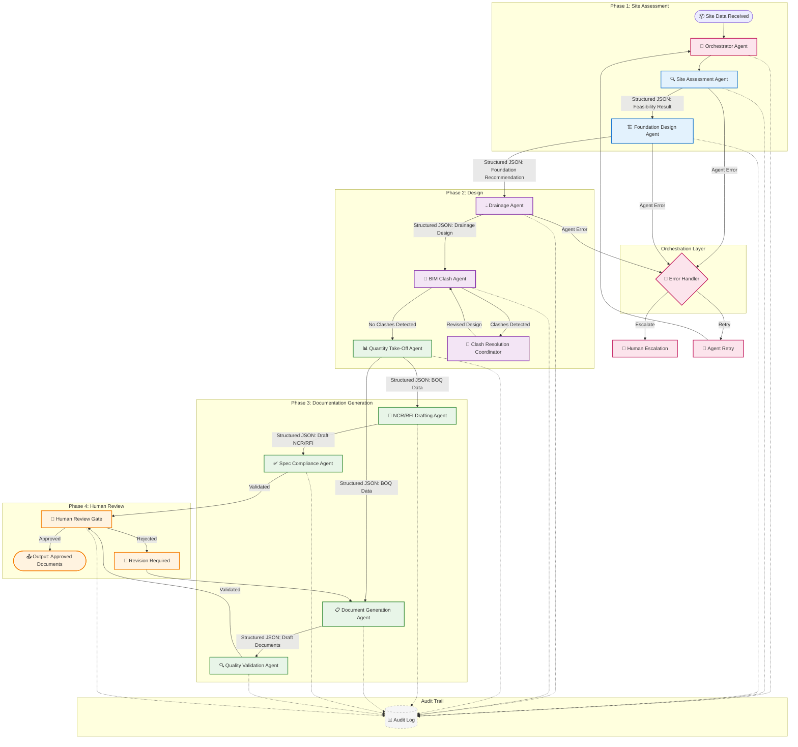
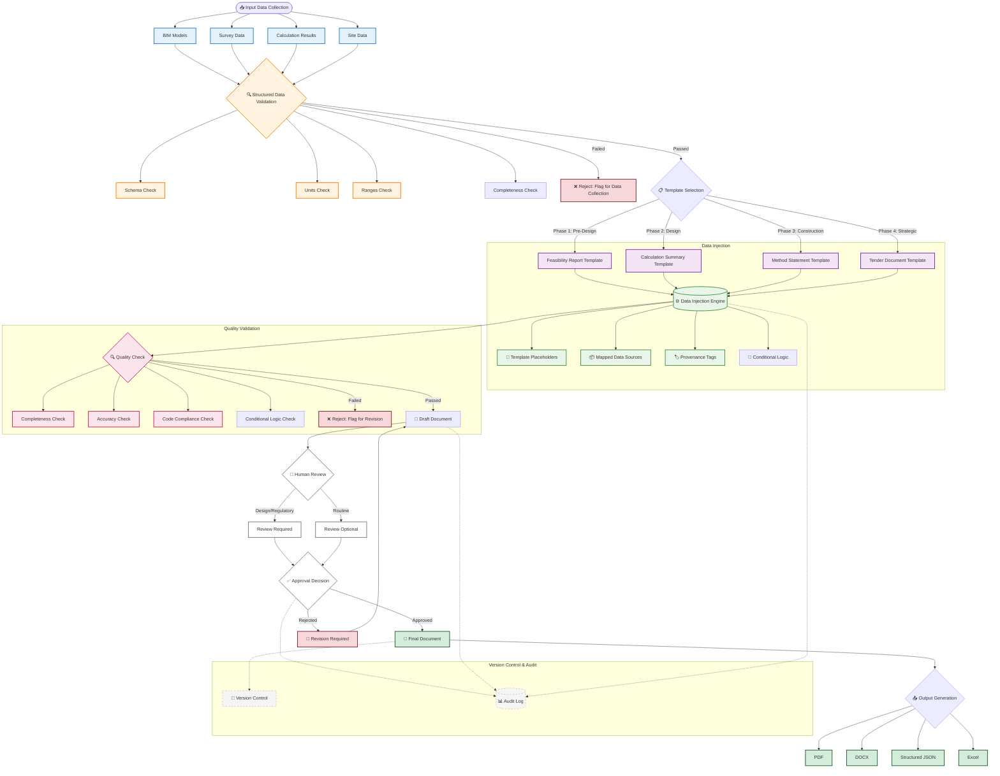
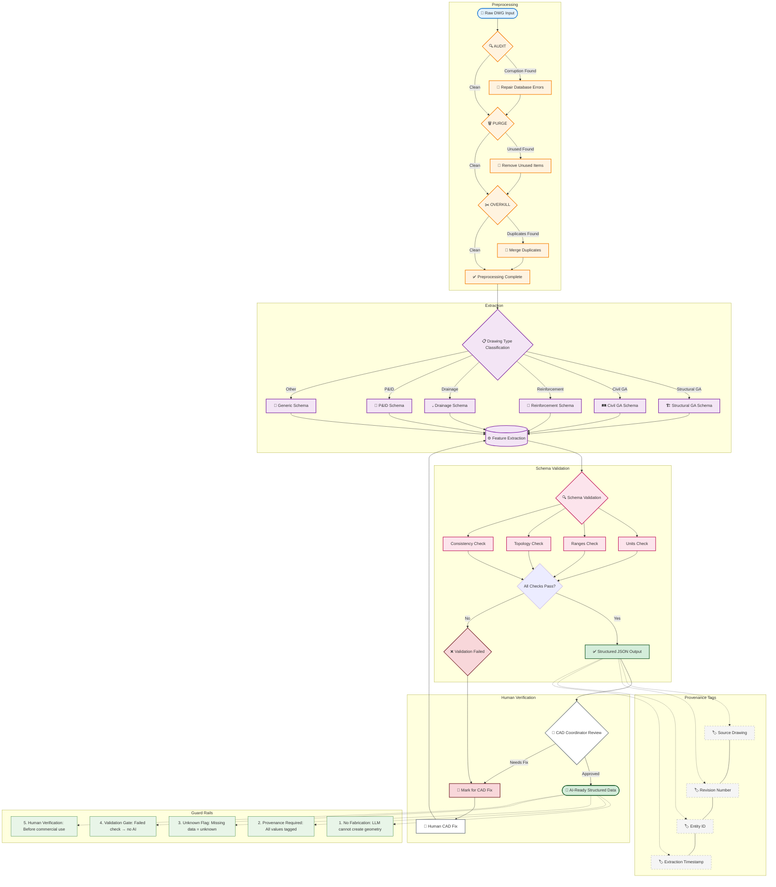
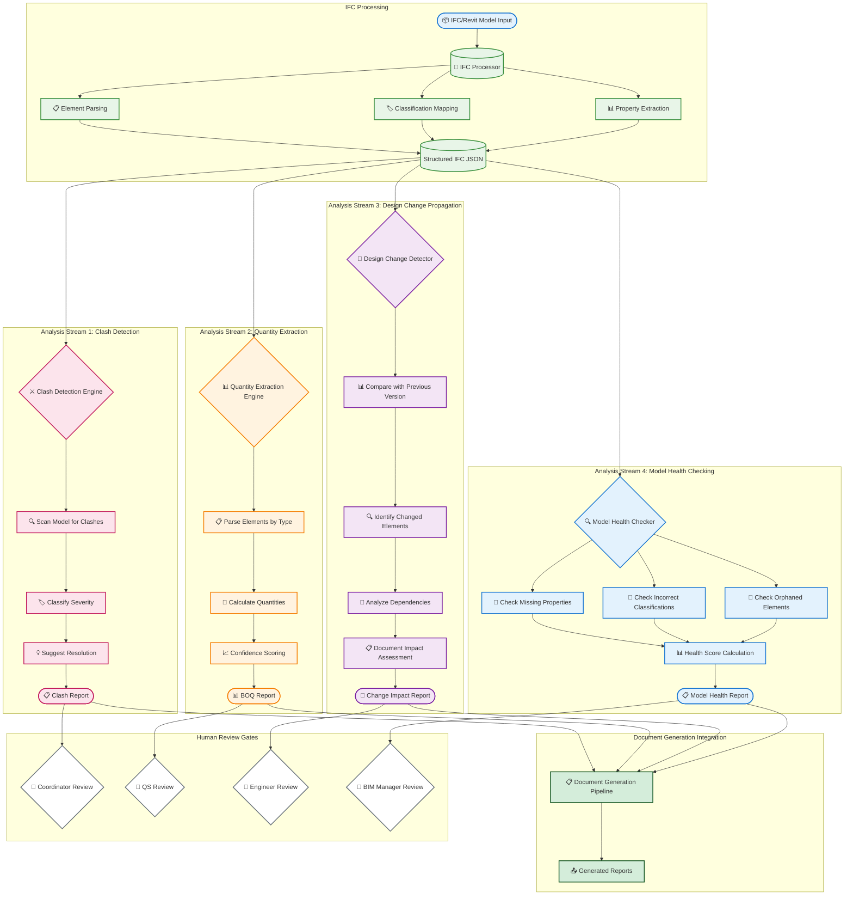
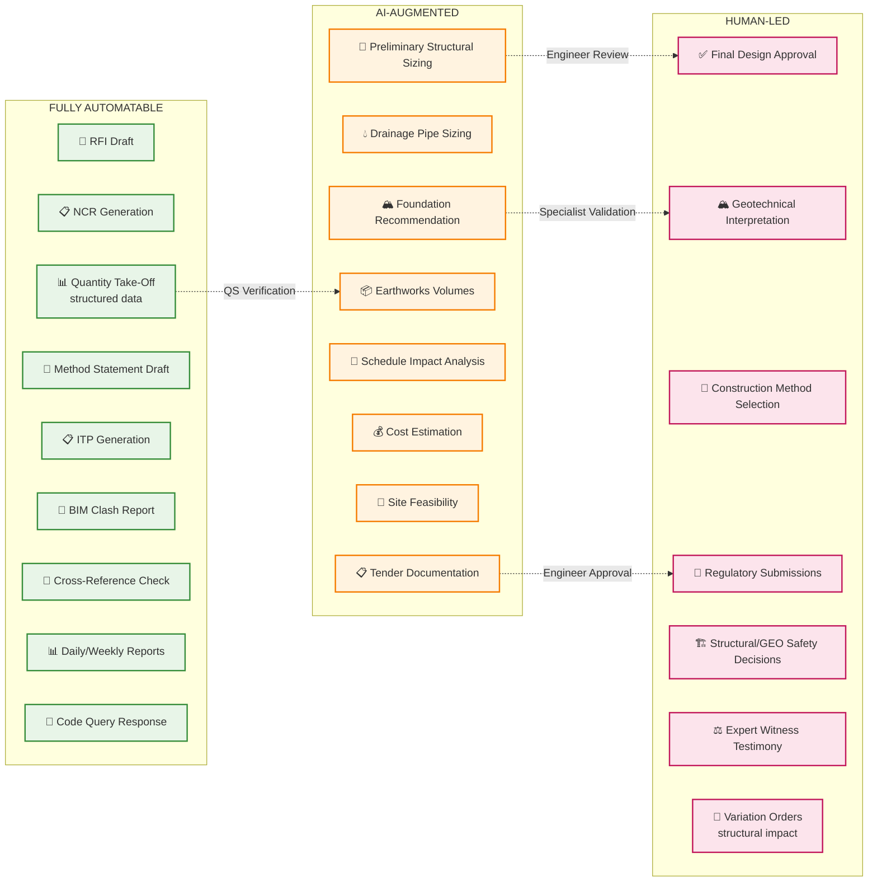

# AI-Native Civil Engineering Workflow Diagrams

## Overview

This file contains Mermaid diagrams for all AI-native civil engineering workflows referenced in the remediation plan and main workflow document.

---

## Diagram 1: Multi-Agent Orchestration

Agent coordination sequence from site data through NCR/RFI.

---

## Diagram 2: Document Generation Pipeline

Pipeline from input data collection through output.

---

## Diagram 3: DWG Processing Pipeline Architecture

Formal DWG pipeline: RAW → PREPROCESSING → EXTRACTION → VALIDATION → STRUCTURED DATA.

---

## Diagram 4: BIM Intelligence Workflow

IFC model processing through clash detection, quantity extraction, and model health checking.

---

## Diagram 5: Automation Spectrum

Visual representation of tasks by automation level.

---

## References

- **AI-Native Prompt**: `00850_AI-NATIVE-CIVIL-ENGINEERING-PROMPT.md`
- **Domain Knowledge**: `00850_DOMAIN-KNOWLEDGE.MD` Part 6B
- **Main Workflow**: `0000_CIVIL_ENGINEERING_DESIGN_WORKFLOW.MD`
- **Implementation Phases**: `0000_AI-NATIVE-IMPLEMENTATION_PHASES.MD`