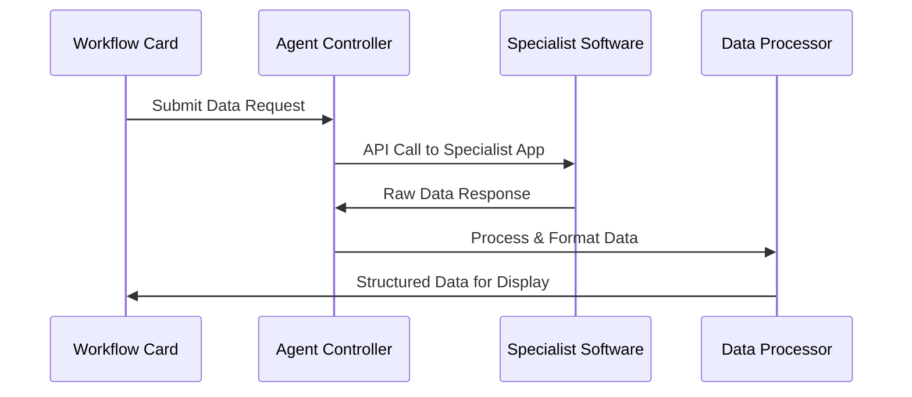

# Civil Engineering Design Workflow

```mermaid
flowchart TD
    %% Start
    START([🏗️ Start Civil Design])

    %% Phase 1: Project Initiation & Site Assessment
    subgraph "Phase 1: Site Assessment & Requirements"
        P1_TITLE[📋 Project Brief Review]
        P1_SITE[Site Survey & Data]
        P1_GEOTECH[Geotechnical Assessment]
        P1_ENVIRONMENTAL[Environmental Constraints]
        P1_REGULATORY[Regulatory Requirements]
        P1_STAKEHOLDER[Stakeholder Analysis]
        P1_SCOPE[Initial Scope Definition]
    end

    %% Phase 2: Conceptual Design
    subgraph "Phase 2: Conceptual Design"
        P2_TITLE[💡 Concept Development]
        P2_OPTIONS[Design Options Analysis]
        P2_MASSING[Mass Balance & Volumes]
        P2_ROUTING[Alignment & Routing]
        P2_PRELIM[Preliminary Layouts]
        P2_COST_EST[Order of Magnitude Costs]
        P2_RISK[Initial Risk Assessment]
    end

    %% Phase 3: Preliminary Design
    subgraph "Phase 3: Preliminary Design"
        P3_TITLE[📐 Detailed Analysis]
        P3_CALCULATIONS[Engineering Calculations]
        P3_MODELS[Hydraulic & Structural Models]
        P3_LAYOUTS[Preliminary Drawings]
        P3_SPECIFICATIONS[Performance Specifications]
        P3_ENVIRONMENTAL[Detailed Environmental Assessment]
        P3_COSTING[Detailed Cost Estimates]
    end

    %% Phase 4: Detailed Design & Documentation
    subgraph "Phase 4: Detailed Design"
        P4_TITLE[🔧 Final Design]
        P4_CALCS[Final Calculations & Analysis]
        P4_DRAWINGS[Construction Drawings]
        P4_SPECS[Technical Specifications]
        P4_SCHEDULES[Material & Quantity Schedules]
        P4_ITP[Inspection & Test Plans]
        P4_METHOD[Construction Methodology]
    end

    %% Phase 5: Procurement & Construction Support
    subgraph "Phase 5: Procurement & Construction"
        P5_TITLE[📋 Tender Documentation]
        P5_TENDER[IFT Drawings & Specs]
        P5_QUANTITIES[Bill of Quantities]
        P5_CONSTRUCTION[IFC Documentation]
        P5_SUPERVISION[Site Supervision Support]
        P5_VARIATIONS[Variation Management]
        P5_CLOSEOUT[Handover Documentation]
    end

    %% End States
    SUCCESS([✅ Design Complete])
    CANCEL([❌ Cancelled])

    %% Phase Transitions
    START --> P1_TITLE

    %% Phase 1 Flow
    P1_TITLE --> P1_SITE
    P1_SITE --> P1_GEOTECH
    P1_GEOTECH --> P1_ENVIRONMENTAL
    P1_ENVIRONMENTAL --> P1_REGULATORY
    P1_REGULATORY --> P1_STAKEHOLDER
    P1_STAKEHOLDER --> P1_SCOPE

    %% Navigation between phases
    P1_SCOPE -->|Next| P2_TITLE
    P2_TITLE --> P2_OPTIONS
    P2_OPTIONS --> P2_MASSING
    P2_MASSING --> P2_ROUTING
    P2_ROUTING --> P2_PRELIM
    P2_PRELIM --> P2_COST_EST
    P2_COST_EST --> P2_RISK

    P2_RISK -->|Next| P3_TITLE
    P3_TITLE --> P3_CALCULATIONS
    P3_CALCULATIONS --> P3_MODELS
    P3_MODELS --> P3_LAYOUTS
    P3_LAYOUTS --> P3_SPECIFICATIONS
    P3_SPECIFICATIONS --> P3_ENVIRONMENTAL
    P3_ENVIRONMENTAL --> P3_COSTING

    P3_COSTING -->|Next| P4_TITLE
    P4_TITLE --> P4_CALCS
    P4_CALCS --> P4_DRAWINGS
    P4_DRAWINGS --> P4_SPECS
    P4_SPECS --> P4_SCHEDULES
    P4_SCHEDULES --> P4_ITP
    P4_ITP --> P4_METHOD

    P4_METHOD -->|Next| P5_TITLE
    P5_TITLE --> P5_TENDER
    P5_TENDER --> P5_QUANTITIES
    P5_QUANTITIES --> P5_CONSTRUCTION
    P5_CONSTRUCTION --> P5_SUPERVISION
    P5_SUPERVISION --> P5_VARIATIONS
    P5_VARIATIONS --> P5_CLOSEOUT

    %% Final transitions
    P5_CLOSEOUT --> SUCCESS

    %% Cancel options from any phase
    P1_TITLE -.->|Cancel| CANCEL
    P2_TITLE -.->|Previous| P1_TITLE
    P2_TITLE -.->|Cancel| CANCEL
    P3_TITLE -.->|Previous| P2_TITLE
    P3_TITLE -.->|Cancel| CANCEL
    P4_TITLE -.->|Previous| P3_TITLE
    P4_TITLE -.->|Cancel| CANCEL
    P5_TITLE -.->|Previous| P4_TITLE
    P5_TITLE -.->|Cancel| CANCEL

    %% Phase indicators at top
    PHASE1_INDICATOR[Phase 1 of 5 - 📋 Site Assessment]
    PHASE2_INDICATOR[Phase 2 of 5 - 💡 Concept Design]
    PHASE3_INDICATOR[Phase 3 of 5 - 📐 Preliminary Design]
    PHASE4_INDICATOR[Phase 4 of 5 - 🔧 Detailed Design]
    PHASE5_INDICATOR[Phase 5 of 5 - 📋 Procurement & Construction]

    %% Connect phase indicators
    PHASE1_INDICATOR -.-> P1_TITLE
    PHASE2_INDICATOR -.-> P2_TITLE
    PHASE3_INDICATOR -.-> P3_TITLE
    PHASE4_INDICATOR -.-> P4_TITLE
    PHASE5_INDICATOR -.-> P5_TITLE

    %% Styling
    classDef phase1 fill:#e3f2fd,stroke:#1976d2,stroke-width:2px
    classDef phase2 fill:#f3e5f5,stroke:#7b1fa2,stroke-width:2px
    classDef phase3 fill:#e8f5e8,stroke:#388e3c,stroke-width:2px
    classDef phase4 fill:#fff3e0,stroke:#f57c00,stroke-width:2px
    classDef phase5 fill:#fce4ec,stroke:#c2185b,stroke-width:2px
    classDef success fill:#d4edda,stroke:#155724,stroke-width:3px
    classDef cancel fill:#f8d7da,stroke:#721c24,stroke-width:2px
    classDef indicator fill:#ffffff,stroke:#6c757d,stroke-width:1px

    class P1_TITLE,P1_SITE,P1_GEOTECH,P1_ENVIRONMENTAL,P1_REGULATORY,P1_STAKEHOLDER,P1_SCOPE phase1
    class P2_TITLE,P2_OPTIONS,P2_MASSING,P2_ROUTING,P2_PRELIM,P2_COST_EST,P2_RISK phase2
    class P3_TITLE,P3_CALCULATIONS,P3_MODELS,P3_LAYOUTS,P3_SPECIFICATIONS,P3_ENVIRONMENTAL,P3_COSTING phase3
    class P4_TITLE,P4_CALCS,P4_DRAWINGS,P4_SPECS,P4_SCHEDULES,P4_ITP,P4_METHOD phase4
    class P5_TITLE,P5_TENDER,P5_QUANTITIES,P5_CONSTRUCTION,P5_SUPERVISION,P5_VARIATIONS,P5_CLOSEOUT phase5
    class SUCCESS success
    class CANCEL cancel
    class PHASE1_INDICATOR,PHASE2_INDICATOR,PHASE3_INDICATOR,PHASE4_INDICATOR,PHASE5_INDICATOR indicator
```

---

## 🚨 **COPYABLE NODE LABELS - QUICK REFERENCE GUIDE**

> **⚠️ IMPORTANT: ONLY copy labels from the YELLOW code blocks below**
>
> **📋 These are the EXACT node labels used in the Mermaid diagram above**
> **🎯 COPY DIRECTLY from these code blocks into your Mermaid diagrams**
> **🚫 DO NOT copy from the narrative text below - only from these code blocks!**

---

## 📋 **QUICK REFERENCE: Copyable Node Labels by Phase**

### **Phase 1: Site Assessment & Requirements** - Copyable Node Labels
```yaml
📋 Project Brief Review
Site Survey & Data
Geotechnical Assessment
Environmental Constraints
Regulatory Requirements
Stakeholder Analysis
Initial Scope Definition
```

### **Phase 2: Conceptual Design** - Copyable Node Labels
```yaml
💡 Concept Development
Design Options Analysis
Mass Balance & Volumes
Alignment & Routing
Preliminary Layouts
Order of Magnitude Costs
Initial Risk Assessment
```

### **Phase 3: Preliminary Design** - Copyable Node Labels
```yaml
📐 Detailed Analysis
Engineering Calculations
Hydraulic & Structural Models
Preliminary Drawings
Performance Specifications
Detailed Environmental Assessment
Detailed Cost Estimates
```

### **Phase 4: Detailed Design** - Copyable Node Labels
```yaml
🔧 Final Design
Final Calculations & Analysis
Construction Drawings
Technical Specifications
Material & Quantity Schedules
Inspection & Test Plans
Construction Methodology
```

### **Phase 5: Procurement & Construction** - Copyable Node Labels
```yaml
📋 Tender Documentation
IFT Drawings & Specs
Bill of Quantities
IFC Documentation
Site Supervision Support
Variation Management
Handover Documentation
```

---

## 🚨 **MODAL WORKFLOW SYSTEM - COMPREHENSIVE INTERACTION DIAGRAM**

```mermaid
flowchart TD
    %% Modal Entry Point
    MODAL_ENTRY([🎯 Civil Engineering<br/>Workflow Modal<br/>13 Interactive Cards])

    %% Modal System Architecture
    subgraph "🎨 Modal System Architecture"
        MODAL_CONTROLLER[🎯 Modal Controller<br/>State Management & Persistence]
        WORKFLOW_ENGINE[⚙️ Workflow Engine<br/>Card Dependencies & Logic]
        AGENT_COORDINATOR[🤖 Agent Coordinator<br/>Multi-Agent Integration]
        APPROVAL_SYSTEM[✅ Approval Workflow<br/>Sign-off & Governance]
    end

    %% Phase 1: Site Assessment Cards - DETAILED
    subgraph "📋 Phase 1: Site Assessment (4 Cards)"
        P1_BRIEF[📋 Project Brief Card<br/>📥 INPUT DOCS:<br/>• Client Requirements<br/>• Scope Documents<br/>• OR Retrieve from 00900 Doc Control<br/>⚙️ AGENT: Content Analysis Agent<br/>📤 OUTPUT: Approved Brief<br/>✅ APPROVAL: PM Sign-off → 00900]
        P1_SURVEY[📍 Site Survey Card<br/>📥 INPUT DOCS:<br/>• Topographic Data<br/>• Utility Maps<br/>• OR Retrieve from Survey DB<br/>⚙️ AGENT: GIS Processing Agent<br/>📤 OUTPUT: Survey Report<br/>✅ APPROVAL: Technical Lead → 00900]
        P1_GEOTECH[🌍 Geotechnical Card<br/>📥 INPUT DOCS:<br/>• Soil Reports<br/>• Borehole Data<br/>• OR Retrieve from Geo DB<br/>⚙️ AGENT: Analysis Agent<br/>📤 OUTPUT: Foundation Recs<br/>✅ APPROVAL: Geotech Engineer → 00900]
        P1_ENV[⚖️ Environmental Card<br/>📥 INPUT DOCS:<br/>• EIA Reports<br/>• Permits<br/>• OR Retrieve from Env DB<br/>⚙️ AGENT: Compliance Agent<br/>📤 OUTPUT: Env Constraints<br/>✅ APPROVAL: Env Specialist → 00900]
    end

    %% Phase 2: Conceptual Design Cards - DETAILED
    subgraph "💡 Phase 2: Conceptual Design (2 Cards)"
        P2_OPTIONS[⚖️ Design Options Card<br/>📥 INPUT DOCS:<br/>• Site Constraints<br/>• Client Preferences<br/>• Budget Parameters<br/>⚙️ AGENT: Options Analysis Agent<br/>📤 OUTPUT: Options Matrix<br/>✅ APPROVAL: Design Team → PM]
        P2_LAYOUT[📐 Preliminary Layout Card<br/>📥 INPUT DOCS:<br/>• Selected Option<br/>• Alignment Data<br/>• Mass Balance Req<br/>⚙️ AGENTS:<br/>• CAD Agent (2D/3D Models)<br/>• GIS Agent (Alignments)<br/>• Analysis Agent (Calculations)<br/>📤 OUTPUT: Layout Drawings<br/>✅ APPROVAL: Senior Engineer → 00900]
    end

    %% Phase 3: Preliminary Design Cards - DETAILED
    subgraph "📐 Phase 3: Preliminary Design (2 Cards)"
        P3_CALC[🧮 Engineering Calculations<br/>📥 INPUT DOCS:<br/>• Layout Drawings<br/>• Load Requirements<br/>• Material Properties<br/>⚙️ AGENTS:<br/>• Structural Analysis Agent<br/>• Hydraulic Analysis Agent<br/>• Geotech Analysis Agent<br/>📤 OUTPUT: Calculation Package<br/>✅ APPROVAL: Technical Lead → 00900]
        P3_DRAWINGS[📏 Preliminary Drawings<br/>📥 INPUT DOCS:<br/>• Calculation Results<br/>• Standards & Codes<br/>• Coordination Req<br/>⚙️ AGENTS:<br/>• CAD Agent (Drawings)<br/>• BIM Agent (Coordination)<br/>• Clash Detection Agent<br/>📤 OUTPUT: Drawing Set<br/>✅ APPROVAL: Drawing Office → 00900]
    end

    %% Phase 4: Detailed Design Cards - DETAILED
    subgraph "🔧 Phase 4: Detailed Design (4 Cards)"
        P4_CONSTRUCTION[📐 Construction Drawings<br/>📥 INPUT DOCS:<br/>• Preliminary Drawings<br/>• Construction Details<br/>• Revision Control<br/>⚙️ AGENTS:<br/>• CAD Agent (Production)<br/>• Standards Agent (Compliance)<br/>• Quality Agent (Review)<br/>📤 OUTPUT: Full Drawing Set<br/>✅ APPROVAL: Chief Engineer → 00900]
        P4_SPECS[📋 Technical Specifications<br/>📥 INPUT DOCS:<br/>• Material Standards<br/>• Quality Requirements<br/>• Regulatory Specs<br/>⚙️ AGENTS:<br/>• Content Agent (Writing)<br/>• Compliance Agent (Checking)<br/>• Standards Agent (Validation)<br/>📤 OUTPUT: Spec Document<br/>✅ APPROVAL: Technical Lead → 00900]
        P4_QUANTITIES[📊 Quantity Schedules<br/>📥 INPUT DOCS:<br/>• Construction Drawings<br/>• Material Take-offs<br/>• Unit Rates<br/>⚙️ AGENTS:<br/>• Quantity Agent (Take-off)<br/>• Cost Agent (Pricing)<br/>• Validation Agent (Checking)<br/>📤 OUTPUT: BOQ Excel<br/>✅ APPROVAL: Quantity Surveyor → 00900]
        P4_INSPECTION[🔍 Inspection & Test Plans<br/>📥 INPUT DOCS:<br/>• Specifications<br/>• Quality Standards<br/>• Regulatory Requirements<br/>⚙️ AGENTS:<br/>• Quality Agent (Planning)<br/>• Compliance Agent (Standards)<br/>• Documentation Agent (Writing)<br/>📤 OUTPUT: ITP Document<br/>✅ APPROVAL: QA Manager → 00900]
    end

    %% Phase 5: Procurement & Construction Cards - DETAILED
    subgraph "📋 Phase 5: Procurement & Construction (2 Cards)"
        P5_TENDER[📄 Tender Documents<br/>📥 INPUT DOCS:<br/>• All Phase 4 Outputs<br/>• Procurement Requirements<br/>• Compliance Matrices<br/>⚙️ AGENTS:<br/>• Documentation Agent (Assembly)<br/>• Compliance Agent (Checking)<br/>• Quality Agent (Review)<br/>📤 OUTPUT: Tender Package<br/>✅ APPROVAL: Procurement Lead → 00900]
        P5_CONSTRUCTION[🏗️ Construction Support<br/>📥 INPUT DOCS:<br/>• Tender Package<br/>• Construction Queries<br/>• Variation Requests<br/>⚙️ AGENTS:<br/>• Support Agent (RFI Responses)<br/>• Variation Agent (Assessment)<br/>• Documentation Agent (Records)<br/>📤 OUTPUT: Construction Docs<br/>✅ APPROVAL: Project Director → 00900]
    end

    %% Document Control Integration
    subgraph "📚 Document Control System (00900)"
        DOC_CONTROL[(🔐 00900 Document Control<br/>Central Repository)]
        APPROVAL_WORKFLOW[✅ Approval Workflow<br/>Multi-level Sign-off]
        VERSION_CONTROL[📝 Version Control<br/>Revision Tracking]
        AUDIT_TRAIL[📊 Audit Trail<br/>Complete History]
    end

    %% Agent Coordination System
    subgraph "🤖 Multi-Agent Coordination"
        AGENT_ROUTER[🎯 Agent Router<br/>Task Distribution]
        CAD_AGENTS[🏗️ CAD Agents<br/>AutoCAD • MicroStation]
        ANALYSIS_AGENTS[🧮 Analysis Agents<br/>Structural • Hydraulic]
        GIS_AGENTS[🗺️ GIS Agents<br/>ArcGIS • QGIS]
        CONTENT_AGENTS[📝 Content Agents<br/>Writing • Review]
        COMPLIANCE_AGENTS[⚖️ Compliance Agents<br/>Regulatory • Standards]
    end

    %% Modal User Interface Controls
    subgraph "🎮 Modal UI Controls"
        CARD_FILTERS[🔍 Filter Controls<br/>Phase • Status • Search]
        PROGRESS_TRACKER[📊 Progress Dashboard<br/>13/13 Cards • Phase Completion]
        QUICK_ACTIONS[⚡ Quick Actions<br/>Save • Reset • Export • Help]
        STATUS_INDICATORS[📈 Status Indicators<br/>Real-time Updates]
    end

    %% User Interaction Flow
    MODAL_ENTRY --> CARD_FILTERS
    CARD_FILTERS --> PROGRESS_TRACKER
    PROGRESS_TRACKER --> QUICK_ACTIONS

    %% Phase 1 Flow with Dependencies
    CARD_FILTERS --> P1_BRIEF
    P1_BRIEF -->|Complete + Approve| P1_SURVEY
    P1_SURVEY -->|Complete + Approve| P1_GEOTECH
    P1_GEOTECH -->|Complete + Approve| P1_ENV
    P1_ENV -->|Next Phase| P2_OPTIONS

    %% Phase 2 Flow
    P2_OPTIONS -->|Complete + Approve| P2_LAYOUT
    P2_LAYOUT -->|Next Phase| P3_CALC

    %% Phase 3 Flow
    P3_CALC -->|Complete + Approve| P3_DRAWINGS
    P3_DRAWINGS -->|Next Phase| P4_CONSTRUCTION

    %% Phase 4 Flow (Parallel Processing)
    P4_CONSTRUCTION -->|Complete + Approve| P5_TENDER
    P3_CALC --> P4_SPECS
    P4_SPECS -->|Complete + Approve| P5_TENDER
    P4_CONSTRUCTION --> P4_QUANTITIES
    P4_QUANTITIES -->|Complete + Approve| P5_TENDER
    P4_SPECS --> P4_INSPECTION
    P4_INSPECTION -->|Complete + Approve| P5_TENDER

    %% Phase 5 Flow
    P5_TENDER -->|Complete + Approve| P5_CONSTRUCTION
    P5_CONSTRUCTION -->|Complete + Approve| PROJECT_COMPLETE([✅ Project Complete<br/>Handover Documentation])

    %% Document Control Integration
    P1_BRIEF -.->|Store & Retrieve| DOC_CONTROL
    P1_SURVEY -.->|Store & Retrieve| DOC_CONTROL
    P1_GEOTECH -.->|Store & Retrieve| DOC_CONTROL
    P1_ENV -.->|Store & Retrieve| DOC_CONTROL
    P2_OPTIONS -.->|Store & Retrieve| DOC_CONTROL
    P2_LAYOUT -.->|Store & Retrieve| DOC_CONTROL
    P3_CALC -.->|Store & Retrieve| DOC_CONTROL
    P3_DRAWINGS -.->|Store & Retrieve| DOC_CONTROL
    P4_CONSTRUCTION -.->|Store & Retrieve| DOC_CONTROL
    P4_SPECS -.->|Store & Retrieve| DOC_CONTROL
    P4_QUANTITIES -.->|Store & Retrieve| DOC_CONTROL
    P4_INSPECTION -.->|Store & Retrieve| DOC_CONTROL
    P5_TENDER -.->|Store & Retrieve| DOC_CONTROL
    P5_CONSTRUCTION -.->|Store & Retrieve| DOC_CONTROL

    %% Approval Workflow Integration
    P1_BRIEF -.->|Approval Required| APPROVAL_WORKFLOW
    P1_SURVEY -.->|Approval Required| APPROVAL_WORKFLOW
    P1_GEOTECH -.->|Approval Required| APPROVAL_WORKFLOW
    P1_ENV -.->|Approval Required| APPROVAL_WORKFLOW
    P2_OPTIONS -.->|Approval Required| APPROVAL_WORKFLOW
    P2_LAYOUT -.->|Approval Required| APPROVAL_WORKFLOW
    P3_CALC -.->|Approval Required| APPROVAL_WORKFLOW
    P3_DRAWINGS -.->|Approval Required| APPROVAL_WORKFLOW
    P4_CONSTRUCTION -.->|Approval Required| APPROVAL_WORKFLOW
    P4_SPECS -.->|Approval Required| APPROVAL_WORKFLOW
    P4_QUANTITIES -.->|Approval Required| APPROVAL_WORKFLOW
    P4_INSPECTION -.->|Approval Required| APPROVAL_WORKFLOW
    P5_TENDER -.->|Approval Required| APPROVAL_WORKFLOW
    P5_CONSTRUCTION -.->|Approval Required| APPROVAL_WORKFLOW

    %% Agent Coordination
    P2_LAYOUT -.->|CAD/GIS/Analysis| AGENT_ROUTER
    AGENT_ROUTER -.-> CAD_AGENTS
    AGENT_ROUTER -.-> GIS_AGENTS
    AGENT_ROUTER -.-> ANALYSIS_AGENTS

    P3_CALC -.->|Analysis| AGENT_ROUTER
    AGENT_ROUTER -.-> ANALYSIS_AGENTS

    P4_SPECS -.->|Content/Compliance| AGENT_ROUTER
    AGENT_ROUTER -.-> CONTENT_AGENTS
    AGENT_ROUTER -.-> COMPLIANCE_AGENTS

    %% Status Updates
    AGENT_ROUTER -.->|Progress Updates| STATUS_INDICATORS
    APPROVAL_WORKFLOW -.->|Approval Status| STATUS_INDICATORS
    DOC_CONTROL -.->|Document Status| STATUS_INDICATORS

    %% Navigation Controls
    P1_BRIEF -.->|Cancel/Previous| QUICK_ACTIONS
    P2_OPTIONS -.->|Previous| P1_ENV
    P3_CALC -.->|Previous| P2_LAYOUT
    P4_CONSTRUCTION -.->|Previous| P3_DRAWINGS
    P5_TENDER -.->|Previous| P4_QUANTITIES

    %% Styling
    classDef modal_entry fill:#e1f5fe,stroke:#0277bd,stroke-width:3px
    classDef modal_system fill:#fff3e0,stroke:#f57c00,stroke-width:2px
    classDef phase1 fill:#e3f2fd,stroke:#1976d2,stroke-width:2px
    classDef phase2 fill:#f3e5f5,stroke:#7b1fa2,stroke-width:2px
    classDef phase3 fill:#e8f5e8,stroke:#388e3c,stroke-width:2px
    classDef phase4 fill:#fff3e0,stroke:#f57c00,stroke-width:2px
    classDef phase5 fill:#fce4ec,stroke:#c2185b,stroke-width:2px
    classDef doc_control fill:#e8f5e8,stroke:#2e7d32,stroke-width:2px
    classDef agents fill:#f3e5f5,stroke:#7b1fa2,stroke-width:2px
    classDef ui_controls fill:#ffffff,stroke:#6c757d,stroke-width:1px
    classDef complete fill:#d4edda,stroke:#155724,stroke-width:3px

    class MODAL_ENTRY modal_entry
    class MODAL_CONTROLLER,WORKFLOW_ENGINE,AGENT_COORDINATOR,APPROVAL_SYSTEM modal_system
    class P1_BRIEF,P1_SURVEY,P1_GEOTECH,P1_ENV phase1
    class P2_OPTIONS,P2_LAYOUT phase2
    class P3_CALC,P3_DRAWINGS phase3
    class P4_CONSTRUCTION,P4_SPECS,P4_QUANTITIES,P4_INSPECTION phase4
    class P5_TENDER,P5_CONSTRUCTION phase5
    class DOC_CONTROL,APPROVAL_WORKFLOW,VERSION_CONTROL,AUDIT_TRAIL doc_control
    class AGENT_ROUTER,CAD_AGENTS,ANALYSIS_AGENTS,GIS_AGENTS,CONTENT_AGENTS,COMPLIANCE_AGENTS agents
    class CARD_FILTERS,PROGRESS_TRACKER,QUICK_ACTIONS,STATUS_INDICATORS ui_controls
    class PROJECT_COMPLETE complete
```

## 📋 **MODAL BUTTON FUNCTIONALITY SPECIFICATION**

### **Card Action Buttons (Every Card Has These)**

#### 1. **👁️ View Button** (Primary Action)
**Function**: Open detailed card interface with full functionality
**Triggers**:
- Modal expansion to show card-specific tools and data
- Load relevant documents from 00900 Doc Control
- Initialize assigned agents for the card
- Display progress tracking and status updates

#### 2. **👤 Assign Button** (Agent Assignment)
**Function**: Assign user or AI agent to work on this card
**Triggers**:
- Agent coordinator activation
- User assignment or AI agent selection
- Progress tracking initialization
- Notification system activation

#### 3. **✅ Complete Button** (Status Update)
**Function**: Mark card as completed and trigger approval workflow
**Triggers**:
- Status change to "completed"
- Automatic approval workflow initiation
- Dependency checking for next cards
- Progress recalculation

#### 4. **📥 Download Button** (Template Access)
**Function**: Download relevant templates and documents
**Integration**: Template Management System
**Templates Available**:
- Project documentation templates
- Calculation spreadsheets
- Drawing templates
- Specification documents

#### 5. **📤 Submit Button** (Approval Submission)
**Function**: Submit work for approval and sign-off
**Triggers**:
- Document upload to 00900 Doc Control
- Approval workflow activation
- Stakeholder notifications
- Audit trail creation

### **Modal-Level Controls**

#### **🔍 Filter System**
- **Phase Filter**: All, Site Assessment, Conceptual, Preliminary, Detailed, Procurement
- **Status Filter**: All, Available, In Progress, Review, Approved, Locked, Rejected
- **Search Filter**: Card name, agent, status keyword search

#### **📊 Progress Dashboard**
- **Overall Progress**: 13/13 cards completion percentage
- **Phase Progress**: Individual phase completion tracking
- **Agent Activity**: Real-time agent status updates
- **Approval Status**: Pending approvals and bottlenecks

#### **⚡ Quick Actions**
- **💾 Save**: Persist current modal state to VFS
- **🔄 Reset**: Reset workflow with confirmation dialog
- **📤 Export**: Export progress reports and documentation
- **❓ Help**: Context-sensitive help and guidance

### **Agent Assignment Logic**

#### **Automatic Agent Assignment**
- **CAD Agent**: Automatically assigned to drawing-related cards
- **Analysis Agent**: Assigned to calculation and modeling tasks
- **GIS Agent**: Assigned to survey and alignment work
- **Content Agent**: Assigned to documentation and specification writing
- **Compliance Agent**: Assigned to regulatory checking and approvals

#### **Manual Agent Override**
- Users can manually assign specific agents
- Override automatic assignments for specialized work
- Agent capacity and availability checking
- Workload balancing across agents

### **Approval Workflow Integration**

#### **Multi-Level Approvals**
- **Technical Lead**: Engineering calculations and drawings
- **Project Manager**: Project briefs and options analysis
- **Chief Engineer**: Final design deliverables
- **QA Manager**: Quality plans and inspection documents
- **Procurement Lead**: Tender documentation
- **Project Director**: Construction support and handover

#### **Approval Process**
1. **Submission**: Work submitted via Submit button
2. **Review**: Assigned approver notified and given access
3. **Approval/Rejection**: Digital sign-off with comments
4. **Revisions**: Automatic routing back for changes if rejected
5. **Final Storage**: Approved documents stored in 00900 Doc Control

### **Document Control Integration (00900)**

#### **Automatic Document Linking**
- **Retrieve**: Cards automatically search for and link existing documents
- **Store**: All outputs automatically stored with version control
- **Access Control**: Role-based permissions for document access
- **Audit Trail**: Complete history of all document interactions

#### **Version Management**
- **Revision Tracking**: Automatic version numbering
- **Change History**: Detailed change logs
- **Rollback Capability**: Restore previous versions if needed
- **Concurrent Editing**: Multi-user editing with conflict resolution

---

## Overview
The Civil Engineering Design Workflow guides civil engineers through a comprehensive 5-phase process for delivering complete civil engineering solutions from site assessment to handover. The workflow integrates DWG segregation principles, ensures compliance with regulatory requirements, and supports seamless collaboration with other disciplines.

### Phase 1: Site Assessment & Requirements - Copyable Node Labels
```
📋 Project Brief Review
Site Survey & Data
Geotechnical Assessment
Environmental Constraints
Regulatory Requirements
Stakeholder Analysis
Initial Scope Definition
```

### Phase 2: Conceptual Design - Copyable Node Labels
```
💡 Concept Development
Design Options Analysis
Mass Balance & Volumes
Alignment & Routing
Preliminary Layouts
Order of Magnitude Costs
Initial Risk Assessment
```

### Phase 3: Preliminary Design - Copyable Node Labels
```
📐 Detailed Analysis
Engineering Calculations
Hydraulic & Structural Models
Preliminary Drawings
Performance Specifications
Detailed Environmental Assessment
Detailed Cost Estimates
```

### Phase 4: Detailed Design - Copyable Node Labels
```
🔧 Final Design
Final Calculations & Analysis
Construction Drawings
Technical Specifications
Material & Quantity Schedules
Inspection & Test Plans
Construction Methodology
```

### Phase 5: Procurement & Construction - Copyable Node Labels
```
📋 Tender Documentation
IFT Drawings & Specs
Bill of Quantities
IFC Documentation
Site Supervision Support
Variation Management
Handover Documentation
```

---

## Phase Summary Blocks (Copyable Labels)

### Phase 1: Site Assessment & Requirements - Copyable Node Labels
```
📋 Project Brief Review
Site Survey & Data
Geotechnical Assessment
Environmental Constraints
Regulatory Requirements
Stakeholder Analysis
Initial Scope Definition
```

### Phase 2: Conceptual Design - Copyable Node Labels
```
💡 Concept Development
Design Options Analysis
Mass Balance & Volumes
Alignment & Routing
Preliminary Layouts
Order of Magnitude Costs
Initial Risk Assessment
```

### Phase 3: Preliminary Design - Copyable Node Labels
```
📐 Detailed Analysis
Engineering Calculations
Hydraulic & Structural Models
Preliminary Drawings
Performance Specifications
Detailed Environmental Assessment
Detailed Cost Estimates
```

### Phase 4: Detailed Design - Copyable Node Labels
```
🔧 Final Design
Final Calculations & Analysis
Construction Drawings
Technical Specifications
Material & Quantity Schedules
Inspection & Test Plans
Construction Methodology
```

### Phase 5: Procurement & Construction - Copyable Node Labels
```
📋 Tender Documentation
IFT Drawings & Specs
Bill of Quantities
IFC Documentation
Site Supervision Support
Variation Management
Handover Documentation
```

## Detailed Phase Breakdown

### Phase 1: Site Assessment & Requirements (Foundation Data Collection)
**Purpose**: Establish comprehensive site understanding and project requirements to inform all subsequent design decisions.

**Required User Inputs:**
- **Project Brief**: Client objectives, scope boundaries, success criteria
- **Site Data**: Topographic surveys, existing infrastructure, utility locations
- **Geotechnical Data**: Soil profiles, groundwater levels, foundation recommendations
- **Environmental Data**: Protected areas, contamination, ecological constraints
- **Regulatory Framework**: Permits required, codes applicable, authority requirements
- **Stakeholder Analysis**: Community impacts, access requirements, operational constraints
- **Scope Definition**: Clear boundaries between civil and other discipline responsibilities

**System Intelligence:**
- **DWG Processing Pipeline**: Automated cleaning and extraction of survey data
- **Geotechnical Integration**: Links to geotechnical investigation reports
- **Regulatory Compliance**: Automated checking against local codes and standards
- **Stakeholder Mapping**: Integration with community consultation databases
- **Scope Validation**: Cross-discipline interface checking

### Phase 2: Conceptual Design (Options Analysis & Selection)
**Purpose**: Develop and evaluate design alternatives to select optimal civil engineering solutions.

**Required User Inputs:**
- **Design Options**: Multiple approaches for roads, drainage, earthworks, utilities
- **Mass Balance**: Cut/fill calculations, material volumes, disposal requirements
- **Alignment Decisions**: Road alignments, pipeline routing, structure locations
- **Preliminary Layouts**: Initial drawings showing major elements
- **Cost Estimation**: Order-of-magnitude pricing for alternatives
- **Risk Assessment**: Technical risks, constructability issues, environmental impacts

**System Intelligence:**
- **Options Analysis**: Automated comparison of alternatives using weighted criteria
- **Mass Balance Automation**: CAD-integrated volume calculations
- **Routing Optimization**: GIS-based alignment optimization
- **Cost Modeling**: Integration with quantity surveying databases
- **Risk Scoring**: Automated risk assessment based on historical data

### Phase 3: Preliminary Design (Detailed Analysis & Validation)
**Purpose**: Develop detailed engineering analysis and preliminary documentation for stakeholder approval.

**Required User Inputs:**
- **Engineering Calculations**: Structural analysis, hydraulic modeling, stability checks
- **Model Development**: 2D/3D models for analysis and visualization
- **Drawing Production**: Preliminary construction drawings
- **Performance Specifications**: Technical requirements and acceptance criteria
- **Environmental Impact**: Detailed assessments and mitigation measures
- **Cost Refinement**: Detailed estimates based on quantities and rates

**System Intelligence:**
- **Calculation Automation**: Integration with analysis software (AutoCAD Civil 3D, STAAD, etc.)
- **Model Coordination**: BIM integration with architectural and structural models
- **Drawing Automation**: Template-based drawing production
- **Specification Libraries**: Standardized specification databases
- **Environmental Modeling**: Integration with environmental assessment tools

### Phase 4: Detailed Design (Construction-Ready Documentation)
**Purpose**: Produce complete construction documentation meeting all regulatory and contractual requirements.

**Required User Inputs:**
- **Final Calculations**: Complete analysis packages with all load cases
- **Construction Drawings**: Full set of working drawings with details
- **Technical Specifications**: Comprehensive material and workmanship requirements
- **Quantity Schedules**: Complete bills of quantities and material lists
- **Quality Plans**: Inspection and test plans for construction activities
- **Methodology Documents**: Construction sequencing and temporary works

**System Intelligence:**
- **Drawing Coordination**: Automated clash detection and resolution
- **Specification Compliance**: Automated checking against standards
- **Quantity Automation**: CAD-integrated quantity take-off
- **Quality Integration**: Linkage to inspection and testing databases
- **Methodology Validation**: Constructability checking against historical data

### Phase 5: Procurement & Construction Support (Implementation Phase)
**Purpose**: Support procurement process and provide construction-phase engineering services.

**Required User Inputs:**
- **Tender Documentation**: IFT drawings and specifications for procurement
- **Quantity Documentation**: Bills of quantities for pricing
- **Construction Drawings**: IFC documentation for construction
- **Supervision Support**: RFI responses, site instructions, variation approvals
- **Variation Management**: Technical assessment of change requests
- **Handover Documentation**: As-built records, O&M manuals, completion certificates

**System Intelligence:**
- **Tender Package Generation**: Automated compilation of procurement documents
- **Quantity Integration**: Linkage to procurement and cost management systems
- **Construction Support**: Real-time access to design information for site queries
- **Variation Analysis**: Automated impact assessment of proposed changes
- **Handover Automation**: Generation of completion documentation

## DWG Input Segregation Integration

### Text-Native vs Geometry-Native Processing
Following the DWG segregation principles established in the design workflow:

**Text-Native Inputs (LLM-Friendly):**
- Specifications, codes, and standards
- Environmental reports and assessments
- Stakeholder consultation records
- Regulatory requirements and permits
- Cost estimates and quantity schedules
- Quality plans and inspection criteria

**Geometry-Native Inputs (DWG Processing Required):**
- Survey data and topographic information
- Existing infrastructure mapping
- Geotechnical investigation locations
- Environmental constraint boundaries
- Regulatory setback requirements
- Construction sequencing layouts

### Automated DWG Processing Pipeline
1. **Input Reception**: DWG files uploaded with metadata tagging
2. **Cleaning & Standardization**: Automated repair, layer normalization, unit conversion
3. **Feature Extraction**: Automated identification of civil engineering elements
4. **Data Validation**: Cross-checking against known standards and ranges
5. **Structured Output**: JSON/CSV data feeds for design calculations
6. **Integration**: Seamless incorporation into design models and drawings

## VFS Integration for Deep-Agents

### Context Retention and Knowledge Continuity Architecture
The Civil Engineering Design Workflow integrates with the Vendor File System (VFS) to enable deep-agent capabilities for context retention, institutional knowledge preservation, and seamless knowledge continuity across all workflow phases.

#### VFS Context Data Sources
- **Design Context Repository**: Complete design rationale, assumptions, and decision histories
- **Institutional Knowledge Base**: Lessons learned, best practices, and historical project data
- **Cross-Phase Context Links**: Seamless knowledge transfer between workflow phases
- **Team Knowledge Continuity**: Preservation of expertise across team member changes
- **Project Memory Integration**: Long-term retention of design context and reasoning

#### Deep-Agent VFS Context Integration Points

**Phase 1: Site Assessment & Requirements**
- **Context Inheritance**: Automatic loading of similar project site assessment data
- **Knowledge Retrieval**: Instant access to institutional expertise on site conditions
- **Context Preservation**: Structured capture of site assessment findings for future phases
- **Knowledge Continuity**: Seamless transfer of site understanding to design team

**Phase 2: Conceptual Design**
- **Design Pattern Recognition**: VFS-powered identification of similar design solutions
- **Contextual Reasoning**: Deep-agent analysis of design alternatives based on historical outcomes
- **Knowledge Integration**: Incorporation of institutional best practices into concept development
- **Context Evolution**: Dynamic updating of design context as concepts mature

**Phase 3: Preliminary Design**
- **Context Validation**: Automated checking of preliminary designs against institutional standards
- **Knowledge Enhancement**: Real-time integration of emerging best practices and lessons learned
- **Context Refinement**: Progressive enrichment of design context with analysis results
- **Knowledge Transfer**: Structured handover of detailed design context to implementation team

**Phase 4: Detailed Design**
- **Context Consistency**: Automated verification of design consistency with established context
- **Knowledge Application**: Deep-agent application of institutional expertise to detailed solutions
- **Context Documentation**: Comprehensive capture of final design rationale and assumptions
- **Knowledge Preservation**: Long-term storage of detailed design context for future reference

**Phase 5: Procurement & Construction**
- **Context Accessibility**: Real-time access to complete design context during construction
- **Knowledge Application**: Deep-agent support for construction decisions based on design intent
- **Context Updates**: Dynamic updating of design context with construction feedback
- **Knowledge Evolution**: Continuous learning from construction experience for future projects

### VFS Context Query Integration

#### Automated Knowledge Discovery
```yaml
VFS_Context_Parameters:
  - project_type: "infrastructure, buildings, transportation"
  - design_phase: "conceptual, preliminary, detailed"
  - context_domain: "geotechnical, structural, environmental"
  - knowledge_type: "best_practices, lessons_learned, standards"
  - relevance_score: "0.8+ confidence"
```

#### Deep-Agent Context Analysis
- **Context Matching**: Automated identification of relevant historical project contexts
- **Knowledge Synthesis**: Intelligent combination of multiple knowledge sources
- **Context Evolution Tracking**: Monitoring of design context changes across phases
- **Knowledge Gap Identification**: Proactive identification of areas needing additional expertise

#### VFS Context Continuity Integration
- **Seamless Context Transfer**: Automatic context handoff between workflow phases
- **Knowledge Preservation**: Structured storage of design rationale and decision-making
- **Context Accessibility**: Instant retrieval of relevant knowledge for current design decisions
- **Knowledge Evolution**: Continuous updating of institutional knowledge base

## Integration Points

### Discipline Coordination
- **Geotechnical**: Foundation recommendations, soil parameters, groundwater data
- **Structural**: Load requirements, foundation reactions, construction sequencing
- **Environmental**: Impact assessments, mitigation measures, monitoring requirements
- **Procurement**: Quantity schedules, specification compliance, vendor coordination
- **Construction**: Methodology validation, supervision support, quality assurance

### Data Sources
- **Survey Databases**: Topographic and utility survey data
- **Geotechnical Reports**: Soil investigation and foundation design data
- **Regulatory Systems**: Permit tracking and compliance monitoring
- **Cost Databases**: Historical pricing and quantity data
- **Quality Systems**: Inspection criteria and acceptance standards
- **VFS Integration**: Supplier qualification, material certification, and performance data

### External Systems
- **CAD Platforms**: AutoCAD Civil 3D, MicroStation for design production
- **Analysis Software**: STAAD, SAP2000, Civil 3D for structural analysis
- **GIS Systems**: Spatial data integration and mapping
- **Cost Management**: Integration with quantity surveying and estimating tools
- **VFS Platform**: Deep-agent supplier intelligence and qualification system

## Specialist Agent Data Retrieval Architecture

### Agent-Based Data Request Framework
The Preliminary Layout Card implements a specialist agent architecture that requests data from external civil engineering applications rather than attempting direct integration. This approach enables the workflow to proceed with specialist software capabilities while maintaining system modularity and extensibility.

#### CAD Model Viewer Agent
**Purpose**: Retrieve 2D/3D model data from CAD applications for visualization and review

**Data Request Protocol**:
```yaml
CAD_Agent_Request:
  action: "retrieve_model_data"
  parameters:
    - model_id: "project_model_identifier"
    - view_type: "2d|3d|both"
    - format: "json|gltf|png"
    - layers: ["alignment", "grading", "utilities"]
  response_format:
    - model_data: "serialized_model_data"
    - metadata: "model_properties"
    - thumbnails: "preview_images"
```

**Integration Points**:
- AutoCAD Civil 3D API endpoints
- MicroStation CONNECT APIs
- Web-based CAD viewers (Forge, etc.)
- Model export services

#### GIS Alignment Editor Agent
**Purpose**: Request alignment data and editing capabilities from GIS platforms

**Data Request Protocol**:
```yaml
GIS_Agent_Request:
  action: "process_alignment_data"
  parameters:
    - alignment_type: "road|rail|pipeline"
    - input_coordinates: "start_end_points"
    - constraints: "environmental|topographic"
    - optimization_criteria: "min_distance|max_efficiency"
  response_format:
    - optimized_alignment: "coordinate_array"
    - analysis_results: "feasibility_metrics"
    - visualization_data: "map_overlay_data"
```

**Integration Points**:
- ArcGIS Server APIs
- QGIS processing services
- Google Earth Engine
- OpenStreetMap data services

#### Analysis Engine Agent
**Purpose**: Request mass balance calculations from civil engineering analysis software

**Data Request Protocol**:
```yaml
Analysis_Agent_Request:
  action: "calculate_mass_balance"
  parameters:
    - site_geometry: "surface_model_data"
    - design_elevation: "finished_grade_data"
    - material_properties: "soil_types|densities"
    - calculation_method: "average_end_area|prismoidal"
  response_format:
    - cut_volume: "cubic_meters"
    - fill_volume: "cubic_meters"
    - net_balance: "surplus|deficit_amount"
    - disposal_requirements: "material_movement_plan"
```

**Integration Points**:
- Civil 3D analysis APIs
- STAAD.Pro calculation services
- SAP2000 analysis engines
- Custom analysis microservices

### Agent Communication Architecture

#### Request-Response Pattern


#### Asynchronous Processing
- **Queue-Based Requests**: Agents queue requests for processing when specialist software is available
- **Callback Mechanisms**: Workflow receives notifications when data processing completes
- **Progress Tracking**: Real-time status updates for long-running calculations
- **Error Handling**: Graceful degradation when specialist software is unavailable

#### Data Security & Access Control
- **Token-Based Authentication**: Secure API access to specialist applications
- **Data Encryption**: End-to-end encryption for sensitive project data
- **Access Logging**: Audit trails for all data requests and responses
- **Compliance Checking**: Regulatory compliance validation for data handling

### Implementation Strategy

#### MVP Agent Implementation
1. **Stub Agents**: Initial implementation with mock data responses
2. **API Interface Definition**: Standardized request/response schemas
3. **Integration Testing**: Validation against known data sets
4. **User Acceptance**: Civil engineer validation of agent responses

#### Production Deployment
1. **Live API Connections**: Direct integration with specialist software APIs
2. **Performance Optimization**: Caching and request batching
3. **Monitoring & Alerting**: System health and error tracking
4. **Scalability Planning**: Load balancing for high-volume requests

#### Future Extensibility
- **Plugin Architecture**: Easy addition of new specialist software agents
- **Custom Agent Development**: Framework for discipline-specific agents
- **AI-Powered Agents**: Machine learning enhanced data processing
- **Cross-Platform Support**: Web, desktop, and mobile agent execution

#### Future Integration Approaches
- **Direct API Integration**: Create custom agents that interface directly with specialist software APIs (AutoCAD Civil 3D .NET API, MicroStation CONNECT APIs, ArcGIS REST APIs)
- **Existing Agent Frameworks**: Integrate with built-in agent capabilities in Autodesk Forge, Bentley iTwin, or other cloud platforms
- **Hybrid Agent Architecture**: Combine custom agents with existing software agent frameworks for enhanced capabilities
- **Cloud-Native Agents**: Leverage cloud-based agent services (AWS Lambda, Azure Functions) for scalable processing
- **Local Agent Networks**: Deploy agents on local networks for secure, high-performance processing of sensitive engineering data

This agent-based approach enables the civil engineering workflow to leverage specialist software capabilities while maintaining system flexibility and enabling phased implementation based on available integrations.

## Success Metrics

### Quality Metrics
- **Design Accuracy**: Reduction in construction variations (<5% of contract value)
- **Regulatory Compliance**: 100% permit approval on first submission
- **Coordination Efficiency**: <2% clashes in coordinated models
- **Documentation Completeness**: All deliverables meeting specification requirements

### Efficiency Metrics
- **Design Speed**: 30% reduction in design timeline through automation
- **Cost Certainty**: ±5% accuracy in preliminary cost estimates
- **Change Management**: <10% of design hours spent on variations
- **Knowledge Reuse**: 80% of designs based on validated templates

### Effectiveness Metrics
- **Stakeholder Satisfaction**: Client approval ratings >95%
- **Construction Performance**: Projects completed on time and budget
- **Safety Record**: Zero design-related safety incidents
- **Sustainability Achievement**: Meeting or exceeding environmental targets

This workflow provides a comprehensive framework for civil engineering design that integrates advanced DWG processing, ensures regulatory compliance, and supports efficient project delivery through all phases from concept to handover.