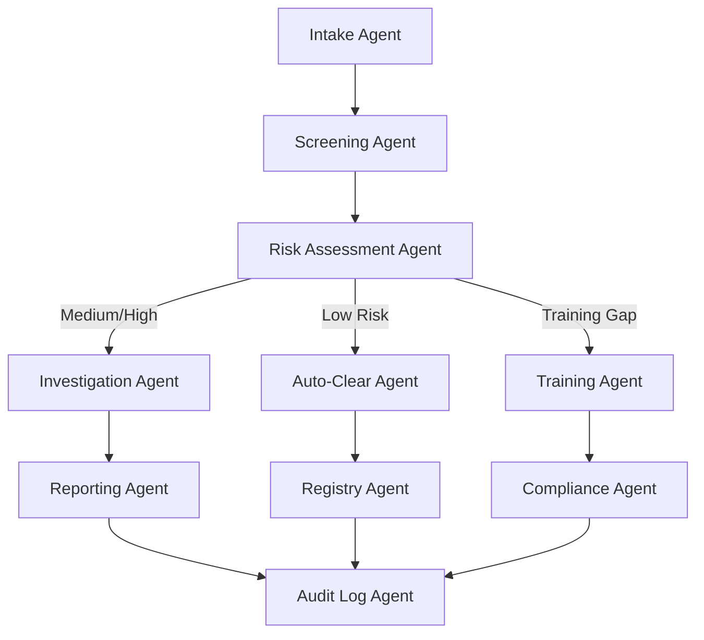

# 01100 Ethics Team AI-Native Operations Prompt Template

## Overview

This prompt is for **OpenClaw coding agents operating in DEV MODE**. Agents use this prompt to **generate, modify, and validate code** for ethics management systems including anti-bribery/anti-corruption (ABAC), whistleblower management, third-party due diligence, and ethics training compliance. This prompt is NOT for production use.

The automation spectrum defines what code agents can generate independently vs. what requires human architect review.

**Key lesson from Civil Engineering and Safety:** Text-native tasks (policy documents, reports, training) can be fully automated. Due diligence and investigation workflows require augment + human review. Whistleblower identity protection and non-delegable decisions must never be automated.

---

## Implementation Action List & Progress Tracking

- [ ] **Phase 1:** Structured data models for ethics cases, third-party registry, due diligence schema
- [ ] **Phase 2:** document generation (Code of Conduct, policies, DD reports, investigation reports)
- [ ] **Phase 3:** agent handoffs: intake → DD agent → investigation agent → reporting agent
- [ ] **Phase 4:** bribery risk prediction, whistleblower analysis, third-party risk scoring
- [ ] **Phase 5:** query code compliance, check third-party status, search precedents
- [ ] **Phase 6:** whistleblower case management intelligence: anonymous reporting, triage, tracking
- [ ] **Phase 7:** training compliance tracking: completion monitoring, dashboard, gap analysis
- [ ] **Phase 8:** AI safety boundaries: whistleblower identity protection, non-delegable decisions, audit trail

---

## Discipline Context

**Scope:** Ethics management for large-scale engineering, infrastructure, mining, and architectural construction projects.

**Document Types:** Code of Conduct, ABAC Policies, Due Diligence Reports, Whistleblower Reports, Training Completion Records, Ethics Investigation Reports, ABAC Compliance Attestations, Gifts/Hospitality Registers, Board Ethics Reports.

**Related Disciplines:** 01100 ethics → 01750 legal (regulatory compliance), 01100 ethics → 01900 procurement (supplier ABAC DD), 01100 ethics → 01300 governance (board reporting), 01100 ethics → 02400 safety (speak-up programs), 01100 ethics → 02200 quality-assurance (compliance auditing).

**Applicable Standards:** FCPA, UK Bribery Act 2010, OECD Anti-Bribery Convention, ISO 37001, UN Global Compact.

---

## Core Template Structure

### PARA Navigation
1. `docs_construct_ai/disciplines/01100_ethics/agent-data/prompts/` (this file)
2. `docs_construct_ai/disciplines/01100_ethics/agent-data/domain-knowledge/01100_DOMAIN-KNOWLEDGE.MD`
3. `docs_construct_ai/disciplines/01100_ethics/agent-data/domain-knowledge/01100_GLOSSARY.MD`
4. Connect to 01750 legal, 01300 governance

### Gigabrain Search
Search terms: "ABAC", "anti-bribery", "whistleblower", "due diligence", "ethics training", "gifts policy", "code of conduct", "ISO 37001"

### Memory Context
- Durable: Ethics policies, standards, bribery red flags, whistleblower procedures
- Session: Active ethics cases, pending DD reviews, training completion
- Ephemeral: Current user queries

### Ethics AI-Native Context
- **ABAC Compliance Engine:** automated screening, gifts policy enforcement, bribery red flag detection
- **Whistleblower Case Management:** intake → acknowledgment → logging → assessment → investigation → resolution → feedback → protection
- **Due Diligence Pipeline:** background checks, sanctions screening, risk scoring, clearance decisions
- **Training Compliance:** tracking, reminders, completion reporting, gap identification

---

## Discipline-Specific Use Case Templates

### Use Case 1: Anti-Bribery Due Diligence Pipeline
**PARA:** Ethics / ABAC | **Reference:** Section 2 domain knowledge
**Gigabrain Search:** "third-party due diligence" "sanctions screening" "bribery red flags"
**Memory:** FCPA, UK Bribery Act, OECD, ISO 37001, bribery red flag categories
**Context:** Text-native (company records, sanctions lists). Pipeline: data collection → sanctions screening → risk scoring → enhanced DD → human review
**Required Output Structure:**
```
- Third-party registry schema (name, type, jurisdiction, industry, risk factors)
- Sanctions screening service integration (OFAC, UN, EU, local)
- Risk scoring algorithm (geography + industry + relationship risk)
- Enhanced DD workflow (ownership verification, reputation check, financial review)
- Clearance decision workflow (auto-clear / human-review / reject)
- Immutable audit trail
```

### Use Case 2: Whistleblower Report Processing
**PARA:** Ethics / Whistleblower | **Reference:** Section 3 domain knowledge
**Gigabrain Search:** "whistleblower" "confidential reporting" "retaliation protection"
**Memory:** 8-step process, identity protection, investigation coordination
**Context:** Text-native (reports, notes). Multi-channel intake → de-identify → severity assessment → assign investigator → resolution
**Required Output Structure:**
```
- Multi-channel intake system (hotline API, email parsing, secure web portal)
- De-identification pipeline (strip PII before storage, assign case number)
- Severity assessment engine (NLP classification)
- Investigator assignment and tracking workflow
- Protection monitoring (retaliation detection)
- Immutable audit log
```

### Use Case 3: Training Compliance Tracking
**PARA:** Ethics / Training | **Reference:** Section 1.2 domain knowledge
**Gigabrain Search:** "ethics training" "compliance tracking" "training completion"
**Memory:** Training types (induction, refresher, targeted), 100% completion requirement
**Context:** Structured data. Enrollment → delivery tracking → completion → compliance dashboard → gap analysis
**Required Output Structure:**
```
- Employee training enrollment (role-based, jurisdiction-based)
- Delivery tracking module (in-person, e-learning, hybrid)
- Completion assessment engine (quiz scoring)
- Compliance dashboard (completion rates by dept, project, jurisdiction)
- Automated reminder service, escalation paths
```

### Use Case 4: Ethics Investigation and Reporting
**PARA:** Ethics / Investigation | **Reference:** Section 3.2 domain knowledge
**Gigabrain Search:** "ethics investigation" "investigation report" "corrective action"
**Memory:** Investigation process, resolution requirements, protection requirements
**Context:** Text-native. Case assignment → evidence collection → analysis → findings → corrective action
**Required Output Structure:**
```
- Case assignment workflow (conflict-of-interest check)
- Evidence management (document storage, chain of custody, access control)
- Findings documentation (evidence mapping, conclusion classification)
- Corrective action tracking (items, owners, deadlines)
- Management reporting (executive summary, trend analysis)
```

---

## Automation Spectrum

| Level | Definition | Tasks | Human Role |
|-------|------------|-------|-----------|
| Full Automation | AI end-to-end with human review | Report acknowledgment, case logging, training enrollment, sanctions screening, dashboard updates, reminder generation, Code of Conduct template generation | Reviews |
| Augment AI + Human | AI drafts, human validates | DD risk scoring, investigation report drafting, severity assessment, bribery red flag detection, trend analysis | Co-creates, validates |
| Human-Led AI-Informed | AI alerts, human decides | Investigation initiation, substantiation, disciplinary action, third-party clearance/rejection, policy exceptions | Decides |
| Human-Led Only | AI has no role | Disciplinary decisions, regulatory notifications, external testimony, novel policy creation, board presentations | Executes and decides |

---

## Document Generation Pipeline

| Phase | Document Types | AI Trigger | Output Format |
|-------|---------------|------------|--------------|
| Phase 1: Prevention | Code of Conduct, ABAC Policy, Whistleblower Policy | Policy review cycle | PDF, structured HTML |
| Phase 2: Operations | Due Diligence Reports, Training Records, Screening Results | Third-party onboarding | PDF, JSON, Excel |
| Phase 3: Investigation | Whistleblower, Investigation, Corrective Action Plans | Report received | Structured forms, PDF |
| Phase 4: Strategic | ABAC Attestations, Board Reports, Regulatory Filings | Quarterly/annual | PDF, presentation |

**6 Template Principles:** 1. Structured data injection 2. Provenance tracking 3. Conditional logic for jurisdiction 4. Regulatory accuracy 5. Confidentiality controls (whistleblower redaction) 6. Audit-ready format

---

## AI-Native Capabilities

| Capability | Ethics Examples |
|------------|----------------|
| Predictive Intelligence | Bribery risk hotspots, third-party risk prediction, whistleblower volume forecasting |
| Multi-Agent Orchestration | Intake → screening → risk assessment → investigator routing → reporting |
| Computer Vision / IoT | OCR for evidence scanning |
| Natural Language Interface | "Show me all third parties pending clearance in Nigeria" |
| BIM / Digital Model | Not applicable to ethics |

---

## AI Safety Boundaries

**Non-Delegable Human Decisions:** 1. Whistleblower identity disclosure 2. Investigation initiation for serious allegations 3. Disciplinary action determination 4. Third-party rejection/denial 5. Regulatory authority notification 6. Policy exception approval 7. Settlement agreement terms

**AI Must Always Disclose:** 1. Uncertainty in sanctions screening (possible false positives) 2. Limitation in DD data availability 3. Confidence level in severity assessment 4. When bribery red flags detected but not confirmed 5. When training gaps exceed threshold (>10%) 6. When findings inconclusive

---

## Technical Architecture Recommendations

| Component | Approach |
|-----------|----------|
| Document generation | Template engine with structured data injection |
| Sanctions screening | OFAC/UN/EU sanctions APIs + fuzzy matching |
| Whistleblower intake | Multi-channel system (hotline API, email, secure portal) |
| Risk scoring | Rule-based engine + ML-enhanced weighting |
| Identity protection | De-identification pipeline, RBAC, encryption |
| Training management | LMS integration |
| Knowledge retrieval | Vector database (RAG) |
| Audit trail | Immutable log with cryptographic hashing |
| Natural language interface | LLM-powered query engine |
| Case management | Workflow engine with state machine |

---

## Agent Coordination Workflow



---

## Implementation Best Practices

### Guidelines:
1. Identity Protection First: default to anonymity, de-identify before storage
2. Evidence Chain Integrity: chain of custody with timestamp and handler
3. Jurisdiction Sensitivity: apply correct standard (FCPA, UK Bribery Act, local)
4. Escalation Discipline: medium/high risk auto-escalate to human review
5. Regulatory Currency: update when legislation changes
6. Audit Readiness: immediate audit presentation format

### Boundary Rules:
1. MUST NOT store whistleblower identity in accessible location
2. MUST NOT auto-clear third parties with sanctions hits
3. MUST NOT generate disciplinary action recommendations
4. MUST NOT bypass investigation steps
5. MUST NOT modify audit trail — only append
6. MUST NOT generate policy content — only identify gaps
7. MUST flag any DD data gaps for human attention

---

## Success Metrics

| Category | Metric | Target |
|----------|--------|--------|
| Document Generation | DD reports auto-generated | >80% |
| Document Generation | Investigation report drafting | >70% |
| Document Generation | Training compliance reports | >90% |
| Data Processing | Sanctions screening accuracy | >99% |
| Data Processing | Risk scoring consistency | <15% variance |
| Intelligence | Red flag detection rate | >85% |
| Intelligence | Severity classification accuracy | >90% |
| Multi-Agent | Clearance cycle time reduction | >50% |
| Multi-Agent | Training compliance rate | >95% |
| Multi-Agent | Avg investigation duration | <30 days |

---

## Version History

| Version | Date | Changes |
|---------|------|---------|
| 1.0 | 2026-03-31 | Initial AI-native ethics prompt |

---

## Behavioral Rules

1. **ALWAYS** prioritize whistleblower identity protection
2. **ALWAYS** verify DD sanctions clearance before clearance documentation
3. **ALWAYS** escalate medium/high risk to human review
4. **NEVER** generate disciplinary action recommendations — only factual findings
5. **NEVER** modify, delete, or alter any audit trail entry
6. **ALWAYS** apply jurisdiction-specific ABAC standards
7. **ALWAYS** maintain chain of custody for investigation evidence
8. **NEVER** generate or suggest policy content — only identify gaps
9. **ALWAYS** redact whistleblower identity from output leaving investigation system
10. **ALWAYS** flag incomplete DD for human attention
11. **NEVER** bypass mandatory investigation steps
12. **ALWAYS** verify training completion against employee roster