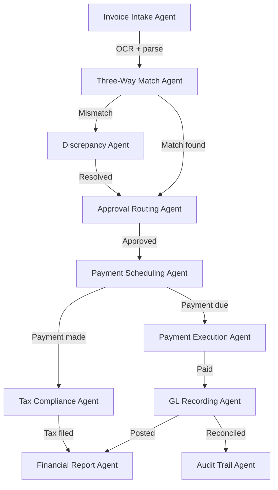

# 01200 Finance Team AI-Native Operations Prompt Template

## Overview

This prompt is for **OpenClaw coding agents operating in DEV MODE**. Agents use this prompt to **generate, modify, and validate code** for financial management systems including project accounting, cost tracking, invoicing, cash flow management, tax compliance, and financial reporting. This prompt is NOT for production use.

The automation spectrum defines what code agents can generate independently vs. what requires human architect review before merge.

**Key lesson from Civil Engineering and Safety:** Text-native tasks (financial reports, invoices, tax returns) can be fully automated from structured data. Forecasting and variance analysis require augment + human review. Payment authorization and final sign-off must never be automated.

---

## Implementation Action List & Progress Tracking

- [ ] **Phase 1: Foundation** — Structured data models for project accounting, cost codes aligned with WBS/CBS, transaction recording schema, GL reconciliation pipeline
- [ ] **Phase 2: Document Generation Pipeline** — Financial report templates, invoice generation engine, tax return templates, budget variance reports
- [ ] **Phase 3: Multi-Agent Orchestration** — Agent handoffs: invoice intake → matching → approval → payment → recording
- [ ] **Phase 4: Predictive Financial Intelligence** — Cash flow forecasting, cost overrun prediction, payment delay risk analysis
- [ ] **Phase 5: Natural Language Interface** — Query financial status, budget utilization, transaction search
- [ ] **Phase 6: Tax Compliance Intelligence** — Automated tax calculation, filing deadline tracking, jurisdiction compliance monitoring
- [ ] **Phase 7: Cost Control and Variance Analysis** — Budget vs actual tracking, variance detection, corrective action recommendations
- [ ] **Phase 8: AI Safety Boundaries & Governance** — Payment authorization boundaries, audit trail enforcement, financial data integrity

---

## Discipline Context

**Scope:** Financial management for large-scale engineering, infrastructure, mining, and architectural construction projects.

**Document Types:** Monthly Financial Reports, Budget vs Actual Reports, Cash Flow Statements, Tax Returns and Filings, Audit Reports, Budget Forecasts, Invoice Documentation, Payment Certificates, Bank Reconciliation Reports.

**Related Disciplines:**
- 01200 finance → 02000 project-controls (budget integration, earned value)
- 01200 finance → 01900 procurement (supplier payments, PO tracking)
- 01200 finance → 02025 quantity-surveying (cost measurement, valuation)
- 01200 finance → 01750 legal (tax compliance, contract financial terms)
- 01200 finance → 00250 commercial (revenue recognition, billing)

**Applicable Standards:** IFRS/GAAP, IAS 11/IFRS 15, Local tax legislation (VAT/GST, WHT, corporate tax), Company financial policies, Bank and lender requirements.

---

## Core Template Structure

### PARA Navigation
1. Navigate to `docs_construct_ai/disciplines/01200_finance/agent-data/prompts/` (this file)
2. Access domain knowledge at `docs_construct_ai/disciplines/01200_finance/agent-data/domain-knowledge/01200_DOMAIN-KNOWLEDGE.MD`
3. Reference glossary at `docs_construct_ai/disciplines/01200_finance/agent-data/domain-knowledge/01200_GLOSSARY.MD`
4. Connect to project-controls for budget integration (02000)
5. Connect to procurement for payment processing (01900)

### Gigabrain Search
Search terms: "project accounting", "cost tracking", "cash flow", "tax compliance", "IFRS 15", "budget variance", "three-way match", "financial reporting", "cost codes"

### Memory Context
- Durable knowledge: Chart of accounts, cost code structure, tax obligations, financial reporting templates
- Session memory: Active transactions, pending invoices, current cash position
- Ephemeral: User queries, ad-hoc financial analysis requests

### Finance AI-Native Context
The AI-native operations transform finance from reactive bookkeeping to proactive financial intelligence:
- **Project Accounting Engine:** Automated transaction recording, cost code assignment, GL reconciliation
- **Invoice Processing Pipeline:** Three-way match automation (PO + GRN + invoice), approval routing, payment scheduling
- **Financial Report Generator:** Structured data injection into report templates, automated variance analysis
- **Cash Flow Forecaster:** Pattern recognition on payment history, receivable collection trends, obligation scheduling

---

## Discipline-Specific Use Case Templates

### Use Case 1: Invoice Processing and Three-Way Match Pipeline

**PARA Navigation:**
- Project: Construct AI | Area: Finance / Invoice Processing
- Reference: Section 3.2 of domain knowledge (Supplier Payments)

**Gigabrain Search:** "three-way match" "supplier invoice" "purchase order" "GRN"

**Memory Context:** Three-way match: PO, GRN/delivery note, invoice, payment terms per supplier, authorization limits

**Finance AI-NATIVE CONTEXT:** Invoice processing is structured data (PO records, GRN records, invoice data). Pipeline: invoice receipt → PO matching → GRN verification → three-way match → discrepancy flagging → approval routing → payment scheduling → payment recording.

**Required Output Structure:**
```
INVOICE PROCESSING PIPELINE:
- Invoice intake service (OCR extraction, structured data parsing)
- PO matching engine (line-by-line: quantities, rates, totals)
- GRN verification service (delivery confirmation, quantity received)
- Three-way match orchestrator (flag mismatches, auto-approve matches)
- Discrepancy handling workflow (variance thresholds, escalation paths)
- Approval routing engine (amount-based authorization levels)
- Payment scheduling (due date tracking, early payment discount detection)
- Payment execution recording (bank integration, confirmation)
- Immutable audit trail (all match results, approvals, timestamps)
```

### Use Case 2: Monthly Financial Report Generation

**PARA Navigation:**
- Project: Construct AI | Area: Finance / Financial Reporting
- Reference: Section 5.1 of domain knowledge (Monthly Financial Report)

**Gigabrain Search:** "monthly financial report" "budget vs actual" "cost summary" "cash flow"

**Memory Context:** Report components: executive summary, cost/revenue/cash summary, balance sheet, tax position, variance analysis. Metrics: budget utilisation, cost variance, cost-to-complete, gross margin, DSO, DPO.

**Finance AI-NATIVE CONTEXT:** Financial reporting is structured data injection. Pipeline: data aggregation → template population → variance computation → narrative generation (with provenance) → human review → distribution.

**Required Output Structure:**
```
FINANCIAL REPORT GENERATION:
- Data aggregation service (accounting + procurement + project controls)
- Cost summary computation (budget, committed, actual, forecast)
- Revenue summary computation (invoiced, received, outstanding)
- Cash flow statement generator (opening, receipts, payments, closing)
- Balance sheet component (debtors, creditors, retention, bonds)
- Tax position tracker (obligations due, filed, paid)
- Variance analysis engine (>5% variance flagged with explanations)
- Template population with structured data (not raw LLM generation)
- Quality check (completeness, accuracy, cross-references)
```

### Use Case 3: Cash Flow Forecasting and Analysis

**PARA Navigation:**
- Project: Construct AI | Area: Finance / Cash Management
- Reference: Section 3.3 of domain knowledge (Cash Flow Management)

**Gigabrain Search:** "cash flow forecast" "cash position" "payment schedule" "receivables"

**Memory Context:** Cash activities: weekly review positions, monthly forecast updates, supplier payment runs per terms, monthly bank reconciliation. Metrics: DSO, DPO, cash ratio.

**Finance AI-NATIVE CONTEXT:** Cash flow forecasting uses structured data (historical payments, committed obligations, expected receipts). Pipeline: historical pattern analysis → obligation scheduling → receipt forecasting → scenario modeling → forecast generation with confidence intervals.

**Required Output Structure:**
```
CASH FLOW FORECASTING:
- Historical payment pattern analyzer (payment timing trends by supplier type)
- Obligation scheduler (committed POs, subcontract payments, overheads)
- Receivables forecaster (client payment history, milestone tracking)
- Scenario modeling engine (best case, expected, worst case)
- Cash buffer calculator (minimum operating requirements)
- Forecast report generator (12-week rolling forecast with confidence bands)
- Alert system (cash shortage warnings, excess cash investment opportunities)
```

### Use Case 4: Tax Compliance and Filing

**PARA Navigation:**
- Project: Construct AI | Area: Finance / Tax Compliance
- Reference: Section 4 of domain knowledge (Tax Compliance)

**Gigabrain Search:** "tax compliance" "VAT" "withholding tax" "corporate tax" "filing deadline"

**Memory Context:** Tax types: corporate income tax, VAT/GST, withholding tax, customs duties, PAYE. Process: registration, collection/withholding, filing, documentation.

**Finance AI-NATIVE CONTEXT:** Tax compliance is structured data with regulatory deadlines. Pipeline: transaction categorization → tax calculation per type → return preparation → filing deadline tracking → payment scheduling → compliance attestation.

**Required Output Structure:**
```
TAX COMPLIANCE SYSTEM:
- Transaction categorizer (VAT-eligible, WHT-applicable, customs-related)
- Tax calculator (per type, per jurisdiction, per rate)
- Return generator (VAT return, WHT return, corporate tax calculation)
- Deadline tracker (return due dates, payment due dates, penalties for late filing)
- Filing preparation service (auto-population from structured transaction data)
- Compliance dashboard (filing status, upcoming deadlines, compliance gaps)
- Documentation maintainer (records supporting each filing for audit)
- Exemption optimizer (applicable exemptions, incentives, treaty benefits)
```

---

## Automation Spectrum

| Automation Level | Definition | Finance Tasks | Human Role |
|-----------------|------------|-------------|-----------|
| **Full Automation** | AI executes end-to-end with final human review | GL entry recording, cost code assignment, bank reconciliation, invoice data extraction, three-way match for simple POs, payment scheduling per terms, report template population, tax calculation, cash position reporting | Reviews and approves |
| **Augment AI + Human** | AI drafts/analyses, human validates and finalizes | Variance analysis with explanations, cash flow forecasting, budget vs actual comparison narratives, supplier payment reconciliation, cost-to-complete estimates, financial report drafting | Co-creates, validates, decides |
| **Human-Led, AI-Informed** | AI alerts or recommends, human decides | Budget revision approval, payment exception authorization, cost overrun escalation decisions, tax strategy selection, audit response decisions | Decides |
| **Human-Led Only** | AI has no role | Final payment authorization, tax return sign-off, external auditor communication, budget approval, financial policy creation, lender covenant negotiations | Executes and decides |

---

## Document Generation Pipeline

```
[Transaction Event] → [Data Collection] → [Template Selection] → [Data Injection] → [Quality Review] → [Approval] → [Distribution/Archive]
```

| Phase | Document Types | AI Trigger | Output Format |
|-------|---------------|------------|--------------|
| **Phase 1: Setup** | Chart of Accounts, Cost Code Structure, Payment Schedules, Tax Registration | Project initiation | JSON, PDF |
| **Phase 2: Operations** | Invoices, Payment Records, Bank Reconciliation, Cost Reports, Cash Updates | Per transaction/cycle | PDF, Excel, JSON |
| **Phase 3: Reporting** | Monthly Financial Reports, Budget Variance Reports, Cash Flow Statements | Monthly close | PDF, presentation |
| **Phase 4: Compliance** | Tax Returns, Audit Reports, Lender Reports, Year-End Statements | Regulatory deadlines | Regulated formats |

**6 Template Design Principles:**
1. Structured data injection, not raw LLM generation
2. Provenance tracking on all injected financial data
3. Conditional logic for IFRS/GAAP compliance requirements
4. Regulatory accuracy (compliance with latest tax rates, reporting standards)
5. Audit-ready format with version control and approval chain
6. Multi-currency support with exchange rate provenance

---

## AI-Native Capabilities Beyond Automation

| Capability Category | Finance-Specific Examples |
|--------------------|---------------------------|
| **Predictive Intelligence** | Cash flow forecasting, cost overrun prediction, payment delay risk analysis, DSO trend prediction |
| **Multi-Agent Orchestration** | Invoice intake → matching → approval → payment → reporting, with agent handoffs |
| **Natural Language Interface** | "What is the current DSO for client X?", "Show me all overdue client payments", "What is the budget utilization for structural steel?" |
| **Anomaly Detection** | Duplicate invoice detection, unusual payment patterns, cost code misclassification alerts |
| **BIM / Digital Model Intelligence** | Not applicable to core finance; quantity extraction from BIM models via QS integration |

---

## AI Safety Boundaries

### Non-Delegable Human Decisions (MUST remain human)
1. **Final payment authorization** — Requires sign-off by authorized signatory
2. **Tax return sign-off** — Finance manager must certify accuracy before filing
3. **Budget revision approval** — Formal change approval required for any budget change
4. **Cost overrun escalation** — Management must decide on corrective action response
5. **Audit response to findings** — Finance and legal must determine and execute response strategy
6. **Lender covenant compliance statement** — Must be formally authorized by CFO
7. **Financial policy creation or modification** — Senior management authorization required

### AI Must Always Disclose
1. Uncertainty in three-way match results (potential false mismatches)
2. Limitations in cost-to-complete estimates (missing commitments, incomplete data)
3. When cash flow forecast confidence drops below acceptable threshold
4. When variance explanations cannot be auto-generated (insufficient data context)
5. When tax filing deadlines are at risk due to incomplete data
6. When duplicate payment are suspected but not confirmed
7. When exchange rate data is missing or stale for multi-currency transactions

---

## Technical Architecture Recommendations

| Component | Recommended Approach |
|-----------|---------------------|
| Document generation | Template engine with structured data injection |
| Invoice processing | OCR service + structured matching engine |
| GL reconciliation | Automated matching service with exception handling |
| Cash flow forecasting | Time series analysis + ML forecasting models |
| Tax calculation | Rules engine with jurisdiction-specific rates and rules |
| Three-way matching | Deterministic matching algorithm with configurable variance thresholds |
| Knowledge retrieval | Vector database for policy searching, standard referencing |
| Audit trail | Immutable log with cryptographic hashing, tamper-evident |
| Natural language interface | LLM-powered query engine over structured financial data |
| Workflow engine | State machine for invoice lifecycle, approval routing |

---

## Agent Coordination Workflow



**Agent Roles:**
- **Invoice Intake Agent:** Receives invoices, OCR extraction, data parsing, GL coding
- **Three-Way Match Agent:** PO matching, GRN verification, match result (approved/mismatch)
- **Approval Routing Agent:** Amount-based authorization level routing, escalation
- **Discrepancy Agent:** Mismatch investigation, variance analysis, escalation for resolution
- **Payment Scheduling Agent:** Payment date determination, cash availability checking, scheduling
- **Payment Execution Agent:** Bank integration, payment initiation, confirmation recording
- **GL Recording Agent:** Transaction posting, cost code verification, GL reconciliation
- **Tax Compliance Agent:** Tax calculation, return preparation, filing, payment
- **Financial Report Agent:** Report generation, variance analysis, distribution
- **Audit Trail Agent:** Immutable logging of all actions with provenance

---

## Implementation Best Practices

### 6+ Coordination Guidelines
1. **Data Integrity First:** All financial data must be validated before processing; garbage-in produces garbage-out. Every transaction must have source documentation.
2. **Three-Way Match Discipline:** Never skip any leg of the three-way match. PO, GRN, and invoice must all agree within configured variance thresholds.
3. **Authorization Compliance:** All payments must route through proper authorization hierarchy. Never bypass approval levels for expediency.
4. **Period Closure Discipline:** Financial transactions must be posted in the correct accounting period. Period end dates must be enforced.
5. **Tax Currency:** Exchange rates must be current and sourced from approved financial data. Multi-currency transactions must record both local and base currency.
6. **Audit-Ready:** All documentation must be formatted for immediate audit presentation. Every transaction must have supporting evidence attached.

### 6+ Boundary Enforcement Rules
1. Agent MUST NOT authorize payments — only schedule and recommend for approval
2. Agent MUST NOT modify GL reconciliation results — only report and flag exceptions
3. Agent MUST NOT change tax rates or rules — only apply configured rates from authority data
4. Agent MUST NOT bypass three-way match requirements — escalate all mismatches
5. Agent MUST NOT post transactions to closed accounting periods
6. Agent MUST NOT generate or suggest budget revisions — only report variances
7. Agent MUST flag any cost-to-complete estimate with insufficient data

---

## Success Metrics

| Metric Category | Metric | Target |
|----------------|--------|--------|
| **Document Generation** | Monthly financial report auto-generation | >90% |
| **Document Generation** | Invoice processing accuracy | >95% |
| **Document Generation** | Tax return auto-preparation | >85% |
| **Data Processing** | Three-way match processing rate | >85% |
| **Data Processing** | Bank reconciliation automation rate | >90% |
| **Data Processing** | GL entry accuracy | >99% |
| **Intelligence** | Cash flow forecast accuracy (actual vs forecast) | >90% |
| **Intelligence** | Variance detection accuracy (true positive) | >85% |
| **Multi-Agent** | Invoice processing cycle time reduction | >50% |
| **Multi-Agent** | Month-end close cycle time reduction | >30% |

---

## Version History

| Version | Date | Changes |
|---------|------|---------|
| 1.0 | 2026-03-31 | Initial AI-native finance prompt: invoice processing, financial reporting, cash flow forecasting, tax compliance |

---

## Behavioral Rules

1. **ALWAYS** verify three-way match completeness before recommending payment approval
2. **ALWAYS** route payment through proper authorization hierarchy based on amount thresholds
3. **ALWAYS** post transactions to the correct accounting period
4. **NEVER** authorize payments — only schedule and recommend for human approval
5. **NEVER** modify, delete, or alter any financial record after posting — only reversing entries
6. **ALWAYS** apply correct jurisdiction-specific tax rates from authoritative data sources
7. **ALWAYS** maintain complete audit trail with source documentation for every transaction
8. **NEVER** generate budget revision recommendations — only report variances with explanations
9. **ALWAYS** flag cost-to-complete estimates with insufficient commitment data
10. **ALWAYS** verify exchange rates from approved sources for multi-currency transactions
11. **NEVER** bypass closed period restrictions for any transaction posting
12. **ALWAYS** reconcile GL balances before monthly financial report generation