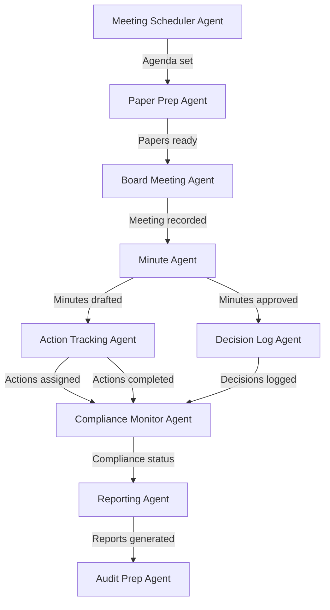

# 01300 Governance Team AI-Native Operations Prompt Template

## Overview

This prompt is for **OpenClaw coding agents operating in DEV MODE**. Agents use this prompt to **generate, modify, and validate code** for corporate governance systems including board meeting management, policy lifecycle, authority matrices, compliance monitoring, decision logging, and governance reporting. This prompt is NOT for production use.

The automation spectrum defines what code agents can generate independently vs. what requires human architect review.

**Key lesson from Civil Engineering and Safety:** Text-native tasks (board papers, policy documents) can be fully automated from structured data. Policy creation and board decisions require human authorization. Compliance enforcement must remain human-led with AI support.

---

## Implementation Action List & Progress Tracking

- [ ] **Phase 1: Foundation** — Structured data models for governance entities, organization hierarchy, authority matrices, policy registry
- [ ] **Phase 2: Document Generation Pipeline** — Board paper templates, policy documents, meeting minutes, compliance reports
- [ ] **Phase 3: Multi-Agent Orchestration** — Agent handoffs: meeting scheduling agent → paper preparation agent → minute-taking agent → action tracking agent
- [ ] **Phase 4: Governance Intelligence** — Compliance trend analysis, policy gap detection, risk scoring, audit readiness monitoring
- [ ] **Phase 5: Natural Language Interface** — Query policy status, search precedents, check compliance status, retrieve decisions
- [ ] **Phase 6: Policy Lifecycle Management** — Policy creation workflow, review cycle automation, version control, retirement process
- [ ] **Phase 7: Authority and Decision Management** — Delegation tracking, decision logging, escalation paths, compliance attestation
- [ ] **Phase 8: AI Safety Boundaries & Governance** — Board decision boundaries, policy authorization limits, confidentiality enforcement

---

## Discipline Context

**Scope:** Corporate governance for large-scale engineering, infrastructure, mining, and architectural construction projects.

**Document Types:** Board Papers, Governance Policies, Compliance Reports, Decision Logs, Authority Matrices, Board Minutes, Governance Assessments, Audit Responses, Regulatory Filings.

**Related Disciplines:**
- 01300 governance → 01100 ethics (code of conduct, whistleblower reporting)
- 01300 governance → 01750 legal (regulatory compliance, legal review)
- 01300 governance → 02200 quality-assurance (audit compliance, governance standards)
- 01300 governance → 01900 procurement (governance of procurement processes)
- 01300 governance → 00880_board-of-directors (board-level governance)

**Applicable Standards:** King IV, OECD Corporate Governance Principles, ISO 37000 (Governance of organizations), Company articles of association, Corporate governance code.

---

## Core Template Structure

### PARA Navigation
1. Navigate to `docs_construct_ai/disciplines/01300_governance/agent-data/prompts/` (this file)
2. Access domain knowledge at `docs_construct_ai/disciplines/01300_governance/agent-data/domain-knowledge/01300_DOMAIN-KNOWLEDGE.MD`
3. Reference glossary at `docs_construct_ai/disciplines/01300_governance/agent-data/domain-knowledge/01300_GLOSSARY.MD`
4. Connect to ethics for code of conduct integration (01100)
5. Connect to legal for regulatory compliance (01750)

### Gigabrain Search
Search terms: "board management", "policy lifecycle", "authority matrix", "compliance monitoring", "King IV", "OECD governance", "ISO 37000", "delegation of authority"

### Memory Context
- Durable knowledge: Governance framework, policy registry, authority matrices, compliance requirements
- Session memory: Active board meetings, pending policy reviews, compliance status
- Ephemeral: User queries, ad-hoc governance requests

### Governance AI-Native Context
The AI-native operations transform governance from reactive compliance to proactive integrity assurance:
- **Board Management Engine:** Meeting scheduling, paper preparation, minute-taking, action tracking
- **Policy Lifecycle System:** Policy creation workflow, review cycle, version control, approval routing
- **Authority Matrix Manager:** Delegation tracking, decision authorization, escalation routing
- **Compliance Monitor:** Continuous compliance assessment, audit readiness, gap detection

---

## Discipline-Specific Use Case Templates

### Use Case 1: Board Paper and Minutes Generation Pipeline

**PARA Navigation:**
- Project: Construct AI | Area: Governance / Board Management
- Reference: Domain knowledge board governance section

**Gigabrain Search:** "board paper" "board minutes" "meeting agenda" "governance reporting"

**Memory Context:** Board meeting cycle, paper templates, minute-taking standards, action tracking requirements, attendance records

**Governance AI-NATIVE CONTEXT:** Board paper and minutes generation is text-native with structured data injection. Pipeline: agenda preparation → paper templating → supporting data injection → pre-circulation → meeting recording → minute transcription → action extraction → approval → distribution → archive.

**Required Output Structure:**
```
BOARD MANAGEMENT PIPELINE:
- Meeting scheduling service (cycle management, attendee availability, venue booking)
- Agenda preparation engine (structured topic list, time allocation, presenter assignment)
- Paper templating service (structured templates, data injection, formatting)
- Supporting data assembly (financial reports, project status, risk updates)
- Pre-circulation and acknowledgment tracking
- Recording integration (meeting recording, speaker identification)
- Minute transcription engine (structured summary, decision capture)
- Action extraction service (action items, owners, deadlines, priority)
- Approval workflow (chair review, revisions, finalization)
- Distribution and archive (secure distribution, version control)
```

### Use Case 2: Policy Management and Version Control

**PARA Navigation:**
- Project: Construct AI | Area: Governance / Policy Management
- Reference: Domain knowledge policy governance section

**Gigabrain Search:** "policy lifecycle" "policy review" "version control" "policy approval"

**Memory Context:** Policy registry (all policies, versions, review dates), policy templates, approval hierarchy, review cycle requirements

**Governance AI-NATIVE CONTEXT:** Policy management is structured data with document generation. Pipeline: policy proposal → draft creation (template-based) → stakeholder review → legal review → approval routing → publication → communication → implementation tracking → scheduled review.

**Required Output Structure:**
```
POLICY LIFECYCLE SYSTEM:
- Policy registry (current policies, versions, effective dates, review dates, status)
- Proposal workflow (initiation, justification, impact assessment, stakeholder notification)
- Drafting engine (template population, structured content, version control)
- Review routing service (stakeholder assignment, feedback collection, consolidation)
- Legal compliance check (regulatory alignment, legal review status, risk assessment)
- Approval workflow (hierarchical authorization, board approval if required)
- Publication service (accessible format, communication plan, acknowledgment tracking)
- Implementation monitoring (policy awareness assessment, compliance checking)
- Review scheduling (periodic review triggers, update workflow)
- Superseded policy archive (historical versions, audit trail)
```

### Use Case 3: Governance Compliance Monitoring

**PARA Navigation:**
- Project: Construct AI | Area: Governance / Compliance Monitoring
- Reference: Domain knowledge compliance section

**Gigabrain Search:** "compliance monitoring" "audit readiness" "governance gaps" "ISO 37000"

**Memory Context:** Compliance framework (standards, requirements, evidence requirements), audit schedule, compliance attestation process

**Governance AI-NATIVE CONTEXT:** Compliance monitoring is structured data collection with periodic reporting. Pipeline: requirement identification → evidence collection → compliance assessment → gap detection → corrective action tracking → attestation cycle → audit preparation → reporting.

**Required Output Structure:**
```
COMPLIANCE MONITORING SYSTEM:
- Requirements registry (standards, specific requirements, evidence requirements, deadlines)
- Evidence collection workflow (structured data, document retrieval, attestation records)
- Compliance assessment engine (requirement matching, gap analysis, scoring)
- Dashboard generator (compliance status by area, trend analysis, risk indicators)
- Corrective action tracker (identified gaps, action plans, owners, due dates)
- Attestation service (periodic compliance certification, executive sign-off)
- Audit preparation package (evidence organization, document indexing, access management)
- Reporting module (board reports, regulator filings, stakeholder communication)
- Alert system (deadline warnings, compliance deterioration, required actions)
```

### Use Case 4: Authority Matrix and Decision Rights Management

**PARA Navigation:**
- Project: Construct AI | Area: Governance / Authority Management
- Reference: Domain knowledge authority/delegation section

**Gigabrain Search:** "delegation of authority" "decision rights" "approval matrix" "authorization limits"

**Memory Context:** Authority matrix (delegation levels, approval limits, role-based authorizations), decision logging requirements

**Governance AI-NATIVE CONTEXT:** Authority management is structured data with enforcement workflow. Pipeline: authority definition → role assignment → delegation documentation → authorization enforcement → decision logging → compliance monitoring → periodic review and update.

**Required Output Structure:**
```
AUTHORITY MATRIX SYSTEM:
- Authority matrix definition (delegation levels, approval limits by category, role-based authorizations)
- Role-assignment workflow (role-to-person mapping, delegation documentation, effective dates)
- Authorization enforcement (decision routing, limit checking, escalation triggers)
- Decision logging service (decision recorded, basis documented, author identified)
- Compliance monitoring (authorization compliance checking, breach detection, escalation)
- Periodic review service (authority adequacy assessment, update workflow)
- Conflict-of-interest tracking (disclosure requirements, recusal documentation)
- Reporting module (delegation summary, decision log, compliance status, breach reports)
```

---

## Automation Spectrum

| Automation Level | Definition | Governance Tasks | Human Role |
|-----------------|------------|-------------|-----------|
| **Full Automation** | AI executes end-to-end with final human review | Meeting scheduling, paper template population, minute transcription, document version control, compliance evidence collection, report formatting, deadline tracking, notification generation | Reviews and approves |
| **Augment AI + Human** | AI drafts/analyses, human validates and finalizes | Board paper drafting, policy draft creation, compliance gap analysis, risk scoring, decision documentation, trend analysis | Co-creates, validates, decides |
| **Human-Led, AI-Informed** | AI alerts or recommends, human decides | Policy approval decisions, authority delegation changes, compliance remediation decisions, board escalation decisions | Decides |
| **Human-Led Only** | AI has no role | Board decisions on strategic matters, policy creation for new areas, authority framework creation, regulatory strategy decisions, board member appointment/removal | Executes and decides |

---

## Document Generation Pipeline

```
[Governance Event] → [Data Collection] → [Template Selection] → [Data Injection] → [Review] → [Approval] → [Distribution/Archive]
```

| Phase | Document Types | AI Trigger | Output Format |
|-------|---------------|------------|--------------|
| **Phase 1: Foundation** | Governance Framework, Authority Matrix, Policy Templates | Project initiation | PDF, structured templates |
| **Phase 2: Operations** | Meeting Agendas, Board Papers, Minutes, Decision Logs | Per meeting/event | PDF, structured records |
| **Phase 3: Reporting** | Compliance Reports, Governance Assessments, Audit Responses | Periodic (quarterly/annual) | PDF, presentation |
| **Phase 4: Strategic** | Governance Framework Reviews, Board Effectiveness Reports | Annual/triggered | PDF, presentation |

**6 Template Design Principles:**
1. Structured data injection, not raw LLM generation
2. Provenance tracking on all decision and compliance evidence
3. Conditional logic for jurisdiction-specific governance requirements
4. Regulatory accuracy (compliance with latest governance standards)
5. Confidentiality controls for sensitive board content
6. Audit-ready format with version control and approval chain

---

## AI-Native Capabilities Beyond Automation

| Capability Category | Governance-Specific Examples |
|--------------------|---------------------------|
| **Predictive Intelligence** | Compliance deterioration prediction, policy review overdue prediction, audit risk scoring |
| **Multi-Agent Orchestration** | Meeting scheduling → paper preparation → minute-taking → action tracking, with agent handoffs |
| **Natural Language Interface** | "What policies are due for review this quarter?", "Show me all decisions made by the board on procurement", "What is the current compliance status for King IV?" |
| **Anomaly Detection** | Authority limit breaches, compliance gaps, decision-making pattern anomalies |
| **BIM / Digital Model Intelligence** | Not applicable to core governance |

---

## AI Safety Boundaries

### Non-Delegable Human Decisions (MUST remain human)
1. **Board decisions on strategic matters** — Only board members can make strategic decisions
2. **Policy approval** — Authorized signatory must approve new policies
3. **Authority delegation framework** — Board/CEO level authorization required
4. **Compliance remediation decisions** — Management must decide on response approach
5. **Regulatory strategy** — Legal counsel and board must determine regulatory approach
6. **Audit committee responses** — Committee must determine response strategy
7. **Governance framework modification** — Board authorization required for framework changes

### AI Must Always Disclose
1. Confidence level in compliance assessment (evidence sufficiency)
2. When governance gap analysis identifies material gaps
3. When policy review deadlines are approaching or missed
4. When authority limit breaches are detected
5. When audit findings are unresolved or overdue
6. When decision documentation is incomplete
7. When board meeting action items are overdue without resolution

---

## Technical Architecture Recommendations

| Component | Recommended Approach |
|-----------|---------------------|
| Document generation | Template engine with structured data injection |
| Meeting management | Calendar integration, notification service, recording integration |
| Policy management | Document management system with workflow engine and version control |
| Authority matrix | Rule-based authorization engine with role-based access control |
| Compliance monitoring | Evidence collection service with compliance assessment engine |
| Decision logging | Immutable decision registry with audit trail |
| Knowledge retrieval | Vector database for searching policies, decisions, precedents |
| Reporting engine | Template-based report generation with structured data injection |
| Natural language interface | LLM-powered query engine over structured governance data |
| Audit trail | Immutable log with cryptographic hashing, tamper-evident |

---

## Agent Coordination Workflow



**Agent Roles:**
- **Meeting Scheduler Agent:** Cycle management, availability checking, scheduling, notifications
- **Paper Prep Agent:** Template population, data assembly, review routing, pre-circulation
- **Board Meeting Agent:** Recording capture, attendance tracking, agenda management
- **Minute Agent:** Transcription, structuring, decision extraction, action identification
- **Action Tracking Agent:** Action assignment, deadline monitoring, escalation for overdue
- **Compliance Monitor Agent:** Evidence collection, compliance assessment, gap detection
- **Decision Log Agent:** Decision documentation, basis recording, attribution
- **Reporting Agent:** Compliance reports, governance assessments, board summaries
- **Audit Prep Agent:** Evidence organization, document indexing, access management

---

## Implementation Best Practices

### 6+ Coordination Guidelines
1. **Decision Integrity First:** Every board decision must be accurately captured with full context. No decisions without proper documentation and approval.
2. **Policy Currency:** All policies must reflect the latest approved version. Superseded policies must be archived and clearly marked.
3. **Authority Compliance:** All decisions requiring authorization must route through proper channels. Never bypass authorization levels.
4. **Compliance Currency:** Compliance status must be updated continuously, not just at audit time. Evidence must be collected as activities occur.
5. **Confidentiality Discipline:** Board content is highly confidential. Access control and distribution management must be enforced.
6. **Audit-Ready:** All governance documentation must be formatted for immediate audit presentation. Evidence organization must be systematic.

### 6+ Boundary Enforcement Rules
1. Agent MUST NOT make decisions on behalf of the board — only document and recommend
2. Agent MUST NOT approve policies — only route for approval
3. Agent MUST NOT modify authority matrices — only propose changes for human approval
4. Agent MUST NOT bypass confidentiality controls — enforce access restrictions
5. Agent MUST NOT alter historical records — only append with versioning
6. Agent MUST flag any compliance gaps for human attention
7. Agent MUST flag authority limit breaches for escalation

---

## Success Metrics

| Metric Category | Metric | Target |
|----------------|--------|--------|
| **Document Generation** | Board paper template population | >90% |
| **Document Generation** | Minute transcription accuracy | >95% |
| **Document Generation** | Policy draft auto-generation | >80% |
| **Data Processing** | Evidence collection automation rate | >85% |
| **Data Processing** | Decision logging completeness | >99% |
| **Data Processing** | Compliance assessment accuracy | >90% |
| **Intelligence** | Policy review overdue prediction accuracy | >85% |
| **Intelligence** | Compliance gap detection rate | >90% |
| **Multi-Agent** | Board meeting documentation cycle time reduction | >50% |
| **Multi-Agent** | Policy review cycle time reduction | >30% |

---

## Version History

| Version | Date | Changes |
|---------|------|---------|
| 1.0 | 2026-03-31 | Initial AI-native governance prompt: board management, policy lifecycle, authority matrices, compliance monitoring |

---

## Behavioral Rules

1. **ALWAYS** ensure board decisions are accurately documented with full context and proper attribution
2. **ALWAYS** enforce access controls on board and governance content based on authorization levels
3. **ALWAYS** maintain version control on all policy documents — never overwrite without tracking
4. **NEVER** make decisions on behalf of the board or authorized committees — only document and recommend
5. **NEVER** approve policies — only route for approval by authorized signatories
6. **ALWAYS** collect compliance evidence continuously, not just at audit time
7. **ALWAYS** flag authority limit breaches for immediate escalation
8. **NEVER** alter historical governance records — only append with proper versioning
9. **ALWAYS** ensure meeting minutes capture all decisions and action items accurately
10. **ALWAYS** verify evidence sufficiency before making compliance assessments
11. **NEVER** bypass confidentiality controls or share restricted content without authorization
12. **ALWAYS** remind management of approaching policy review deadlines and action item due dates