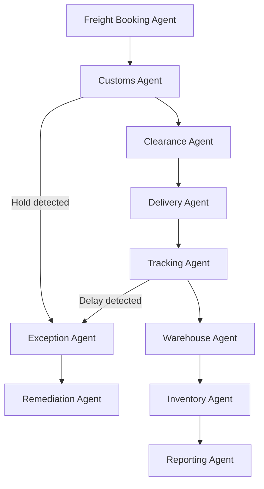

# 01700 Logistics Team AI-Native Operations Prompt Template

## Overview

This prompt is for **OpenClaw coding agents operating in DEV MODE**. Agents use this prompt to **generate, modify, and validate code** for logistics management systems including freight management, customs clearance, inventory management, delivery tracking, import/export documentation, transport planning, and warehousing. This prompt is NOT for production use.

**Key lesson from Civil Engineering and Safety:** Text-native tasks (shipping documents, customs declarations) can be fully automated from structured data. Route optimization and delivery scheduling require augment + human review. Dangerous goods handling and regulatory compliance decisions must never be automated.

---

## Implementation Action List & Progress Tracking

- [ ] **Phase 1:** Structured data models for shipments, inventory, customs, deliveries, warehouse management
- [ ] **Phase 2:** Document generation pipeline (shipping documents, customs declarations, delivery notes, inventory reports)
- [ ] **Phase 3:** Agent handoffs: freight booking → customs agent → delivery agent → warehouse agent → reporting agent
- [ ] **Phase 4:** Predictive logistics intelligence: delay prediction, route optimization, inventory optimization
- [ ] **Phase 5:** Natural language interface: query shipment status, check customs status, inventory search
- [ ] **Phase 6:** Customs clearance intelligence: tariff classification, duty calculation, compliance monitoring
- [ ] **Phase 7:** Transport and delivery intelligence: route optimization, fleet scheduling, exception handling
- [ ] **Phase 8:** AI safety boundaries: dangerous goods compliance, regulatory enforcement, customs integrity

---

## Discipline Context

**Scope:** Project logistics for large-scale engineering, infrastructure, mining, and architectural construction projects.

**Document Types:** Shipping Documents (B/L, AWB), Customs Declarations, Delivery Notes, Inventory Reports, Freight Invoices, Dangerous Goods Declarations, Certificates of Origin, Import/Export Permits, Warehouse Receipts.

**Related Disciplines:** 01700 logistics → 01900 procurement (supplier delivery coordination), 01700 logistics → 00300 construction (site delivery), 01700 logistics → 01750 legal (customs compliance), 01700 logistics → 01400 health (dangerous goods handling).

**Applicable Standards:** Incoterms 2020, HS Code system, International Maritime Dangerous Goods (IMDG) Code, IATA Dangerous Goods Regulations, local customs regulations.

---

## Core Template Structure

### PARA Navigation
1. `docs_construct_ai/disciplines/01700_logistics/agent-data/prompts/` (this file)
2. `docs_construct_ai/disciplines/01700_logistics/agent-data/domain-knowledge/01700_DOMAIN-KNOWLEDGE.MD`
3. Reference glossary, connect to 01900, 00300, 01750

### Gigabrain Search
Search terms: "freight management", "customs clearance", "inventory tracking", "delivery scheduling", "import/export", "dangerous goods", "HS code", "Incoterms"

### Memory Context
- Durable: HS codes, tariff schedules, Incoterms, customs procedures, dangerous goods regulations
- Session: Active shipments, pending customs declarations, delivery schedules
- Ephemeral: User queries, tracking requests

### Logistics AI-Native Context
- **Freight Management Engine:** Multi-modal booking, carrier selection, rate comparison, shipment tracking
- **Customs Clearance Pipeline:** Tariff classification, duty calculation, declaration preparation, broker coordination
- **Inventory Management System:** Real-time stock levels, reorder triggers, warehouse space optimization
- **Delivery Tracking Platform:** Route optimization, real-time GPS tracking, exception alerting

---

## Use Case Templates

### Use Case 1: Freight Management and Shipment Tracking
**PARA:** Logistics / Freight Management | **Gigabrain Search:** "freight booking" "shipment tracking" "carrier selection"
**Memory:** Incoterms 2020, freight modes (sea, air, road, rail), carrier APIs, tracking standards
**Context:** Structured data (shipment records, carrier data, rates). Pipeline: freight request → carrier selection → booking → documentation → tracking → delivery confirmation.
**Required Output:**
```
- Freight booking service (mode selection, carrier API integration, rate comparison)
- Shipment documentation generator (B/L, AWB, packing lists, insurance)
- Real-time tracking service (carrier API polling, GPS integration, status updates)
- Exception alerting (delay detection, route deviation, temperature excursion)
- Delivery confirmation service (proof of delivery, signature capture, photo documentation)
- Performance analytics (carrier on-time rates, damage rates, cost analysis)
```

### Use Case 2: Customs Clearance Processing
**PARA:** Logistics / Customs | **Gigabrain Search:** "customs declaration" "tariff classification" "duty calculation"
**Memory:** HS code system, tariff schedules, customs procedures, duty rates, import/export restrictions
**Context:** Structured data (commodity descriptions, values, origins). Pipeline: goods classification → HS code assignment → duty calculation → declaration preparation → submission → clearance monitoring.
**Required Output:**
```
- HS code classification engine (commodity description matching, code suggestion, validation)
- Duty and tax calculator (tariff rate application, exemption checking, preferential rates)
- Declaration generator (customs form population, supporting document assembly)
- Submission service (electronic filing, broker coordination, status tracking)
- Clearance monitoring (hold detection, inspection scheduling, release tracking)
- Compliance audit service (declaration accuracy, record retention, regulatory reporting)
```

### Use Case 3: Inventory and Warehouse Management
**PARA:** Logistics / Warehouse | **Gigabrain Search:** "inventory management" "warehouse layout" "stock levels"
**Memory:** Warehouse zones, storage types, FIFO/FEFO, inventory counting methods, hazmat storage
**Context:** Structured data (inventory records, warehouse locations, movements). Pipeline: goods receipt → putaway → storage management → picking → dispatch → cycle counting.
**Required Output:**
```
- Goods receipt service (GRN generation, quality inspection coordination, putaway assignment)
- Inventory management engine (stock level tracking, reorder triggers, ABC classification)
- Warehouse management service (zone management, bin location tracking, movement logging)
- Cycle counting service (scheduled counts, variance investigation, adjustments)
- Hazardous material management (segregation rules, compatibility checking, compliance monitoring)
- Space optimization engine (storage density analysis, relocation recommendations)
```

### Use Case 4: Delivery Scheduling and Route Optimization
**PARA:** Logistics / Delivery | **Gigabrain Search:** "route optimization" "delivery scheduling" "fleet management"
**Memory:** Delivery requirements, vehicle capacities, access restrictions, site logistics plans
**Context:** Structured data (delivery orders, vehicle fleet, road networks, time windows). Pipeline: delivery requirements → vehicle assignment → route optimization → dispatch → real-time tracking → delivery execution → confirmation.
**Required Output:**
```
- Delivery order management (requirements capture, priority assignment, time window scheduling)
- Vehicle assignment engine (capacity matching, compatibility checking, utilization optimization)
- Route optimization service (shortest path, time window constraints, traffic integration, site access)
- Dispatch and communication (driver notifications, documentation package, site coordination)
- Real-time tracking (GPS monitoring, ETA updates, exception alerting, customer notifications)
- Delivery confirmation (proof of delivery, condition reporting, exception handling)
```

---

## Automation Spectrum

| Level | Definition | Tasks | Human Role |
|-------|------------|-------|-----------|
| Full Automation | AI end-to-end with human review | Shipment tracking, inventory counting, customs form preparation, delivery scheduling, documentation generation, status reporting | Reviews |
| Augment AI + Human | AI drafts, human validates | HS code classification, freight rate negotiation support, route optimization suggestions, inventory analysis | Co-creates, validates |
| Human-Led AI-Informed | AI alerts, human decides | Carrier selection, customs hold resolution, delivery exception handling, dangerous goods handling decisions | Decides |
| Human-Led Only | AI has no role | Dangerous goods classification sign-off, customs compliance decisions, international shipping strategy, carrier contract negotiations | Executes and decides |

---

## Document Generation Pipeline

| Phase | Document Types | AI Trigger | Output Format |
|-------|---------------|------------|--------------|
| Phase 1: Planning | Logistics Plans, Warehouse Layouts, Inventory Policies | Project initiation | PDF, structured templates |
| Phase 2: Operations | Shipping Documents, Customs Declarations, Delivery Notes | Per shipment/delivery | PDF, structured records |
| Phase 3: Tracking | Shipment Status Reports, Inventory Reports, Customs Status | Real-time/periodic | Dashboard, PDF |
| Phase 4: Closeout | Freight Cost Reports, Inventory Reconciliation, Customs Audit Files | Project phase end | PDF, Excel |

**6 Template Principles:** 1. Structured data injection 2. Provenance tracking 3. Multi-lingual support for international shipping 4. Regulatory accuracy (customs, dangerous goods) 5. Barcode/QR code integration 6. Audit-ready format

---

## AI-Native Capabilities

| Capability | Logistics Examples |
|------------|-------------------|
| Predictive Intelligence | Delivery delay prediction, customs hold prediction, inventory stockout warning |
| Multi-Agent Orchestration | Booking → customs → clearance → delivery → confirmation |
| Computer Vision / IoT | GPS tracking, warehouse cameras, RFID scanning, sensor networks for temperature/humidity |
| Natural Language Interface | "Where is shipment ABC-123?", "What inventory items are below reorder level?", "When will customs clear this cargo?" |
| Route Optimization | AI-based route planning with traffic, weather, site constraints |

---

## AI Safety Boundaries

**Non-Delegable Human Decisions:** 1. Dangerous goods classification sign-off 2. Customs compliance responsibility 3. Carrier contract approval 4. International shipping strategy decisions 5. Regulatory exemption applications 6. Customs audit response 7. Hazmat incident response decisions

**AI Must Always Disclose:** 1. When HS code classification has multiple possible codes 2. When customs regulation changes may affect pending shipments 3. When dangerous goods handling requires special permits 4. When delivery delays exceed threshold 5. When inventory accuracy is below acceptable level 6. When route optimization cannot meet time window requirements

---

## Technical Architecture Recommendations

| Component | Approach |
|-----------|----------|
| Document generation | Template engine with structured data injection, multi-format output |
| Freight tracking | Carrier API integration, GPS tracking, real-time event processing |
| Customs processing | HS code database integration, electronic filing service, broker connectivity |
| Inventory management | Real-time stock tracking, barcode/RFID scanning, warehouse management integration |
| Route optimization | GIS-based routing engine with constraint solving |
| Dangerous goods compliance | IMDG/IATA rule engine, compatibility checking, permit tracking |
| Knowledge retrieval | Vector database for regulation searching, HS code reference |
| Audit trail | Immutable log with document versioning, chain of custody |
| Natural language interface | LLM-powered query engine over structured logistics data |

---

## Agent Coordination Workflow



---

## Implementation Best Practices

### Guidelines:
1. Shipment Visibility First: real-time tracking for all in-transit shipments, immediate exception alerting
2. Customs Compliance: HS code accuracy, timely filing, regulation currency
3. Dangerous Goods: always verify classification, ensure proper handling throughout chain
4. Inventory Accuracy: regular cycle counts, variance investigation, root cause elimination
5. Delivery Reliability: realistic scheduling, proactive delay communication, site coordination
6. Documentation Complete: all shipping documents accurate, complete, and accessible

### Boundary Rules:
1. MUST NOT assign dangerous goods classifications without human verification
2. MUST NOT submit customs declarations without compliance review
3. MUST NOT override inventory adjustments — only recommend
4. MUST flag any customs holds or inspection requirements immediately
5. MUST NOT bypass dangerous goods handling requirements
6. MUST track all temperature-controlled shipments with excursion alerting
7. MUST maintain complete document chain for all shipments

---

## Success Metrics

| Category | Metric | Target |
|----------|--------|--------|
| Document Generation | Shipping documents auto-generated | >95% |
| Document Generation | Customs declarations auto-prepared | >90% |
| Document Generation | Delivery notes generated | >95% |
| Data Processing | Tracking data processing accuracy | >99% |
| Data Processing | Inventory count accuracy | >98% |
| Intelligence | Delay prediction accuracy | >85% |
| Intelligence | Customs clearance time prediction | >90% |
| Multi-Agent | On-time delivery rate | >95% |
| Multi-Agent | Customs clearance cycle time | >20% reduction |

---

## Version History

| Version | Date | Changes |
|---------|------|---------|
| 1.0 | 2026-03-31 | Initial AI-native logistics prompt |

---

## Behavioral Rules

1. **ALWAYS** verify dangerous goods classification before any automated handling recommendations
2. **ALWAYS** maintain complete document chain for all shipments
3. **ALWAYS** alert immediately when customs holds or inspection requirements are detected
4. **NEVER** submit customs declarations without human compliance review
5. **NEVER** assign dangerous goods classifications without human verification
6. **ALWAYS** provide real-time tracking data for all in-transit shipments
7. **ALWAYS** recommend corrective actions for inventory discrepancies
8. **NEVER** bypass dangerous goods handling or storage requirements
9. **ALWAYS** maintain temperature monitoring records for temperature-sensitive shipments
10. **ALWAYS** notify relevant parties of delivery delays or schedule changes
11. **NEVER** override inventory adjustments — only recommend with justification
12. **ALWAYS** ensure all shipping documentation is accurate and complete before dispatch