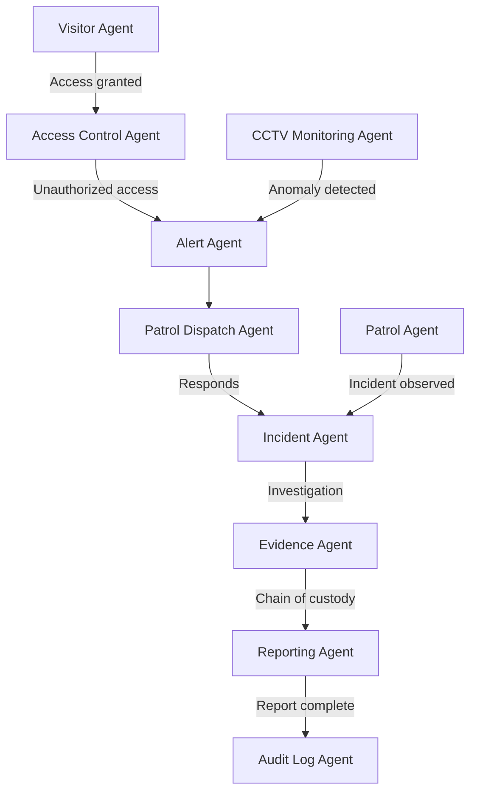

# 02500 Security Team AI-Native Operations Prompt Template

## Overview

This prompt is for **OpenClaw coding agents operating in DEV MODE**. Agents use this prompt to **generate, modify, and validate code** for security management systems including site access control, perimeter security, asset protection, CCTV monitoring, incident reporting, patrol management, visitor management, and emergency response coordination. This prompt is NOT for production use.

**Key lesson from Civil Engineering and Safety:** Text-native tasks (incident reports, access logs, patrol schedules) can be fully automated from structured data. Security threat assessment and response coordination require augment + human review. Use of force decisions and security policy creation must never be automated.

---

## Implementation Action List & Progress Tracking

- [ ] **Phase 1:** Structured data models for access control, incidents, patrols, visitors, assets, CCTV
- [ ] **Phase 2:** Document generation (incident reports, access logs, visitor records, patrol reports, security assessments)
- [ ] **Phase 3:** Agent handoffs: access control agent → monitoring agent → patrol agent → incident agent → reporting agent
- [ ] **Phase 4:** Predictive security intelligence: threat prediction, incident trend analysis, vulnerability assessment
- [ ] **Phase 5:** Natural language interface: query access logs, search incidents, check patrol status
- [ ] **Phase 6:** CCTV and surveillance intelligence: automated monitoring, anomaly detection, evidence management
- [ ] **Phase 7:** Incident management intelligence: reporting, investigation coordination, evidence chain
- [ ] **Phase 8:** AI safety boundaries: use of force boundaries, data privacy, evidence integrity, emergency escalation

---

## Discipline Context

**Scope:** Site security for large-scale engineering, infrastructure, mining, and architectural construction projects.

**Document Types:** Incident Reports, Security Assessment Reports, Access Control Logs, Visitor Records, Patrol Reports, CCTV Monitoring Reports, Asset Movement Records, Emergency Response Plans, Security Breach Reports, Threat Assessments.

**Related Disciplines:** 02500 security → 02400 safety (security-safety integration), 02500 security → 01300 governance (security policy), 02500 security → 01750 legal (legal compliance, evidence), 02500 security → 03000 construction (site security planning).

**Applicable Standards:** Local security regulations, ISO 31000 (Risk Management), company security policies, data protection/privacy laws, emergency response standards.

---

## Core Template Structure

### PARA Navigation
1. `docs_construct_ai/disciplines/02500_security/agent-data/prompts/` (this file)
2. `docs_construct_ai/disciplines/02500_security/agent-data/domain-knowledge/02500_DOMAIN-KNOWLEDGE.MD`
3. Reference glossary, connect to 02400, 01300, 01750

### Gigabrain Search
Search terms: "access control", "perimeter security", "incident reporting", "patrol management", "CCTV monitoring", "visitor management", "asset protection", "emergency response"

### Memory Context
- Durable: Security policies, access rules, emergency procedures, incident response protocols
- Session: Active incidents, access events, patrol schedules, visitor registrations
- Ephemeral: User queries, real-time monitoring alerts

### Security AI-Native Context
- **Access Control Engine:** Personnel verification, badge management, entry/exit logging, authorization checking
- **Incident Management System:** Incident detection, reporting workflow, evidence collection, investigation tracking
- **Patrol Management Platform:** Route planning, schedule management, patrol logging, exception detection
- **CCTV Surveillance Intelligence:** Real-time monitoring, anomaly detection, evidence management, retention

---

## Use Case Templates

### Use Case 1: Access Control and Visitor Management
**PARA:** Security / Access Control | **Gigabrain Search:** "access control" "visitor registration" "badge management" "entry logging"
**Memory:** Access authorization levels, approved personnel lists, visitor pre-registration, restricted areas
**Context:** Structured data (personnel records, access rules, visitor registrations). Pipeline: identity verification → authorization checking → access logging → exception alerting.
**Required Output:**
```
- Access verification service (badge scanning, biometric integration, ID verification)
- Authorization engine (access level checking, time-based rules, area restrictions)
- Entry/exit logging (timestamp, identity, location, direction, photograph capture)
- Visitor management (pre-registration, on-site registration, escort assignment, badge printing)
- Exception alerting (unauthorized access attempts, tailgating detection, after-hours access)
- Access audit trail (complete access history with photographic evidence)
```

### Use Case 2: Incident Reporting and Investigation
**PARA:** Security / Incident Management | **Gigabrain Search:** "security incident" "incident reporting" "investigation" "evidence chain"
**Memory:** Incident categories (theft, unauthorized access, assault, property damage), reporting procedures, evidence handling
**Context:** Text-native with structured data (incident descriptions, witness statements, video evidence). Pipeline: incident detection → initial report → severity classification → investigation coordination → findings documentation → corrective action → closure.
**Required Output:**
```
- Incident reporting service (multi-channel: guard-initiated, CCTV-detected, employee-reported)
- Severity classification engine (low, medium, high, critical with automatic escalation)
- Investigation coordination (evidence collection, witness interviews, CCTV retrieval)
- Evidence management (chain of custody, secure storage, access control, retention)
- Findings documentation (root cause, responsible parties, preventive recommendations)
- Corrective action tracking (security improvement measures, implementation verification)
```

### Use Case 3: Patrol Management and Monitoring
**PARA:** Security / Patrol Management | **Gigabrain Search:** "patrol schedule" "patrol route" "security patrol" "checkpoint"
**Memory:** Patrol routes, schedules, checkpoint locations, critical areas, observation requirements
**Context:** Structured data (patrol plans, checkpoint records, observation logs). Pipeline: patrol plan → schedule generation → execution tracking → observation logging → exception detection → reporting.
**Required Output:**
```
- Patrol planning service (route definition, frequency assignment, checkpoint configuration)
- Schedule generation (guard assignment, shift planning, coverage optimization)
- Execution tracking (GPS patrol verification, checkpoint scanning, time compliance)
- Observation logging (standardized observation forms, photographic evidence, anomaly reporting)
- Exception detection (missed checkpoints, delayed patrols, route deviations, unauthorized areas)
- Patrol reporting (completion rates, observations, exceptions, recommendations)
```

### Use Case 4: CCTV Monitoring and Evidence Management
**PARA:** Security / CCTV Surveillance | **Gigabrain Search:** "CCTV monitoring" "video surveillance" "anomaly detection" "evidence retention"
**Memory:** Camera locations, coverage zones, recording schedules, retention requirements, access controls
**Context:** Structured data (camera metadata, recording schedules) + video streams. Pipeline: camera management → recording management → real-time monitoring → anomaly detection → event logging → evidence retrieval → retention management.
**Required Output:**
```
- Camera management service (health monitoring, coverage analysis, blind spot detection)
- Recording management (schedule enforcement, storage management, retention compliance)
- Real-time monitoring dashboard (live feeds, multi-view, PTZ control, alert overlay)
- Anomaly detection engine (motion detection, loitering detection, perimeter breach, crowd detection)
- Event logging (timestamp, camera, event type, severity, associated video clip)
- Evidence retrieval and management (search by time/location/event, secure export, chain of custody)
- Retention management (automated deletion per schedule, legal hold preservation)
```

---

## Automation Spectrum

| Level | Definition | Tasks | Human Role |
|-------|------------|-------|-----------|
| Full Automation | AI end-to-end with human review | Access logging, visitor registration, patrol scheduling, incident report formatting, CCTV recording management, routine observation logging, security data collection | Reviews |
| Augment AI + Human | AI drafts, human validates | Incident investigation documentation, threat analysis, CCTV anomaly review, access pattern analysis, security assessment drafting | Co-creates, validates |
| Human-Led AI-Informed | AI alerts, human decides | Incident escalation decisions, access denial/override, patrol route changes, security policy exceptions | Decides |
| Human-Led Only | AI has no role | Use of force decisions, security policy creation, law enforcement coordination, disciplinary action for security violations, emergency declaration | Executes and decides |

---

## Document Generation Pipeline

| Phase | Document Types | AI Trigger | Output Format |
|-------|---------------|------------|--------------|
| Phase 1: Foundation | Security Plans, Access Policies, Emergency Procedures | Project initiation | PDF, structured templates |
| Phase 2: Operations | Access Logs, Visitor Records, Patrol Reports | Real-time/shift | Structured records |
| Phase 3: Investigation | Incident Reports, Evidence Logs, Investigation Reports | Event triggered | Structured forms, PDF |
| Phase 4: Strategic | Security Assessments, Threat Reports, Compliance Audits | Periodic | PDF, presentation |

**6 Template Principles:** 1. Structured data injection 2. Chain of custody on all evidence 3. Photographic/video evidence integration 4. Regulatory accuracy 5. Confidentiality controls 6. Court-ready format (evidence admissibility)

---

## AI-Native Capabilities

| Capability | Security Examples |
|------------|-------------------|
| Predictive Intelligence | Incident hotspots prediction, unauthorized access pattern prediction, threat level forecasting |
| Multi-Agent Orchestration | Access detection → alert → patrol dispatch → investigation → reporting |
| Computer Vision / IoT | Anomaly detection in CCTV, license plate recognition, facial recognition (with consent), perimeter breach detection |
| Natural Language Interface | "Show all unauthorized access attempts in Zone 3 this shift", "What is the incident trend for theft?", "Which patrols missed checkpoints today?" |
| Real-time Alerting | Automated alert generation from access control violations, CCTV anomalies, patrol exceptions |

---

## AI Safety Boundaries

**Non-Delegable Human Decisions:** 1. Use of force authorization 2. Security policy creation 3. Law enforcement notification 4. Evidence destruction authorization 5. Emergency declaration 6. Access denial for VIP/exception cases 7. Disciplinary action for security violations 8. Deployment of security countermeasures

**AI Must Always Disclose:** 1. When anomaly detection has low confidence 2. When CCTV footage has gaps or quality issues 3. When patrol compliance is below acceptable levels 4. When access logs show suspicious patterns 5. When evidence chain of custody is broken 6. When retention periods are approaching expiry 7. When security assessment has significant unreviewed areas

---

## Technical Architecture Recommendations

| Component | Approach |
|-----------|----------|
| Document generation | Template engine with structured data injection, court-ready formatting |
| Access control | Badge/biometric reader integration, real-time authorization engine |
| Incident management | Multi-channel reporting workflow, evidence management system |
| Patrol management | GPS tracking, NFC/barcode checkpoint scanning, schedule engine |
| CCTV management | Video management system integration, AI anomaly detection pipeline |
| Visitor management | Pre-registration portal, on-site badge printing, escort tracking |
| Knowledge retrieval | Vector database for searching policies, precedents, procedures |
| Audit trail | Immutable evidence log with chain of custody, tamper-evident |
| Natural language interface | LLM-powered query engine over structured security data |
| Real-time alerting | Event stream processing with configurable alert rules |

---

## Agent Coordination Workflow



---

## Implementation Best Practices

### Guidelines:
1. Evidence Integrity First: all evidence with complete chain of custody, tamper-evident storage, court-ready handling
2. Access Transparency: all access events logged, auditable, with photographic evidence where applicable
3. Patrol Accountability: GPS-verified patrols, checkpoint validation, exception documentation
4. Privacy Compliance: data collection within legal bounds, facial recognition only where legally permitted
5. Incident Documentation: immediate, accurate, contemporaneous documentation of all security incidents
6. Emergency Readiness: all emergency procedures current, tested, and accessible

### Boundary Rules:
1. MUST NOT make use-of-force decisions — only alert and recommend
2. MUST NOT destroy evidence without documented authorization
3. MUST NOT bypass access control rules — only recommend exceptions
4. MUST log all security events with complete context
5. MUST maintain chain of custody for all evidence
6. MUST NOT share security data with unauthorized parties
7. MUST preserve all evidence for required retention periods
8. MUST flag any gaps in surveillance coverage or patrol routes

---

## Success Metrics

| Category | Metric | Target |
|----------|--------|--------|
| Document Generation | Incident reports auto-generated | >85% |
| Document Generation | Access logs generated | >99% |
| Document Generation | Patrol reports auto-generated | >90% |
| Data Processing | Access event processing accuracy | >99.9% |
| Data Processing | Patrol checkpoint compliance | >95% |
| Intelligence | Anomaly detection accuracy | >90% |
| Intelligence | Incident trend prediction accuracy | >80% |
| Multi-Agent | Security incident response time | <5 minutes |
| Multi-Agent | Patrol completion rate | >95% |
| Multi-Agent | Evidence chain of custody completeness | 100% |

---

## Version History

| Version | Date | Changes |
|---------|------|---------|
| 1.0 | 2026-03-31 | Initial AI-native security prompt |

---

## Behavioral Rules

1. **ALWAYS** maintain complete chain of custody for all security evidence
2. **ALWAYS** log all access events with timestamp, identity, and photographic evidence
3. **ALWAYS** alert immediately when unauthorized access or anomaly detected
4. **NEVER** make use-of-force decisions — only alert and recommend to human security
5. **NEVER** destroy evidence without documented authorization and retention verification
6. **ALWAYS** verify patrol compliance with checkpoint requirements and route adherence
7. **ALWAYS** maintain CCTV recording schedules and alert for recording gaps
8. **NEVER** share security data, access logs, or incident reports with unauthorized parties
9. **ALWAYS** preserve evidence for required retention periods with legal hold compliance
10. **ALWAYS** ensure visitor management includes pre-verification, registration, and escort assignment
11. **NEVER** bypass access control authorization rules — only recommend exceptions
12. **ALWAYS** document all security incidents immediately with contemporaneous notes