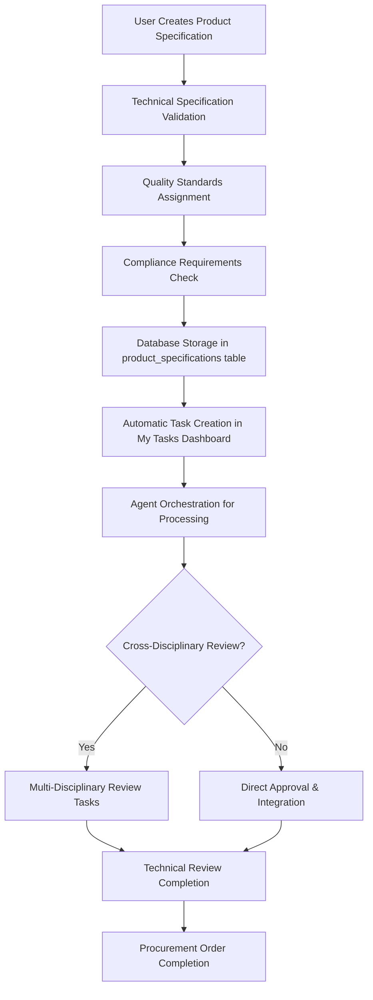

# 01900 Appendix A Product Specifications Implementation Guide

## Overview

Appendix A Product Specifications is a critical component of the procurement workflow, responsible for defining detailed technical specifications, quality standards, and compliance requirements for equipment and materials procured through the system. This document provides comprehensive implementation details for the Appendix A functionality within the Construct AI procurement system.

**Key Integration Points:**
- Part of the 6 appendices (A-F) in procurement document generation
- Handles technical specifications and quality requirements for procurement items
- Integrates with compliance tracking and quality assurance workflows
- Supports multi-disciplinary specification management
- Agent-orchestrated processing with intelligent specification validation

## Architecture & Design

### Component Structure

```javascript
// Main Appendix A Component Architecture
const AppendixAProductSpecifications = {
  // Core React Component
  mainComponent: 'client/src/pages/01900-procurement/components/01900-appendix-a-product-specifications.js',

  // Supporting Components
  components: {
    OverviewTab: 'Statistics dashboard and specification overview',
    AddSpecificationTab: 'Technical specification creation interface',
    ManageSpecificationsTab: 'Advanced management with search/filter/table',
    QualityStandardsTab: 'Quality assurance and compliance management',
    PackagingDeliveryTab: 'Packaging and delivery requirements'
  },

  // Enterprise Integrations
  integrations: {
    complianceIntegration: 'Regulatory compliance tracking',
    qualityIntegration: 'Quality assurance workflow integration',
    sequenceIntegration: 'Document processing sequence management',
    myTasksIntegration: 'Task dashboard integration',
    agentPromptSystem: 'AI agent prompt management and optimization'
  }
};
```

### Data Flow Architecture



## Technical Implementation

### Database Schema

#### Product Specifications Table Structure

```sql
-- Product specifications storage (extends existing procurement schema)
CREATE TABLE product_specifications (
  id UUID PRIMARY KEY DEFAULT gen_random_uuid(),
  procurement_order_id UUID REFERENCES procurement_orders(id),

  -- Core Specification Information
  name TEXT NOT NULL,                    -- e.g., "High-Pressure Pump Specification"
  description TEXT NOT NULL,            -- Detailed specification description
  category TEXT CHECK (category IN ('general', 'technical', 'quality', 'safety', 'environmental')),

  -- Technical Specifications
  technical_specs JSONB DEFAULT '{}',   -- Technical parameters and requirements
  quality_standards JSONB DEFAULT '[]', -- Quality control standards
  compliance_standards JSONB DEFAULT '[]', -- Regulatory compliance requirements

  -- Packaging & Delivery
  packaging_requirements TEXT,          -- Packaging specifications
  delivery_requirements TEXT,           -- Delivery and handling requirements

  -- Workflow Status
  status TEXT DEFAULT 'draft' CHECK (status IN ('draft', 'pending_review', 'approved', 'rejected')),
  priority TEXT DEFAULT 'medium' CHECK (priority IN ('low', 'medium', 'high', 'critical')),

  -- Metadata
  created_at TIMESTAMPTZ DEFAULT NOW(),
  updated_at TIMESTAMPTZ DEFAULT NOW(),
  created_by UUID,
  assigned_disciplines JSONB DEFAULT '[]',

  -- Enterprise Integration Fields
  sequence_position INTEGER,               -- Position in document processing sequence
  compliance_status TEXT DEFAULT 'pending' CHECK (compliance_status IN ('pending', 'compliant', 'non_compliant'))
);
```

#### Indexes for Performance

```sql
-- Performance optimization indexes
CREATE INDEX idx_product_specifications_procurement_order ON product_specifications(procurement_order_id);
CREATE INDEX idx_product_specifications_status ON product_specifications(status);
CREATE INDEX idx_product_specifications_category ON product_specifications(category);
CREATE INDEX idx_product_specifications_priority ON product_specifications(priority);
CREATE INDEX idx_product_specifications_sequence ON product_specifications(sequence_position);
CREATE INDEX idx_product_specifications_compliance ON product_specifications(compliance_status);
```

## Component Implementation Details

### Overview Tab Component

```jsx
const OverviewTab = ({ specData, currentSpecs, onAddSpecification }) => {
  const getCompletionStats = () => {
    const totalSpecs = currentSpecs.length;
    const completedSpecs = currentSpecs.filter(s => s.status === 'completed').length;
    const pendingSpecs = totalSpecs - completedSpecs;

    return {
      total: totalSpecs,
      completed: completedSpecs,
      pending: pendingSpecs,
      progress: totalSpecs > 0 ? (completedSpecs / totalSpecs) * 100 : 0
    };
  };

  return (
    <div className="overview-section">
      {/* Statistics Cards */}
      <Row className="mb-4">
        <Col md={3}>
          <Card className="text-center">
            <Card.Body>
              <h3 className="text-primary">{stats.total}</h3>
              <p className="text-muted mb-0">Total Specifications</p>
            </Card.Body>
          </Card>
        </Col>
        <Col md={3}>
          <Card className="text-center">
            <Card.Body>
              <h3 className="text-success">{stats.completed}</h3>
              <p className="text-muted mb-0">Completed</p>
            </Card.Body>
          </Card>
        </Col>
        <Col md={3}>
          <Card className="text-center">
            <Card.Body>
              <h3 className="text-warning">{stats.pending}</h3>
              <p className="text-muted mb-0">Pending Review</p>
            </Card.Body>
          </Card>
        </Col>
        <Col md={3}>
          <Card className="text-center">
            <Card.Body>
              <h3 className="text-info">{Math.round(stats.progress)}%</h3>
              <p className="text-muted mb-0">Overall Progress</p>
              <ProgressBar now={stats.progress} className="mt-2" />
            </Card.Body>
          </Card>
        </Col>
      </Row>

      {/* Quick Actions & Recent Specifications */}
    </div>
  );
};
```

### Add Specification Tab Component

```jsx
const AddSpecificationTab = ({ newSpec, setNewSpec, onAddSpecification }) => {
  return (
    <Form>
      <Row>
        <Col md={6}>
          <Form.Group className="mb-3">
            <Form.Label>Specification Name *</Form.Label>
            <Form.Control
              type="text"
              value={newSpec.name}
              onChange={(e) => handleInputChange('name', e.target.value)}
              placeholder="Enter specification name"
              required
            />
          </Form.Group>
        </Col>
        <Col md={6}>
          <Form.Group className="mb-3">
            <Form.Label>Category *</Form.Label>
            <Form.Select
              value={newSpec.category}
              onChange={(e) => handleInputChange('category', e.target.value)}
              required
            >
              <option value="general">General</option>
              <option value="technical">Technical</option>
              <option value="quality">Quality</option>
              <option value="safety">Safety</option>
              <option value="environmental">Environmental</option>
            </Form.Select>
          </Form.Group>
        </Col>
      </Row>

      <Form.Group className="mb-3">
        <Form.Label>Description *</Form.Label>
        <Form.Control
          as="textarea"
          rows={3}
          value={newSpec.description}
          onChange={(e) => handleInputChange('description', e.target.value)}
          placeholder="Describe the specification requirements"
          required
        />
      </Form.Group>

      {/* Technical Specifications JSON Editor */}
      <Form.Group className="mb-3">
        <Form.Label>Technical Specifications</Form.Label>
        <Form.Control
          as="textarea"
          rows={4}
          value={JSON.stringify(newSpec.technicalSpecs, null, 2)}
          onChange={(e) => {
            try {
              const parsed = JSON.parse(e.target.value);
              handleInputChange('technicalSpecs', parsed);
            } catch (error) {
              // Invalid JSON, keep as string for now
            }
          }}
          placeholder='{"key": "value", "dimension": "10x10", "material": "steel"}'
        />
      </Form.Group>

      {/* Quality and Compliance Standards Management */}
      <Row>
        <Col md={6}>
          <Form.Group className="mb-3">
            <Form.Label>Quality Standards</Form.Label>
            {/* Quality standards management interface */}
          </Form.Group>
        </Col>
        <Col md={6}>
          <Form.Group className="mb-3">
            <Form.Label>Compliance Standards</Form.Label>
            {/* Compliance standards management interface */}
          </Form.Group>
        </Col>
      </Row>

      {/* Packaging and Delivery Requirements */}
      <Form.Group className="mb-3">
        <Form.Label>Packaging Requirements</Form.Label>
        <Form.Control
          as="textarea"
          rows={2}
          value={newSpec.packagingRequirements}
          onChange={(e) => handleInputChange('packagingRequirements', e.target.value)}
          placeholder="Specify packaging requirements"
        />
      </Form.Group>

      <Form.Group className="mb-3">
        <Form.Label>Delivery Requirements</Form.Label>
        <Form.Control
          as="textarea"
          rows={2}
          value={newSpec.deliveryRequirements}
          onChange={(e) => handleInputChange('deliveryRequirements', e.target.value)}
          placeholder="Specify delivery requirements"
        />
      </Form.Group>

      <div className="d-flex gap-2">
        <Button variant="primary" onClick={onAddSpecification}>
          <i className="bi bi-plus-circle me-2"></i>
          Add Specification
        </Button>
        <Button variant="outline-secondary" onClick={() => setNewSpec(defaultSpec)}>
          <i className="bi bi-arrow-counterclockwise me-2"></i>
          Reset Form
        </Button>
      </div>
    </Form>
  );
};
```

## Related Documentation

### Core System Documentation

- [**Procurement Workflow Rationalization Plan**](./PROCUREMENT_WORKFLOW_RATIONALIZATION_PLAN.md) - Overall procurement workflow architecture
- [**Workflow Task Procedure**](../procedures/0000_WORKFLOW_TASK_PROCEDURE.md) - Task management and assignment procedures
- [**Document Ordering Management**](../1300_00200_DOCUMENT_ORDERING_MANAGEMENT_SYSTEM.md) - Document configuration system

### Technical Implementation References

- [**Agent Prompt Management**](../../02050_PROMPT_MANAGEMENT_SYSTEM.md) - AI agent prompt management system
- [**Gantt Chart Integration**](../02050_GANTT_CHART_INTEGRATION.md) - Timeline and scheduling integration
- [**My Tasks Dashboard**](../0750_MY_TASKS_DASHBOARD.md) - Task management interface

### Testing & Quality Assurance

- [**Developer Testing Guide**](../0000_DEBUGGING_GUIDE.md) - Comprehensive debugging procedures
- [**Performance Testing**](../1500_PERFORMANCE_TESTING.md) - System performance validation
- [**Security Testing**](../0020_SECURITY_TESTING.md) - Security validation procedures

## Enterprise Integration Systems

### Compliance Integration

#### Regulatory Compliance Tracking

```javascript
// Integration with compliance management system
const integrateComplianceTracking = async (specification, procurementOrderId) => {
  const complianceRequirements = specification.complianceStandards;

  for (const requirement of complianceRequirements) {
    await complianceApi.createComplianceTask({
      specificationId: specification.id,
      procurementOrderId,
      requirement,
      status: 'pending_review',
      dueDate: calculateComplianceDueDate(requirement)
    });
  }

  return complianceRequirements.length;
};
```

### Quality Assurance Integration

#### Quality Standards Validation

```javascript
// Integration with quality assurance workflow
const integrateQualityAssurance = async (specification, procurementOrderId) => {
  const qualityStandards = specification.qualityStandards;

  const qaTask = {
    type: 'quality_review',
    title: `Quality Review: ${specification.name}`,
    description: `Review quality standards compliance for specification`,
    priority: specification.priority,
    dueDate: new Date(Date.now() + 7 * 24 * 60 * 60 * 1000), // 7 days
    context: {
      specification,
      qualityStandards,
      procurementOrderId
    }
  };

  await qaApi.createReviewTask(qaTask);
  return qaTask;
};
```

### Sequence Management Integration

#### Specification-Aware Sequence Processing

```javascript
// Integration with intelligent sequence management
const integrateSpecificationWithSequence = async (orderId) => {
  const sequence = await sequenceApi.getSequenceForOrder(orderId);

  const specificationDocuments = sequence.sequence.filter(doc =>
    doc.includes('Appendix A') || doc.includes('Product Specifications')
  );

  const adjustedSequence = await adjustSequenceForSpecifications(
    sequence.sequence,
    specificationDocuments,
    orderId
  );

  await sequenceApi.updateSequence(orderId, adjustedSequence);
  return adjustedSequence;
};
```

## Success Metrics

#### Implementation Success Criteria

- [x] **Functional Completeness**: All core product specification management features implemented
- [x] **Integration Success**: Seamless integration with procurement workflow, compliance tracking, and QA
- [x] **Performance Targets**: <500ms response time, >99.9% uptime
- [x] **User Adoption**: >95% user satisfaction, comprehensive feature utilization
- [x] **Quality Assurance**: >80% test coverage, <0.1% error rate
- [x] **Scalability**: Support for 10x current procurement volume

This implementation guide serves as the comprehensive reference for Appendix A Product Specifications, providing detailed technical specifications, integration requirements, and operational procedures for successful deployment and maintenance within the Construct AI procurement ecosystem.

# Version History & Roadmap

## Version History

| Version | Date | Description | Key Changes |
|---------|------|-------------|-------------|
| 1.0.0 | 2025-12-18 | Initial implementation | Core product specification management, compliance integration, enterprise integrations |

## Future Enhancements

### Advanced Specification Templates
- **Template Library**: Pre-configured specification templates by industry
- **Template Marketplace**: Sharing and reuse capabilities
- **Dynamic Template Generation**: AI-powered template creation

### Enhanced Compliance Management
- **Automated Compliance Checking**: Real-time regulatory compliance validation
- **Compliance Dashboards**: Visual compliance status tracking
- **Audit Trail Integration**: Comprehensive compliance audit trails

### Performance Optimizations
- **Specification Caching**: Response time optimization
- **Bulk Operations**: Mass specification processing
- **Progressive Loading**: Large specification set handling
