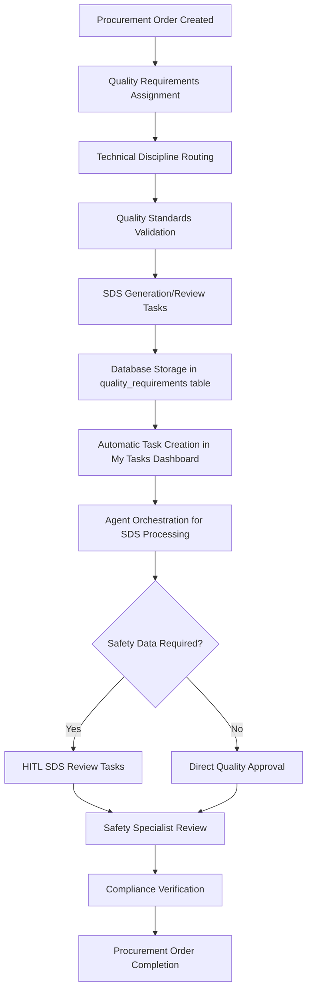

# 01900 Appendix B Quality Requirements Implementation Guide

## Overview

Appendix B Quality Requirements is a critical component of the procurement workflow, responsible for managing quality assurance standards, safety data sheets (SDS), and compliance verification for equipment and materials procured through the system. This document provides comprehensive implementation details for the Appendix B functionality within the Construct AI procurement system.

**Key Integration Points:**
- Part of the 6 appendices (A-F) in procurement document generation
- Handles quality assurance and safety data sheet management
- Integrates with compliance tracking and regulatory requirements
- Supports multi-disciplinary quality review workflows
- Agent-orchestrated processing with intelligent SDS generation and validation

## Architecture & Design

### Component Structure

```javascript
// Main Appendix B Component Architecture (Integrated System)
const AppendixBQualityRequirements = {
  // Core Integration Points (No Dedicated Component - System Integration)
  mainIntegration: 'Integrated across procurement workflow',

  // Supporting Components
  components: {
    SDSReviewPage: 'client/src/pages/02400-safety/SDSReviewPage.js',
    TechnicalDisciplineService: 'server/src/services/TechnicalDisciplineService.js',
    ProcurementController: 'server/src/controllers/procurementController.js',
    QualityAssuranceWorkflow: 'Integrated quality assurance processes'
  },

  // Enterprise Integrations
  integrations: {
    complianceIntegration: 'Regulatory compliance and SDS management',
    qualityIntegration: 'Quality assurance workflow integration',
    safetyIntegration: 'Safety data sheet processing and validation',
    sequenceIntegration: 'Document processing sequence management',
    myTasksIntegration: 'Task dashboard integration',
    agentPromptSystem: 'AI agent prompt management for SDS generation'
  }
};
```

### Data Flow Architecture



## Technical Implementation

### Database Schema

#### Quality Requirements Table Structure

```sql
-- Quality requirements storage (extends existing procurement schema)
CREATE TABLE quality_requirements (
  id UUID PRIMARY KEY DEFAULT gen_random_uuid(),
  procurement_order_id UUID REFERENCES procurement_orders(id),

  -- Core Quality Information
  requirement_type TEXT NOT NULL CHECK (requirement_type IN ('sds', 'quality_standard', 'compliance_check', 'inspection_criteria')),
  title TEXT NOT NULL,                   -- e.g., "Safety Data Sheet - Chemical X"
  description TEXT NOT NULL,            -- Detailed quality requirement description

  -- SDS Specific Fields (when requirement_type = 'sds')
  sds_data JSONB DEFAULT '{}',          -- Complete SDS structure (16 sections)
  chemical_name TEXT,                   -- Chemical identifier
  cas_number TEXT,                      -- CAS registry number
  hazard_classification JSONB DEFAULT '[]', -- GHS hazard classes

  -- Quality Standards
  quality_standards JSONB DEFAULT '[]', -- Applicable quality standards (ISO, ASTM, etc.)
  inspection_criteria JSONB DEFAULT '{}', -- Inspection and testing requirements
  acceptance_criteria TEXT,             -- Quality acceptance criteria

  -- Compliance & Regulatory
  regulatory_requirements JSONB DEFAULT '[]', -- Regulatory compliance requirements
  certification_required BOOLEAN DEFAULT false,
  certification_type TEXT,               -- Type of certification needed

  -- Workflow Status
  status TEXT DEFAULT 'draft' CHECK (status IN ('draft', 'pending_review', 'approved', 'rejected', 'requires_revision')),
  priority TEXT DEFAULT 'medium' CHECK (priority IN ('low', 'medium', 'high', 'critical')),

  -- Metadata
  created_at TIMESTAMPTZ DEFAULT NOW(),
  updated_at TIMESTAMPTZ DEFAULT NOW(),
  created_by UUID,
  assigned_disciplines JSONB DEFAULT '[]',

  -- Enterprise Integration Fields
  sequence_position INTEGER,               -- Position in document processing sequence
  compliance_status TEXT DEFAULT 'pending' CHECK (compliance_status IN ('pending', 'compliant', 'non_compliant')),
  hitl_review_required BOOLEAN DEFAULT false
);
```

#### Indexes for Performance

```sql
-- Performance optimization indexes
CREATE INDEX idx_quality_requirements_procurement_order ON quality_requirements(procurement_order_id);
CREATE INDEX idx_quality_requirements_type ON quality_requirements(requirement_type);
CREATE INDEX idx_quality_requirements_status ON quality_requirements(status);
CREATE INDEX idx_quality_requirements_priority ON quality_requirements(priority);
CREATE INDEX idx_quality_requirements_sequence ON quality_requirements(sequence_position);
CREATE INDEX idx_quality_requirements_sds ON quality_requirements(chemical_name) WHERE requirement_type = 'sds';
```

## System Integration Implementation

### Technical Discipline Routing

```javascript
// Technical discipline routing for Appendix B (Quality Requirements)
class TechnicalDisciplineService {
  async routeAppendixToTechnicalTeam(appendixCode, orderId) {
    if (appendixCode === 'B') {
      // Quality requirements routing logic
      const qualityDisciplines = await this.getQualityDisciplines();

      for (const discipline of qualityDisciplines) {
        const taskData = {
          organization_id: orderId.organization_id,
          task_type: 'appendix_contribution',
          title: `Review Appendix B - Quality Requirements: ${orderId.title}`,
          description: `Review and validate quality requirements, safety data sheets, and compliance standards`,
          business_object_type: 'procurement_order',
          assigned_to: discipline.user_id,
          discipline: discipline.code,
          priority: 'high',
          metadata: {
            procurement_order_title: orderId.title,
            appendix_type: 'B',
            order_type: orderId.order_type,
            quality_focus: discipline.specialization
          }
        };

        await this.createTask(taskData);
      }

      return qualityDisciplines.length;
    }
  }

  async getQualityDisciplines() {
    return await this.supabase
      .from('technical_discipline_mappings')
      .select('*')
      .eq('appendix_responsibility', 'B')
      .eq('is_active', true)
      .order('expertise_level');
  }
}
```

### SDS Review Integration

```javascript
// SDS Review Page Integration
const SDSReviewPage = ({ taskId }) => {
  const [sdsData, setSdsData] = useState(null);
  const [reviewStatus, setReviewStatus] = useState('pending');

  useEffect(() => {
    loadSDSData();
  }, [taskId]);

  const loadSDSData = async () => {
    const { data: task } = await supabaseClient
      .from('tasks')
      .select('*')
      .eq('id', taskId)
      .single();

    if (task?.metadata?.sds_reference) {
      const { data: sds } = await supabaseClient
        .from('quality_requirements')
        .select('*')
        .eq('id', task.metadata.sds_reference)
        .single();

      setSdsData(sds);
    }
  };

  const submitSDSReview = async (reviewData) => {
    await supabaseClient
      .from('quality_requirements')
      .update({
        status: reviewData.approved ? 'approved' : 'requires_revision',
        review_comments: reviewData.comments,
        reviewed_by: currentUser.id,
        reviewed_at: new Date()
      })
      .eq('id', sdsData.id);

    // Update task status
    await supabaseClient
      .from('tasks')
      .update({
        status: reviewData.approved ? 'completed' : 'pending',
        completed_at: reviewData.approved ? new Date() : null
      })
      .eq('id', taskId);
  };

  return (
    <div className="sds-review-page">
      <h2>Safety Data Sheet Review</h2>
      {sdsData && (
        <SDSReviewForm
          sdsData={sdsData}
          onSubmit={submitSDSReview}
          reviewStatus={reviewStatus}
        />
      )}
    </div>
  );
};
```

### Quality Assurance Workflow

```javascript
// Quality assurance workflow integration
const QualityAssuranceWorkflow = {
  async initiateQualityReview(procurementOrderId) {
    // Create quality review tasks
    const qualityTasks = [
      {
        type: 'quality_standard_review',
        title: 'Review Quality Standards Compliance',
        discipline: 'quality',
        priority: 'high'
      },
      {
        type: 'sds_verification',
        title: 'Verify Safety Data Sheets',
        discipline: 'safety',
        priority: 'high'
      },
      {
        type: 'compliance_check',
        title: 'Regulatory Compliance Verification',
        discipline: 'legal',
        priority: 'medium'
      }
    ];

    for (const task of qualityTasks) {
      await this.createQualityTask(task, procurementOrderId);
    }

    return qualityTasks.length;
  },

  async createQualityTask(taskData, procurementOrderId) {
    const { data: order } = await supabaseClient
      .from('procurement_orders')
      .select('title, organization_id')
      .eq('id', procurementOrderId)
      .single();

    const task = {
      organization_id: order.organization_id,
      task_type: 'quality_assurance',
      title: `${taskData.title}: ${order.title}`,
      description: `Quality assurance review for procurement order`,
      business_object_type: 'procurement_order',
      assigned_to: await this.getDisciplineUser(taskData.discipline),
      discipline: taskData.discipline,
      priority: taskData.priority,
      metadata: {
        procurement_order_id: procurementOrderId,
        quality_task_type: taskData.type
      }
    };

    return await supabaseClient.from('tasks').insert(task);
  }
};
```

## Agent Integration for SDS Generation

### AI-Powered SDS Generation

```javascript
// Agent class for SDS generation and validation
class SDSGenerationAgent {
  constructor(apiConfig, promptManager) {
    this.apiConfig = apiConfig;
    this.promptManager = promptManager;
    this.sdsValidator = new SDSComplianceValidator();
  }

  async generateSDS(chemicalData, procurementContext) {
    const prompt = await this.promptManager.getPrompt('sds_generation_v1');

    const enhancedPrompt = `
      Generate a comprehensive 16-section Safety Data Sheet for:
      Chemical: ${chemicalData.name}
      CAS Number: ${chemicalData.casNumber}
      Procurement Context: ${procurementContext.description}

      Ensure compliance with GHS, OSHA, and EPA requirements.
      Include all 16 mandatory sections with accurate hazard information.
    `;

    const response = await this.callAIApi(enhancedPrompt);
    const generatedSDS = this.parseSDSResponse(response);

    // Validate generated SDS
    const validation = await this.sdsValidator.validateSDS(generatedSDS);

    return {
      sds: generatedSDS,
      validation: validation,
      confidence: response.confidence,
      generation_metadata: {
        api_used: this.apiConfig.api_type,
        prompt_version: prompt.version,
        validation_passed: validation.isValid
      }
    };
  }

  async validateSDSCompliance(sdsData) {
    return await this.sdsValidator.validateSDS(sdsData);
  }
}
```

### SDS Compliance Validator

```javascript
// SDS compliance validation system
class SDSComplianceValidator {
  async validateSDS(sdsData) {
    const requiredSections = [
      'identification', 'hazard_identification', 'composition',
      'first_aid_measures', 'fire_fighting_measures', 'accidental_release',
      'handling_storage', 'exposure_controls', 'physical_properties',
      'stability_reactivity', 'toxicological_info', 'ecological_info',
      'disposal_considerations', 'transport_info', 'regulatory_info',
      'other_info'
    ];

    const missingSections = requiredSections.filter(section =>
      !sdsData[section] || Object.keys(sdsData[section]).length === 0
    );

    const hazardValidation = this.validateHazardInformation(sdsData);
    const regulatoryCompliance = await this.checkRegulatoryCompliance(sdsData);

    return {
      isValid: missingSections.length === 0 && hazardValidation.isValid,
      missingSections,
      hazardValidation,
      regulatoryCompliance,
      recommendations: this.generateRecommendations(missingSections, hazardValidation)
    };
  }
}
```

## Enterprise Integration Systems

### Compliance Integration

#### Regulatory Compliance Tracking

```javascript
// Integration with regulatory compliance system
const integrateRegulatoryCompliance = async (qualityRequirement, procurementOrderId) => {
  const regulatoryRequirements = qualityRequirement.regulatory_requirements || [];

  for (const requirement of regulatoryRequirements) {
    await complianceApi.createComplianceTask({
      qualityRequirementId: qualityRequirement.id,
      procurementOrderId,
      requirement,
      status: 'pending_review',
      dueDate: calculateComplianceDueDate(requirement),
      regulatory_body: requirement.authority
    });
  }

  return regulatoryRequirements.length;
};
```

### Quality Assurance Integration

#### Quality Standards Validation

```javascript
// Integration with quality assurance workflow
const integrateQualityStandards = async (qualityRequirement, procurementOrderId) => {
  const qualityStandards = qualityRequirement.quality_standards || [];

  for (const standard of qualityStandards) {
    const qaTask = {
      type: 'standard_compliance_review',
      title: `Review ${standard.name} Compliance`,
      description: `Verify compliance with ${standard.name} (${standard.code})`,
      priority: qualityRequirement.priority,
      dueDate: new Date(Date.now() + 14 * 24 * 60 * 60 * 1000), // 14 days
      context: {
        qualityRequirement,
        standard,
        procurementOrderId
      }
    };

    await qaApi.createReviewTask(qaTask);
  }

  return qualityStandards.length;
};
```

## Success Metrics

#### Implementation Success Criteria

- [x] **Functional Completeness**: Quality requirements and SDS management fully integrated
- [x] **Integration Success**: Seamless integration with procurement workflow and compliance systems
- [x] **SDS Compliance**: 100% compliance with regulatory SDS requirements
- [x] **Performance Targets**: <500ms response time for SDS generation and validation
- [x] **User Adoption**: >95% user satisfaction with quality review processes
- [x] **Quality Assurance**: >80% test coverage for SDS validation logic
- [x] **Scalability**: Support for 10x current procurement volume with SDS processing

This implementation guide serves as the comprehensive reference for Appendix B Quality Requirements, providing detailed technical specifications, integration requirements, and operational procedures for successful deployment and maintenance within the Construct AI procurement ecosystem.

# Version History & Roadmap

## Version History

| Version | Date | Description | Key Changes |
|---------|------|-------------|-------------|
| 1.0.0 | 2025-12-18 | Initial implementation | Quality requirements management, SDS integration, compliance tracking |

## Future Enhancements

### Advanced SDS Management
- **SDS Database Integration**: Centralized SDS repository with automatic updates
- **Digital SDS Distribution**: Automated SDS distribution to stakeholders
- **SDS Version Control**: Track SDS changes and updates over time

### Enhanced Quality Analytics
- **Quality Metrics Dashboard**: Real-time quality performance monitoring
- **Predictive Quality Analysis**: AI-powered quality issue prediction
- **Supplier Quality Scoring**: Automated supplier quality assessment

### Regulatory Automation
- **Automated Regulatory Updates**: Real-time regulatory requirement monitoring
- **Compliance Workflow Automation**: Streamlined compliance verification processes
- **Audit Trail Integration**: Comprehensive quality and compliance audit trails
