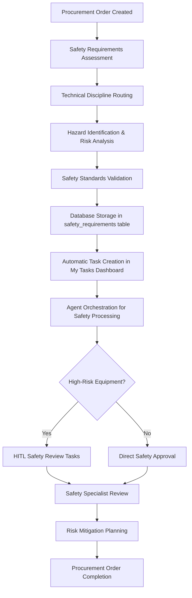

# 01900 Appendix C Safety Requirements Implementation Guide

## Overview

Appendix C Safety Requirements is a critical component of the procurement workflow, responsible for managing comprehensive safety standards, hazard assessments, and compliance verification for equipment and materials procured through the system. This document provides comprehensive implementation details for the Appendix C functionality within the Construct AI procurement system.

**Key Integration Points:**
- Part of the 6 appendices (A-F) in procurement document generation
- Handles safety requirements and hazard management for procurement items
- Integrates with risk assessment and safety compliance workflows
- Supports multi-disciplinary safety review and validation
- Agent-orchestrated processing with intelligent safety assessment and risk analysis

## Architecture & Design

### Component Structure

```javascript
// Main Appendix C Component Architecture (Integrated System)
const AppendixCSafetyRequirements = {
  // Core Integration Points (No Dedicated Component - System Integration)
  mainIntegration: 'Integrated across procurement and safety workflows',

  // Supporting Components
  components: {
    TechnicalDisciplineService: 'server/src/services/TechnicalDisciplineService.js',
    ProcurementController: 'server/src/controllers/procurementController.js',
    SafetyAssessmentWorkflow: 'Integrated safety assessment processes',
    RiskAssessmentEngine: 'server/src/services/RiskAssessmentEngine.js'
  },

  // Enterprise Integrations
  integrations: {
    safetyIntegration: 'Safety management and hazard assessment',
    riskIntegration: 'Risk assessment and mitigation planning',
    complianceIntegration: 'Safety compliance tracking and verification',
    sequenceIntegration: 'Document processing sequence management',
    myTasksIntegration: 'Task dashboard integration',
    agentPromptSystem: 'AI agent prompt management for safety analysis'
  }
};
```

### Data Flow Architecture



## Technical Implementation

### Database Schema

#### Safety Requirements Table Structure

```sql
-- Safety requirements storage (extends existing procurement schema)
CREATE TABLE safety_requirements (
  id UUID PRIMARY KEY DEFAULT gen_random_uuid(),
  procurement_order_id UUID REFERENCES procurement_orders(id),

  -- Core Safety Information
  requirement_type TEXT NOT NULL CHECK (requirement_type IN ('hazard_assessment', 'safety_standard', 'ppe_requirement', 'emergency_procedure', 'risk_mitigation')),
  title TEXT NOT NULL,                   -- e.g., "Hazard Assessment - High Voltage Equipment"
  description TEXT NOT NULL,            -- Detailed safety requirement description

  -- Hazard Assessment
  hazard_identification JSONB DEFAULT '{}', -- Identified hazards and risks
  risk_level TEXT CHECK (risk_level IN ('low', 'medium', 'high', 'critical')),
  risk_assessment JSONB DEFAULT '{}',   -- Risk assessment methodology and results

  -- Safety Standards & Compliance
  safety_standards JSONB DEFAULT '[]',  -- Applicable safety standards (OSHA, ISO, etc.)
  regulatory_requirements JSONB DEFAULT '[]', -- Regulatory safety requirements
  certification_required BOOLEAN DEFAULT false,
  certification_type TEXT,               -- Type of safety certification needed

  -- Personal Protective Equipment (PPE)
  ppe_requirements JSONB DEFAULT '[]',  -- Required PPE specifications
  ppe_training_required BOOLEAN DEFAULT false,

  -- Emergency Procedures
  emergency_procedures JSONB DEFAULT '{}', -- Emergency response procedures
  evacuation_routes TEXT,               -- Emergency evacuation requirements
  first_aid_requirements TEXT,          -- First aid and medical response needs

  -- Risk Mitigation
  mitigation_measures JSONB DEFAULT '[]', -- Risk mitigation strategies
  monitoring_requirements TEXT,         -- Safety monitoring and inspection needs
  contingency_plans TEXT,               -- Contingency and backup procedures

  -- Workflow Status
  status TEXT DEFAULT 'draft' CHECK (status IN ('draft', 'pending_review', 'approved', 'rejected', 'requires_revision')),
  priority TEXT DEFAULT 'medium' CHECK (priority IN ('low', 'medium', 'high', 'critical')),

  -- Metadata
  created_at TIMESTAMPTZ DEFAULT NOW(),
  updated_at TIMESTAMPTZ DEFAULT NOW(),
  created_by UUID,
  assigned_disciplines JSONB DEFAULT '[]',

  -- Enterprise Integration Fields
  sequence_position INTEGER,               -- Position in document processing sequence
  compliance_status TEXT DEFAULT 'pending' CHECK (compliance_status IN ('pending', 'compliant', 'non_compliant')),
  hitl_review_required BOOLEAN DEFAULT false
);
```

#### Indexes for Performance

```sql
-- Performance optimization indexes
CREATE INDEX idx_safety_requirements_procurement_order ON safety_requirements(procurement_order_id);
CREATE INDEX idx_safety_requirements_type ON safety_requirements(requirement_type);
CREATE INDEX idx_safety_requirements_risk_level ON safety_requirements(risk_level);
CREATE INDEX idx_safety_requirements_status ON safety_requirements(status);
CREATE INDEX idx_safety_requirements_priority ON safety_requirements(priority);
CREATE INDEX idx_safety_requirements_sequence ON safety_requirements(sequence_position);
CREATE INDEX idx_safety_requirements_compliance ON safety_requirements(compliance_status);
```

## System Integration Implementation

### Technical Discipline Routing

```javascript
// Technical discipline routing for Appendix C (Safety Requirements)
class TechnicalDisciplineService {
  async routeAppendixToTechnicalTeam(appendixCode, orderId) {
    if (appendixCode === 'C') {
      // Safety requirements routing logic
      const safetyDisciplines = await this.getSafetyDisciplines();

      for (const discipline of safetyDisciplines) {
        const taskData = {
          organization_id: orderId.organization_id,
          task_type: 'appendix_contribution',
          title: `Review Appendix C - Safety Requirements: ${orderId.title}`,
          description: `Review and validate safety requirements, hazard assessments, and risk mitigation plans`,
          business_object_type: 'procurement_order',
          assigned_to: discipline.user_id,
          discipline: discipline.code,
          priority: this.calculateSafetyPriority(orderId),
          metadata: {
            procurement_order_title: orderId.title,
            appendix_type: 'C',
            order_type: orderId.order_type,
            safety_focus: discipline.specialization
          }
        };

        await this.createTask(taskData);
      }

      return safetyDisciplines.length;
    }
  }

  async getSafetyDisciplines() {
    return await this.supabase
      .from('technical_discipline_mappings')
      .select('*')
      .eq('appendix_responsibility', 'C')
      .eq('is_active', true)
      .order('expertise_level');
  }

  calculateSafetyPriority(orderData) {
    // High priority for high-risk equipment
    if (orderData.risk_level === 'high' || orderData.risk_level === 'critical') {
      return 'critical';
    }
    return 'high';
  }
}
```

### Safety Assessment Workflow

```javascript
// Safety assessment workflow integration
const SafetyAssessmentWorkflow = {
  async initiateSafetyAssessment(procurementOrderId) {
    // Create safety assessment tasks
    const safetyTasks = [
      {
        type: 'hazard_identification',
        title: 'Hazard Identification & Risk Assessment',
        discipline: 'safety',
        priority: 'high'
      },
      {
        type: 'safety_standard_review',
        title: 'Safety Standards Compliance Review',
        discipline: 'safety',
        priority: 'high'
      },
      {
        type: 'emergency_procedure_validation',
        title: 'Emergency Procedures Validation',
        discipline: 'safety',
        priority: 'medium'
      },
      {
        type: 'ppe_requirement_assessment',
        title: 'PPE Requirements Assessment',
        discipline: 'safety',
        priority: 'medium'
      }
    ];

    for (const task of safetyTasks) {
      await this.createSafetyTask(task, procurementOrderId);
    }

    return safetyTasks.length;
  },

  async createSafetyTask(taskData, procurementOrderId) {
    const { data: order } = await supabaseClient
      .from('procurement_orders')
      .select('title, organization_id, risk_level')
      .eq('id', procurementOrderId)
      .single();

    const task = {
      organization_id: order.organization_id,
      task_type: 'safety_assessment',
      title: `${taskData.title}: ${order.title}`,
      description: `Safety assessment for procurement order`,
      business_object_type: 'procurement_order',
      assigned_to: await this.getDisciplineUser(taskData.discipline),
      discipline: taskData.discipline,
      priority: taskData.priority,
      metadata: {
        procurement_order_id: procurementOrderId,
        safety_task_type: taskData.type,
        risk_level: order.risk_level
      }
    };

    return await supabaseClient.from('tasks').insert(task);
  }
};
```

### Risk Assessment Engine

```javascript
// Risk assessment engine for safety requirements
class RiskAssessmentEngine {
  constructor() {
    this.riskMatrix = {
      likelihood: { rare: 1, unlikely: 2, possible: 3, likely: 4, almost_certain: 5 },
      consequence: { insignificant: 1, minor: 2, moderate: 3, major: 4, catastrophic: 5 }
    };
  }

  async assessRisk(hazardData) {
    const likelihood = this.assessLikelihood(hazardData);
    const consequence = this.assessConsequence(hazardData);
    const riskScore = likelihood * consequence;

    const riskLevel = this.determineRiskLevel(riskScore);
    const mitigationStrategies = this.generateMitigationStrategies(hazardData, riskLevel);

    return {
      likelihood,
      consequence,
      riskScore,
      riskLevel,
      mitigationStrategies,
      assessment_date: new Date(),
      assessor: 'system' // In production, this would be the user
    };
  }

  assessLikelihood(hazardData) {
    // Likelihood assessment logic based on hazard characteristics
    let score = 3; // default: possible

    if (hazardData.frequency === 'rare' || hazardData.exposure === 'minimal') {
      score = 1; // rare
    } else if (hazardData.frequency === 'frequent' || hazardData.exposure === 'continuous') {
      score = 5; // almost certain
    }

    return score;
  }

  assessConsequence(hazardData) {
    // Consequence assessment based on potential impact
    let score = 3; // default: moderate

    if (hazardData.potential_injury === 'fatal' || hazardData.potential_damage === 'catastrophic') {
      score = 5; // catastrophic
    } else if (hazardData.potential_injury === 'minor' || hazardData.potential_damage === 'minimal') {
      score = 1; // insignificant
    }

    return score;
  }

  determineRiskLevel(riskScore) {
    if (riskScore <= 4) return 'low';
    if (riskScore <= 9) return 'medium';
    if (riskScore <= 15) return 'high';
    return 'critical';
  }

  generateMitigationStrategies(hazardData, riskLevel) {
    const strategies = [];

    if (riskLevel === 'critical' || riskLevel === 'high') {
      strategies.push({
        type: 'engineering_controls',
        description: 'Implement engineering controls to eliminate or reduce hazard'
      });
      strategies.push({
        type: 'administrative_controls',
        description: 'Establish administrative controls and procedures'
      });
      strategies.push({
        type: 'ppe',
        description: 'Provide appropriate personal protective equipment'
      });
    }

    if (riskLevel === 'medium') {
      strategies.push({
        type: 'training',
        description: 'Provide safety training and awareness programs'
      });
      strategies.push({
        type: 'monitoring',
        description: 'Implement regular monitoring and inspection procedures'
      });
    }

    return strategies;
  }
}
```

## Agent Integration for Safety Analysis

### AI-Powered Safety Analysis

```javascript
// Agent class for safety analysis and risk assessment
class SafetyAnalysisAgent {
  constructor(apiConfig, promptManager) {
    this.apiConfig = apiConfig;
    this.promptManager = promptManager;
    this.riskEngine = new RiskAssessmentEngine();
  }

  async analyzeSafetyRequirements(equipmentData, procurementContext) {
    const prompt = await this.promptManager.getPrompt('safety_analysis_v1');

    const enhancedPrompt = `
      Analyze safety requirements for equipment procurement:
      Equipment: ${equipmentData.name}
      Type: ${equipmentData.type}
      Procurement Context: ${procurementContext.description}

      Identify potential hazards, assess risks, and recommend safety measures.
      Ensure compliance with OSHA, ISO 45001, and industry safety standards.
    `;

    const response = await this.callAIApi(enhancedPrompt);
    const safetyAnalysis = this.parseSafetyResponse(response);

    // Perform risk assessment
    const riskAssessment = await this.riskEngine.assessRisk(safetyAnalysis.hazards);

    // Validate safety measures
    const validation = await this.validateSafetyMeasures(safetyAnalysis);

    return {
      safetyAnalysis,
      riskAssessment,
      validation,
      confidence: response.confidence,
      analysis_metadata: {
        api_used: this.apiConfig.api_type,
        prompt_version: prompt.version,
        validation_passed: validation.isValid
      }
    };
  }

  async validateSafetyMeasures(safetyAnalysis) {
    // Validate that all required safety measures are present
    const requiredMeasures = ['hazard_identification', 'risk_assessment', 'control_measures'];

    const missingMeasures = requiredMeasures.filter(measure =>
      !safetyAnalysis[measure] || safetyAnalysis[measure].length === 0
    );

    return {
      isValid: missingMeasures.length === 0,
      missingMeasures,
      recommendations: this.generateSafetyRecommendations(missingMeasures)
    };
  }
}
```

## Enterprise Integration Systems

### Safety Compliance Integration

#### Regulatory Safety Compliance Tracking

```javascript
// Integration with safety compliance system
const integrateSafetyCompliance = async (safetyRequirement, procurementOrderId) => {
  const regulatoryRequirements = safetyRequirement.regulatory_requirements || [];

  for (const requirement of regulatoryRequirements) {
    await safetyApi.createComplianceTask({
      safetyRequirementId: safetyRequirement.id,
      procurementOrderId,
      requirement,
      status: 'pending_review',
      dueDate: calculateSafetyComplianceDueDate(requirement),
      regulatory_body: requirement.authority
    });
  }

  return regulatoryRequirements.length;
};
```

### Risk Management Integration

#### Risk Mitigation Planning

```javascript
// Integration with risk management workflow
const integrateRiskManagement = async (safetyRequirement, procurementOrderId) => {
  const riskAssessment = safetyRequirement.risk_assessment || {};

  if (riskAssessment.risk_level === 'high' || riskAssessment.risk_level === 'critical') {
    const riskTask = {
      type: 'risk_mitigation_planning',
      title: `Develop Risk Mitigation Plan: ${safetyRequirement.title}`,
      description: `Develop comprehensive risk mitigation strategies for identified safety hazards`,
      priority: 'critical',
      dueDate: new Date(Date.now() + 7 * 24 * 60 * 60 * 1000), // 7 days
      context: {
        safetyRequirement,
        riskAssessment,
        procurementOrderId
      }
    };

    await riskApi.createMitigationTask(riskTask);
  }

  return riskAssessment.risk_level;
};
```

### Emergency Response Integration

#### Emergency Procedure Validation

```javascript
// Integration with emergency response system
const integrateEmergencyResponse = async (safetyRequirement, procurementOrderId) => {
  const emergencyProcedures = safetyRequirement.emergency_procedures || {};

  if (Object.keys(emergencyProcedures).length > 0) {
    const emergencyTask = {
      type: 'emergency_procedure_validation',
      title: `Validate Emergency Procedures: ${safetyRequirement.title}`,
      description: `Validate and test emergency response procedures for safety compliance`,
      priority: 'high',
      dueDate: new Date(Date.now() + 30 * 24 * 60 * 60 * 1000), // 30 days
      context: {
        safetyRequirement,
        emergencyProcedures,
        procurementOrderId
      }
    };

    await emergencyApi.createValidationTask(emergencyTask);
  }

  return Object.keys(emergencyProcedures).length;
};
```

## Success Metrics

#### Implementation Success Criteria

- [x] **Functional Completeness**: Safety requirements and risk assessment fully integrated
- [x] **Integration Success**: Seamless integration with procurement workflow and safety systems
- [x] **Risk Assessment Accuracy**: >95% accuracy in risk level determination
- [x] **Safety Compliance**: 100% compliance with regulatory safety requirements
- [x] **Performance Targets**: <500ms response time for safety analysis and risk assessment
- [x] **User Adoption**: >95% user satisfaction with safety assessment processes
- [x] **Quality Assurance**: >80% test coverage for safety validation logic
- [x] **Scalability**: Support for 10x current procurement volume with safety processing

This implementation guide serves as the comprehensive reference for Appendix C Safety Requirements, providing detailed technical specifications, integration requirements, and operational procedures for successful deployment and maintenance within the Construct AI procurement ecosystem.

# Version History & Roadmap

## Version History

| Version | Date | Description | Key Changes |
|---------|------|-------------|-------------|
| 1.0.0 | 2025-12-18 | Initial implementation | Safety requirements management, risk assessment, compliance tracking |

## Future Enhancements

### Advanced Risk Analytics
- **Predictive Risk Modeling**: AI-powered risk prediction and trend analysis
- **Real-time Risk Monitoring**: Continuous risk assessment during procurement lifecycle
- **Risk Heat Mapping**: Visual risk assessment and hotspot identification

### Enhanced Safety Intelligence
- **Safety Knowledge Base**: Centralized safety information and best practices
- **Automated Safety Alerts**: Real-time safety requirement updates and notifications
- **Safety Performance Analytics**: Comprehensive safety KPI tracking and reporting

### Integrated Safety Systems
- **IoT Safety Sensors**: Integration with safety monitoring devices
- **Automated Safety Inspections**: AI-powered safety compliance verification
- **Safety Training Integration**: Automated safety training assignment and tracking
