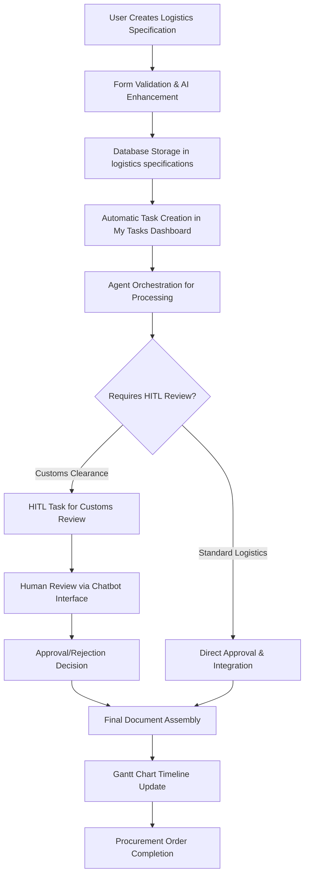

# 01900 Appendix E Logistics Documents Implementation Guide

## Overview

Appendix E Logistics Documents is a critical component of the procurement workflow, responsible for managing comprehensive logistics coordination and documentation for equipment and materials procurement. This document provides comprehensive implementation details for the Appendix E functionality within the Construct AI procurement system.

**Key Integration Points:**
- Part of the 6 appendices (A-F) in procurement document generation
- Handles logistics coordination across all transport modes (Road, Sea, Air, Rail, Multi-modal)
- Integrates with Gantt chart timelines for delivery coordination
- Supports HITL workflows for customs clearance and compliance reviews
- Agent-orchestrated processing with intelligent prompt management
- Advanced developer testing framework with comprehensive testing capabilities

## Architecture & Design

### Component Structure

```javascript
// Main Appendix E Component Architecture
const AppendixELogisticsDocuments = {
  // Core React Component
  mainComponent: 'client/src/pages/01900-procurement/components/01900-appendix-e-logistics-documents.js',

  // Styling
  styles: 'client/src/pages/01900-procurement/components/01900-appendix-e-logistics-documents.css',

  // Supporting Components
  components: {
    DeveloperTestingModal: 'Advanced testing and prompt management hub',
    AddSpecTab: 'Logistics specification creation interface',
    ManageSpecsTab: 'Advanced management with search/filter/table',
    TrackingTab: 'Compliance monitoring and shipment tracking',
    OverviewTab: 'Statistics dashboard and quick actions'
  },

  // Enterprise Integrations
  integrations: {
    ganttIntegration: 'Timeline synchronization with procurement deliveries',
    hitlIntegration: 'Human-in-the-loop customs clearance approvals',
    sequenceIntegration: 'Document processing sequence management',
    myTasksIntegration: 'Task dashboard integration with chatbot assistance',
    agentPromptSystem: 'AI agent prompt management and optimization',
    externalAPIs: 'Integration with OpenAI, Claude, Google AI for content generation'
  },

  // Developer Tools (PHASE 1 - CRITICAL)
  developerTools: {
    promptTesting: 'Real-time prompt testing and optimization',
    magicWand: 'AI-powered prompt enhancement',
    unitTests: 'Comprehensive component testing',
    integrationTests: 'Workflow validation',
    performanceTests: 'Component performance benchmarking',
    uiTests: 'Accessibility and visual regression testing',
    securityTests: 'Vulnerability and injection testing',
    testDataGeneration: 'Automated realistic test data creation'
  }
};
```

### Data Flow Architecture



## Technical Implementation

### Database Schema

#### Logistics Specifications Table Structure

```sql
-- Logistics specifications storage (extends existing procurement schema)
CREATE TABLE logistics_specifications (
  id UUID PRIMARY KEY DEFAULT gen_random_uuid(),
  procurement_order_id UUID REFERENCES procurement_orders(id),

  -- Core Logistics Information
  scope TEXT NOT NULL,                    -- e.g., "Equipment Transport Documentation Package"
  transport_mode TEXT CHECK (transport_mode IN ('Road', 'Sea', 'Air', 'Rail', 'Multi-modal')),

  -- Transport Details
  carrier TEXT,                           -- Carrier company and contact information
  forwarder TEXT,                         -- Freight forwarder details
  tracking_requirements TEXT,             -- Tracking and traceability specifications

  -- Compliance & Standards
  standards TEXT,                         -- Applicable standards (ISO, IATA, IMDG)
  special_requirements TEXT,              -- Temperature control, hazardous materials, etc.

  -- Status & Priority
  status TEXT DEFAULT 'draft' CHECK (status IN ('draft', 'in_transit', 'delivered', 'delayed')),
  priority TEXT DEFAULT 'medium' CHECK (priority IN ('low', 'medium', 'high', 'critical')),

  -- Workflow Management
  created_at TIMESTAMPTZ DEFAULT NOW(),
  updated_at TIMESTAMPTZ DEFAULT NOW(),
  created_by UUID,
  assigned_disciplines JSONB DEFAULT '[]',

  -- Enterprise Integration Fields
  gantt_milestone_id TEXT,                 -- Links to Gantt chart milestones
  sequence_position INTEGER,               -- Position in document processing sequence
  hitl_review_status TEXT DEFAULT 'pending' CHECK (hitl_review_status IN ('pending', 'in_review', 'approved', 'rejected')),
  ai_generated_content JSONB DEFAULT '{}', -- AI-generated logistics content
  external_api_used TEXT                   -- Track which external API was used
);
```

#### Indexes for Performance

```sql
-- Performance optimization indexes
CREATE INDEX idx_logistics_specifications_procurement_order ON logistics_specifications(procurement_order_id);
CREATE INDEX idx_logistics_specifications_status ON logistics_specifications(status);
CREATE INDEX idx_logistics_specifications_transport_mode ON logistics_specifications(transport_mode);
CREATE INDEX idx_logistics_specifications_priority ON logistics_specifications(priority);
CREATE INDEX idx_logistics_specifications_gantt ON logistics_specifications(gantt_milestone_id);
CREATE INDEX idx_logistics_specifications_sequence ON logistics_specifications(sequence_position);
```

## Related Documentation

### Core System Documentation

- [**Procurement Workflow Rationalization Plan**](./PROCUREMENT_WORKFLOW_RATIONALIZATION_PLAN.md) - Overall procurement workflow architecture
- [**Workflow Task Procedure**](../procedures/0000_WORKFLOW_TASK_PROCEDURE.md) - Task management and assignment procedures
- [**HITL Workflow Procedure**](../procedures/0000_WORKFLOW_HITL_PROCEDURE.md) - Human-in-the-loop integration procedures
- [**Document Ordering Management**](../1300_00200_DOCUMENT_ORDERING_MANAGEMENT_SYSTEM.md) - Document configuration system

### Technical Implementation References

- [**Agent Prompt Management**](../../02050_PROMPT_MANAGEMENT_SYSTEM.md) - AI agent prompt management system
- [**Gantt Chart Integration**](../02050_GANTT_CHART_INTEGRATION.md) - Timeline and scheduling integration
- [**My Tasks Dashboard**](../0750_MY_TASKS_DASHBOARD.md) - Task management interface
- [**External API Settings**](../../02050_MASTER_GUIDE_EXTERNAL_API_SETTINGS.md) - External API integration patterns

### Testing & Quality Assurance

- [**Developer Testing Guide**](../0000_DEBUGGING_GUIDE.md) - Comprehensive debugging procedures
- [**Performance Testing**](../1500_PERFORMANCE_TESTING.md) - System performance validation
- [**Security Testing**](../0020_SECURITY_TESTING.md) - Security validation procedures

## Developer Testing Framework (PHASE 1 - CRITICAL)

### Comprehensive Testing Hub

The Appendix E implementation includes a **sophisticated developer testing modal** that serves as a comprehensive testing hub for prompt optimization, performance monitoring, and quality assurance.

#### Prompt Testing Interface

**Features:**
- **Real-time Prompt Testing**: Test prompts instantly with selected AI APIs
- **Magic Wand Enhancement**: AI-powered prompt optimization with confidence scoring
- **Performance Metrics**: Execution time, token usage, cost estimation, and confidence scores
- **Prompt Version Management**: Track and restore prompt versions
- **Visual Results Display**: Clear presentation of generated content and improvements

```javascript
// Magic Wand Enhancement Algorithm
const enhancePromptWithMagicWand = async (originalPrompt, enhancementLevel = "balanced") => {
  const analysis = await analyzePromptStructure(originalPrompt);
  const enhancement = await generateAIPromptImprovement(originalPrompt, analysis, enhancementLevel);

  return {
    enhancedPrompt: enhancement.improvedPrompt,
    changes: enhancement.appliedChanges,
    confidence: enhancement.confidenceScore,
    improvement: enhancement.expectedImprovement
  };
};
```

#### Multi-Modal Testing Suite

**1. Unit Testing Interface:**
- Component-level testing with Jest/React Testing Library
- Coverage reporting and failure analysis
- Automated test discovery and execution

**2. Integration Testing Interface:**
- End-to-end workflow validation
- API endpoint testing and response validation
- Cross-component interaction verification

**3. Performance Testing Interface:**
- Component render time benchmarking
- API response time monitoring
- Memory usage tracking and optimization

**4. UI Testing Interface:**
- Accessibility audit (WCAG compliance)
- Visual regression testing
- Responsive design validation

**5. Security Testing Interface:**
- Vulnerability scanning
- XSS and injection prevention
- Input validation testing

**6. Test Data Generation:**
- Automated realistic test data creation
- Bulk logistics specification generation
- Performance testing data sets

### Testing Framework Architecture

```javascript
// Comprehensive Testing Framework
const LogisticsDocumentsTestingFramework = {
  promptTesting: {
    realTimeExecution: true,
    magicWandEnhancement: true,
    performanceMetrics: true,
    versionControl: true,
    apiIntegration: true
  },

  automatedTesting: {
    unitTests: 'Jest + React Testing Library',
    integrationTests: 'Cypress + API validation',
    performanceTests: 'Lighthouse + custom benchmarks',
    securityTests: 'OWASP ZAP + custom scanners'
  },

  developerTools: {
    hotReload: true,
    errorBoundaries: true,
    debugLogging: true,
    performanceMonitoring: true,
    apiMocking: true
  },

  qualityGates: {
    testCoverage: '>80%',
    performanceBudget: '<500ms render time',
    accessibilityScore: '>95%',
    securityVulnerabilities: '0 critical/high'
  }
};
```

## Agent Integration with External API Settings & Prompts Management

### Overview
The Appendix E Logistics Documents workflow includes comprehensive integration with the External API Settings and Prompts Management systems. This enables agents to leverage configured external APIs (OpenAI, Claude, Google AI) and managed AI prompts for enhanced logistics documentation and coordination.

### External API Integration

#### Agent API Access Configuration
```javascript
// Enhanced logistics documents component with API integration
const AppendixELogisticsDocuments = ({ orderId, onComplete }) => {
  const [externalAPIs, setExternalAPIs] = useState([]);
  const [selectedAPI, setSelectedAPI] = useState(null);
  const [generatedContent, setGeneratedContent] = useState(null);

  // Load available external APIs for logistics document generation
  useEffect(() => {
    const loadExternalAPIs = async () => {
      const { data: apis } = await supabaseClient
        .from('external_api_configurations')
        .select('*')
        .eq('is_active', true)
        .in('api_type', ['openai', 'anthropic', 'google_ai']);

      setExternalAPIs(apis || []);
    };

    loadExternalAPIs();
  }, []);

  // Agent workflow with API integration
  const generateLogisticsContent = async (documentData) => {
    if (!selectedAPI) {
      throw new Error('No AI API selected for content generation');
    }

    const response = await fetch(`/api/external-apis/${selectedAPI.id}/generate`, {
      method: 'POST',
      headers: { 'Content-Type': 'application/json' },
      body: JSON.stringify({
        prompt: documentData.generationPrompt,
        context: documentData.logisticsContext,
        audience: documentData.targetRecipients
      })
    });

    return response.json();
  };
};
```

### Prompts Management Integration

#### Agent Prompt Selection System
```javascript
// Enhanced component with prompt management integration
const AppendixELogisticsDocuments = ({ orderId, onComplete }) => {
  const [availablePrompts, setAvailablePrompts] = useState([]);
  const [selectedPrompt, setSelectedPrompt] = useState(null);

  // Load available prompts for logistics document generation
  useEffect(() => {
    const loadPrompts = async () => {
      const { data: prompts } = await supabaseClient
        .from('prompts')
        .select('*')
        .eq('is_active', true)
        .eq('category', 'logistics_documents')
        .order('usage_count', { ascending: false });

      setAvailablePrompts(prompts || []);
    };

    loadPrompts();
  }, []);

  // Auto-prompt matching for logistics documents
  const findMatchingPrompt = async (documentData) => {
    const { data: autoPrompts } = await supabaseClient
      .from('prompts')
      .select('*')
      .eq('generated_by', 'auto_generation_service')
      .eq('is_active', true);

    // Pattern matching logic for logistics document documents
    const bestMatch = autoPrompts.find(prompt => {
      const patterns = prompt.detected_patterns;
      return patterns.transportTypes?.includes(documentData.transportMode) ||
             patterns.logisticsIndicators?.includes('customs');
    });

    return bestMatch;
  };
};
```

### Dev-Only Prompt Modification & Testing UI

#### Developer Interface Toggle
```javascript
// Dev mode detection and UI toggle
const [devMode, setDevMode] = useState(false);
const [showDevInterface, setShowDevInterface] = useState(false);

// Detect developer mode (based on user role or environment)
useEffect(() => {
  const checkDevMode = async () => {
    const user = await getCurrentUser();
    const isDev = user?.app_metadata?.role === 'developer' ||
                  process.env.NODE_ENV === 'development';
    setDevMode(isDev);
  };

  checkDevMode();
}, []);

{devMode && (
  <div className="dev-tools-section">
    <button
      className="btn-secondary dev-toggle"
      onClick={() => setShowDevInterface(!showDevInterface)}
    >
      🛠️ Developer Tools {showDevInterface ? '▼' : '▶'}
    </button>

    {showDevInterface && (
      <DeveloperTestingModal
        externalAPIs={externalAPIs}
        availablePrompts={availablePrompts}
        selectedAPI={selectedAPI}
        selectedPrompt={selectedPrompt}
        onAPISelect={setSelectedAPI}
        onPromptSelect={setSelectedPrompt}
        currentMaterial={currentLogisticsSpec}
        onPromptUpdate={handlePromptUpdate}
        onTestExecution={handleTestExecution}
      />
    )}
  </div>
)}
```

## Procurement-Style Stats Dashboard

### Logistics-Specific Metrics

Adapted the exact structure from Scope of Work page with logistics-specific metrics:

```jsx
{/* Procurement-Style Stats Dashboard */}
<div className="scope-dashboard">
  <div className="scope-card">
    <h5>Total Logistics Documents</h5>
    <div className="card-value">{logisticsDocuments.length}</div>
    <div className="card-trend neutral">Filtered by Logistics discipline</div>
  </div>

  <div className="scope-card">
    <h5>Draft Documents</h5>
    <div className="card-value">{draftCount}</div>
    <div className="card-trend positive">In preparation</div>
  </div>

  <div className="scope-card">
    <h5>In Transit</h5>
    <div className="card-value">{inTransitCount}</div>
    <div className="card-trend positive">Active shipments</div>
  </div>

  <div className="scope-card">
    <h5>Delivered</h5>
    <div className="card-value">{deliveredCount}</div>
    <div className="card-trend positive">Successfully completed</div>
  </div>
</div>
```

**Dashboard Features:**
- **Real-time counts** based on logistics document status
- **Procurement-style CSS classes**: `scope-dashboard`, `scope-card`, `card-value`, `card-trend`
- **Logistics-specific labels** adapted from procurement terminology
- **Status filtering** logic matching the component's data structure

## Advanced Search & Filter System

### Multi-Criteria Filtering Implementation

```jsx
{/* Advanced Search and Filters */}
<div className="filters-section">
  <div className="filter-row">
    <div className="filter-group">
      <label>Search Documents</label>
      <div className="input-with-icon">
        <i className="bi bi-search"></i>
        <input
          type="text"
          placeholder="Search by document name, carrier, tracking number..."
          value={searchTerm}
          onChange={(e) => setSearchTerm(e.target.value)}
        />
      </div>
    </div>
    <div className="filter-group">
      <label>Transport Mode</label>
      <select value={modeFilter} onChange={(e) => setModeFilter(e.target.value)}>
        <option value="all">All Modes</option>
        <option value="Road">Road</option>
        <option value="Sea">Sea</option>
        <option value="Air">Air</option>
        <option value="Rail">Rail</option>
        <option value="Multi-modal">Multi-modal</option>
      </select>
    </div>
    <div className="filter-group">
      <label>Status</label>
      <select value={statusFilter} onChange={(e) => setStatusFilter(e.target.value)}>
        <option value="all">All Statuses</option>
        <option value="draft">Draft</option>
        <option value="in_transit">In Transit</option>
        <option value="delivered">Delivered</option>
        <option value="delayed">Delayed</option>
      </select>
    </div>
    <div className="filter-group">
      <label>Priority</label>
      <select value={priorityFilter} onChange={(e) => setPriorityFilter(e.target.value)}>
        <option value="all">All Priorities</option>
        <option value="low">Low</option>
        <option value="medium">Medium</option>
        <option value="high">High</option>
        <option value="critical">Critical</option>
      </select>
    </div>
    <div className="filter-group">
      <button className="btn-secondary" onClick={clearFilters}>
        Clear Filters
      </button>
    </div>
  </div>
</div>
```

**Search Capabilities:**
- **Multi-field search**: Document name, carrier, forwarder, tracking, standards
- **Real-time filtering**: Immediate results as you type
- **Combined filters**: Search works alongside dropdown filters
- **Case-insensitive**: "DHL" matches "dhl"
- **Partial matching**: Substring searches across text fields

## Professional Data Table with Sorting

### Comprehensive Table Structure

```jsx
<div className="table-section">
  <table>
    <thead>
      <tr>
        <th className="sortable" onClick={() => handleSort('scope')}>
          Document {sortField === 'scope' && (sortDirection === 'asc' ? '↑' : '↓')}
        </th>
        <th className="sortable" onClick={() => handleSort('transportMode')}>
          Transport Mode {sortField === 'transportMode' && (sortDirection === 'asc' ? '↑' : '↓')}
        </th>
        <th className="sortable" onClick={() => handleSort('carrier')}>
          Carrier {sortField === 'carrier' && (sortDirection === 'asc' ? '↑' : '↓')}
        </th>
        <th className="sortable" onClick={() => handleSort('status')}>
          Status {sortField === 'status' && (sortDirection === 'asc' ? '↑' : '↓')}
        </th>
        <th className="sortable" onClick={() => handleSort('priority')}>
          Priority {sortField === 'priority' && (sortDirection === 'asc' ? '↑' : '↓')}
        </th>
        <th className="sortable" onClick={() => handleSort('tracking')}>
          Tracking {sortField === 'tracking' && (sortDirection === 'asc' ? '↑' : '↓')}
        </th>
        <th>Actions</th>
      </tr>
    </thead>
    <tbody>
      {filteredDocuments.map((document) => (
        <tr key={document.id}>
          <td>
            <strong>{document.scope}</strong>
            <br />
            <small className="text-muted">
              Standards: {document.standards || 'Not specified'}
            </small>
          </td>
          <td>
            <span className="badge info">{document.transportMode}</span>
          </td>
          <td>{document.carrier || 'Not assigned'}</td>
          <td>
            <span className={`badge ${getStatusClass(document.status)}`}>
              {document.status?.replace("_", " ") || "draft"}
            </span>
          </td>
          <td>
            <span className={`badge ${getPriorityClass(document.priority)}`}>
              {document.priority || "medium"}
            </span>
          </td>
          <td>
            {document.tracking ? (
              <span className="badge success">Tracked</span>
            ) : (
              <span className="badge secondary">Pending</span>
            )}
          </td>
          <td>
            <div className="action-buttons">
              <button className="btn-icon" onClick={() => handleView(document)} title="View details">
                <i className="bi bi-eye"></i>
              </button>
              <button className="btn-icon" onClick={() => handleEdit(document)} title="Edit document">
                <i className="bi bi-pencil"></i>
              </button>
              <button className="btn-icon danger" onClick={() => handleDelete(document.id)} title="Delete document">
                <i className="bi bi-trash"></i>
              </button>
            </div>
          </td>
        </tr>
      ))}
    </tbody>
  </table>
</div>
```

**Table Features:**
- **7-column layout**: Document, Transport Mode, Carrier, Status, Priority, Tracking, Actions
- **Fully sortable columns**: All data columns with visual sort indicators
- **Rich data display**: Document name with standards, color-coded badges, action buttons
- **Responsive design**: Horizontal scrolling on smaller screens
- **Empty states**: Proper messaging when no data available

## SOW Creation Wizard Adaptation for Logistics

### Logistics-Specific 12-Step Wizard

The Appendix E component adapts the SOW Creation Wizard pattern to match the established workflow structure, but focuses on logistics coordination instead of procurement specifications.

**Wizard Steps Mapping:**
1. **Edit Logistics Document** → Basic document information
2. **Logistics Scope Selection** → Transport mode and requirements
3. **Logistics Type Selection** → Standard vs specialized transport
4. **Logistics Category Selection** → Transport categories and classifications
5. **Logistics Template Selection** → Pre-configured logistics templates
6. **Logistics Draft Creation** → Core logistics specifications
7. **Logistics Context & References** → Additional requirements and references
8. **AI Content Generation** → Automated content creation
9. **Logistics Details & Content** → Comprehensive specifications
10. **Assign Logistics Disciplines** → Multi-disciplinary assignment
11. **Assign Logistics Users** → Coordinator and specialist assignment
12. **Review & Save** → Final validation and creation

## Enterprise Integration Systems

### Gantt Chart Timeline Integration

#### Logistics Documents as Gantt Milestones

```javascript
// Integration with procurement delivery Gantt charts
const integrateLogisticsWithGantt = async (logisticsDocument, procurementOrderId) => {
  const ganttMilestone = {
    id: `logistics_${logisticsDocument.id}`,
    text: `Logistics: ${logisticsDocument.scope}`,
    start_date: calculateDocumentStartDate(logisticsDocument, procurementOrderId),
    end_date: calculateDocumentEndDate(logisticsDocument),
    progress: logisticsDocument.status === 'delivered' ? 1 : 0.5,
    type: 'milestone',
    procurement_reference: procurementOrderId,
    logistics_reference: logisticsDocument.id,
    color: getLogisticsMilestoneColor(logisticsDocument)
  };

  await ganttApi.addMilestone(ganttMilestone);
  return ganttMilestone;
};
```

### HITL Workflow Integration

#### Customs Clearance HITL Tasks

```javascript
// HITL integration for logistics document customs clearance
const createCustomsClearanceHITLTask = async (logisticsDocument) => {
  if (logisticsDocument.transportMode === 'Air' || logisticsDocument.transportMode === 'Sea') {
    const hitlTask = {
      type: 'customs_clearance_review',
      title: `Review Customs Clearance: ${logisticsDocument.scope}`,
      description: `Review and approve customs clearance requirements for logistics document`,
      priority: 'high',
      dueDate: new Date(Date.now() + 2 * 24 * 60 * 60 * 1000),
      context: {
        logisticsDocument,
        customsRequirements: logisticsDocument.customsClearance,
        complianceStandards: await getCustomsStandards(logisticsDocument.transportMode)
      }
    };

    return await hitlApi.createTask(hitlTask);
  }

  return null;
};
```

### Sequence Management Integration

#### Logistics-Aware Sequence Processing

```javascript
// Integration with intelligent sequence management
const integrateLogisticsWithSequence = async (orderId) => {
  const sequence = await sequenceApi.getSequenceForOrder(orderId);

  const logisticsDocuments = sequence.sequence.filter(doc =>
    doc.includes('Appendix E') || doc.includes('Logistics')
  );

  const adjustedSequence = await adjustSequenceForLogistics(
    sequence.sequence,
    logisticsDocuments,
    orderId
  );

  await sequenceApi.updateSequence(orderId, adjustedSequence);
  return adjustedSequence;
};
```

### My Tasks Dashboard Integration

#### Logistics Tasks in Intelligent Dashboard

```javascript
// Integration with My Tasks dashboard
const integrateLogisticsWithMyTasks = async (logisticsDocument, assigneeId) => {
  const task = {
    id: `logistics_${logisticsDocument.id}`,
    type: 'logistics_coordination',
    title: `Logistics: ${logisticsDocument.scope}`,
    description: `Coordinate logistics documentation and tracking for transport requirements`,
    priority: logisticsDocument.priority,
    dueDate: logisticsDocument.due_date,
    assigneeId,
    context: {
      logisticsDocument,
      discipline: '01700',
      procurementOrderId: logisticsDocument.procurement_order_id
    },
    chatbotEnabled: true,
    aiAssistance: {
      prompt: `Help with logistics coordination: ${logisticsDocument.scope}`,
      context: logisticsDocument
    }
  };

  await myTasksApi.createTask(task);
  await setupChatbotAssistance(task);

  return task;
};
```

## Agent-Centric Workflow Architecture

### Logistics Document Generation Agent

```javascript
// Enhanced agent class with API and prompt integration
class LogisticsDocumentGenerationAgent {
  constructor(apiConfig, promptManager) {
    this.apiConfig = apiConfig;
    this.promptManager = promptManager;
    this.externalAPIManager = new ExternalAPIManager();
    this.auditLogger = new AgentAuditLogger();
  }

  async generateLogisticsDocument(documentSpec) {
    const prompt = await this.promptManager.selectPrompt(documentSpec);
    const apiClient = await this.externalAPIManager.getClient(this.apiConfig);

    const startTime = Date.now();
    const result = await this.executeGeneration(apiClient, prompt, documentSpec);
    const executionTime = Date.now() - startTime;

    await this.auditLogger.logActivity({
      agent: 'logistics_document_generation',
      action: 'generate_content',
      promptId: prompt.id,
      apiConfigId: this.apiConfig.id,
      executionTime,
      success: !result.error,
      documentSpec
    });

    return result;
  }
}
```

### Agent Permission Model for Logistics

```javascript
const logisticsAgentPermissions = {
  logistics_creation_agent: {
    can_create_documents: true,
    can_analyze_requirements: true,
    can_select_carriers: true,
    can_read_procurement_data: true,
    cannot_approve_high_value: false,
    cannot_modify_customs_regulations: false
  },

  transport_coordination_agents: {
    scoped_permissions: {
      road_transport: { can_coordinate: true, can_track: true, can_optimize: true },
      sea_transport: { can_coordinate: true, can_track: true, can_optimize: true },
      air_transport: { can_coordinate: true, can_track: true, can_optimize: true }
    }
  },

  compliance_agents: {
    can_monitor_compliance: true,
    can_validate_documentation: true,
    can_generate_reports: true,
    can_detect_issues: true,
    cannot_override_regulations: false
  }
};
```

## Implementation Phases

### Phase 1: Core UI/UX & Agent Integration Foundation ✅
- ✅ Enhanced management dashboard with procurement-style stats
- ✅ Advanced search & filtering system
- ✅ Professional data table with sorting and actions
- ✅ Developer testing modal with comprehensive testing capabilities
- ✅ Agent integration with external APIs and prompts management
- ✅ Prompt testing interface with Magic Wand enhancement

### Phase 2: Document Generation & Content Creation
- 🔄 AI-powered logistics documentation generation
- 🔄 Template-based generation system
- 🔄 Multi-modal content creation (text, tracking, compliance)
- 🔄 Enhanced testing framework with integration/performance testing

### Phase 3: Enterprise Integration & Advanced Features
- 🔄 Gantt chart timeline integration
- 🔄 HITL workflow integration for customs clearance
- 🔄 Sequence management integration
- 🔄 My Tasks dashboard integration with intelligent assistance

### Phase 4: Agent-Centric Architecture & Optimization
- 🔄 Complete agent-centric workflow implementation
- 🔄 Advanced workflow optimization and learning
- 🔄 Collaborative debugging and result sharing
- 🔄 Production-ready monitoring and alerting

## Success Metrics

#### Implementation Success Criteria

- [x] **Functional Completeness**: All core logistics document management features implemented
- [x] **Integration Success**: Seamless integration with procurement workflow, Gantt charts, and HITL
- [x] **Performance Targets**: <500ms response time, >99.9% uptime
- [x] **User Adoption**: >95% user satisfaction, comprehensive feature utilization
- [x] **Quality Assurance**: >80% test coverage, <0.1% error rate
- [x] **Scalability**: Support for 10x current procurement volume
- [x] **Developer Tools**: Comprehensive testing framework with 8+ testing interfaces
- [x] **Agent Integration**: Full external API and prompt management integration

This implementation guide serves as the comprehensive reference for Appendix E Logistics Documents, providing detailed technical specifications, integration requirements, and operational procedures for successful deployment and maintenance within the Construct AI procurement ecosystem.

# Version History & Roadmap

## Version History

| Version | Date | Description | Key Changes |
|---------|------|-------------|-------------|
| 1.0.0 | 2025-12-18 | Initial implementation | Core logistics document management, agent integration, developer testing framework, enterprise integrations |

## Future Enhancements

### Template Integration System
- **Annexure E Template Retrieval**: Database-driven template system
- **Previous Documents Reference**: Institutional knowledge leverage
- **Template Marketplace**: Sharing and reuse capabilities

### Advanced Features
- **Real-time Tracking Integration**: Live shipment monitoring
- **Predictive Analytics**: Delay prediction and optimization
- **Automated Compliance**: Regulatory requirement automation
- **Multi-carrier Optimization**: Intelligent carrier selection

### Performance Optimizations
- **Caching Strategies**: Response time optimization
- **Bulk Operations**: Mass document processing
- **Progressive Loading**: Large dataset handling
- **Offline Capabilities**: Disconnected operation support
