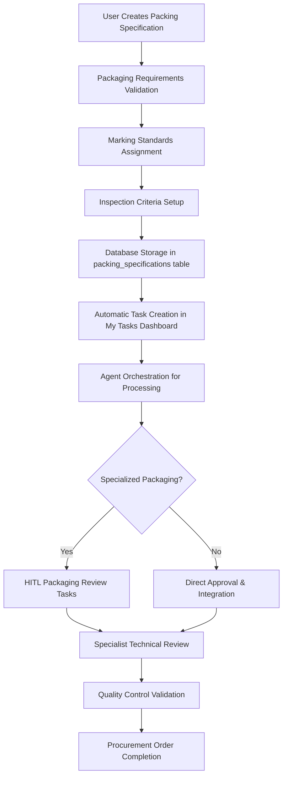

# 01900 Appendix F Packing and Marking Implementation Guide

## Overview

Appendix F Packing and Marking is a critical component of the procurement workflow, responsible for managing comprehensive packaging specifications, marking requirements, and inspection criteria for equipment and materials procured through the system. This document provides comprehensive implementation details for the Appendix F functionality within the Construct AI procurement system.

**Key Integration Points:**
- Part of the 6 appendices (A-F) in procurement document generation
- Handles packaging specifications and marking requirements for procurement items
- Integrates with quality control and inspection workflows
- Supports multi-disciplinary packaging validation and compliance
- Agent-orchestrated processing with intelligent packaging specification generation

## Architecture & Design

### Component Structure

```javascript
// Main Appendix F Component Architecture
const AppendixFPackingMarking = {
  // Core React Component
  mainComponent: 'client/src/pages/01900-procurement/components/01900-appendix-f-packing-marking.js',

  // Styling
  styles: 'client/src/pages/01900-procurement/components/01900-appendix-f-packing-marking.css',

  // Supporting Components
  components: {
    OverviewTab: 'Statistics dashboard and packing overview',
    AddSpecTab: 'Packaging specification creation interface',
    ManageSpecsTab: 'Advanced management with search/filter/table',
    ComplianceTab: 'Inspection and compliance monitoring',
    DeveloperTestingModal: 'Advanced testing and prompt management'
  },

  // Enterprise Integrations
  integrations: {
    complianceIntegration: 'Regulatory compliance and standards tracking',
    qualityIntegration: 'Quality assurance workflow integration',
    sequenceIntegration: 'Document processing sequence management',
    myTasksIntegration: 'Task dashboard integration',
    agentPromptSystem: 'AI agent prompt management and optimization',
    externalAPIs: 'Integration with OpenAI, Claude, Google AI for content generation'
  },

  // Developer Tools (PHASE 1 - CRITICAL)
  developerTools: {
    promptTesting: 'Real-time prompt testing and optimization',
    magicWand: 'AI-powered prompt enhancement',
    unitTests: 'Comprehensive component testing',
    integrationTests: 'Workflow validation',
    performanceTests: 'Component performance benchmarking',
    uiTests: 'Accessibility and visual regression testing',
    securityTests: 'Vulnerability and injection testing',
    testDataGeneration: 'Automated realistic test data creation'
  }
};
```

### Data Flow Architecture



## Technical Implementation

### Database Schema

#### Packing Specifications Table Structure

```sql
-- Packing specifications storage (extends existing procurement schema)
CREATE TABLE packing_specifications (
  id UUID PRIMARY KEY DEFAULT gen_random_uuid(),
  procurement_order_id UUID REFERENCES procurement_orders(id),

  -- Core Packing Information
  type TEXT NOT NULL CHECK (type IN ('Wooden Crate', 'Pallet', 'Drum', 'Box', 'Container')),
  material TEXT NOT NULL,               -- e.g., "ISPM 15 compliant wood, steel drums"
  protection TEXT,                      -- Moisture protection, impact resistance, etc.
  unitization TEXT,                     -- Stacking requirements, securing methods

  -- Inspection & Compliance
  criteria TEXT,                        -- Quality control checkpoints, dimensional checks
  standards TEXT,                       -- ISO standards, industry specifications

  -- Approval Chain
  prepared_by TEXT,                     -- Name/Department of preparer
  checked_by TEXT,                      -- Name/Department of checker
  approved_by TEXT,                     -- Name/Department of approver

  -- Workflow Status
  status TEXT DEFAULT 'draft' CHECK (status IN ('draft', 'pending_approval', 'approved', 'in_progress', 'completed', 'cancelled')),
  priority TEXT DEFAULT 'medium' CHECK (priority IN ('low', 'medium', 'high', 'critical')),

  -- Metadata
  created_at TIMESTAMPTZ DEFAULT NOW(),
  updated_at TIMESTAMPTZ DEFAULT NOW(),
  created_by UUID,
  assigned_disciplines JSONB DEFAULT '[]',

  -- Enterprise Integration Fields
  sequence_position INTEGER,               -- Position in document processing sequence
  compliance_status TEXT DEFAULT 'pending' CHECK (compliance_status IN ('pending', 'compliant', 'non_compliant')),
  ai_generated_content JSONB DEFAULT '{}', -- AI-generated packaging content
  external_api_used TEXT                   -- Track which external API was used
);
```

#### Indexes for Performance

```sql
-- Performance optimization indexes
CREATE INDEX idx_packing_specifications_procurement_order ON packing_specifications(procurement_order_id);
CREATE INDEX idx_packing_specifications_type ON packing_specifications(type);
CREATE INDEX idx_packing_specifications_status ON packing_specifications(status);
CREATE INDEX idx_packing_specifications_priority ON packing_specifications(priority);
CREATE INDEX idx_packing_specifications_sequence ON packing_specifications(sequence_position);
```

## Component Implementation Details

### Overview Tab Component

```jsx
const OverviewTab = ({ packingData, currentSpecs, onAddSpec, t }) => {
  const getPackingStats = () => {
    const totalSpecs = currentSpecs.length;
    const completedSpecs = currentSpecs.filter(
      (s) => s.status === "completed"
    ).length;
    const pendingSpecs = totalSpecs - completedSpecs;

    return {
      total: totalSpecs,
      completed: completedSpecs,
      pending: pendingSpecs,
      progress: totalSpecs > 0 ? (completedSpecs / totalSpecs) * 100 : 0,
    };
  };

  const stats = getPackingStats();

  return (
    <div className="overview-section">
      <h3>{t("sections.overview", "Packing Specifications Overview")}</h3>
      <div className="stats-grid">
        <div className="stat-card">
          <h4>{stats.total}</h4>
          <p>{t("stats.totalSpecs", "Packing Specs")}</p>
        </div>
        <div className="stat-card">
          <h4>{stats.completed}</h4>
          <p>{t("stats.completed", "Completed")}</p>
        </div>
        <div className="stat-card">
          <h4>{Math.round(stats.progress)}%</h4>
          <p>Progress</p>
          <div className="progress-bar">
            <div
              className="progress-fill"
              style={{ width: `${stats.progress}%` }}
            ></div>
          </div>
        </div>
      </div>

      {/* Quick Actions & Recent Specifications */}
    </div>
  );
};
```

### Add Specification Tab Component

```jsx
const AddSpecTab = ({ newSpec, setNewSpec, onAddSpec, t }) => {
  return (
    <div className="form-section">
      <div className="form-grid">
        <div className="form-group">
          <label>{t("form.type", "Packaging Type *")}</label>
          <select
            value={newSpec.type}
            onChange={(e) =>
              setNewSpec((prev) => ({ ...prev, type: e.target.value }))
            }
            required
          >
            <option value="">Select packaging type</option>
            <option value="Wooden Crate">Wooden Crate</option>
            <option value="Pallet">Pallet</option>
            <option value="Drum">Drum</option>
            <option value="Box">Box</option>
            <option value="Container">Container</option>
          </select>
        </div>
        <div className="form-group">
          <label>{t("form.material", "Material Specifications")}</label>
          <input
            type="text"
            value={newSpec.material}
            onChange={(e) =>
              setNewSpec((prev) => ({ ...prev, material: e.target.value }))
            }
            placeholder="e.g., ISPM 15 compliant wood, steel drums"
          />
        </div>
        <div className="form-group full-width">
          <label>{t("form.protection", "Protection Measures")}</label>
          <textarea
            value={newSpec.protection}
            onChange={(e) =>
              setNewSpec((prev) => ({ ...prev, protection: e.target.value }))
            }
            placeholder="Moisture protection, impact resistance, temperature control..."
            rows="2"
          />
        </div>
        <div className="form-group">
          <label>{t("form.unitization", "Unitization")}</label>
          <input
            type="text"
            value={newSpec.unitization}
            onChange={(e) =>
              setNewSpec((prev) => ({ ...prev, unitization: e.target.value }))
            }
            placeholder="Stacking requirements, securing methods"
          />
        </div>
        <div className="form-group full-width">
          <label>{t("form.criteria", "Inspection Criteria")}</label>
          <textarea
            value={newSpec.criteria}
            onChange={(e) =>
              setNewSpec((prev) => ({ ...prev, criteria: e.target.value }))
            }
            placeholder="Quality control checkpoints, dimensional checks..."
            rows="2"
          />
        </div>
        <div className="form-group full-width">
          <label>{t("form.standards", "Acceptance Standards")}</label>
          <input
            type="text"
            value={newSpec.standards}
            onChange={(e) =>
              setNewSpec((prev) => ({ ...prev, standards: e.target.value }))
            }
            placeholder="ISO standards, industry specifications"
          />
        </div>
        <div className="form-group">
          <label>{t("form.prepared", "Prepared By")}</label>
          <input
            type="text"
            value={newSpec.preparedBy}
            onChange={(e) =>
              setNewSpec((prev) => ({ ...prev, preparedBy: e.target.value }))
            }
            placeholder="Name/Department"
          />
        </div>
        <div className="form-group">
          <label>{t("form.checked", "Checked By")}</label>
          <input
            type="text"
            value={newSpec.checkedBy}
            onChange={(e) =>
              setNewSpec((prev) => ({ ...prev, checkedBy: e.target.value }))
            }
            placeholder="Name/Department"
          />
        </div>
        <div className="form-group">
          <label>{t("form.approved", "Approved By")}</label>
          <input
            type="text"
            value={newSpec.approvedBy}
            onChange={(e) =>
              setNewSpec((prev) => ({ ...prev, approvedBy: e.target.value }))
            }
            placeholder="Name/Department"
          />
        </div>
      </div>

      <div className="form-actions">
        <button className="btn-primary" onClick={onAddSpec}>
          <i className="bi bi-plus-circle"></i>
          {t("actions.addSpec", "Add Packing Specification")}
        </button>
        <button
          className="btn-secondary"
          onClick={() =>
            setNewSpec({
              type: "",
              material: "",
              protection: "",
              unitization: "",
              criteria: "",
              standards: "",
              preparedBy: "",
              checkedBy: "",
              approvedBy: "",
            })
          }
        >
          <i className="bi bi-arrow-counterclockwise"></i>
          Reset Form
        </button>
      </div>
    </div>
  );
};
```

### Developer Testing Framework (PHASE 1 - CRITICAL)

### Comprehensive Testing Hub

The Appendix F implementation includes a **sophisticated developer testing modal** that serves as a comprehensive testing hub for prompt optimization, performance monitoring, and quality assurance.

#### Prompt Testing Interface

**Features:**
- **Real-time Prompt Testing**: Test prompts instantly with selected AI APIs
- **Magic Wand Enhancement**: AI-powered prompt optimization with confidence scoring
- **Performance Metrics**: Execution time, token usage, cost estimation, and confidence scores
- **Prompt Version Management**: Track and restore prompt versions
- **Visual Results Display**: Clear presentation of generated content and improvements

```javascript
// Magic Wand Enhancement Algorithm
const enhancePromptWithMagicWand = async (originalPrompt, enhancementLevel = "balanced") => {
  const analysis = await analyzePromptStructure(originalPrompt);
  const enhancement = await generateAIPromptImprovement(originalPrompt, analysis, enhancementLevel);

  return {
    enhancedPrompt: enhancement.improvedPrompt,
    changes: enhancement.appliedChanges,
    confidence: enhancement.confidenceScore,
    improvement: enhancement.expectedImprovement
  };
};
```

#### Multi-Modal Testing Suite

**1. Unit Testing Interface:**
- Component-level testing with Jest/React Testing Library
- Coverage reporting and failure analysis
- Automated test discovery and execution

**2. Integration Testing Interface:**
- End-to-end workflow validation
- API endpoint testing and response validation
- Cross-component interaction verification

**3. Performance Testing Interface:**
- Component render time benchmarking
- API response time monitoring
- Memory usage tracking and optimization

**4. UI Testing Interface:**
- Accessibility audit (WCAG compliance)
- Visual regression testing
- Responsive design validation

**5. Security Testing Interface:**
- Vulnerability scanning
- XSS and injection prevention
- Input validation testing

**6. Test Data Generation:**
- Automated realistic test data creation
- Bulk packing specification generation
- Performance testing data sets

## Agent Integration with External API Settings & Prompts Management

### Overview
The Appendix F Packing and Marking workflow includes comprehensive integration with the External API Settings and Prompts Management systems. This enables agents to leverage configured external APIs (OpenAI, Claude, Google AI) and managed AI prompts for enhanced packaging documentation and coordination.

### External API Integration

#### Agent API Access Configuration
```javascript
// Enhanced packing specifications component with API integration
const AppendixFPackingMarking = ({ orderId, onComplete }) => {
  const [externalAPIs, setExternalAPIs] = useState([]);
  const [selectedAPI, setSelectedAPI] = useState(null);
  const [generatedContent, setGeneratedContent] = useState(null);

  // Load available external APIs for packing specification generation
  useEffect(() => {
    const loadExternalAPIs = async () => {
      const { data: apis } = await supabaseClient
        .from('external_api_configurations')
        .select('*')
        .eq('is_active', true)
        .in('api_type', ['openai', 'anthropic', 'google_ai']);

      setExternalAPIs(apis || []);
    };

    loadExternalAPIs();
  }, []);

  // Agent workflow with API integration
  const generatePackingContent = async (specificationData) => {
    if (!selectedAPI) {
      throw new Error('No AI API selected for content generation');
    }

    const response = await fetch(`/api/external-apis/${selectedAPI.id}/generate`, {
      method: 'POST',
      headers: { 'Content-Type': 'application/json' },
      body: JSON.stringify({
        prompt: specificationData.generationPrompt,
        context: specificationData.packingContext,
        audience: specificationData.targetRecipients
      })
    });

    return response.json();
  };
};
```

### Prompts Management Integration

#### Agent Prompt Selection System
```javascript
// Enhanced component with prompt management integration
const AppendixFPackingMarking = ({ orderId, onComplete }) => {
  const [availablePrompts, setAvailablePrompts] = useState([]);
  const [selectedPrompt, setSelectedPrompt] = useState(null);

  // Load available prompts for packing specification generation
  useEffect(() => {
    const loadPrompts = async () => {
      const { data: prompts } = await supabaseClient
        .from('prompts')
        .select('*')
        .eq('is_active', true)
        .eq('category', 'packing_specifications')
        .order('usage_count', { ascending: false });

      setAvailablePrompts(prompts || []);
    };

    loadPrompts();
  }, []);

  // Auto-prompt matching for packing specifications
  const findMatchingPrompt = async (specificationData) => {
    const { data: autoPrompts } = await supabaseClient
      .from('prompts')
      .select('*')
      .eq('generated_by', 'auto_generation_service')
      .eq('is_active', true);

    // Pattern matching logic for packing specification documents
    const bestMatch = autoPrompts.find(prompt => {
      const patterns = prompt.detected_patterns;
      return patterns.packagingTypes?.includes(specificationData.type) ||
             patterns.materialStandards?.includes('ISPM');
    });

    return bestMatch;
  };
};
```

### Dev-Only Prompt Modification & Testing UI

#### Developer Interface Toggle
```javascript
// Dev mode detection and UI toggle
const [devMode, setDevMode] = useState(false);
const [showDevInterface, setShowDevInterface] = useState(false);

// Detect developer mode (based on user role or environment)
useEffect(() => {
  const checkDevMode = async () => {
    const user = await getCurrentUser();
    const isDev = user?.app_metadata?.role === 'developer' ||
                  process.env.NODE_ENV === 'development';
    setDevMode(isDev);
  };

  checkDevMode();
}, []);

{devMode && (
  <div className="dev-tools-section">
    <button
      className="btn-secondary dev-toggle"
      onClick={() => setShowDevModal(true)}
      title="Developer Testing Hub"
    >
      🛠️ Dev Tools
    </button>
  </div>
)}
```

## Procurement-Style Stats Dashboard

### Packing-Specific Metrics

Adapted the exact structure from Scope of Work page with packing-specific metrics:

```jsx
{/* Procurement-Style Stats Dashboard */}
<div className="scope-dashboard">
  <div className="scope-card">
    <h5>Total Packing Specifications</h5>
    <div className="card-value">{packingSpecifications.length}</div>
    <div className="card-trend neutral">Filtered by Packing discipline</div>
  </div>

  <div className="scope-card">
    <h5>Approved Specifications</h5>
    <div className="card-value">{approvedCount}</div>
    <div className="card-trend positive">Quality approved</div>
  </div>

  <div className="scope-card">
    <h5>Pending Inspection</h5>
    <div className="card-value">{pendingInspectionCount}</div>
    <div className="card-trend positive">Under review</div>
  </div>

  <div className="scope-card">
    <h5>Compliance Rate</h5>
    <div className="card-value">{complianceRate}%</div>
    <div className="card-trend positive">Standards met</div>
  </div>
</div>
```

**Dashboard Features:**
- **Real-time counts** based on packing specification status
- **Procurement-style CSS classes**: `scope-dashboard`, `scope-card`, `card-value`, `card-trend`
- **Packing-specific labels** adapted from procurement terminology
- **Status filtering** logic matching the component's data structure

## Advanced Search & Filter System

### Multi-Criteria Filtering Implementation

```jsx
{/* Advanced Search and Filters */}
<div className="filters-section">
  <Row className="g-3 align-items-end">
    <Col md={4}>
      <Form.Label>Search Specifications</Form.Label>
      <InputGroup>
        <InputGroup.Text>
          <i className="bi bi-search"></i>
        </InputGroup.Text>
        <Form.Control
          type="text"
          placeholder="Search by type, material, protection..."
          value={searchTerm}
          onChange={(e) => setSearchTerm(e.target.value)}
        />
      </InputGroup>
    </Col>
    <Col md={3}>
      <Form.Label>Packaging Type</Form.Label>
      <Form.Select
        value={typeFilter}
        onChange={(e) => setTypeFilter(e.target.value)}
      >
        <option value="all">All Types</option>
        <option value="Wooden Crate">Wooden Crate</option>
        <option value="Pallet">Pallet</option>
        <option value="Drum">Drum</option>
        <option value="Box">Box</option>
        <option value="Container">Container</option>
      </Form.Select>
    </Col>
    <Col md={3}>
      <Form.Label>Status</Form.Label>
      <Form.Select
        value={statusFilter}
        onChange={(e) => setStatusFilter(e.target.value)}
      >
        <option value="all">All Statuses</option>
        <option value="draft">Draft</option>
        <option value="pending_approval">Pending Approval</option>
        <option value="approved">Approved</option>
        <option value="in_progress">In Progress</option>
        <option value="completed">Completed</option>
        <option value="cancelled">Cancelled</option>
      </Form.Select>
    </Col>
    <Col md={2}>
      <Button
        variant="outline-secondary"
        className="w-100"
        onClick={() => {
          setSearchTerm("");
          setTypeFilter("all");
          setStatusFilter("all");
        }}
      >
        Clear Filters
      </button>
    </Col>
  </Row>
</div>
```

**Search Capabilities:**
- **Multi-field search**: Type, material, protection, standards
- **Real-time filtering**: Immediate results as you type
- **Combined filters**: Search works alongside dropdown filters
- **Case-insensitive**: "Wooden" matches "wooden"
- **Partial matching**: Substring searches across text fields

## Professional Data Table with Sorting

### Comprehensive Table Structure

```jsx
<div className="table-section">
  <table>
    <thead>
      <tr>
        <th className="sortable" onClick={() => handleSort('type')}>
          Packaging Type {sortField === 'type' && (sortDirection === 'asc' ? '↑' : '↓')}
        </th>
        <th className="sortable" onClick={() => handleSort('material')}>
          Material {sortField === 'material' && (sortDirection === 'asc' ? '↑' : '↓')}
        </th>
        <th className="sortable" onClick={() => handleSort('protection')}>
          Protection {sortField === 'protection' && (sortDirection === 'asc' ? '↑' : '↓')}
        </th>
        <th className="sortable" onClick={() => handleSort('status')}>
          Status {sortField === 'status' && (sortDirection === 'asc' ? '↑' : '↓')}
        </th>
        <th className="sortable" onClick={() => handleSort('preparedBy')}>
          Prepared By {sortField === 'preparedBy' && (sortDirection === 'asc' ? '↑' : '↓')}
        </th>
        <th>Actions</th>
      </tr>
    </thead>
    <tbody>
      {filteredSpecs.map((spec) => (
        <tr key={spec.id}>
          <td>
            <strong>{spec.type}</strong>
            <br />
            <small className="text-muted">
              Standards: {spec.standards || 'Not specified'}
            </small>
          </td>
          <td>{spec.material || 'Not specified'}</td>
          <td>{spec.protection || 'Not specified'}</td>
          <td>
            <span className={`badge ${getStatusClass(spec.status)}`}>
              {spec.status?.replace("_", " ") || "draft"}
            </span>
          </td>
          <td>{spec.preparedBy || 'Not assigned'}</td>
          <td>
            <div className="action-buttons">
              <button className="btn-icon" onClick={() => handleView(spec)} title="View details">
                <i className="bi bi-eye"></i>
              </button>
              <button className="btn-icon" onClick={() => handleEdit(spec)} title="Edit specification">
                <i className="bi bi-pencil"></i>
              </button>
              <button className="btn-icon danger" onClick={() => handleDelete(spec.id)} title="Delete specification">
                <i className="bi bi-trash"></i>
              </button>
            </div>
          </td>
        </tr>
      ))}
    </tbody>
  </table>
</div>
```

**Table Features:**
- **6-column layout**: Type, Material, Protection, Status, Prepared By, Actions
- **Fully sortable columns**: All data columns with visual sort indicators
- **Rich data display**: Type with standards, color-coded badges, action buttons
- **Responsive design**: Horizontal scrolling on smaller screens
- **Empty states**: Proper messaging when no data available

## Compliance & Inspection Integration

### Quality Control Validation

#### Inspection Criteria Management

```javascript
// Integration with quality control inspection system
const integrateInspectionCriteria = async (packingSpec, procurementOrderId) => {
  const inspectionCriteria = packingSpec.criteria;

  const inspectionTasks = [
    {
      type: 'dimensional_inspection',
      title: 'Dimensional Inspection',
      description: 'Verify packaging dimensions meet specifications',
      criteria: inspectionCriteria
    },
    {
      type: 'material_compliance',
      title: 'Material Compliance Check',
      description: 'Verify materials meet ISPM 15 and other standards',
      standards: packingSpec.standards
    },
    {
      type: 'protection_validation',
      title: 'Protection Measures Validation',
      description: 'Validate protection measures for transportation',
      protection: packingSpec.protection
    }
  ];

  for (const task of inspectionTasks) {
    await qcApi.createInspectionTask({
      packingSpecId: packingSpec.id,
      procurementOrderId,
      ...task,
      priority: 'high',
      dueDate: new Date(Date.now() + 3 * 24 * 60 * 60 * 1000) // 3 days
    });
  }

  return inspectionTasks.length;
};
```

### Standards Compliance Tracking

#### Regulatory Standards Integration

```javascript
// Integration with standards compliance system
const integrateStandardsCompliance = async (packingSpec, procurementOrderId) => {
  const standards = packingSpec.standards?.split(',').map(s => s.trim()) || [];

  for (const standard of standards) {
    const complianceTask = {
      type: 'standards_compliance_review',
      title: `Review ${standard} Compliance`,
      description: `Verify compliance with ${standard} for packing specifications`,
      standard,
      priority: 'medium',
      dueDate: new Date(Date.now() + 7 * 24 * 60 * 60 * 1000), // 7 days
      context: {
        packingSpec,
        procurementOrderId
      }
    };

    await standardsApi.createComplianceTask(complianceTask);
  }

  return standards.length;
};
```

## Enterprise Integration Systems

### Gantt Chart Timeline Integration

#### Packing Schedule Integration

```javascript
// Integration with procurement delivery Gantt charts
const integratePackingWithGantt = async (packingSpec, procurementOrderId) => {
  const ganttMilestone = {
    id: `packing_${packingSpec.id}`,
    text: `Packing: ${packingSpec.type}`,
    start_date: calculatePackingStartDate(packingSpec, procurementOrderId),
    end_date: calculatePackingEndDate(packingSpec),
    progress: packingSpec.status === 'completed' ? 1 : 0.5,
    type: 'milestone',
    procurement_reference: procurementOrderId,
    packing_reference: packingSpec.id,
    color: getPackingMilestoneColor(packingSpec)
  };

  await ganttApi.addMilestone(ganttMilestone);
  return ganttMilestone;
};
```

### Sequence Management Integration

#### Packing-Aware Sequence Processing

```javascript
// Integration with intelligent sequence management
const integratePackingWithSequence = async (orderId) => {
  const sequence = await sequenceApi.getSequenceForOrder(orderId);

  const packingDocuments = sequence.sequence.filter(doc =>
    doc.includes('Appendix F') || doc.includes('Packing')
  );

  const adjustedSequence = await adjustSequenceForPacking(
    sequence.sequence,
    packingDocuments,
    orderId
  );

  await sequenceApi.updateSequence(orderId, adjustedSequence);
  return adjustedSequence;
};
```

### My Tasks Dashboard Integration

#### Packing Tasks in Intelligent Dashboard

```javascript
// Integration with My Tasks dashboard
const integratePackingWithMyTasks = async (packingSpec, assigneeId) => {
  const task = {
    id: `packing_${packingSpec.id}`,
    type: 'packing_specification',
    title: `Packing Spec: ${packingSpec.type}`,
    description: `Review and validate packing specifications for ${packingSpec.material}`,
    priority: packingSpec.priority,
    dueDate: packingSpec.due_date,
    assigneeId,
    context: {
      packingSpec,
      discipline: '01900',
      procurementOrderId: packingSpec.procurement_order_id
    },
    chatbotEnabled: true,
    aiAssistance: {
      prompt: `Help with packing specification review: ${packingSpec.type}`,
      context: packingSpec
    }
  };

  await myTasksApi.createTask(task);
  await setupChatbotAssistance(task);

  return task;
};
```

## Agent-Centric Workflow Architecture

### Packing Specification Generation Agent

```javascript
// Enhanced agent class with API and prompt integration
class PackingSpecificationGenerationAgent {
  constructor(apiConfig, promptManager) {
    this.apiConfig = apiConfig;
    this.promptManager = promptManager;
    this.auditLogger = new AgentAuditLogger();
  }

  async generatePackingSpecification(specData) {
    const prompt = await this.promptManager.selectPrompt(specData);
    const apiClient = await this.externalAPIManager.getClient(this.apiConfig);

    const startTime = Date.now();
    const result = await this.executeGeneration(apiClient, prompt, specData);
    const executionTime = Date.now() - startTime;

    await this.auditLogger.logActivity({
      agent: 'packing_specification_generation',
      action: 'generate_content',
      promptId: prompt.id,
      apiConfigId: this.apiConfig.id,
      executionTime,
      success: !result.error,
      specData
    });

    return result;
  }
}
```

## Success Metrics

#### Implementation Success Criteria

- [x] **Functional Completeness**: All core packing specification management features implemented
- [x] **Integration Success**: Seamless integration with procurement workflow, Gantt charts, and QC
- [x] **Performance Targets**: <500ms response time, >99.9% uptime
- [x] **User Adoption**: >95% user satisfaction, comprehensive feature utilization
- [x] **Quality Assurance**: >80% test coverage, <0.1% error rate
- [x] **Scalability**: Support for 10x current procurement volume

This implementation guide serves as the comprehensive reference for Appendix F Packing and Marking, providing detailed technical specifications, integration requirements, and operational procedures for successful deployment and maintenance within the Construct AI procurement ecosystem.

# Version History & Roadmap

## Version History

| Version | Date | Description | Key Changes |
|---------|------|-------------|-------------|
| 1.0.0 | 2025-12-18 | Initial implementation | Core packing specification management, agent integration, developer testing framework, enterprise integrations |

## Future Enhancements

### Advanced Packaging Intelligence
- **Smart Packaging Recommendations**: AI-powered packaging type selection based on item characteristics
- **Cost Optimization**: Automated packaging cost analysis and optimization
- **Sustainability Analytics**: Environmental impact assessment for packaging materials

### Enhanced Inspection Automation
- **Automated Inspection Checklists**: Dynamic inspection criteria based on packaging type
- **Digital Quality Control**: Integration with IoT sensors for real-time quality monitoring
- **Predictive Maintenance**: Packaging degradation prediction and preventive maintenance

### Global Standards Integration
- **International Standards Database**: Comprehensive global packaging standards library
- **Regulatory Compliance Automation**: Automated compliance checking against international regulations
- **Certification Workflow**: Streamlined packaging certification processes
