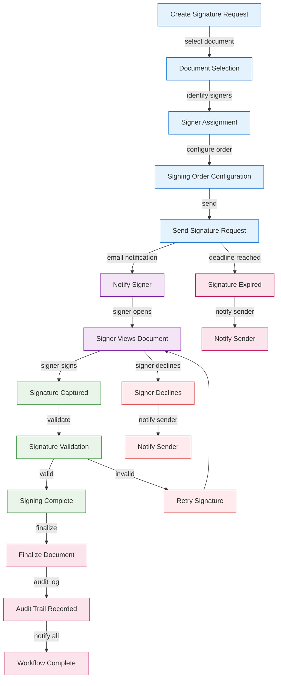
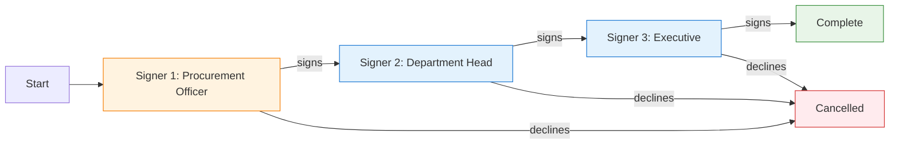
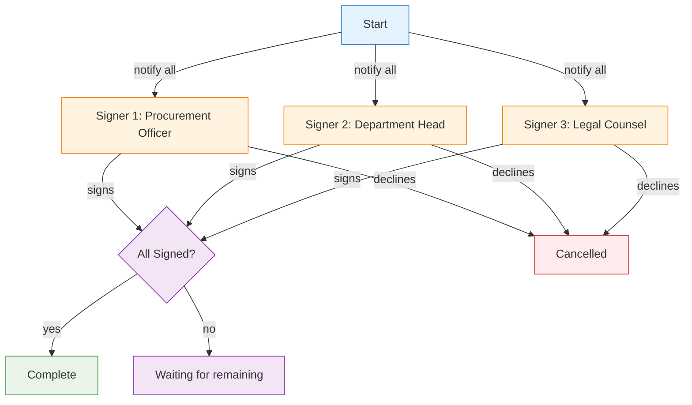
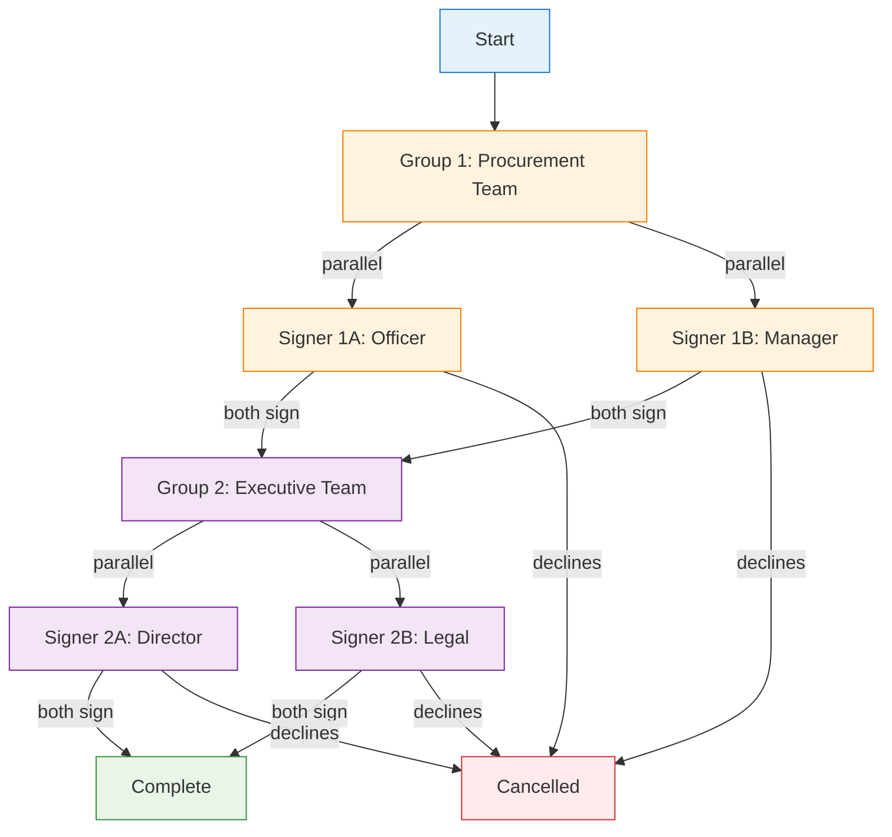
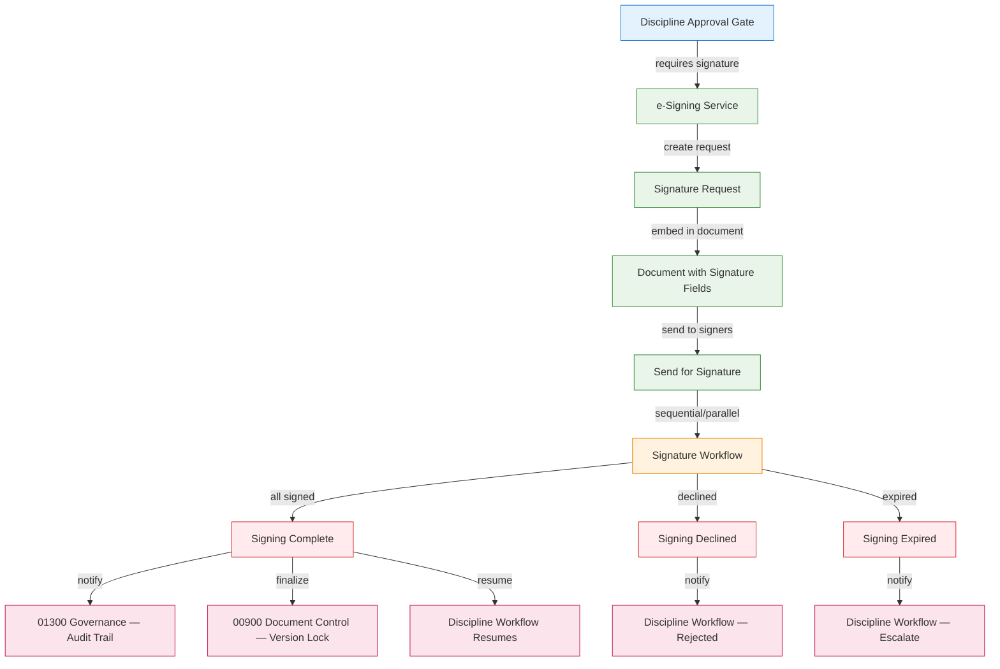

# ESIGN — e-Signing UI/UX Specification (Desktop)

## Table of Contents

1. [Part A: UX Patterns (High-Level)](#part-a-ux-patterns-high-level)
2. [Part B: Signature Capture Components](#part-b-signature-capture-components)
3. [Part C: Signature Workflow Diagrams](#part-c-signature-workflow-diagrams)
4. [Part D: Implementation Standards](#part-d-implementation-standards)
5. [Part E: Screen Specifications](#part-e-screen-specifications)
6. [Part F: Cross-Discipline Integration](#part-f-cross-discipline-integration)
7. [Part G: Agent Knowledge Ownership](#part-g-agent-knowledge-ownership)

---

## Part A: UX Patterns (High-Level)

### 1. Discipline Classification

**Type**: Shared Cross-Discipline Service

The e-Signing discipline provides digital signature capabilities as a shared service consumed by all discipline pages. It does not have its own three-state page (Agents, Upserts, Workspace) but instead embeds signature capture components and workflow triggers into existing discipline pages.

**Integration Pattern**:
- **01300 Governance**: Signature routing embedded in approval matrix
- **00900 Document Control**: Signature fields embedded in document templates
- **01900 Procurement**: Signature capture in PO and tender approval modals
- **01700 Logistics**: Signature capture in delivery and weighbridge sign-off
- **02400 Safety**: Signature capture in SDS and incident report approval

### 2. Information Architecture

**Accordion Section**: Shared Services
**Accordion Subsection**: e-Signing
**Icon**: Pen / signature icon
**Route**: `/e-signing`

### 3. Color Scheme

```css
:root {
  --esign-primary: #2E7D32;
  --esign-secondary: #4CAF50;
  --esign-accent: #1B5E20;
  --esign-bg-gradient: linear-gradient(135deg, #f1f8e9 0%, #e8f5e9 100%);
  --esign-header-gradient: linear-gradient(135deg, #2E7D32 0%, #4CAF50 100%);
  --esign-text-primary: #000000;
  --esign-text-secondary: #6c757d;
  --esign-text-white: #ffffff;
  --esign-shadow-sm: 0 2px 4px rgba(0, 0, 0, 0.05);
  --esign-shadow-md: 0 4px 6px rgba(0, 0, 0, 0.1);
  --esign-shadow-lg: 0 8px 24px rgba(46, 125, 50, 0.3);
  --esign-signature-blue: #1565C0;
  --esign-signature-green: #2E7D32;
  --esign-signature-pending: #FFA000;
  --esign-signature-completed: #2E7D32;
  --esign-signature-expired: #C62828;
}
```

### 4. Signature States

Every signature request passes through the following states:

| State | Description | Visual Indicator |
|-------|-------------|-----------------|
| **Pending** | Signature request sent, awaiting signer action | Amber badge, clock icon |
| **Viewed** | Signer has opened the document | Blue badge, eye icon |
| **Signed** | Signer has completed signing | Green badge, checkmark icon |
| **Declined** | Signer has declined to sign | Red badge, X icon |
| **Expired** | Signature deadline has passed | Dark red badge, warning icon |
| **Cancelled** | Request was cancelled by sender | Grey badge, ban icon |

### 5. Signature Capture Methods

Four signature capture methods are supported:

| Method | Description | Use Case | Accessibility |
|--------|-------------|----------|---------------|
| **Draw** | Signer draws signature on canvas using mouse/touch | Desktop & mobile signing | Requires fine motor control |
| **Type** | Signer types name, rendered in cursive font | Quick signing, accessibility | Screen reader compatible |
| **Upload** | Signer uploads an image of their signature | Reuse existing signature | Requires image file |
| **PKI** | Certificate-based digital signature | High-compliance signing | Requires digital certificate |

---

## Part B: Signature Capture Components

### 6. Signature Capture Modal

The signature capture modal is embedded in any discipline page's approval workflow. It provides all four capture methods with a consistent UX.

**Modal Specifications**:
- **Width**: 98vw (matching discipline modal standard)
- **Header**: Green gradient with "Sign Document" title
- **Footer**: "Complete Signing" and "Cancel" buttons

```
┌──────────────────────────────────────────────────────────────┐
│  [Green Header Gradient]                                      │
│  Sign Document                                                │
├──────────────────────────────────────────────────────────────┤
│                                                               │
│  Document: PO-2026-0042 — Caterpillar Inc.                    │
│  Signer: John Smith (john.smith@example.com)                  │
│  Role: Procurement Manager                                    │
│                                                               │
│  ┌─ Signature Method ──────────────────────────────────────┐  │
│  │  [Draw] [Type] [Upload] [PKI Certificate]               │  │
│  └─────────────────────────────────────────────────────────┘  │
│                                                               │
│  ┌─ Signature Area ─────────────────────────────────────────┐  │
│  │                                                           │  │
│  │           [Signature Canvas / Input Area]                 │  │
│  │                                                           │  │
│  │  [Clear]                                                  │  │
│  └─────────────────────────────────────────────────────────┘  │
│                                                               │
│  ┌─ Additional Fields ─────────────────────────────────────┐  │
│  │  Signer Name: [John Smith                    ]           │  │
│  │  Date: [2026-05-04                          ]           │  │
│  │  Title: [Procurement Manager                ]           │  │
│  │  Reason for Signing: [Approving purchase order]         │  │
│  └─────────────────────────────────────────────────────────┘  │
│                                                               │
│  [Complete Signing]  [Cancel]                                  │
└──────────────────────────────────────────────────────────────┘
```

### 7. Signature Request Dashboard

A dashboard showing all pending, completed, and expired signature requests for the current user.

```
┌──────────────────────────────────────────────────────────────┐
│  [Green Header Gradient]                                      │
│  My Signature Requests                                        │
├──────────────────────────────────────────────────────────────┤
│                                                               │
│  Filters: [All] [Pending] [Completed] [Expired]              │
│                                                               │
│  ┌────────────────────────────────────────────────────────┐  │
│  │ ● PO-2026-0042 — Caterpillar Inc.     Pending    [Sign]│  │
│  │   Requested: 2026-05-03 | Deadline: 2026-05-10         │  │
│  ├────────────────────────────────────────────────────────┤  │
│  │ ✓ DEL-2026-0012 — Site Delivery        Completed       │  │
│  │   Signed: 2026-05-02 by John Smith                     │  │
│  ├────────────────────────────────────────────────────────┤  │
│  │ ✗ SAFETY-2026-0005 — Incident Report    Expired        │  │
│  │   Deadline: 2026-04-28                                 │  │
│  └────────────────────────────────────────────────────────┘  │
│                                                               │
└──────────────────────────────────────────────────────────────┘
```

### 8. Signature Workflow Configuration

Admin interface for configuring signature workflows per discipline and approval matrix level.

```
┌──────────────────────────────────────────────────────────────┐
│  [Green Header Gradient]                                      │
│  Signature Workflow Configuration                             │
├──────────────────────────────────────────────────────────────┤
│                                                               │
│  Discipline: [01900 Procurement ▼]                           │
│  Approval Level: [Level 2 — Parallel ▼]                     │
│                                                               │
│  ┌─ Signing Order ─────────────────────────────────────────┐  │
│  │  ○ Sequential (one after another)                        │  │
│  │  ● Parallel (all at once)                                │  │
│  │  ○ Hybrid (groups sequentially, within parallel)         │  │
│  └─────────────────────────────────────────────────────────┘  │
│                                                               │
│  ┌─ Signers ───────────────────────────────────────────────┐  │
│  │  [Procurement Officer]          [Remove]                 │  │
│  │  [Department Head]              [Remove]                 │  │
│  │  [+ Add Signer]                                          │  │
│  └─────────────────────────────────────────────────────────┘  │
│                                                               │
│  ┌─ Settings ──────────────────────────────────────────────┐  │
│  │  ☑ Require reason for signing                            │  │
│  │  ☑ Send reminder every [3] days                         │  │
│  │  ☐ Expire after [14] days                               │  │
│  │  ☐ Allow delegation                                      │  │
│  └─────────────────────────────────────────────────────────┘  │
│                                                               │
│  [Save Configuration]  [Test Workflow]                        │
└──────────────────────────────────────────────────────────────┘
```

---

## Part C: Signature Workflow Diagrams

### 9. Signature Request Lifecycle

The full lifecycle of a signature request from creation through completion or expiry.



### 10. Sequential Signing Flow

Documents requiring signatures in a specific order — each signer must sign before the next is notified.



### 11. Parallel Signing Flow

Documents requiring multiple signatures simultaneously — all signers are notified at once.



### 12. Hybrid Signing Flow

Documents requiring signatures in sequential groups, with parallel signing within each group.



### 13. Cross-Discipline Signature Integration Flow

How e-Signing integrates with discipline-specific approval workflows.



---

## Part D: Implementation Standards

### 14. Component Inventory

| Component | File | Purpose | CSS Class Prefix |
|-----------|------|---------|-----------------|
| SignatureCanvas | Signature capture | Draw signature with mouse/touch | `.ESIGN-canvas` |
| SignatureType | Signature capture | Type signature with cursive font | `.ESIGN-type` |
| SignatureUpload | Signature capture | Upload signature image | `.ESIGN-upload` |
| SignaturePKI | Signature capture | Certificate-based signing | `.ESIGN-pki` |
| SignatureModal | Modal | Full signature capture modal | `.ESIGN-modal` |
| SignatureDashboard | Dashboard | User's signature requests | `.ESIGN-dashboard` |
| SignatureWorkflowConfig | Admin | Configure signing workflows | `.ESIGN-workflow-config` |
| SignatureStatusBadge | Badge | Signature state indicator | `.ESIGN-status-badge` |
| SignatureAuditLog | Audit | Signature audit trail viewer | `.ESIGN-audit-log` |

### 15. API Endpoints

| Endpoint | Method | Purpose |
|----------|--------|---------|
| `/api/esign/requests` | POST | Create signature request |
| `/api/esign/requests/:id` | GET | Get signature request status |
| `/api/esign/requests/:id/sign` | POST | Submit signature |
| `/api/esign/requests/:id/decline` | POST | Decline signature |
| `/api/esign/requests/:id/remind` | POST | Send reminder |
| `/api/esign/requests/:id/cancel` | POST | Cancel signature request |
| `/api/esign/requests/user/:userId` | GET | Get user's signature requests |
| `/api/esign/templates` | GET | Get signature field templates |
| `/api/esign/audit/:requestId` | GET | Get signature audit trail |
| `/api/esign/webhook` | POST | Provider webhook handler |

### 16. Database Schema

```sql
-- Signature Requests
CREATE TABLE esignature_requests (
    id UUID PRIMARY KEY DEFAULT gen_random_uuid(),
    document_id UUID NOT NULL REFERENCES documents(id),
    discipline_code VARCHAR(10) NOT NULL,
    workflow_type VARCHAR(20) NOT NULL CHECK (workflow_type IN ('sequential', 'parallel', 'hybrid')),
    status VARCHAR(20) NOT NULL DEFAULT 'pending' CHECK (status IN ('pending', 'in_progress', 'completed', 'declined', 'expired', 'cancelled')),
    deadline TIMESTAMP,
    created_by UUID NOT NULL REFERENCES users(id),
    created_at TIMESTAMP DEFAULT NOW(),
    updated_at TIMESTAMP DEFAULT NOW()
);

-- Signature Request Signers
CREATE TABLE esignature_signers (
    id UUID PRIMARY KEY DEFAULT gen_random_uuid(),
    request_id UUID NOT NULL REFERENCES esignature_requests(id) ON DELETE CASCADE,
    user_id UUID NOT NULL REFERENCES users(id),
    signing_order INTEGER NOT NULL DEFAULT 1,
    group_id INTEGER,
    status VARCHAR(20) NOT NULL DEFAULT 'pending' CHECK (status IN ('pending', 'viewed', 'signed', 'declined')),
    signed_at TIMESTAMP,
    signature_data TEXT,
    signature_method VARCHAR(20) CHECK (signature_method IN ('draw', 'type', 'upload', 'pki')),
    ip_address VARCHAR(45),
    user_agent TEXT,
    created_at TIMESTAMP DEFAULT NOW()
);

-- Signature Audit Log
CREATE TABLE signature_audit_log (
    id UUID PRIMARY KEY DEFAULT gen_random_uuid(),
    request_id UUID NOT NULL REFERENCES esignature_requests(id) ON DELETE CASCADE,
    signer_id UUID REFERENCES esignature_signers(id),
    event_type VARCHAR(30) NOT NULL CHECK (event_type IN (
        'request_created', 'request_sent', 'signer_viewed', 'signer_signed',
        'signer_declined', 'request_completed', 'request_expired',
        'request_cancelled', 'reminder_sent', 'delegation_granted'
    )),
    event_data JSONB,
    ip_address VARCHAR(45),
    created_at TIMESTAMP DEFAULT NOW()
);
```

---

## Part E: Screen Specifications

### 17. Screen Inventory

| Screen | Loading | Empty | Error | Populated |
|--------|---------|-------|-------|-----------|
| Signature Dashboard | Spinner + skeleton | "No signature requests" CTA | Red banner + retry | Request list with status badges |
| Signature Capture | Spinner | Default canvas/input | Field validation errors | Signature canvas with controls |
| Workflow Config | Spinner | Empty configuration form | Save error | Pre-populated configuration |
| Audit Trail | Spinner + skeleton | "No audit events" | Red banner + retry | Event timeline with filters |

### 18. Platform Adaptations

**Desktop (1280px+)**:
- Full signature canvas with all capture methods
- Side-by-side document preview and signature panel
- Signature dashboard with table layout

**Tablet (768px - 1279px)**:
- Signature canvas full width
- Document preview in collapsible panel
- Signature dashboard with card layout

**Mobile (< 768px)**:
- Signature canvas optimized for touch
- Document preview hidden by default
- Signature dashboard as scrollable list
- Biometric authentication (Face ID / fingerprint)

---

## Part F: Cross-Discipline Integration

### 19. Integration Points

| Discipline | Integration | Signature Trigger | Post-Signature Action |
|-----------|-------------|-------------------|----------------------|
| **01300 Governance** | Approval matrix routing | Approval gate reached | Record approval in audit trail |
| **00900 Document Control** | Document lifecycle | Document ready for sign-off | Lock document version |
| **01900 Procurement** | PO/Tender approval | PO generated or tender awarded | Issue PO / award contract |
| **01700 Logistics** | Delivery sign-off | Delivery completed | Release payment |
| **02400 Safety** | Incident/SDS approval | Incident report or SDS ready | Archive report / publish SDS |

### 20. Integration Registry References

See [Cross-Discipline Integration Registry](../../../orchestration/INTEGRATION-REGISTRY.md) for the full chain of integration touch points.

| Integration ID | Source | Target | Description |
|---------------|--------|--------|-------------|
| INT-005 | 01700 Logistics | 00900 Document Control | Logistics → Document Control |
| INT-006 | 00900 Document Control | 01300 Governance | Document Control → Governance |
| INT-ESIGN-001 | All Disciplines | ESIGN | Discipline approval gate → e-Signing |
| INT-ESIGN-002 | ESIGN | 01300 Governance | e-Signing → Audit Trail |
| INT-ESIGN-003 | ESIGN | 00900 Document Control | e-Signing → Document Version Lock |

---

## Part G: Agent Knowledge Ownership

### 21. Agent Ownership

| Company | Role | Action |
|---------|------|--------|
| **DomainForge AI** | Domain Validation | Validate e-Signing workflows are correct across all disciplines |
| **QualityForge AI** | Testing | Execute ESIGN test suite against this spec |
| **DevForge AI** | Implementation | Build signature capture components, API integration, workflow engine |
| **KnowledgeForge AI** | Indexing | Index spec into institutional memory |
| **InfraForge AI** | Infrastructure | Deploy e-Signature service, manage API keys, configure webhooks |
| **IntegrateForge AI** | Integration | Integrate with 01300 Governance, 00900 Document Control, and other disciplines |

### 22. QualityForge AI Testing

1. **Foundation (ESIGN-001)**: Provider evaluation, architecture design, component specs
2. **Core Integration (ESIGN-002)**: Signature capture, workflow engine, API endpoints
3. **Discipline Integration (ESIGN-003)**: Cross-discipline signature workflows
4. **Mobile & Offline (ESIGN-004)**: Mobile signing, offline fallback
5. **Compliance & Audit (ESIGN-005)**: Audit trail integrity, compliance reporting

---

## Version History

| Version | Date | Changes |
|---------|------|---------|
| 1.0 | 2026-05-04 | Initial UI/UX specification for e-Signing discipline |

---

**Document Information**
- **Author**: DomainForge AI — e-Signing Domain
- **Date**: 2026-05-04
- **Status**: Active
