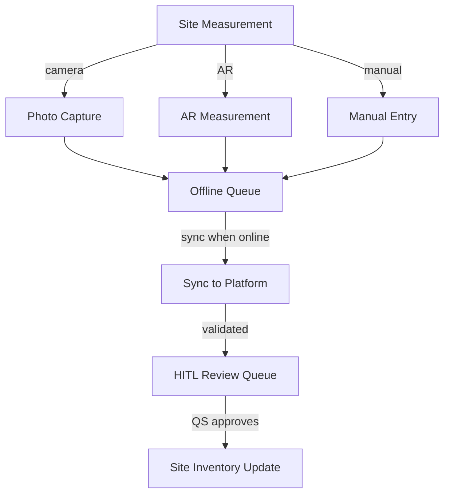

# Cross-Discipline Measurement Platform — UI/UX Specification (Mobile)

> **Platform**: Mobile (< 768px)
> **Source**: Derived from the master UI-UX-SPECIFICATION.md — Part G
> **Note**: Mobile measurement is handled by **MobileForge AI** as a separate parallel track. This document covers the mobile-specific UI/UX patterns and on-site measurement workflows.

## Table of Contents

1. [Part G: Mobile Measurement (On-Site)](#part-g-mobile-measurement-on-site)
2. [Mobile UI Patterns](#mobile-ui-patterns)
3. [Platform Adaptations](#platform-adaptations)
4. [Related Desktop Specification](#related-desktop-specification)

---

## Part G: Mobile Measurement (On-Site)

### 24. Mobile Measurement Interface

**Platform**: Progressive Web App (PWA) — works on-site offline, syncs when connected.

**Key Screens**:

1. **On-Site Capture**:
   - Camera integration for site photos
   - AR-assisted measurement (LiDAR on iOS)
   - Manual entry for tape measurements
   - GPS tagging for location tracking

2. **Measurement Sync**:
   - Offline queue for site measurements
   - Auto-sync when connection restored
   - Conflict resolution for duplicate measurements

3. **Site Inventory**:
   - Delivery verification with photo proof
   - Stock level updates
   - Wastage capture

**Mobile-Specific UI Patterns**:

- **Full-width cards** instead of tables
- **Swipe gestures** for approve/reject
- **Camera button** prominently placed for photo capture
- **Voice input** for hands-free measurement notes
- **Brightness adaptation** for outdoor site use

**Mermaid Flow**:

## Mobile UI Patterns

### Navigation

- **Three-state nav** as bottom tab bar (Agents | Upsert | Workspace)
- **Touch targets**: minimum 48dp per accessibility standards
- **Swipe gestures** for approve/reject actions on measurement cards

### CAD Takeoff (Mobile)

- Full-width CAD viewer with measurement tools as floating action button
- Measurement panel as slide-out drawer from bottom
- Pinch-to-zoom and pan gestures for CAD inspection

### Measurement Grid (Mobile)

- Card-based layout instead of tables
- Key columns only (item, quantity, status)
- Expandable cards for full details

### BOQ Composer (Mobile)

- Single column layout
- Collapsible trade package sections
- Summary bar pinned to bottom

### Tender Portal (Mobile)

- Swipeable bid cards
- Expandable bid details
- Quick-action buttons for evaluate/award

## Platform Adaptations

### Mobile (< 768px)

- Three-state nav as bottom tab bar
- CAD Takeoff: full width, measurement tools as floating action button
- Measurement Grid: card-based layout
- BOQ Composer: single column
- Tender Portal: swipeable bid cards
- Touch targets: minimum 48dp

### Tablet (768px - 1279px)

- Three-state nav collapses to dropdown
- CAD Takeoff: full width, measurement panel as slide-out drawer
- Measurement Grid: responsive, key columns only
- BOQ Composer: stacked layout
- Tender Portal: bid list with expandable details

## Related Desktop Specification

For the full specification including Parts A–F and H–J (UX patterns, three-state button rules, mermaid diagrams, implementation standards, screen specifications, shared components, AI model backend, agent knowledge ownership, and future extension architecture), see the [desktop specification](desktop.md).

---

## Version History

| Version | Date       | Changes                                                               |
| ------- | ---------- | --------------------------------------------------------------------- |
| 1.0     | 2026-04-28 | Initial mobile UI/UX specification for Cross-Discipline Measurement Platform |

---

**Document Information**

- **Author**: MeasureForge AI — UI/UX Design Coordination
- **Date**: 2026-04-28
- **Status**: Active
- **Next Review**: 2026-05-28
