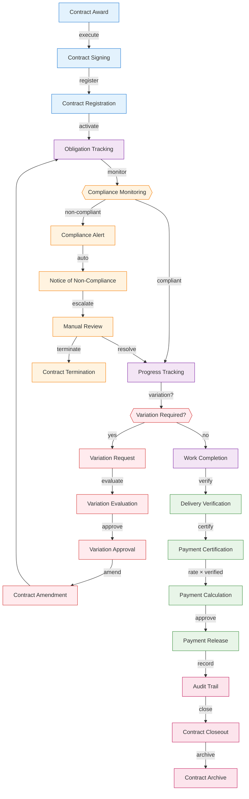
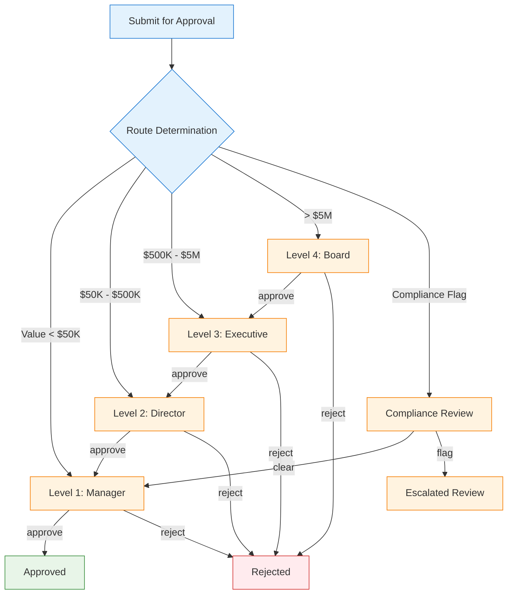
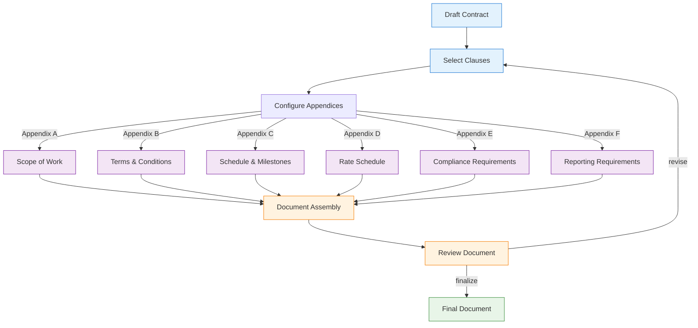
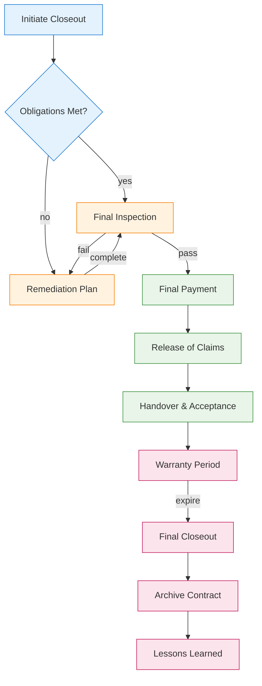

# 00400 Contracts — Desktop UI/UX Specification

> **Parent**: [`ui-ux/index.md`](index.md) — Master Index
> **Platform**: Desktop (1280px+)
> **Language Support**: 9 languages — see [Language Support](index.md#language-support) in master index

## 1. Overview

The 00400 Contracts discipline page provides a comprehensive contract lifecycle management interface. It enables users to create, manage, monitor, and close out contracts from award through final closeout. The system integrates with Procurement (01900) for purchase order handoff, Pre-Award (00425) for award recommendations, and Post-Award (00435) for compliance monitoring and payment certification.

### 1.1 Key Capabilities
- Contract creation from procurement PO or award recommendation
- Contract signing and registration workflow
- Obligation tracking and compliance monitoring
- Variation management (scope, cost, schedule changes)
- Payment certification and release
- Contract closeout and archival

### 1.2 Integration Points
- **INT-001/INT-009**: Receives from 01900 Procurement (PO → Contract)
- **INT-002**: Receives from 00425 Pre-Award (Award → Contract)
- **INT-003**: Sends to 00435 Post-Award (Contract → Compliance)

## 2. User Roles & Permissions

| Role | Permissions | Description |
|------|------------|-------------|
| Contract Admin | CRUD all contracts, approve variations, certify payments | Full lifecycle management |
| Contract Manager | Create/edit contracts, manage obligations, initiate variations | Day-to-day contract management |
| Contract Reviewer | View contracts, submit review comments, approve/reject at gates | Review and approval gates |
| Compliance Officer | View compliance status, raise alerts, track corrective actions | Compliance monitoring |
| Finance User | View payment certifications, process payments | Payment processing |
| Viewer | Read-only access to contract data | Audit and reporting |

## 3. Page Architecture

### 3.1 Three-State Navigation

The page follows the standard three-state navigation pattern:

```
┌─────────────────────────────────────────────────┐
│  [Agents]  [Upsert]  [Workspace]                │
├─────────────────────────────────────────────────┤
│                                                   │
│  Content area based on selected state             │
│                                                   │
└─────────────────────────────────────────────────┘
```

#### Agents State
- AI-powered contract drafting assistant
- Compliance risk analysis agent
- Variation impact assessment agent
- Contract summarization agent

#### Upsert State
- Contract creation form (from PO, from award, or blank)
- Contract amendment form
- Variation request form
- Payment certification form

#### Workspace State
- Contract list with filters (status, type, value, date)
- Contract detail view with tabs (Overview, Obligations, Variations, Payments, Documents, Timeline)
- Compliance dashboard
- Closeout workspace

### 3.2 Contract Lifecycle Flow



### 3.3 Contract Creation Workflow

```mermaid
flowchart LR
    SOURCE{Contract Source}
    SOURCE -->|From PO| PO_IN[Import PO Data]
    SOURCE -->|From Award| AWARD_IN[Import Award Data]
    SOURCE -->|Blank| BLANK[Empty Template]
    PO_IN --> TEMPLATE[Select Contract Template]
    AWARD_IN --> TEMPLATE
    BLANK --> TEMPLATE
    TEMPLATE --> TERMS[Define Terms]
    TERMS --> PARTIES[Add Parties]
    PARTIES --> SCOPE[Define Scope of Work]
    SCOPE --> VALUE[Set Contract Value]
    VALUE --> SCHEDULE[Set Schedule & Milestones]
    SCHEDULE --> CLAUSES[Configure Clause Library]
    CLAUSES --> REVIEW[Review Draft]
    REVIEW -->|approve| SIGN_READY[Ready for Signing]
    REVIEW -->|reject| TERMS

    classDef source fill:#e3f2fd,stroke:#1976d2
    classDef create fill:#f3e5f5,stroke:#7b1fa2
    classDef define fill:#fff3e0,stroke:#f57c00
    classDef review fill:#ffebee,stroke:#d32f2f
    classDef ready fill:#e8f5e8,stroke:#388e3c

    class SOURCE source
    class PO_IN,AWARD_IN,BLANK,TEMPLATE create
    class TERMS,PARTIES,SCOPE,VALUE,SCHEDULE,CLAUSES define
    class REVIEW review
    class SIGN_READY ready
```



### 3.4 Approval Routing Matrix



### 3.5 Document Assembly Flow



### 3.6 Contract Closeout Process



## 4. State Management

### 4.1 Loading States
- **Initial Load**: Skeleton loader with contract list placeholder cards
- **Contract Detail**: Progressive loading — header first, then tabs
- **Document Assembly**: Loading bar showing assembly progress
- **Payment Calculation**: Spinner during rate × quantity computation

### 4.2 Empty States
- **No Contracts**: "No contracts yet. Create your first contract from a purchase order or award recommendation."
- **No Variations**: "No variations recorded for this contract."
- **No Compliance Alerts**: "All compliance checks passed. No alerts."
- **No Documents**: "No documents attached to this contract."

### 4.3 Error States
- **Contract Load Failure**: "Unable to load contract data. Retry or contact support."
- **Save Failure**: "Failed to save changes. Your work has been preserved locally."
- **Integration Failure**: "Unable to sync with Procurement/Post-Award system. Data may be stale."
- **Payment Calculation Error**: "Payment calculation failed. Verify rate and quantity inputs."

### 4.4 Edge Cases
- **Concurrent Editing**: Lock mechanism prevents simultaneous edits
- **Contract Amendment Chain**: Track amendment history with version tree
- **Cross-Phase Contracts**: Contracts spanning pre-award through post-award
- **Terminated Contracts**: Special closeout flow with termination checklist
- **Multi-Currency Contracts**: Currency conversion display and validation

## 5. API Endpoints

| Method | Endpoint | Description |
|--------|----------|-------------|
| GET | `/api/v1/contracts` | List contracts with filters |
| GET | `/api/v1/contracts/:id` | Get contract detail |
| POST | `/api/v1/contracts` | Create contract |
| PUT | `/api/v1/contracts/:id` | Update contract |
| DELETE | `/api/v1/contracts/:id` | Delete contract (draft only) |
| POST | `/api/v1/contracts/:id/sign` | Sign contract |
| POST | `/api/v1/contracts/:id/register` | Register contract |
| GET | `/api/v1/contracts/:id/variations` | List variations |
| POST | `/api/v1/contracts/:id/variations` | Create variation |
| GET | `/api/v1/contracts/:id/compliance` | Get compliance status |
| POST | `/api/v1/contracts/:id/payments` | Certify payment |
| POST | `/api/v1/contracts/:id/closeout` | Initiate closeout |
| GET | `/api/v1/contracts/:id/documents` | List documents |
| POST | `/api/v1/contracts/:id/documents/assemble` | Assemble document |

## 6. Database Schema References

### Core Tables
- `a_00400_contracts` — Contract records
- `a_00400_contract_parties` — Contract parties/stakeholders
- `a_00400_contract_obligations` — Obligation tracking
- `a_00400_contract_variations` — Variation management
- `a_00400_contract_payments` — Payment certifications
- `a_00400_contract_documents` — Document registry
- `a_00400_contract_approvals` — Approval routing records
- `a_00400_contract_compliance` — Compliance monitoring

### Integration Tables
- `a_01900_procurement_orders` — Source for PO-based contracts (INT-009)
- `a_00425_preaward_evaluations` — Source for award-based contracts (INT-002)
- `a_00435_postaward_compliance` — Target for compliance handoff (INT-003)

## 7. Integration Details

### INT-001/INT-009: Procurement → Contracts
- **Trigger**: Purchase order issued in 01900
- **Data Flow**: PO data → Contract template → Terms population
- **Validation**: PO must be in "Approved" status
- **Error Handling**: If contract creation fails, PO remains in "Pending Contract" status

### INT-002: Pre-Award → Contracts
- **Trigger**: Award recommendation approved in 00425
- **Data Flow**: Evaluation results → Selected bidder → Contract terms
- **Validation**: Award must have completed compliance check
- **Error Handling**: Failed contract creation returns award to "Pending Contract" status

### INT-003: Contracts → Post-Award
- **Trigger**: Contract signed and registered
- **Data Flow**: Contract terms → Obligations → Compliance thresholds
- **Validation**: Contract must be in "Active" status
- **Error Handling**: Compliance monitoring initialization retries on failure

---

## Version History

| Version | Date | Changes |
|---------|------|---------|
| 2.0 | 2026-05-03 | Split into platform-specific files (desktop, mobile, web). Added language support reference. |
| 1.0 | 2026-05-03 | Initial UI/UX specification |

---

**Document Information**
- **Author**: DomainForge AI — Contracts Domain
- **Date**: 2026-05-03
- **Status**: Active