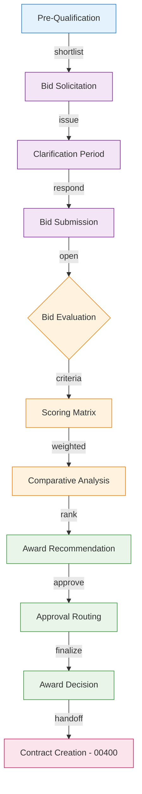
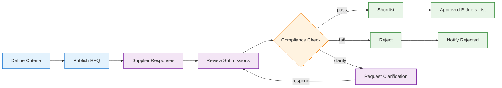
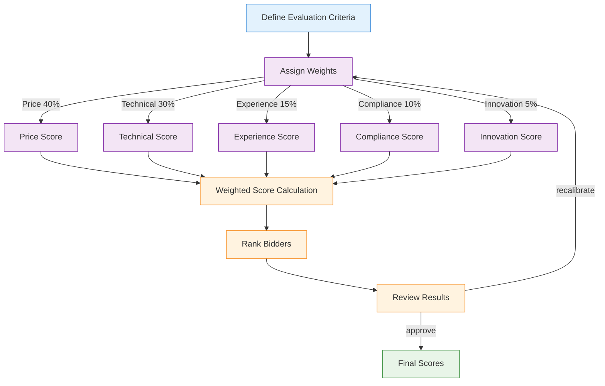
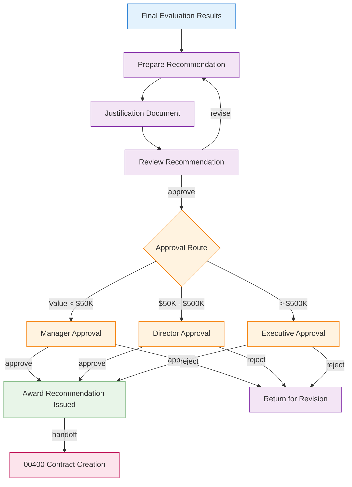

# 00425 Contracts Pre-Award UI/UX Specification

## 1. Overview

The 00425 Contracts Pre-Award discipline page manages the complete pre-award lifecycle from procurement handoff through award recommendation. It enables users to create tender packages, manage supplier pre-qualification, conduct bid evaluations with scoring matrices, and generate award recommendations for contract creation.

### 1.1 Key Capabilities
- Tender package creation from procurement requirements (INT-001)
- Supplier pre-qualification and shortlisting
- Bid solicitation and submission management
- Evaluation criteria definition and scoring matrix
- Comparative analysis and award recommendation
- Integration with 00400 Contracts for contract generation (INT-002)

### 1.2 Integration Points
- **INT-001**: Receives from 01900 Procurement (Requirements → Tender)
- **INT-002**: Sends to 00400 Contracts (Award → Contract)

## 2. User Roles & Permissions

| Role | Permissions | Description |
|------|------------|-------------|
| Tender Admin | CRUD all tenders, manage evaluation panels, approve awards | Full pre-award lifecycle |
| Procurement Officer | Create tenders from procurement requirements, manage submissions | Day-to-day tender management |
| Evaluator | Score bids, submit evaluations, add comments | Bid evaluation panel member |
| Compliance Reviewer | Verify pre-qualification, check compliance requirements | Compliance gate |
| Viewer | Read-only access to tender data | Audit and reporting |

## 3. Page Architecture

### 3.1 Three-State Navigation

```
┌─────────────────────────────────────────────────┐
│  [Agents]  [Upsert]  [Workspace]                │
├─────────────────────────────────────────────────┤
│                                                   │
│  Content area based on selected state             │
│                                                   │
└─────────────────────────────────────────────────┘
```

#### Agents State
- AI-powered tender drafting assistant
- Bid evaluation summarization agent
- Supplier risk assessment agent
- Compliance checking agent

#### Upsert State
- Tender creation form (from procurement requirements or blank)
- Pre-qualification criteria form
- Evaluation criteria and scoring matrix form
- Award recommendation form

#### Workspace State
- Tender list with filters (status, type, value, deadline)
- Tender detail view with tabs (Overview, Submissions, Evaluation, Timeline)
- Evaluation dashboard with scoring overview
- Award recommendation workspace

### 3.2 Bid/Tender Pipeline Flow



### 3.3 Pre-Qualification Workflow



### 3.4 Bid Evaluation & Scoring Matrix



### 3.5 Award Recommendation Flow



## 4. State Management

### 4.1 Loading States
- **Tender List**: Skeleton cards with tender status badges
- **Evaluation Dashboard**: Progressive loading of score components
- **Bid Submission**: Upload progress indicator

### 4.2 Empty States
- **No Tenders**: "No active tenders. Create a tender from procurement requirements."
- **No Submissions**: "No bids received yet. The submission deadline is [date]."
- **No Evaluations**: "Evaluation not started. Define criteria and assign evaluators."

### 4.3 Error States
- **Submission Upload Failure**: "Bid document upload failed. Retry or contact support."
- **Scoring Calculation Error**: "Score calculation error. Verify criteria weights sum to 100%."
- **Integration Failure**: "Unable to sync with Procurement system. Data may be stale."

### 4.4 Edge Cases
- **Late Submissions**: Configurable late submission policy (accept/reject with penalty)
- **Tied Scores**: Tie-breaking rules (price preference, local content, random selection)
- **Withdrawn Bids**: Bid withdrawal handling and notification
- **Amended Tenders**: Tender amendment process with re-notification

## 5. API Endpoints

| Method | Endpoint | Description |
|--------|----------|-------------|
| GET | `/api/v1/tenders` | List tenders with filters |
| GET | `/api/v1/tenders/:id` | Get tender detail |
| POST | `/api/v1/tenders` | Create tender |
| PUT | `/api/v1/tenders/:id` | Update tender |
| POST | `/api/v1/tenders/:id/publish` | Publish tender |
| GET | `/api/v1/tenders/:id/submissions` | List submissions |
| POST | `/api/v1/tenders/:id/submissions` | Submit bid |
| GET | `/api/v1/tenders/:id/evaluations` | Get evaluations |
| POST | `/api/v1/tenders/:id/evaluations` | Submit evaluation score |
| GET | `/api/v1/tenders/:id/scoring` | Get scoring matrix |
| POST | `/api/v1/tenders/:id/award` | Issue award recommendation |
| GET | `/api/v1/pre-qualification` | List pre-qualifications |
| POST | `/api/v1/pre-qualification` | Submit pre-qualification |

## 6. Database Schema References

### Core Tables
- `a_00425_preaward_tenders` — Tender records
- `a_00425_preaward_submissions` — Bid submissions
- `a_00425_preaward_evaluations` — Evaluation scores
- `a_00425_preaward_scoring_matrix` — Scoring criteria and weights
- `a_00425_preaward_awards` — Award recommendations
- `a_00425_preaward_pre_qualifications` — Supplier pre-qualifications

### Integration Tables
- `a_01900_procurement_orders` — Source for tender requirements (INT-001)
- `a_00400_contracts` — Target for award handoff (INT-002)

## 7. Mobile & Responsive Considerations

- **Tender List**: Card-based layout with status indicators
- **Bid Submission**: Document upload with camera capture option
- **Evaluation**: Simplified scoring input for mobile reviewers
- **Notifications**: Deadline reminders, submission alerts, evaluation assignments

## 8. Integration Details

### INT-001: Procurement → Pre-Award
- **Trigger**: Procurement requirements finalized in 01900
- **Data Flow**: Requirements spec → Tender package → Solicitation documents
- **Validation**: Requirements must be in "Approved" status
- **Error Handling**: Failed tender creation returns requirements to "Pending Tender" status

### INT-002: Pre-Award → Contracts
- **Trigger**: Award recommendation approved
- **Data Flow**: Evaluation results → Selected bidder → Contract terms → Draft contract
- **Validation**: Award must have completed compliance check
- **Error Handling**: Failed contract creation returns award to "Pending Contract" status