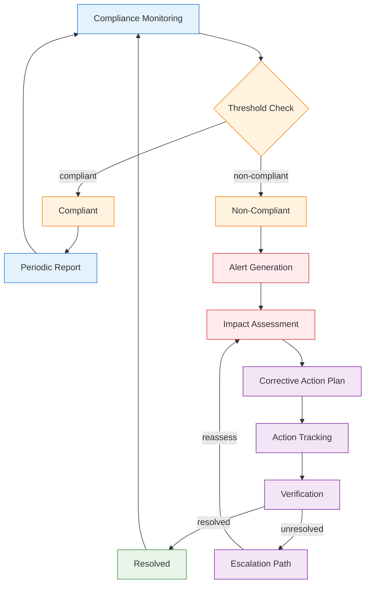
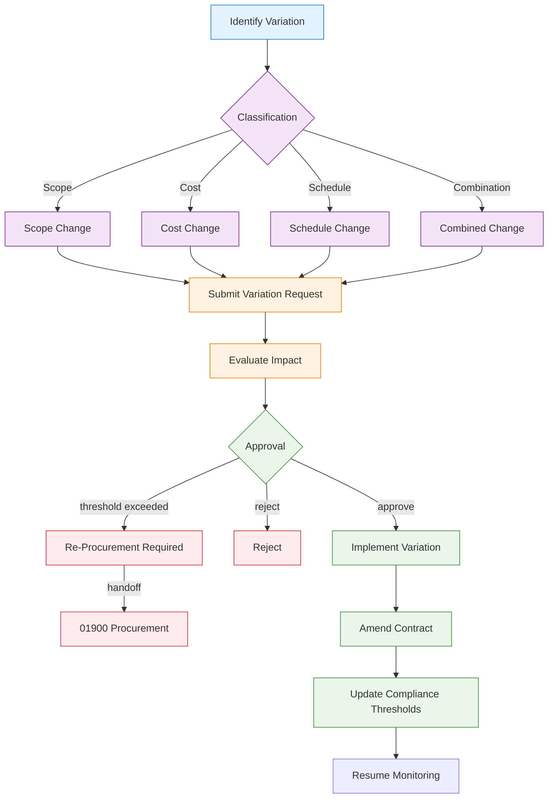
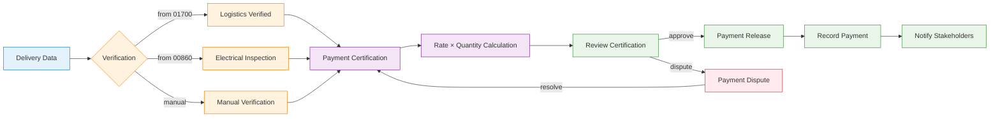
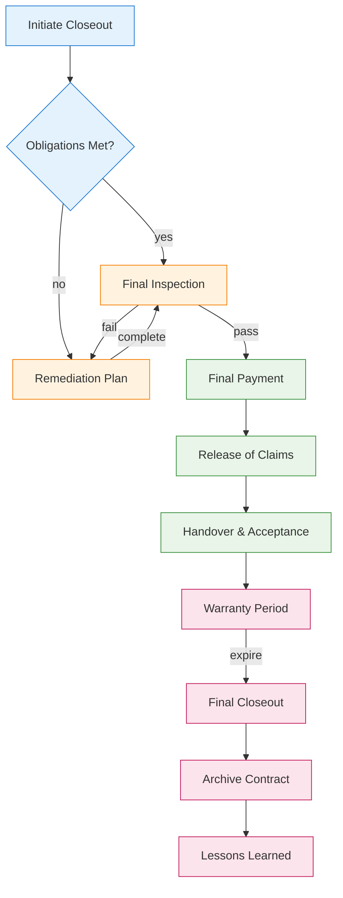

# 00435 Contracts Post-Award UI/UX Specification

## 1. Overview

The 00435 Contracts Post-Award discipline page manages contract execution after signing — compliance monitoring, variation management, payment certification, and closeout. It receives contracts from 00400, delivery data from 01700 Logistics, inspection reports from 00860 Electrical, and safety incidents from 02400 Safety.

### 1.1 Key Capabilities
- Compliance monitoring with threshold-based alerts
- Variation management (scope, cost, schedule)
- Payment certification from verified delivery data
- Contract closeout and archival
- Integration with logistics, electrical, and safety disciplines

### 1.2 Integration Points
- **INT-003**: Receives from 00400 Contracts (Contract → Compliance)
- **INT-004**: Receives from 01700 Logistics (Delivery → Payment)
- **INT-007**: Receives from 00860 Electrical (Inspection → Compliance)
- **INT-008**: Receives from 02400 Safety (Incident → Compliance)
- **INT-010**: Sends to 01900 Procurement (Variation → Re-procurement)

## 2. User Roles & Permissions

| Role | Permissions | Description |
|------|------------|-------------|
| Contract Admin | Full lifecycle management, approve variations, certify payments | Post-award management |
| Compliance Officer | Monitor compliance, raise alerts, track corrective actions | Compliance monitoring |
| Finance User | Process payment certifications, release payments | Payment processing |
| Logistics Liaison | Submit delivery verification data | Logistics integration |
| Viewer | Read-only access | Audit and reporting |

## 3. Page Architecture

### 3.1 Three-State Navigation

```
┌─────────────────────────────────────────────────┐
│  [Agents]  [Upsert]  [Workspace]                │
├─────────────────────────────────────────────────┤
│                                                   │
│  Content area based on selected state             │
│                                                   │
└─────────────────────────────────────────────────┘
```

#### Agents State
- Compliance risk analysis agent
- Variation impact assessment agent
- Payment verification agent
- Closeout readiness agent

#### Upsert State
- Compliance alert form
- Variation request form
- Payment certification form
- Closeout initiation form

#### Workspace State
- Contract compliance dashboard
- Variation tracking board
- Payment certification queue
- Closeout workspace

### 3.2 Compliance Monitoring Loop



### 3.3 Variation Management Workflow



### 3.4 Payment Certification Flow



### 3.5 Contract Closeout Process



## 4. State Management

### 4.1 Loading States
- **Compliance Dashboard**: Skeleton with compliance status cards
- **Payment Queue**: Progressive loading of certification items
- **Variation Board**: Kanban-style loading of variation cards

### 4.2 Empty States
- **No Compliance Alerts**: "All contracts compliant. No alerts."
- **No Variations**: "No active variations for this contract."
- **No Payments Pending**: "All payments processed. Queue is empty."

### 4.3 Error States
- **Compliance Check Failure**: "Compliance check failed. Manual review required."
- **Payment Calculation Error**: "Rate × quantity mismatch. Verify source data."
- **Integration Failure**: "Unable to sync with Logistics/Electrical system."

### 4.4 Edge Cases
- **Overlapping Variations**: Concurrent variation handling with dependency tracking
- **Retroactive Variations**: Historical variation with backdated effective dates
- **Partial Payments**: Milestone-based partial payment certification
- **Disputed Payments**: Payment dispute resolution workflow

## 5. API Endpoints

| Method | Endpoint | Description |
|--------|----------|-------------|
| GET | `/api/v1/compliance` | List compliance status |
| GET | `/api/v1/compliance/:id` | Get compliance detail |
| POST | `/api/v1/compliance/alerts` | Create compliance alert |
| PUT | `/api/v1/compliance/:id/resolve` | Resolve compliance issue |
| GET | `/api/v1/variations` | List variations |
| POST | `/api/v1/variations` | Create variation |
| PUT | `/api/v1/variations/:id/approve` | Approve variation |
| GET | `/api/v1/payments` | List payment certifications |
| POST | `/api/v1/payments/certify` | Certify payment |
| POST | `/api/v1/payments/:id/release` | Release payment |
| POST | `/api/v1/closeout/:id` | Initiate closeout |

## 6. Database Schema References

### Core Tables
- `a_00435_postaward_compliance` — Compliance monitoring records
- `a_00435_postaward_variations` — Variation management
- `a_00435_postaward_payments` — Payment certifications
- `a_00435_postaward_closeout` — Closeout records

### Integration Tables
- `a_00400_contracts` — Source contract data (INT-003)
- `a_01700_logistics_deliveries` — Delivery verification (INT-004)
- `a_00860_electrical_inspections` — Inspection reports (INT-007)
- `a_02400_safety_incidents` — Safety incidents (INT-008)
- `a_01900_procurement_orders` — Re-procurement target (INT-010)

## 7. Mobile & Responsive Considerations

- **Compliance Dashboard**: Summary cards with alert badges
- **Variation Approval**: Swipe-to-approve/reject on mobile
- **Payment Certification**: Simplified certification form
- **Push Notifications**: Compliance alerts, variation approvals, payment releases

## 8. Integration Details

### INT-003: Contracts → Post-Award
- **Trigger**: Contract signed and registered in 00400
- **Data Flow**: Contract terms → Obligations → Compliance thresholds
- **Validation**: Contract must be in "Active" status

### INT-004: Logistics → Post-Award
- **Trigger**: Delivery confirmed in 01700
- **Data Flow**: Verified delivery → Rate lookup → Payment calculation
- **Validation**: Delivery must pass threshold check

### INT-007: Electrical → Post-Award
- **Trigger**: Inspection report finalized in 00860
- **Data Flow**: Inspection results → Compliance check → Contract update
- **Validation**: Inspection must be "Pass" or "Fail" classified

### INT-008: Safety → Post-Award
- **Trigger**: Safety incident classified as reportable in 02400
- **Data Flow**: Incident details → Contract obligation check → Compliance impact
- **Validation**: Incident must be "Reportable" severity

### INT-010: Post-Award → Procurement
- **Trigger**: Variation exceeds re-procurement threshold
- **Data Flow**: Variation details → Procurement request → New PO
- **Validation**: Variation value > re-procurement threshold