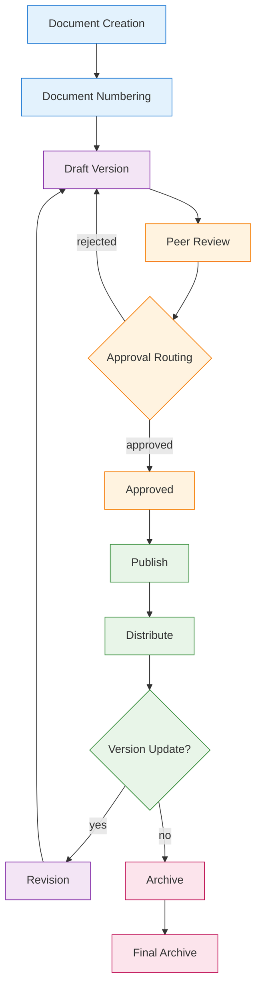
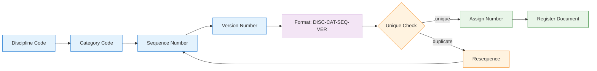
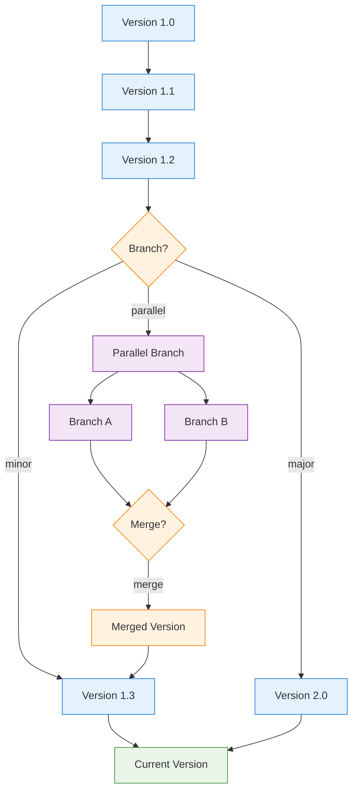
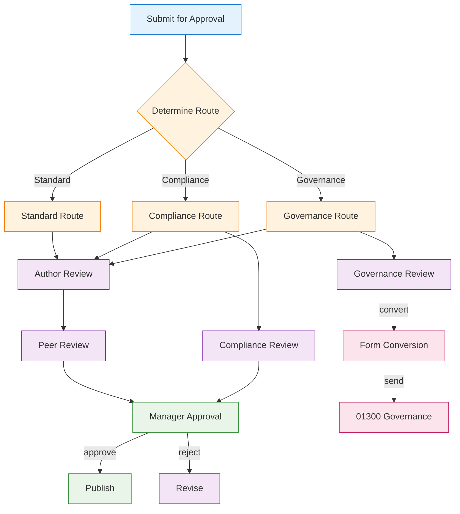
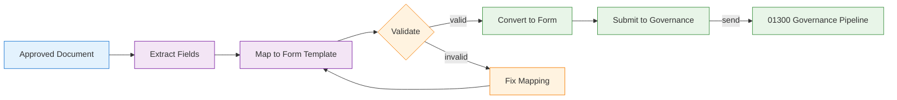

# 00900 Document Control UI/UX Specification

## 1. Overview

The 00900 Document Control discipline page provides a comprehensive document lifecycle management system. It manages document creation, numbering, version control, approval routing, and governance form conversion. The system integrates with Logistics (01700) for field document capture and Governance (01300) for form-based approval pipelines.

### 1.1 Key Capabilities
- Document creation and numbering sub-process
- Version control with branching and revision history
- Approval routing with configurable gates
- Governance form conversion for approval pipelines
- Document search and retrieval
- Integration with field capture and governance systems

### 1.2 Integration Points
- **INT-005**: Receives from 01700 Logistics (Field → Document)
- **INT-006**: Sends to 01300 Governance (Document → Form)

## 2. User Roles & Permissions

| Role | Permissions | Description |
|------|------------|-------------|
| Document Controller | Full lifecycle management, numbering, approval routing | Document control operations |
| Document Author | Create/edit documents, submit for review | Content creation |
| Reviewer | Review documents, approve/reject, add comments | Review gates |
| Governance Officer | Convert documents to governance forms | Governance integration |
| Viewer | Read-only access | Audit and retrieval |

## 3. Page Architecture

### 3.1 Three-State Navigation

```
┌─────────────────────────────────────────────────┐
│  [Agents]  [Upsert]  [Workspace]                │
├─────────────────────────────────────────────────┤
│                                                   │
│  Content area based on selected state             │
│                                                   │
└─────────────────────────────────────────────────┘
```

#### Agents State
- Document summarization agent
- Content analysis agent
- Version comparison agent
- Compliance checking agent

#### Upsert State
- Document creation form
- Document upload form
- Revision submission form
- Governance form conversion form

#### Workspace State
- Document registry with filters (type, status, date, discipline)
- Document detail view with tabs (Content, Versions, Approvals, Governance)
- Approval queue
- Version history tree

### 3.2 Document Lifecycle



### 3.3 Document Numbering Sub-Process



### 3.4 Version Control Branching



### 3.5 Approval Routing



### 3.6 Governance Form Conversion



## 4. State Management

### 4.1 Loading States
- **Document Registry**: Skeleton table with document type icons
- **Document Detail**: Progressive loading — metadata first, then content
- **Version History**: Tree view loading with version nodes

### 4.2 Empty States
- **No Documents**: "No documents in registry. Create or upload a document."
- **No Versions**: "Only one version exists. No revision history yet."
- **No Approvals Pending**: "No documents pending approval."

### 4.3 Error States
- **Document Load Failure**: "Unable to load document. File may be corrupted."
- **Version Conflict**: "Version conflict detected. Latest version has been updated."
- **Numbering Collision**: "Document number collision. Auto-resequencing."

### 4.4 Edge Cases
- **Concurrent Editing**: Lock mechanism with version conflict detection
- **Document Withdrawal**: Withdraw document from approval pipeline
- **Bulk Operations**: Batch document numbering and approval
- **Cross-Discipline Documents**: Documents shared across multiple disciplines

## 5. API Endpoints

| Method | Endpoint | Description |
|--------|----------|-------------|
| GET | `/api/v1/documents` | List documents with filters |
| GET | `/api/v1/documents/:id` | Get document detail |
| POST | `/api/v1/documents` | Create document |
| PUT | `/api/v1/documents/:id` | Update document |
| DELETE | `/api/v1/documents/:id` | Delete document (draft only) |
| POST | `/api/v1/documents/:id/submit` | Submit for approval |
| POST | `/api/v1/documents/:id/approve` | Approve document |
| POST | `/api/v1/documents/:id/reject` | Reject document |
| GET | `/api/v1/documents/:id/versions` | List versions |
| POST | `/api/v1/documents/:id/versions` | Create new version |
| POST | `/api/v1/documents/:id/convert` | Convert to governance form |
| GET | `/api/v1/documents/:id/numbering` | Get document number |

## 6. Database Schema References

### Core Tables
- `a_00900_doccontrol_documents` — Document records
- `a_00900_doccontrol_document_versions` — Version history
- `a_00900_doccontrol_data` — Document metadata
- `a_00900_doccontrol_approvals` — Approval records
- `a_00900_doccontrol_numbering` — Numbering sequence registry

### Integration Tables
- `a_01700_logistics_transactions` — Source for field documents (INT-005)
- `a_01300_governance_forms` — Target for form conversion (INT-006)

## 7. Mobile & Responsive Considerations

- **Document List**: Card-based layout with document type badges
- **Document Viewing**: Native PDF viewer with annotation
- **Approval Actions**: Swipe-to-approve/reject on mobile
- **Document Upload**: Camera capture and file upload options
- **Offline Access**: Cache recently viewed documents

## 8. Integration Details

### INT-005: Logistics → Document Control
- **Trigger**: Field transaction completed in 01700
- **Data Flow**: Transaction record → Document generation → Numbering → Registry
- **Validation**: Transaction must be in "Completed" status
- **Error Handling**: Failed document creation queues for retry

### INT-006: Document Control → Governance
- **Trigger**: Document approved and ready for governance
- **Data Flow**: Document → Field extraction → Form mapping → Governance submission
- **Validation**: Document must be in "Approved" status
- **Error Handling**: Failed form conversion returns document to "Pending Conversion" status