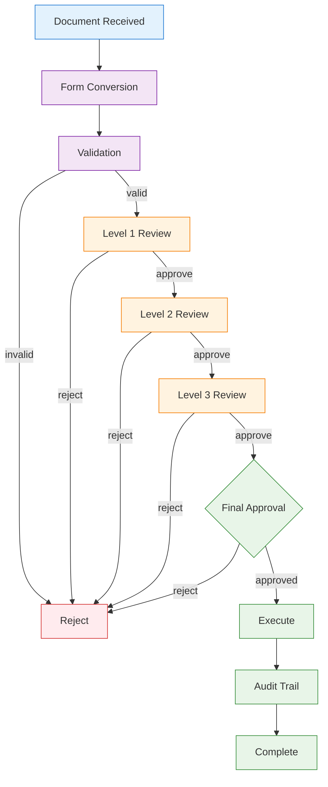
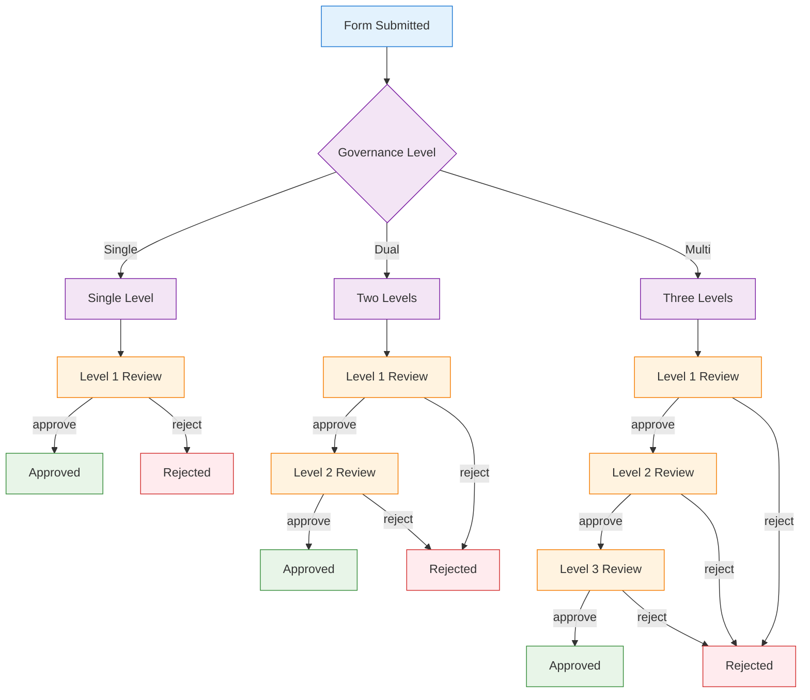
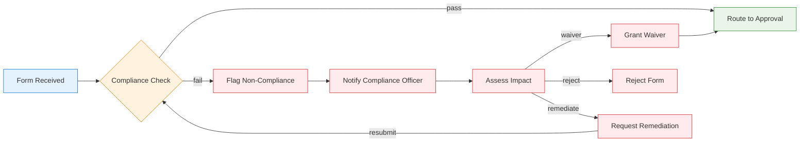
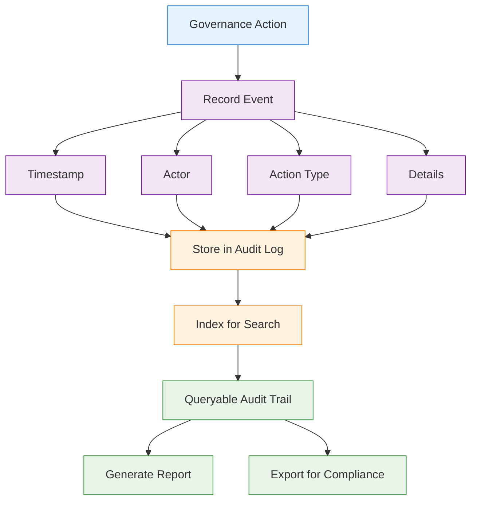

# 01300 Governance UI/UX Specification — Desktop

## 1. Overview

The 01300 Governance discipline page provides a comprehensive form-based governance management system. It manages document-to-form conversion, multi-level approval pipelines, compliance enforcement, and audit trail tracking. The system receives documents from Document Control (00900) for governance processing.

### 1.1 Key Capabilities
- Document-to-form conversion and validation
- Multi-level governance approval gating (single/dual/multi)
- Compliance enforcement with threshold-based routing
- Complete audit trail for all governance actions
- Form template management
- Integration with document control system

### 1.2 Integration Points
- **INT-006**: Receives from 00900 Document Control (Document → Form)

## 2. User Roles & Permissions

| Role | Permissions | Description |
|------|------------|-------------|
| Governance Admin | Full lifecycle management, configure approval levels, manage templates | Governance operations |
| Level 1 Reviewer | Review and approve/reject at first governance gate | Initial review |
| Level 2 Reviewer | Review and approve/reject at second governance gate | Secondary review |
| Level 3 Reviewer | Review and approve/reject at third governance gate | Final review |
| Compliance Officer | Enforce compliance checks, flag non-compliant forms | Compliance enforcement |
| Auditor | Read-only access to all governance records and audit trail | Audit and reporting |

## 3. Page Architecture

### 3.1 Three-State Navigation

```
┌─────────────────────────────────────────────────┐
│  [Agents]  [Upsert]  [Workspace]                │
├─────────────────────────────────────────────────┤
│                                                   │
│  Content area based on selected state             │
│                                                   │
└─────────────────────────────────────────────────┘
```

#### Agents State
- Form validation agent
- Compliance checking agent
- Approval routing agent
- Audit analysis agent

#### Upsert State
- Form creation from document conversion
- Form template management
- Approval level configuration
- Compliance rule configuration

#### Workspace State
- Governance dashboard with pipeline status
- Form queue by approval level
- Compliance enforcement board
- Audit trail viewer

### 3.2 Governance Approval Pipeline



### 3.3 Multi-Level Approval Gating



### 3.4 Compliance Enforcement



### 3.5 Audit Trail



## 4. State Management

### 4.1 Loading States
- **Governance Dashboard**: Skeleton with pipeline stage cards
- **Form Detail**: Progressive loading — form fields first, then approval history
- **Audit Trail**: Virtual scrolling for large audit logs

### 4.2 Empty States
- **No Forms Pending**: "No forms pending governance review."
- **No Audit Records**: "No governance actions recorded yet."
- **No Compliance Flags**: "All forms compliant. No flags."

### 4.3 Error States
- **Form Conversion Failure**: "Document-to-form conversion failed. Check field mapping."
- **Approval Routing Error**: "Unable to determine approval route. Verify governance level config."
- **Audit Log Write Failure**: "Audit event not recorded. System integrity may be affected."

### 4.4 Edge Cases
- **Escalated Forms**: Forms that exceed normal approval thresholds
- **Urgent Processing**: Expedited governance pipeline for time-sensitive forms
- **Withdrawn Forms**: Form withdrawal during active approval
- **Rejected Resubmission**: Form resubmission after rejection with revision tracking

## 5. API Endpoints

| Method | Endpoint | Description |
|--------|----------|-------------|
| GET | `/api/v1/forms` | List governance forms |
| GET | `/api/v1/forms/:id` | Get form detail |
| POST | `/api/v1/forms` | Create form (from document) |
| PUT | `/api/v1/forms/:id` | Update form |
| POST | `/api/v1/forms/:id/submit` | Submit for approval |
| POST | `/api/v1/forms/:id/approve` | Approve at current level |
| POST | `/api/v1/forms/:id/reject` | Reject form |
| GET | `/api/v1/forms/:id/approval-history` | Get approval history |
| GET | `/api/v1/compliance` | List compliance checks |
| POST | `/api/v1/compliance/check` | Run compliance check |
| GET | `/api/v1/audit` | List audit trail |
| GET | `/api/v1/audit/:id` | Get audit detail |
| GET | `/api/v1/templates` | List form templates |
| POST | `/api/v1/templates` | Create form template |

## 6. Database Schema References

### Core Tables
- `a_01300_governance_forms` — Form records
- `a_01300_governance_approvals` — Approval records
- `a_01300_governance_compliance` — Compliance check records
- `a_01300_governance_audit` — Audit trail
- `a_01300_governance_templates` — Form templates
- `a_01300_governance_config` — Governance level configuration

### Integration Tables
- `a_00900_doccontrol_documents` — Source for document-to-form conversion (INT-006)

## 7. Desktop-Specific Considerations

- **Layout**: Full-width pipeline dashboard with side panel for form details
- **Interactions**: Drag-and-drop form reordering, keyboard shortcuts for approval actions
- **Performance**: Optimized for large audit logs with virtual scrolling
- **Multi-Window**: Support for opening form details and audit trail in separate windows
- **Offline Support**: Local caching of form data for offline review with sync on reconnect

## 8. Integration Details

### INT-006: Document Control → Governance
- **Trigger**: Document approved and ready for governance in 00900
- **Data Flow**: Document → Field extraction → Form mapping → Governance submission
- **Validation**: Document must be in "Approved" status
- **Error Handling**: Failed form conversion returns document to "Pending Conversion" status
- **Governance Level Determination**: Based on document type, value, and compliance requirements
