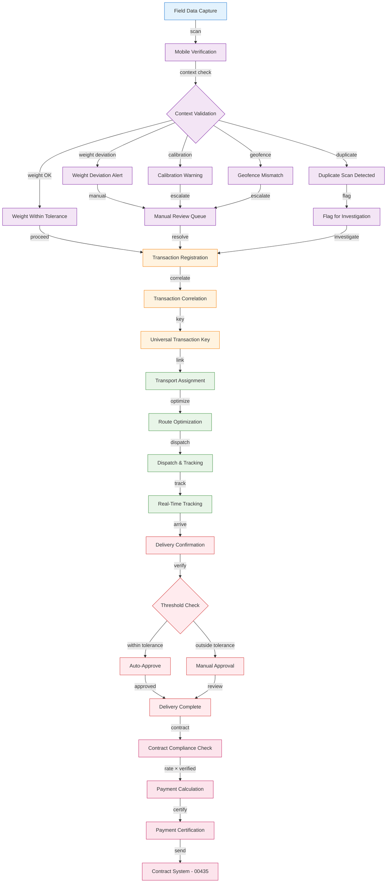
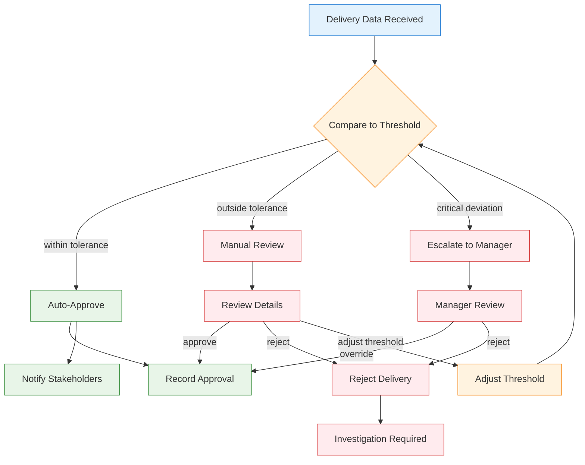
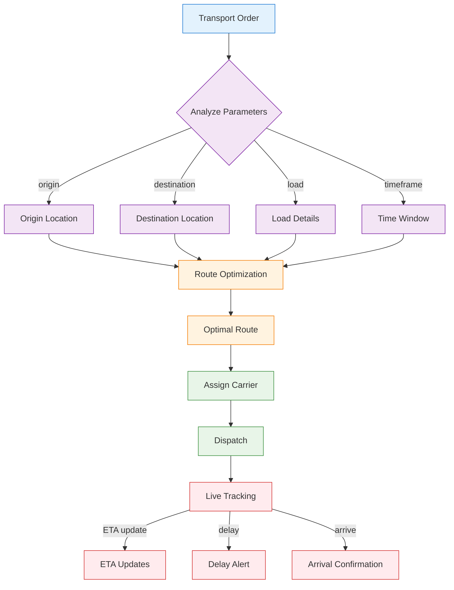

# 01700 Logistics UI/UX Specification — Desktop

> **Platform Index:** [index.md](./index.md) | **Mobile:** [mobile.md](./mobile.md) | **Web:** [web.md](./web.md)

## 1. Overview

The 01700 Logistics discipline page provides an end-to-end integrated logistics management system. It manages the complete chain from field data capture through delivery confirmation and contract compliance. The system incorporates org-agnostic patterns derived from the F-Stander logistics knowledge base, including weighbridge integration, mobile field verification, threshold-based auto-approval, and transport route optimization.

### 1.1 Key Capabilities
- Field data capture with mobile validation (FSP-001)
- Threshold-based auto-approval pipeline (FSP-002)
- Universal transaction correlation (FSP-003)
- Transport route optimization and tracking (FSP-004)
- Automated payment calculation from verified data (FSP-005)
- Context-aware field validation (FSP-007)

### 1.2 Integration Points
- **INT-004**: Sends to 00435 Post-Award (Delivery → Payment)
- **INT-005**: Sends to 00900 Document Control (Field → Document)

## 2. User Roles & Permissions

| Role | Permissions | Description |
|------|------------|-------------|
| Field Operator | Capture field data, scan QR codes, verify deliveries | Mobile field operations |
| Dispatcher | Assign transport, optimize routes, track shipments | Transport management |
| Logistics Manager | Full lifecycle management, configure thresholds, approve exceptions | Operations management |
| Weighbridge Operator | Operate weighbridge, capture weights, link transactions | Weighbridge operations |
| Contract Admin | View delivery data for payment certification | Contract integration |
| Viewer | Read-only access | Audit and reporting |

## 3. Page Architecture

### 3.1 Three-State Navigation

```
┌─────────────────────────────────────────────────┐
│  [Agents]  [Upsert]  [Workspace]                │
├─────────────────────────────────────────────────┤
│                                                   │
│  Content area based on selected state             │
│                                                   │
└─────────────────────────────────────────────────┘
```

#### Agents State
- Field data validation agent
- Route optimization agent
- Delivery verification agent
- Anomaly detection agent

#### Upsert State
- Field data capture form (weighbridge, mobile)
- Transport assignment form
- Delivery confirmation form
- Threshold configuration form

#### Workspace State
- Transaction dashboard with real-time tracking
- Field data list with verification status
- Transport tracking board
- Delivery confirmation queue
- Compliance dashboard

### 3.2 Integrated Logistics Chain



### 3.3 Field Data Capture with Mobile Validation (FSP-001)

```mermaid
at this 
```

### 3.4 Threshold-Based Auto-Approval Pipeline (FSP-002)



### 3.5 Transport Route Optimization & Tracking (FSP-004)



### 3.6 Delivery Confirmation & Contract Compliance (FSP-005)

```mermaid
flowchart LR
    DELIVER[Delivery Arrived] --> CONFIRM[Confirm Delivery]
    CONFIRM --> VERIFY_QTY[Verify Quantity]
    VERIFY_QTY --> VERIFY_QUALITY[Verify Quality]
    VERIFY_QUALITY --> CAPTURE_SIGN[Cature Signature/Photo]
    CAPTURE_SIGN --> COMPLETE_DEL[Delivery Complete]
    COMPLETE_DEL --> RATE_LOOKUP[Contract Rate Lookup]
    RATE_LOOKUP --> CALC_PAYMENT[Calculate Payment]
    CALC_PAYMENT --> CERTIFY_PAYMENT[Certify Payment]
    CERTIFY_PAYMENT --> SEND_CONTRACT[Send to Contract System]

    classDef deliver fill:#e3f2fd,stroke:#1976d2
    classDef verify fill:#fff3e0,stroke:#f57c00
    classDef complete fill:#e8f5e8,stroke:#388e3c
    classDef payment fill:#fce4ec,stroke:#c2185b

    class DELIVER,CONFIRM deliver
    class VERIFY_QTY,VERIFY_QUALITY,CAPTURE_SIGN verify
    class COMPLETE_DEL complete
    class RATE_LOOKUP,CALC_PAYMENT,CERTIFY_PAYMENT,SEND_CONTRACT payment
```



## 4. State Management

### 4.1 Loading States
- **Transaction Dashboard**: Real-time updating map with loading indicators
- **Field Capture**: Camera/viewfinder initialization
- **Route Optimization**: Progress bar during calculation

### 4.2 Empty States
- **No Active Transactions**: "No active logistics transactions. Start with a field capture."
- **No Transport Assignments**: "No pending transport assignments."
- **No Deliveries Today**: "No deliveries scheduled for today."

### 4.3 Error States
- **Weighbridge Connection Failure**: "Unable to connect to weighbridge. Check connection."
- **Mobile Sync Failure**: "Field data not synced. Will retry when connection available."
- **Geofence Service Unavailable**: "Location verification unavailable. Manual check required."

### 4.4 Edge Cases
- **Offline Mode**: Field capture works offline, syncs when connected
- **Duplicate Transaction Detection**: FSP-007 context-aware duplicate scan detection
- **Calibration Expiry**: Weighbridge calibration expiry warning
- **Geofence Mismatch**: Capture location outside expected geofence
- **Partial Delivery**: Multi-stop delivery with partial confirmation

## 5. API Endpoints

| Method | Endpoint | Description |
|--------|----------|-------------|
| GET | `/api/v1/transactions` | List logistics transactions |
| POST | `/api/v1/transactions` | Create transaction (field capture) |
| GET | `/api/v1/transactions/:id` | Get transaction detail |
| PUT | `/api/v1/transactions/:id/verify` | Verify transaction |
| POST | `/api/v1/transactions/:id/approve` | Auto/manual approve |
| GET | `/api/v1/transport` | List transport assignments |
| POST | `/api/v1/transport` | Create transport assignment |
| PUT | `/api/v1/transport/:id/route` | Update route |
| GET | `/api/v1/transport/:id/tracking` | Get live tracking data |
| POST | `/api/v1/deliveries` | Confirm delivery |
| GET | `/api/v1/deliveries/:id` | Get delivery detail |
| POST | `/api/v1/deliveries/:id/certify` | Certify for payment |
| GET | `/api/v1/weighbridge` | List weighbridge records |
| POST | `/api/v1/weighbridge` | Capture weighbridge reading |
| GET | `/api/v1/thresholds` | Get threshold configuration |
| PUT | `/api/v1/thresholds` | Update thresholds |

## 6. Database Schema References

### Core Tables
- `a_01700_logistics_transactions` — Transaction records (universal correlation key)
- `a_01700_logistics_field_captures` — Field data capture records
- `a_01700_logistics_transport` — Transport assignments
- `a_01700_logistics_routes` — Route optimization records
- `a_01700_logistics_deliveries` — Delivery confirmations
- `a_01700_logistics_weighbridge` — Weighbridge readings
- `a_01700_logistics_thresholds` — Auto-approval threshold config

### Integration Tables
- `a_00435_postaward_payments` — Payment certification target (INT-004)
- `a_00900_doccontrol_documents` — Document registry target (INT-005)

## 7. Integration Details

### INT-004: Logistics → Post-Award
- **Trigger**: Delivery confirmed and approved
- **Data Flow**: Verified delivery data → Contract rate lookup → Payment calculation → Certification
- **Validation**: Delivery must pass threshold check
- **Error Handling**: Failed certification returns delivery to "Pending Certification" status

### INT-005: Logistics → Document Control
- **Trigger**: Field transaction completed
- **Data Flow**: Transaction record → Document generation → Numbering → Registry
- **Validation**: Transaction must be in "Completed" status
- **Error Handling**: Failed document creation queues for retry
