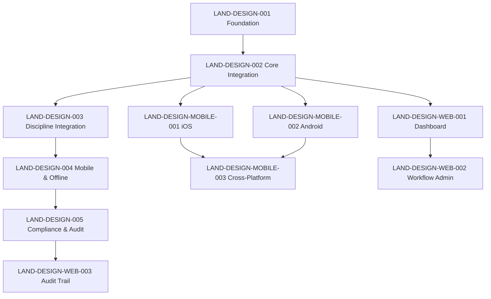

# LANDSCAPE-DESIGN — Landscape Design & Planting Plans

> **Discipline:** 03000 — Landscaping  
> **Project ID:** LANDSCAPE-DESIGN  
> **Status:** 🚧 In Planning  
> **Version:** 1.0.0

---

## Overview

LANDSCAPE-DESIGN delivers a comprehensive digital toolset for landscape architects and designers to create, review, and manage planting plans and landscape designs. The platform integrates CAD-style design canvases, a rich plant database, hardscape design tools, grading plans, and cross-discipline coordination capabilities — all with mobile field review and full compliance audit trails.

---

## Project Structure

```
LANDSCAPE-DESIGN/
├── README.md
├── LANDSCAPE-DESIGN-implementation.md
├── ISSUE-GENERATION-STATUS.md
├── trigger/
│   └── .gitkeep
├── shared/
│   └── .gitkeep
├── desktop/
│   ├── ISSUE-GENERATION-STATUS.md
│   ├── trigger/
│   │   └── .gitkeep
│   └── issues/
│       ├── LAND-DESIGN-001-foundation.md
│       ├── LAND-DESIGN-002-core-integration.md
│       ├── LAND-DESIGN-003-discipline-integration.md
│       ├── LAND-DESIGN-004-mobile-offline.md
│       └── LAND-DESIGN-005-compliance-audit.md
├── mobile/
│   ├── ISSUE-GENERATION-STATUS.md
│   ├── trigger/
│   │   └── .gitkeep
│   └── issues/
│       ├── LAND-DESIGN-MOBILE-001-ios-design.md
│       ├── LAND-DESIGN-MOBILE-002-android-design.md
│       └── LAND-DESIGN-MOBILE-003-cross-platform.md
└── web/
    ├── ISSUE-GENERATION-STATUS.md
    ├── trigger/
    │   └── .gitkeep
    └── issues/
        ├── LAND-DESIGN-WEB-001-dashboard.md
        ├── LAND-DESIGN-WEB-002-workflow-admin.md
        └── LAND-DESIGN-WEB-003-audit-trail.md
```

---

## Platforms

| Platform | Focus | Key Issues |
|----------|-------|------------|
| **Desktop** | CAD Design Canvas, Plant Placement, Hardscape Design, Grading Plans, Compliance | LAND-DESIGN-001 through 005 |
| **Mobile (iOS)** | Field Plan Viewing, Markup & Photo Documentation | LAND-DESIGN-MOBILE-001 |
| **Mobile (Android)** | Site Survey, GPS Waypoints & Plant Identification | LAND-DESIGN-MOBILE-002 |
| **Mobile (Cross-Platform)** | Design Library, Template Gallery & Collaboration | LAND-DESIGN-MOBILE-003 |
| **Web** | Design Dashboard, Plant DB Management, Audit Trail | LAND-DESIGN-WEB-001 through 003 |

---

## Phases

| Phase | Name | Duration | Key Deliverables |
|-------|------|----------|------------------|
| 1 — Foundation | Foundation | 4 weeks | Design tools, plant database, data model |
| 2 — Core Integration | Core Integration | 6 weeks | CAD canvas, plant placement, annotation tools |
| 3 — Discipline Integration | Discipline Integration | 4 weeks | Hardscape design, grading plans, coordination |
| 4 — Mobile & Offline | Mobile & Offline | 4 weeks | Field review, markup, offline viewing |
| 5 — Compliance & Audit | Compliance & Audit | 3 weeks | Version control, approval workflow, audit trail |

---

## Getting Started

1. **Review the implementation plan:**  
   `LANDSCAPE-DESIGN-implementation.md`

2. **Explore desktop issues** (core design tooling):  
   `desktop/issues/LAND-DESIGN-001-foundation.md` through `LAND-DESIGN-005-compliance-audit.md`

3. **Explore mobile issues** (field and site tools):  
   `mobile/issues/LAND-DESIGN-MOBILE-001-ios-design.md` through `LAND-DESIGN-MOBILE-003-cross-platform.md`

4. **Explore web issues** (dashboard and admin):  
   `web/issues/LAND-DESIGN-WEB-001-dashboard.md` through `LAND-DESIGN-WEB-003-audit-trail.md`

---

## Success Metrics

- **Design Creation Efficiency:** Reduce time to produce a planting plan by 40%
- **Plant Database Coverage:** 5,000+ plant species with regional variants
- **Mobile Adoption:** 80% of field staff use mobile review tools
- **Compliance Rate:** 100% of designs have complete version history and audit trail
- **Cross-Discipline Coordination:** 50% reduction in design conflicts with grading and hardscape

---

## Dependencies



---

## Contact

- **Project Lead:** domainforge-ai  
- **Engineering:** devforge-ai  
- **Repository:** `agent-companies-core/agent-companies-paperclip/docs-paperclip/disciplines/03000-landscaping/projects/LANDSCAPE-DESIGN/`

---

> **Next:** Review the [Implementation Plan](./LANDSCAPE-DESIGN-implementation.md) for detailed phase breakdowns.
